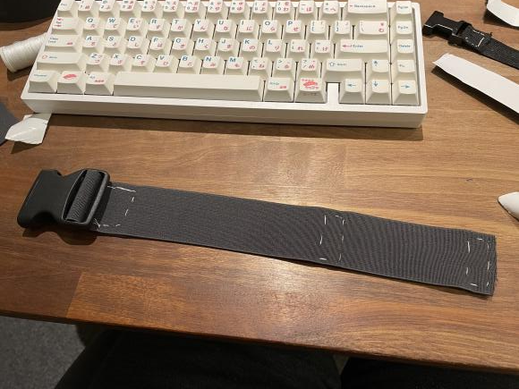

# DIY Straps Guide

## Index
{:.no_toc}

## Disclaimer
*This page is not a definitive/step by step guide to straps.*
*This page is meant to be used as inspiration to make your own DIY straps.*

## Tom Yum's

## Fadetoblk27's

Fadetoblk27 took an approach that does not require sewing (you still can for added strenght).
This is achieved by using buckles.

Materials used:
- Elastic band 50mm
- 50mm Buckles
- 50mm Slider Buckles

Instructions:
Cut a strip of material to lenght by wrapping it around the desired body part.
Weave the strap through the normal buckle on both ends and instead of sewing the ends back onto the strap, you weave them through the slider buckles (as seen in the picture).
This allows the straps to be very adjustable and require no sewing.

## Smeltie's
For Smelties straps the material ELA1300 was used, sadly this material isn't readily available outside of EU and UK neighbouring countries.
This material can be found at LeDuc in Europe and various UK based stores.

These straps require the following materials:
- ELA1300 50mm Elastic band (Can be substituted)
- Velcro strips (Preferably without adhesive)
- 50mm buckles

These straps have one closed end and one open end closed with velcro.
There are no set measurements on how to make these, you will have to tailor these to your own body proportions!

Instructions:
Cut a strip of material to lenght by wrapping it around the desired body part, keep a little extra material just in case.
Weave one end of the strap through one of the buckle halve, make it protrude about or just over an inch and sew it shut.
Weave the other end the same way through the other buckle halve, but instead of sewing this end attach a strip of velcro on either side and sew them into place.
Before you sew the velcro in place test fit your straps and ensure the correct tightness.
Dont be afraid to trim some material at this stage, we left some extra on purpose.
Once you have finished this strap you can make an exact replica for the opposite side of your body.

## Prevent Sliding
trackers sliding around is one of the most common issues when making your own straps.
However there are a few thing you can do to prevent/minimize this issue.

Things to check:
- Your straps are too flexible
- Your straps are too narrow/small

---
### Credits
*Created by Smeltie#1999, Tom Yum#2283 & Fadetoblk27#1200*
