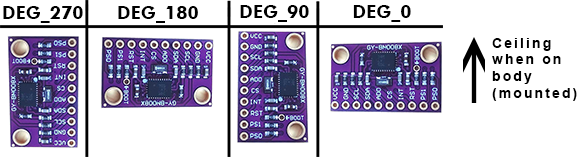

# Configuring the Firmware Project
{:.no_toc}

In order to build SlimeVR firmware and upload it to your tracker, you need to configure the project to match your specific hardware configuration. To do this, you need to modify two files: `platformio.ini` and `defines.h`.

## Table of Contents
{:.no_toc}

* TOC
{:toc}

## 1. Configuring platformio.ini

The `platformio.ini` file specifies the information about your MCU.

This file can be found in the root directory of the project:


The contents of `platformio.ini` file should look as follows:


### Select Your Hardware Settings

#### Monitor Speed

This field set your serial monitor speed in VSCode `monitor_speed = 115200`. Change this if your board datasheet and documentation suggest so, but the defaults should work.

**For the platform and board fields, visit [PlatformIO Boards documentation](https://docs.platformio.org/en/latest/boards/index.html) and find your board there. If it's not there, keep default ones or ask on [SlimeVR Discord](https://discord.gg/SlimeVR).**

#### env

> **Important:** Other env lines must be commented out with preceding semicolon (`;`) character.

If you're using a board with an ESP8266, uncomment the following lines:

```ini
[env:esp12e]
platform = espressif8266
board = esp12e
```

If you're using a board with an ESP32, uncomment the following lines:

```ini
[env:esp32]
platform = espressif32
board = esp32dev
```

#### WiFi

If you're having problems with setting the wifi credentials through the server, you can hardcode your wifi credentials to firmware.

To hardcode your wifi credentials, uncomment the following lines and replace `SSID` and `PASSWORD` with your corresponding wifi credentials:


```ini
  -DWIFI_CREDS_SSID='"SSID"'
  -DWIFI_CREDS_PASSWD='"PASSWORD"'
```
  
If you are having problems getting the tracker to connect to your Wi-Fi, review these troubleshooting steps:

- If your wifi password contains the `%` character, replace it with `%%`.
- If your network SSID contains non-alphanumerical characters, the tracker could fail to connect
- The ESP8266 and ESP32 only support 2.4GHz network bands.

## 2. Configuring defines.h

The `defines.h` file specifies the information about your IMU and MCU.

This file can be found in the `src` directory of the project:


You can either edit the defines.h file [manually](#configuring-definesh-manually) or use the tool below to generate the contents of the file.

### Configuring defines.h Automatically

Select how you built your SlimeVR tracker:

<dl id="defines_config"></dl>

After selecting the settings above, you can either:
- Use the download button below and replace your defines.h file.
- Copy and paste from the text field below into your IDE (such as VSCode).

<a class="btn btn-purple" id="defines_download">Download defines.h</a>

<div class="language-plaintext highlighter-rouge"><div class="highlight"><pre class="highlight"><code id="defines_code"></code></pre></div></div>

If you have used the above tool, you are finished with the defines.h file.

### Configuring defines.h Manually

You can also configure the defines.h file manually instead of using the tool above. Before any changes to the file, the contents of `defines.h` file should look as follows:


#### Select Your Hardware Settings

First you need to change these lines to define your IMU model and MCU:

```c
// Set parameters of IMU and board used
#define IMU IMU_BNO085
#define BOARD BOARD_SLIMEVR
#define IMU_ROTATION DEG_90
#define SECOND_IMU_ROTATION DEG_270
#define BATTERY_SHIELD_130K false
```

##### Change the IMU Model

The following line defines which IMU is present:

```c
#define IMU IMU_BNO085
```

To change IMU model, replace `IMU_BNO085` with one of the following values depending on your IMU model:

```
IMU_BNO080
IMU_BNO055
IMU_MPU9250
IMU_MPU6500
IMU_MPU6050
IMU_BNO086
IMU_ICM20948
IMU_BMI160
```

If you're using an MPU+QMC5883L, you would set your IMU as `IMU_MPU9250`. Bear in mind, you need to be using the QMC firmware for this to work, as the main firmware does not support the MPU+QMC5883L.

##### Change Board Model

The following line defines which MCU board is present:

```c
#define BOARD BOARD_SLIMEVR
```

To change the board model, you must replace `BOARD_SLIMEVR` with one of the possible values:

* For most boards with ESP8266, set it to `BOARD_NODEMCU`. For Wemos D1 Mini, you can use `BOARD_WEMOSD1MINI`.
* For boards with ESP32, set it to `BOARD_WROOM32`.
* For other boards that don't follow the pinouts of any defined board, set it to `BOARD_CUSTOM` and define the pins yourself.

##### Adjust IMU Board Rotation

The following lines define the rotation of your IMU boards:

```c
#define IMU_ROTATION DEG_90
#define SECOND_IMU_ROTATION DEG_270
```

To change the IMU board rotation, replace `DEG_90` (and `DEG_270` if you have auxiliary IMU) with one of the following values. Top of this picture is the ceiling (or your head) and IMU facing away from you when mounted on the body.



##### Set Battery Monitoring Options

The following lines define how battery voltage is read:

```c
#define BATTERY_MONITOR BAT_EXTERNAL
#define BATTERY_SHIELD_RESISTANCE 180
```

If you don't have a 180 kOhm resistor for checking the battery percentage of your tracker, replace `BAT_EXTERNAL` with `BAT_INTERNAL`. When set to `BAT_INTERNAL` the tracker will only be able to tell when the battery is low, and will cause the LED on the microcontroller to flash repeatedly. If you have a 180 kOhm resistor you do not need to change `BAT_EXTERNAL`. If you have a resistor of value other than 180 kOhm, simply change `180` to whatever your resistor value is in kOhms, for instance `130` if your resistor is 130 kOhms. If you have a Wemos Battery Shield product, you would change `180` to `130` as previously mentioned.

#### Define Pins of the Selected Board

You need to change only the section between `#elif` symbols with the selected board. If you are using VSCode, selected board section will light up, while other ones will be grayed out.

**Example 1:**

```c
#elif BOARD == BOARD_NODEMCU || BOARD == BOARD_WEMOSD1MINI
  #define PIN_IMU_SDA D2
  #define PIN_IMU_SCL D1
  #define PIN_IMU_INT D5
  #define PIN_IMU_INT_2 D6
  #define PIN_BATTERY_LEVEL A0
  #define BATTERY_SHIELD_130K true
```

**Example 2:**

```c
#elif BOARD == BOARD_WROOM32
  #define PIN_IMU_SDA 21
  #define PIN_IMU_SCL 22
  #define PIN_IMU_INT 23
  #define PIN_IMU_INT_2 25
  #define PIN_BATTERY_LEVEL 36
  #define BATTERY_SHIELD_130K true
```

**Example 3:**

```c
#elif BOARD == BOARD_CUSTOM
  // Define pins by the examples above
  #define PIN_IMU_SDA 5
  #define PIN_IMU_SCL 4
  #define PIN_IMU_INT 14
  #define PIN_IMU_INT_2 13
  #define PIN_BATTERY_LEVEL A0
```

SDA and SCL pin for main and AUX trackers are always the same. You can define pins either by using pin name, like `D1`, or by pin number, like `21`. Check you board pinout for the details, or connect your tracker to the default pins, they're recommended ones.

You need to put here your selected pins for I2C. Check pinout for details in terms of which ports could be used for I2C.

```c
  #define PIN_IMU_SDA D2
  #define PIN_IMU_SCL D1
```

If you are using BNO you need to define INT pin:

```c
  #define PIN_IMU_INT D5
```

If you are using the second BNO you need to define INT pin for the second BNO, it must be another pin:

```c
  #define PIN_IMU_INT_2 D6
```

If you are using a resistor for checking the battery level, you will need to select a pin that supports analog input:

```c
  #define PIN_BATTERY_LEVEL A0
```


Your firmware for your MCU and IMU configuration should now be complete!

***Next step - [Uploading the firmware](upload-firmware.md)***

*Created by adigyran#1121 with help from Musicman247#1341, edited by NWB#5135, edited and styled by CalliePepper#0666 and Emojikage#3095*

<script src="../assets/js/configuring-defines.js"></script>
