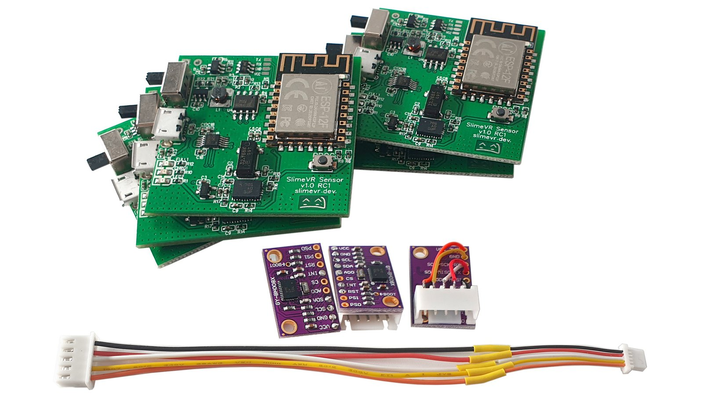
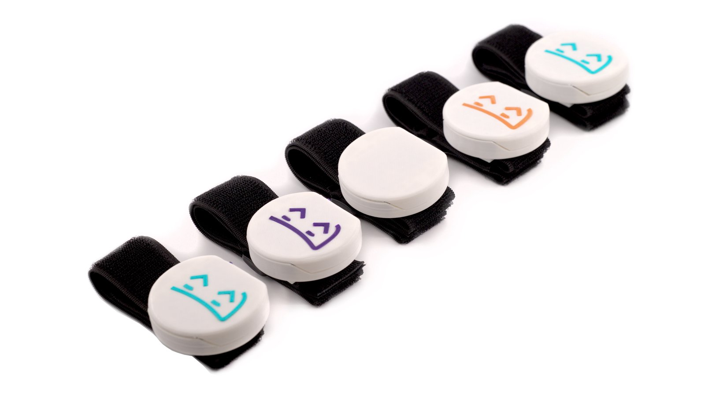

# SlimeVR Documentation

Welcome to the SlimeVR documentation. This site covers how to [build your own SlimeVR trackers](diy/diy-trackers-guide.md), [install or update existing tracker's firmware](firmware/upload-firmware-guide.md), [install and configure the SlimeVR Server](server-setup/slimevr-setup.md), or [use your mobile phones as SlimeVR trackers](faq-owo.md).

> **Note:** You need at least 5 trackers (built boards or phones) for proper full body tracking. Alternatively, you can build a single tracker or use 1 phone/tablet for just waist tracking if you wish to test the tracking without investing in a full kit.

## How do I get my hands on those sweet sweet SlimeVR trackers?

### 1. Build them from scratch (The DIY route)

*Example build by NightyIceC00kie*

You get yourself a **microcontroller**, an **IMU** [(supported IMUs)](https://github.com/SlimeVR/SlimeVR-Tracker-ESP/blob/main/README.md), **a battery**, and a **battery charger** (depends on the battery, for Li-ion's and LiPo's the most commonly used is the TP4056). Can add some sliding switches, and a few resistors to measure battery percentages. You then solder it all together (soldering is important as good connections to the pins is required for your tracker to function). Alternatively you can order a base board from a custom PMC manufacturer (please check the pins in the discord's pcb channel for more information).

**Pros:** Cheapest and quickest trackers to get your hands on (apart from using a phone you already have). Full documentation on this site to cover the process assuming you understand how to solder.

**Cons:** You will need to solder some wires, have a basic understanding of electronics, and you are limited in how small the trackers can get.

### 2. Pre-order the official DIY Kit on Crowd Supply

You buy the [**official DIY Kit**](https://www.crowdsupply.com/slimevr/slimevr-full-body-tracker) which includes all the boards and cables you need, get a **LiPo battery**, attach batteries to the boards. All you need is to 3D print (or build) yourself a nice casing and get straps (or get creative and tape them with electrical tape to your body, idk :D).

**Pros:** no or almost no soldering required, tested boards, smallest possible design, cheaper than buying completed SlimeVR trackers. You can customize cases and straps.

**Cons:** at this point you could just buy completed SlimeVR trackers, all import limitations and shipping costs apply. It will cost more than the first option due to shipping, importing fees and construction costs. Due the chip shortage currently affecting the world, this option is currently planned to ship in November of 2022. Limited supply.

### 3. Pre-order a built tracker on Crowd Supply

We currently have fully built trackers for pre-order at [Crowd Supply](https://www.crowdsupply.com/slimevr/slimevr-full-body-tracker). 

**Pros:** a polished build of the SlimeVR trackers with a small footprint with no physical build required.

**Cons:** due the chip shortage currently affecting the world, this option is currently planned to ship in November of 2022. Limited supply.

### 4. Use phones instead of trackers

It is possible to use phone in place of trackers, please check the [owoTrack mobile application](faq-owo.md). Please note that this option varies depending on your phone make and model, there has been issues with connections, the application being suspended and a handful of others.

**Pros:** if you have 5 phones lying around, you can have FBT set up very quickly. You can also use this option to sub in phones for any missing trackers from the previous options.

**Cons:** not all phones are supported, quality of tracking differs depending on make and model. Your experience may differ wildly depending on your setup.

If you have any problems, feel free to reach out on the [SlimeVR discord](https://discord.gg/SlimeVR).

*Written by adigyran#1121, edited by QuantumRed#0001, CalliePepper#0666 and Emojikage#3095, styled by CalliePepper#0666*
