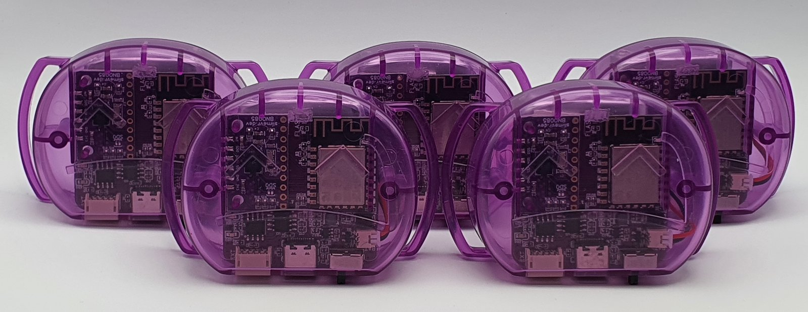
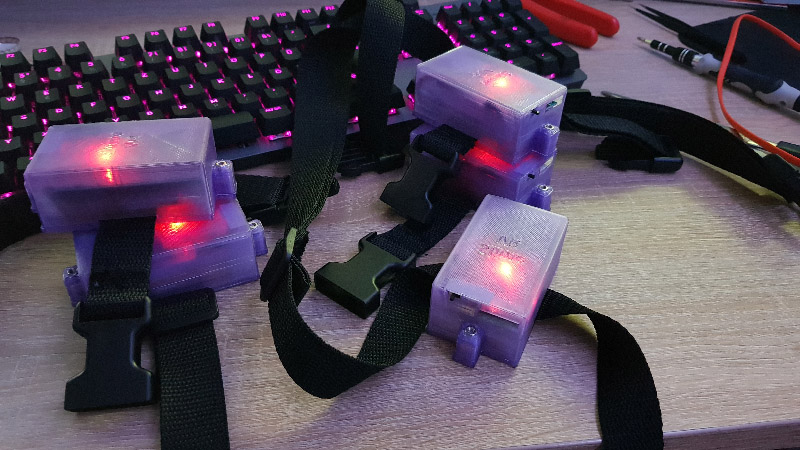

# SlimeVR Documentation

Welcome to the SlimeVR documentation. This site covers how to [build your own SlimeVR trackers](diy/index.html), [install or update an existing tracker's firmware](firmware/index.html), [install and configure the SlimeVR Server](server/index.html), and [provides a wide collection of community built tools](tools/index.html).

## What is SlimeVR?

SlimeVR is a set of open-source software and hardware sensors designed to facilitate full-body tracking (FBT) in virtual reality. The project is built around the core concept of creating a system that can be fully customized to suit each user’s needs. This documentation provides a full breakdown of how to set up prebuilt trackers, as well as guides on building compatible DIY SlimeVR Trackers. For a more detailed explanation of how SlimeVR works, check [SlimeVR 101](slimevr101.html).

## I have prebuilt trackers, what do I do now?

Welcome new SlimeVR user, we're happy to have you here! For the simplest setup process we suggest you visit our [Quick Setup Guide](quick-setup.md).

## How do I get my hands on those sweet sweet SlimeVR trackers?

There are currently multiple ways to approach putting together your own SlimeVR FBT solution.

``` admonish note
A minimum of 5 SlimeVR trackers is required for proper full-body tracking (FBT). Alternatively, you may purchase or build a single tracker exclusively for chest tracking if you want to test partial tracking without investing in a full kit. Other options, such as using phones or Joy-Cons — do exist, but tracking quality is heavily restricted by the specific device—so expect significantly worse results.
```

### 1. Buying trackers

#### Fully built trackers directly from SlimeVR



Fully built trackers are available for pre-order at [Crowd Supply](https://www.crowdsupply.com/slimevr/slimevr-full-body-tracker). These trackers are a passion project of the dedicated core members of SlimeVR, and due to chip shortages, shipping delays and the like we cannot guarantee shipping dates or turnaround time.

This option is a pre-order. Please check the product page for estimated shipping times for new orders. Actual shipping times might differ due to production delays and other circumstances.


### 2. Third-Party Sellers

Third-party sellers are common, with prebuilt trackers and custom commissions offered on the [SlimeVR Discord](https://discord.gg/SlimeVR) marketplace forum. Designs and specifications vary from seller to seller, so make sure to check exactly what you’re getting.

As the two most important aspects of every SlimeVR Trackers are the IMU (used to measure movement) and the communication protocol (how the tracker communicates with your device), we suggest checking the [IMU comparison page](diy/imu-comparison.html) to get an idea of what to expect from any available tracker.

```admonish warning
SlimeVR cannot ensure that non-marketplace, third-party trackers trackers meet any specific quality requirements. Please assume that purchasing from a third-party seller is comparable to buying from a small creator, and your own research into the quality of these trackers is important. We suggest checking reviews or speaking with others who have purchased from the seller. If any of your third-party trackers develop a fault, contact the seller for support. However, you may need some understanding of soldering and tracker assembly to perform repairs yourself.
```

### 3. Building trackers yourself

#### Entirely from scratch

<br>
*Example build by NightyIceC00kie*

Building trackers is currently the cheapest method of obtaining SlimeVR trackers at the time of writing. This documentation provides a full guide to building trackers from scratch, which provides lists of full components needed, where to buy them and schematics for most combinations of IMUs and Microcontrollers.

The most common way of assembling SlimeVR Trackers is by soldering multiple PCBs onto a carrier board.

- For Wi-Fi-based Trackers ("big" or "normal" Trackers), the component and assembly guide can be viewed [here](diy/index.html).
- For nRF (“Smol”) Trackers, the component and assembly guide can be viewed [here](smol-slimes/index.html).

PCB-based builds are also frequently used, which can be manufactured through JLCPCB or other suppliers at low cost. These boards can greatly simplify the process and reduce the amount of soldering required. Many popular options are available, with instructions and 3D printable files:[community cases](diy/cases.md)

DIY builds require time to assemble and may require self-repairs from time to time.

> Please note: If you are looking for the ICM-45686 (the recommended IMU), the SlimeVR store has [modules available](https://shop.slimevr.dev/products/slimevr-mumo-breakout-module-v1-icm-45686-qmc6309).

#### Purchase the official DIY Kit on Crowd Supply

<br>
*A prototype of DIY-Kit boards and wires.*

You buy the [**official DIY Kit**](https://www.crowdsupply.com/slimevr/slimevr-full-body-tracker#products), which includes the boards, extensions, and cables. It does not include enclosures, straps, batteries, or other accessories, which must be sourced separately. See the [DIY Kit Guide](diy/diy_kit_guide.html) for more information.

This option requires little to no soldering, provides tested boards, uses the best available IMUs, allows for a compact design, and is a more affordable alternative to completed SlimeVR trackers. It also allows you to customize cases and straps.

Example: [TinyOfficial-Case](https://github.com/ZRock35/TinyOfficial-Case)

However, while the cost is significantly lower, this option is still a pre-order. We recommend buying batteries and other required parts at the same time to avoid delays.

Please check the product page and Discord for estimated shipping times. Actual shipping times may vary due to production delays and other circumstances.

### 4. Alternative tracking options

As SlimeVR is open source and has roots in the idea of experimentation and exploration, other options to replace custom built trackers have emerged. This includes:

- Using [a phone in place of a tracker](tools/owoTrack.md).
- Using [Nintendo Joycons in place of trackers](tools/slimevr-wrangler.html).
- Using [Mocopi trackers with SlimeVR server](https://www.sony.net/Products/mocopi-dev/en/documents/beta/HowToBetaFunctions_SlimeVR.html)
- Using [HaritoraX trackers with SlimeVR server](tools/slimetora.md)

**Please note that these options may be subpar when compared to actual SlimeVR trackers, but are useful for experimenting and in some cases can work well. We suggest you do not invest heavily in buying old phones or joycons, as most users of these options only consider them stopgaps at best.**

Note that these options vary depending on make and model (for example, third-party Joy-Cons almost never work). Users commonly experience issues with connection stability, application crashes, and other limitations. Phone or Joy-Con straps must also be sourced based on the object’s shape, size, and mounting location.

If you have any problems, feel free to reach out on the [SlimeVR discord](https://discord.gg/SlimeVR).

*Written by adigyran and calliepepper; edited by QuantumRed#0001, calliepepper, Spazzwan emojikage, nwbx01, and tomyum3dp; styled by calliepepper. Reformatted and rewritten by Amebun to meet December 2025 standards.*
