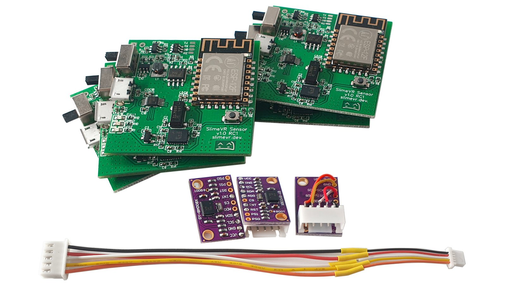
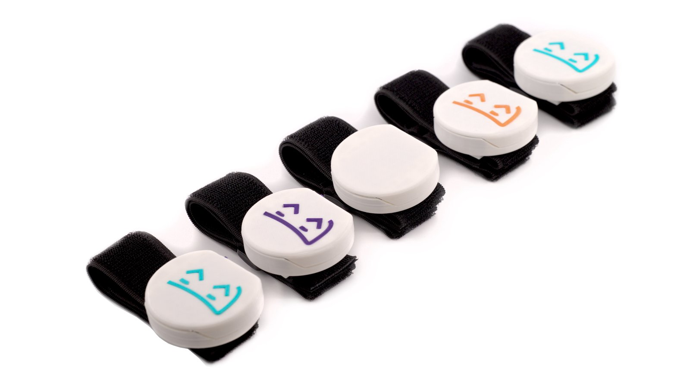

# SlimeVR Documentation

Welcome to the SlimeVR documentation. This site covers how to [build your own SlimeVR trackers](diy/diy-trackers-guide.md), [install or update an existing tracker's firmware](firmware/updating-firmware.md), [install and configure the SlimeVR Server](server-setup/slimevr-setup.md), or [use your mobile phones as SlimeVR trackers](tools/owoTrack.md).

> **Note:** You need at least 5 trackers (built boards or phones) for proper full body tracking (FBT). Alternatively, you can build a single tracker or use 1 phone/tablet for just waist tracking if you wish to test the tracking without investing in a full kit.

## How do I get my hands on those sweet sweet SlimeVR trackers?

### 1. Build them from scratch (The DIY route)

*Example build by NightyIceC00kie*

You get yourself a **microcontroller**, an **IMU** [(supported IMUs)](https://github.com/SlimeVR/SlimeVR-Tracker-ESP/blob/main/README.md), **a battery**, and **a battery charger** (These parts will be explained in detail). Optionally, you can add sliding switches, safety diodes, and a few resistors to measure battery percentages. You then solder it all together (soldering is important as good connections to the pins is required for your tracker to function). Alternatively, you can order a base board from a custom PMC manufacturer (please check the pins in the discord’s pcb channel for more information).

**Pros:** Cheapest and fastest to obtain trackers (apart from using a phone you already have). Full documentation on this site to cover the process, assuming you understand how to solder. Flexibility in construction options allows for budget to advanced builds.

**Cons:** You will need to solder some wires, have a basic understanding of electronics, and you are limited in how small the trackers can get. DIY builds require time to assemble and may require self-repairs from time to time.

> **Caution:** There is a seller on Amazon selling DIY SlimeVR trackers. Due to a significant number of users reporting issues with these trackers, they cannot be recommended unless you are savvy enough to potentially diagnose any issues as if you were DIY'ing SlimeVR trackers yourself. If you purchase them, you are doing so at your own risk.

### 2. Pre-order the official DIY Kit on Crowd Supply

*A prototype of DIY-Kit boards and wires, which are identical to those in our standard Tracker Sets, but without enclosures and other accessories.*

You buy the [**official DIY Kit**](https://www.crowdsupply.com/slimevr/slimevr-full-body-tracker) which includes all the boards and cables you need, get a LiPo battery, and attach batteries to the boards. All you need is to 3D print (or build) yourself a nice casing and get straps (or get creative and tape them with electrical tape to your body).

**Pros:** No or little soldering required, tested boards, the smallest possible design, cheaper alternative to buying completed SlimeVR trackers. You can customize cases and straps.

**Cons:** At this point, you could just buy completed SlimeVR trackers. Import limitations and shipping costs apply. It will cost more than the first option due to shipping, import fees, and construction costs. Due to the chip shortage currently affecting the world, this option is currently planned to ship in November of 2022. Limited supply.

### 3. Pre-order a built tracker on Crowd Supply

*Prototypes of a SlimeVR Tracker*

You buy fully built trackers for pre-order at [Crowd Supply](https://www.crowdsupply.com/slimevr/slimevr-full-body-tracker).

**Pros:** A premium build of the SlimeVR trackers with a small footprint with no physical build required.

**Cons:** Due to the chip shortage currently affecting the world, this option is currently planned to ship in November of 2022. Limited supply.

### 4. Use phones instead of trackers

It is possible to use a phone in place of a tracker, please check the  [owoTrack mobile application](tools/owoTrack.md). Note that this option varies depending on your phone make and model, there have been issues with connections, the application being suspended, and a handful of others. Phone straps are also required to be sourced based on phone shape, size, and mount location.

**Pros:** If you have 5 phones lying around, you can have FBT set up very quickly. You can also use this option to sub in phones for any missing trackers from the previous options.

**Cons:** Not all phones are supported. Quality of tracking can differ depending on make and model of phone. Your experience may differ wildly depending on your setup.

If you have any problems, feel free to reach out on the [SlimeVR discord](https://discord.gg/SlimeVR).

*Written by adigyran#1121 and CalliePepper#0666, edited by QuantumRed#0001, CalliePepper#0666, Spazzwan Emojikage#3095, NWB#5135, and Tom Yum#0069, styled by CalliePepper#0666*
