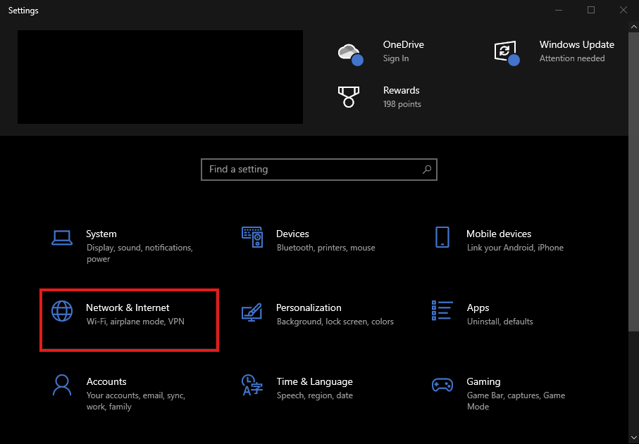
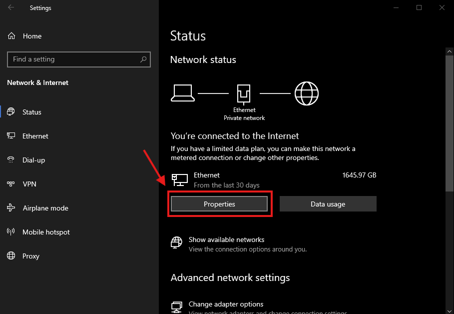
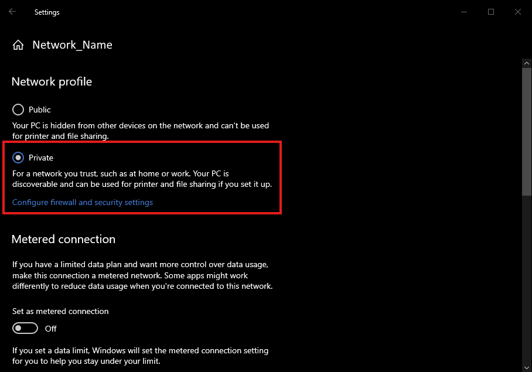
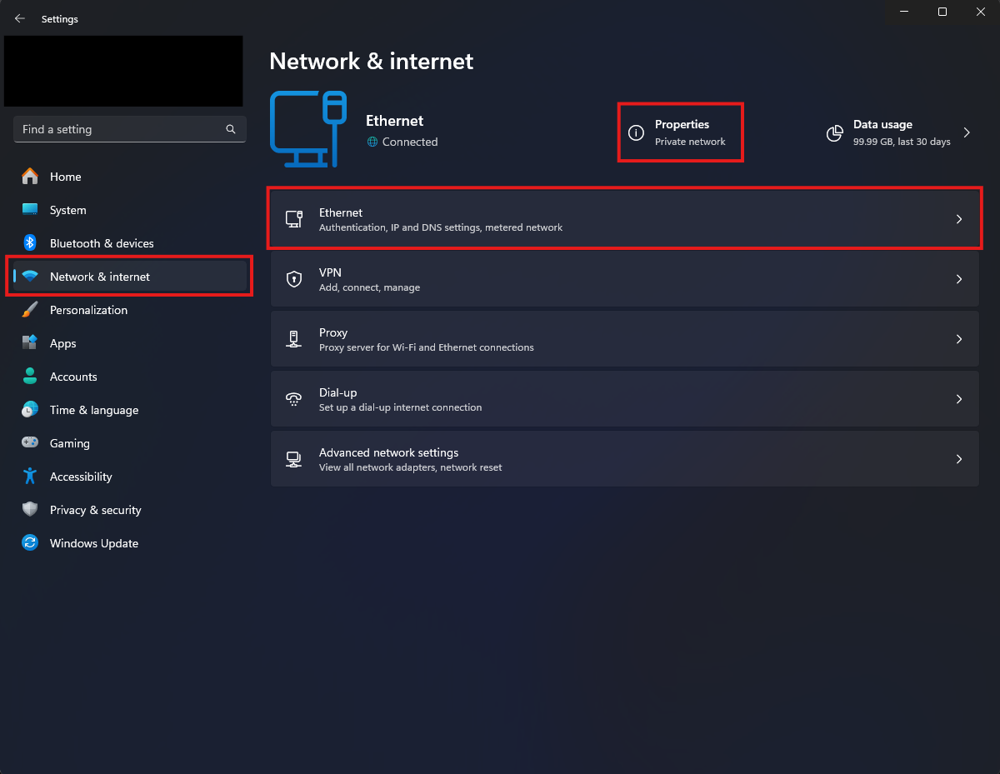
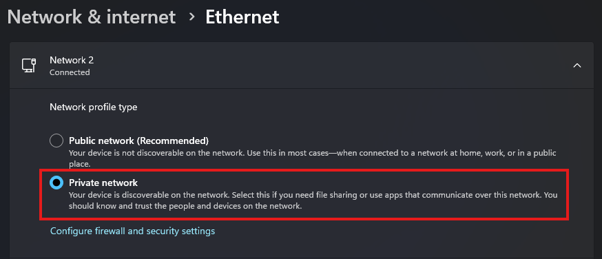

# Common Issues

This page aims to list and provide solutions to frequently encountered issues. If nothing here answers your question, or a given fix does not help, please feel free to ask your question in the [#support-forum](https://discord.com/channels/817184208525983775/1025104406393405491) on the [SlimeVR Discord](https://discord.gg/slimevr). Make sure you mention all of the steps you have tried from here when asking for help. Keep in mind that some solutions may not apply to your SlimeVR Trackers, especially if they are DIY or purchased from a third-party seller.

* TOC
{:toc}

## Network profile is currently set to Public

If your network settings in Windows are set to "Public Network", it can lead to issues with how your SlimeVR Trackers connect to your PC.
To change this you can do the following:

**Windows 10**

Open your network settings via Windows Settings > Network & Internet > Properties.
Switch the setting called "Network Profile Type" to "Private Network".





**Windows 11**

Open your network settings via Windows Settings > Network & Internet. You can either click "Properties" or "Ethernet/WiFi" depending on how your PC is connected.
From there, switch the setting called "Network Profile Type" to "Private Network"




## SlimeVR Feeder App not connected
Ensure both SlimeVR and SteamVR are running and that the SlimeVR Feeder app is enabled in the Startup Overlay Apps. Follow the guide below on enabling it.

If the app does not appear in SteamVR, you may have to run the SlimeVR installer again in Repair Mode. Make sure "SlimeVR Feeder App" is ticked before continuing.

## Feeder App window closes immediately after opening
This is intended behaviour on later versions—the Feeder app continues to run in the background after the window auto-closes. 

## The SlimeVR Server won't start

- If the error is related to ports, ensure all other SlimeVR Server instances are closed. If it continues, restart your PC.
- This may also be caused by Java not being installed or issues with your Java installation. Running the installer linked in the [Installing the server page](server/initial-setup.md#install-the-latest-slimevr-installer) again should handle this.

## The SlimeVR window is stuck as a tiny window

Update your SlimeVR Server using the [installer](https://slimevr.dev/download)

## SlimeVR GUI crashes immediately / "panicked at ... WebView2Error" / WebView2 is missing

It's possible that you don't have the required WebView2 component installed, you can download the WebView2 installer from <https://developer.microsoft.com/en-us/microsoft-edge/webview2/consumer/>. To ensure that WebView2 installs properly, run the WebView2 installer as an administrator (right-click, then select Run as Administrator) and make sure the installer is running from the C: drive (ex. `C:\MicrosoftEdgeWebview2Setup.exe`) and running it from there.

## SlimeVR GUI keeps timing out / "Connection lost to the server. Trying to reconnect..." repeatedly

- If your SlimeVR GUI is repeatedly timing out from the SlimeVR server (check the logs), you may be able to fix this by running the following command in an administrator console: `netsh int tcp set supplemental internet congestionprovider=default`. This is caused by non-default Windows network configurations commonly used by modified OSes.
- Alternatively, try running the SlimeVR installer in repair mode.

## The Wi-Fi Settings window outputs ERROR

Try resetting your tracker, this may fix the issues immediately. Try connecting the tracker to a different USB port, and/or try a different USB cable. If the issue persists, your COM port may be being hogged, which can be tested by going through the firmware update process in VSCode (as it has more verbose error messages). If this is the case, close any application that might be hogging the ports (VSCode and Cura are often the cause).

## The Wi-Fi Settings window outputs symbols and nothing else

There are two common causes that you should check:

- Make sure that you have the right driver installed.
- Check that your PIO firmware upload worked. If you have multiple firmware versions open in VSCode you will have to set the correct one to default to upload.

## Tracker can't connect to WiFi

The two common issues that cause this error are:

- Make sure you are connecting to a 2.4GHz network, 5GHz networks are not supported.
- Check your SSID for special characters. At the time of writing SlimeVR only supports network SSIDs that contain alphanumerical characters.
- Make sure you are using WiFi channels 1-11. Avoid using channels 12-14 because connection issues may occur.
- Ensure WPA3 WiFi security is not being used, as the SlimeVR trackers do not support this security protocol. We recommend using WPA2, which is fully supported by SlimeVR.
- Try restarting your router to see if this resolves the issue.

If all of this is correct, you can check your gateway's list of connected devices to see if all your trackers are connecting. If a tracker is not connecting even after using the same firmware upload with hardcoded Wi-Fi details there are two additional steps you can check:

- Check if your Wi-Fi has reached its maximum allowed Wi-Fi connections. You can test this by disconnecting devices and then trying to connect your trackers again.
- If you hard coded your Wi-Fi settings in `platformio.ini` try connecting your trackers via USB and [pushing new Wi-Fi details](server/connecting-trackers.md#connect-trackers). You may find this either fixes your connection or provides you with additional details on why the connection is failing.

## The trackers are connected to Wi-Fi but can't find the server

Check that you do not have two copies of the SlimeVR server running, as only one of them will show trackers connected.

If only one server is running, this is most likely a firewall issue, go to SlimeVR Server folder and run `firewall.bat` as administrator to add the firewall rules to Windows Defender Firewall.

If you are still having trouble, try manually adding the SlimeVR Server to your firewall.

1. Go to **Settings** > **Network & Internet** then click on the text link **Window Firewall** (you may have to scroll down).
1. In the firewall window, click the link **Allow an app through firewall**.
1. Click the **Allow another app...** button, and then **Browse...** in the opened **Add an app** window. If your options are greyed out in the **Allowed apps** window, click the **Change Settings** button to allow changes.
1. In the **File name** text box, type `*.*` and press enter before navigating to `slimevr.jar` in your SlimeVR server folder and select it (if you cannot see files in this folder, try typing `*.*` and pressing enter again to show all files).
1. Click the **Add** button to add the file to your firewall settings.
1. Finally, make sure both public and private checkboxes are selected in the **Allowed apps** window before clicking **OK** to save the changes.

If adding SlimeVR to your firewall has not worked, you can try to diagnose the issue further with the following steps:

1. Make sure the computer's Ethernet/Wi-Fi connection is set to Private.
1. Make sure Network Discovery is enabled on your active network interface.
1. Disable any VPN software or VPN-enabled hardware.
1. Make sure your trackers are not connected to a Guest WiFi network.
1. Make sure the WiFi network does NOT have AP Isolation enabled.
1. Delete the SlimeVR configuration: Close SlimeVR and delete the config folder at `%AppData%\dev.slimevr.SlimeVR`.
1. If you install and run the SlimeVR server on another device, then close it, the trackers should reconnect to the previously used server.
1. Temporarily disable Windows Defender Firewall or any other antivirus to test if the trackers connect.
   - If the trackers only show up on SlimeVR when Windows Defender Firewall is disabled, then you have a problem with your firewall.
1. Try pinging the tracker from your computer to see if it can be reached by opening Command Prompt (CMD) and run the command `ping <IP>`, where `<IP>` is your tracker's IP (ex. `ping 192.168.0.1`). You can find the tracker's IP using the "Serial console" under the "Settings" tab of the SlimeVR GUI.
   - If the command outputs something like `Reply from 192.168.XXX.XXX: Destination host unreachable.`, then you likely have a problem with either your router or your firewall.
   - If the command outputs something like `Reply from 192.168.XXX.XXX: bytes=32 time<1ms TTL=63`, then you likely have a problem with either your network adapter or your network settings. You may need to enable broadcast packets (or something similar) on your router, as SlimeVR trackers broadcast to `255.255.255.255` to discover your SlimeVR Server.
1. Try hosting a Wi-Fi hotspot either from your computer or your phone and connect your trackers to it to see if they will show up on SlimeVR using it.
   - If the trackers don't show up on SlimeVR, then you likely have a problem with either your trackers or your computer. It may be worth trying disabling your Windows Defender Firewall as per the first step, but using this Wi-Fi hotspot instead.
   - If the trackers show up on SlimeVR, then you likely have a problem with either your router or the network adapter you connect to your router with.
1. Re-flash the firmware to an older version.

If none of these steps have helped you, you can find information about getting further help at [the top of this page](#common-issues).

## The trackers are connected to the SlimeVR server but don't show up

This is usually the result of an issue with the IMU. Plug in your Wemos D1 Mini and check through the serial console under settings in the SlimeVR server. You may see an error like one of the following:
```c
[ERR] I2C: Can't find I2C device on provided addresses, scanning for all I2C devices and returning
[ERR] I2C: No I2C devices found
[ERR] I2C: Can't find I2C device on provided addresses, scanning for all I2C devices and returning
[DBG] I2C (@ D2(4) : D1(5)): I2C device found at address 0x68  !
[ERROR] [ErroneousSensor:0] IMU of type MPU6500 failed to initialize
```

The most common reasons for errors with the IMU are the following:

1. You accidentally set the IMU wrong (i.e. set as MPU6050 when you have an BNO085)
1. You accidentally selected the wrong board type (i.e. set as BOARD_SLIMEVR instead of BOARD_WEMOSD1MINI)
1. The wiring is wrong (e.g. accidentally swapping around D1/D2 and SDA/SCL)
1. There's an issue with the soldering (e.g. not enough solder, cold joint, or bridging between SDA and SCL)
1. You're using a breadboard (Without soldering connections, the IMU often won't be able to communicate with the microcontroller)
1. There's an issue with the IMU itself (e.g. burned trace while soldering, or the chip is downright DOA)

## The trackers are connected to the SlimeVR server but aren't turning up on Steam

- Make sure you installed SlimeVR with [the installer](https://slimevr.dev/download) to have the right SteamVR driver.
- Make sure the SlimeVR addon is enabled in SteamVR Settings > Startup/Shutdown > Manage Add-ons.
- Make sure you have [SteamVR Trackers enabled in the SlimeVR settings](server/configuring-trackers.md#configuring-how-many-virtual-trackers-you-need).

## My tracker keeps flashing

This is intended behavior, the number of flashes lets you know the current status of your tracker. Check the top of the [the setup page for more info](server-setup/initial-setup.md#test-your-trackers).

## My aux tracker isn't working
- Ensure that the tracker was powered off before the aux tracker was connected.
- In order to make sure your aux tracker is set up, you need to specify it in your `defines.h` uploaded to the primary tracker's firmware. Check the [bottom of the section mentioning defining the pins on the configuring the SlimeVR firmware page](firmware/configuring-project.md#define-pins-of-the-selected-board). Alternatively, you should ensure that you have correctly soldered VCC to AD0 on your aux tracker IMU.

## Sensor was reset error

Check your INT wire, there is either a bad connection or you have it connected to the flash pin. If you are building your tracker on a breadboard, your connections may be not firm enough and cause this error.

## Trackers are drifting more than expected

- Make sure that the tracker is placed on a solid, vibration free surface when powered on. The sensors need to calibrate for 10-20 seconds in a stable environment. If your trackers use an IMU besides BNO085 and ICM-45686, you may need to perform additional [IMU calibration](server/imu-calibration.md).
- Additionally, after 15 or more minutes of use, take the trackers off and place them flat for 10-20s before putting them back on. This ensures that the IMU adjusts to your body temperature.

## Ankle and foot trackers appear as one tracker
This is normal. SlimeVR combines the position of the ankle tracker with the rotation of the foot tracker—which means SteamVR only reports one foot tracker.

## My trackers are bound to the wrong body part in SteamVR
If this happens in SteamVR, make sure your trackers are assigned to the right body parts in SlimeVR. Do not touch the assignments in SteamVR.

## Moving one tracker moves other body parts in VRChat
- Ensure that IK calibration range is set to 0.2 in VRChat.
- Ensure that Legacy Calibration and Legacy IK are both disabled in VRChat

## Trackers are moving in the wrong direction when I move

- Use the Automatic mounting calibration instead of manual.
- Make sure your mounting orientations for your trackers in the server are correct to where they are on your body (you may have to lie about them for certain setups)
**DIY-Only:** You may have specified a wrong `IMU_ROTATION` value in your `defines.h` file. Take note of which trackers are the issue and refer to the [configuring the SlimeVR firmware page](firmware/configuring-project.md#adjust-imu-board-rotation) to get the board's rotation right.
If it’s only off by a few degrees, shift your trackers inwards or outwards a bit, then redo automatic mounting calibration.

## My feet sink into the floor / I'm sliding a lot

This will be due to either your physical or bone length setup. Try:

- Making sure "Skating correction" and "Floor clip" are enabled in the SlimeVR Settings > Tracking settings (doesn't work for Quest Standalone for now).
- Running through the Automatic Calibration again.
- Adjusting your IRL tracker mounting.

## My feet are incorrect/move incorrectly
- Ensure foot mounting reset is completed after mounting calibration in the SlimeVR server.
- Try changing the angle of your feet; higher or lower angles may work better depending on your body type. They should not be tilted to either side during foot calibration.

## My avatar floats above the ground

- Make sure your floor level is correct by redrawing your boundary. If on Quest or other standalone headsets, clear boundary history.
- Ensure your real height is your actual IRL height in both SlimeVR and VRChat
- This may also be caused by a niche issue with specific avatars, try switching to an alternative avatar and recalibrating in VRChat.

## My legs don't bend

- Make sure you have upper leg trackers above your knees and assigned as "Thigh" trackers as well as ankle trackers just above your ankles assigned as "ankle" trackers.
- Make sure your ankle trackers are on your ankles and not your feet.

## My legs cross when sitting down

- Make sure your feet are positioned no closer than 10cm apart from each other in mounting calibration
- Try mounting your upper leg trackers further outwards at an angle
- Try mounting your upper leg trackers higher on your thighs or lower on your upper legs depending on your build.
- Reset your body proportions  and height in the body proportions menu.
- Use yaw reset to correct leg crossing: [assigning a keybind for resetting](server/setting-reset-bindings.md).

## One of my leg is higher than the other

Shift your upper leg trackers a bit; try out other mounting positions and orientations for your upper leg trackers

## AutoBone / Automatic body proportions calibration isn't working

If AutoBone isn't working properly for you, you can find a list of common issues and debugging information in the ["Common Issues / Debugging" section of the body proportions configuration page](/server/body-config.md#common-issues--debugging).

## No serial device appears / "Looking for trackers" / "Connection to serial lost, Reconnecting..."

If you are having trouble with your tracker(s) not being detected for the "Connect trackers" step, not showing up in the serial console, not showing up in the web firmware tool, or not being detected in VSCode, then make sure you check the following:
- If you are using official trackers, ensure that they are turned on and the blue light is blinking. If the blue light is not blinking, there may be other issues.
  - For most DIY trackers, they should be turned **off** as a safety precaution as the ESP should be powered by USB directly.
- If you are using DIY trackers, ensure you are plugging in the microcontroller module (the ESP, like Wemos D1 Mini which usually has Micro USB), not the charging module (TP4056, which usually has USB C).
- Ensure that your cable is a data cable. Some cables are charging only and therefore cannot be used to connect to serial.
- Ensure that the appropriate drivers are installed. For official trackers and most DIY trackers, you'll need CH340/CH341 drivers. Some other DIY trackers need FT232 drivers.
  - CH340/CH341 drivers are installed when installing SlimeVR, but can also be found at <https://www.wch-ic.com/downloads/CH341SER_EXE.html>.
    - Note: Some ESP breakout boards (DIY) come with counterfeit CH340 chips, which don't work with the latest drivers. To work around this, you can use <https://github.com/SHWotever/FakeCH340DriverFixer#how-to-use> (not provided by SlimeVR, please be careful) to automatically detect these fake chips and correct the driver version. You can also find information on how to spot the counterfeits on the same page.
  - FT232 drivers can be found at <https://ftdichip.com/drivers/vcp-drivers/>.
- Make sure the cable is seated properly, this is usually accompanied with a click as it seats into place.

You can easily determine the type of chip you have using Device Manager. Open Device Manager, and under one of the categories (usually "Ports (COM & LPT)" or "Other devices") you'll find one of the following:
- CH340: "USB-SERIAL CH340"
- FT232: "USB Serial Converter"

## Please specify upload_port while updating firmware / trying to upload firmware fails

This error indicates there is interference between your computer and the tracker. Check the following:

1. Make sure your USB cable from the tracker is plugged firmly into your PC.
1. Make sure that your USB cable is a data and charging cable (it is suggested you try other cables or devices with the cable).
1. Make sure that your drivers are up to date.
2. You may have a counterfeit CH340 module on your DIY tracker. Try running [FakeCH340DriverFixer](https://github.com/SHWotever/FakeCH340DriverFixer) for compatible drivers.

Additionally, this can be caused by software hogging COM ports (**VSCode and Cura can be the cause of this**).

## Quest Pro controllers cause high latency / lag

Quest Pro controllers can use 2.4 GHz Wi-Fi to connect to your headset, this can cause interference with SlimeVR trackers as they also use 2.4 GHz Wi-Fi. The easiest current solution is to change your 2.4ghz WiFi channel through your router, though this may not always work. If you wish to find the Quest Pro controller's Wi-Fi, it should be called something like "DIRECT-Meta-XXXX". You can read the [Meta support article for Wi-Fi troubleshooting for the Quest Pro controllers](https://www.meta.com/help/quest/articles/getting-started/getting-started-with-quest-pro/wi-fi-troubleshooting-touch-pro-controllers/) for more information.

## References

* [BNO08X calibration documentation](https://xdevs.com/doc/CEVA/BNO080-BNO085-Sesnor-Calibration-Procedure.pdf)
* [MPU-9250 product specification](https://invensense.tdk.com/wp-content/uploads/2015/02/PS-MPU-9250A-01-v1.1.pdf)

*Created and updated by [calliepepper](https://github.com/calliepepper), edited by [emojikage](https://github.com/deiteris), [spazzwan](https://github.com/Spazznyan), [butterscotch.v](https://github.com/ButterscotchV), [Smeltie](https://github.com/smeltie), and [Aed](https://github.com/Aed-1). Majorly reformatted and updated by Amebun.*
