# Community-built Cases
The SlimeVR community has built a huge number of cases for style, internals and purpose. If you wish to add your case to this page, please fork the docs on Github.

> Please note, if you are looking for official cases as a replacement or for official DIY kits [those can be found here!](https://shop.slimevr.dev/products/copy-of-slimevr-main-case-pc-plastic).

* TOC
{:toc}

## Shine Bright's meowCarrier BMI-BNO PCB Case
*PCB, Case, and Accessories as a DIY solution, designed by Shine Bright*

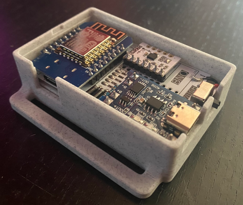

*Image: Meia*

* Customisable, see the Github for more information on ordering and assembly.
* PCB, see Github for more details.
* BMI-160, BMI-270, BNO085.
* Some community made adaptations/modifications.
* Specific components, battery sizes and switch types.

[Github](https://github.com/Shine-Bright-Meow/meowCarrier)

## Shine Bright's Hyperion BMI-BNO PCB Case
*Modified Hyperion design by Shine Bright, based from Smeltie's original Hyperion*

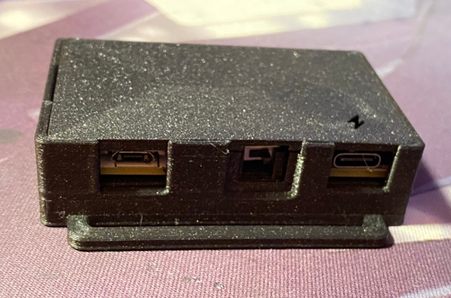

*Image: Shine Bright*

* Customisable, see the Github for more information.
* PCB, see Github for more details.
* BMI-160, BMI-270, BNO085.
* Many community made adaptations/modifications.
* Specific battery sizes and switch types.

[Github](https://github.com/Shine-Bright-Meow/SlimeVR-Hyperion-BMI-BNO-PCB-Case)

## Gorbit99's Tiny-Slime BMI PCB Case
*A tiny and cheap module based SlimeVR tracker design by Gorbit99*

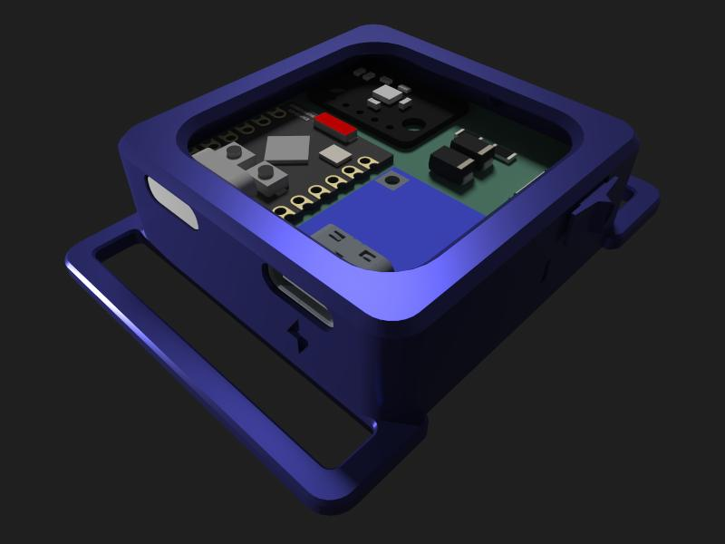

*Image: Gorbit99*

* Customisable, see the Github for more information.
* PCB, see Github for more details.
* BMI-160, BMI-270.
* Some community made adaptations/modifications.
* The antenna is only usable within the same room.
* Specific battery size, IMUs, MCU, power board.

[Github](https://github.com/gorbit99/tiny-slime/)

## ZRock35's Tiny-Official SlimeVR PCB Case
*A remix of Gorbit99's TinySlime case for the Official SlimeVR PCB with adapted version of Pixel's clip to fit it onto!*

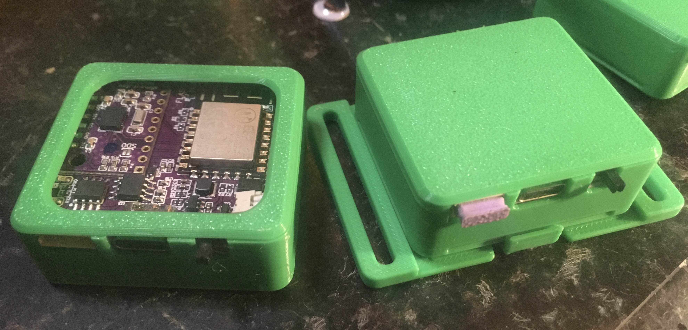

*Image: ZRock35*

* Very simple and tiny PCB case, designed to fit the Official SlimeVR PCB and battery with no modifications needed.
* Open or closed top option, with clip backplate  allowing for easy removing.
* BNO085 Official PCB
* Official SlimeVR standard battery.

[Github](https://github.com/ZRock35/TinyOfficial-Case)

## Sorakage's CheeseCake PCB Case
*Very delicious cakes, designed by Sorakage*

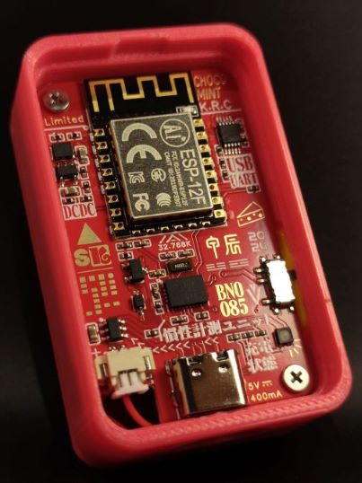

*Image: Sorakage*

* Customisable, see the Github for more information.
* PCB, see Github for more details.
* BMI-160, BMI-270, BNO085, LSM6DSVTR, ICM-42688
* A popular choice with a good variety of community made adaptations/modifications, mainly for bigger batteries.
* Specific battery sizes (803035 or 903035)

[Github](https://github.com/Sorakage033/SlimeVR-CheeseCake)

## The Hyperion
*Design by Smeltie*

* Customisable, see the Github for more information.
* D1 Mini.
* MPU6050, MPU9250 & BNO085.
* Countless community made adaptations/modifications.
* Various battery sizes and switch types.

[Github](https://github.com/Smeltie/Hyperion)

## The Pucirion
*Hyperion case edit by Krysiek, Original Hyperion by Smeltie*

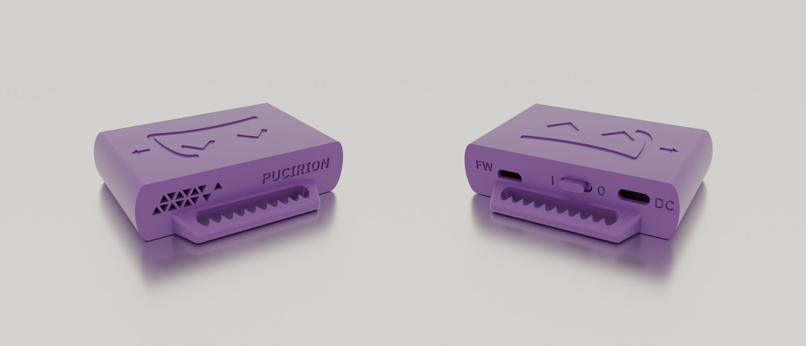

* Stronger handles with teeth that hold the strap, smaller, access to MicroUSB port, redesigned vent. See the Github for more information.
* D1 Mini.
* MPU6050, MPU9250 & BNO085.
* Pucirion repository link has only modified case STL files, full instructions are on the Hyperion repository.

[Github](https://github.com/Krysiek/Pucirion)

## Flexible TPU Case
*Design by ShoryuKyzan*

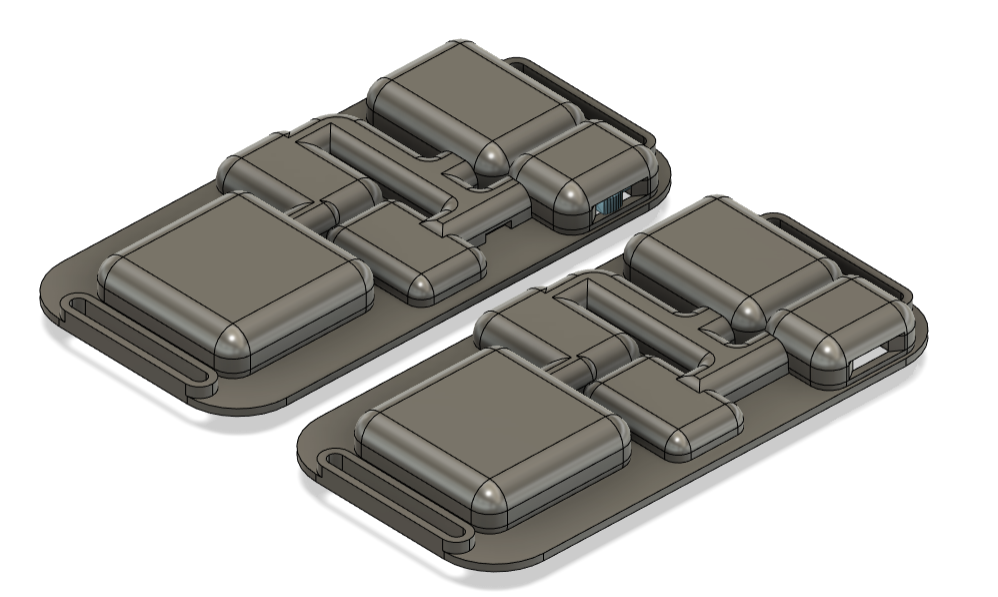

* SlimeVR case printed with TPU filament designed to flex in 3 places, be thin and form fitting. See the Github for more information.
* NodeMCU D1 Mini v3 USB-C (with diagonal corners, not holes at edges).
* BNO085.
* 804040 Battery.
* Additional details, components list and instructions on the repository.

[Github](https://github.com/ShoryuKyzan/SlimeVR-Flexible-Case)

## Slidey-Slimes
*Design by punt-cuncher*

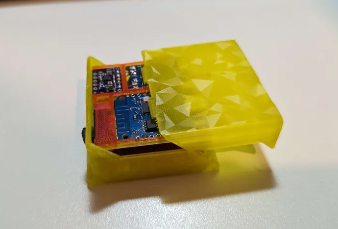

* Easy to assemble, fairly compact sliding case design. No need for screws or glue, just solder together, slide assembled tray into case with satisfying snap.
* D1 Mini 4.0
* BMI160, BMI270, BNO085 (SlimeVR store version).
* 804040 Battery or smaller.
* Additional details, components list and instructions on the repository.

[Github](https://github.com/punt-cuncher/Slidey-Slimes)

## Candy-Case
*Design by ManicQuinn*

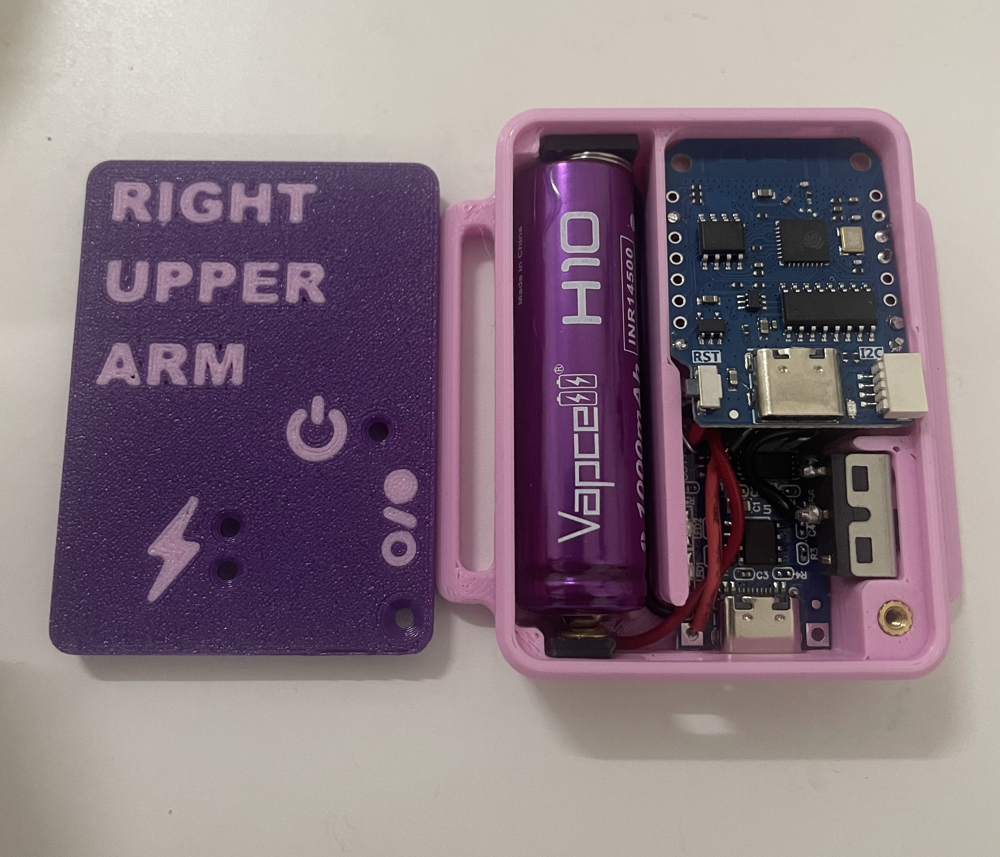

* Non-PCB case design, optimized for being compact while using breakout boards.
* D1 Mini 4.0
* BMI160, BMI270
* 14500 Lithium Ion Battery.
* Additional details, components list and instructions on the repository.

[Github](https://github.com/ManicQuinn/SlimeVR-Candy)

## Zaku² Case
*Design by Tom Yum*

<video name="Zaku² case assembly" autoplay playsinline muted loop>
     <source src="../assets/videos/Zaku2_gif.webm" type="video/webm">
     <source src="../assets/videos/Zaku2_gif.mov" type="video/quicktime">
</video>

* Wemos D1 Mini.
* TP4056 Type-C charge board.
* MPU6050.
* 804040/BP-5M Battery.

[Github](https://github.com/TomYumVR/Zaku2)

## Hexaeder
*Design by MaddesJG*

* Wemos D1 Mini.
* MPU9250 or MPU6050.
* 804040 Lip Battery.

[Thingiverse](https://www.thingiverse.com/thing:5140456)

## Red's Case
*Design by Red*

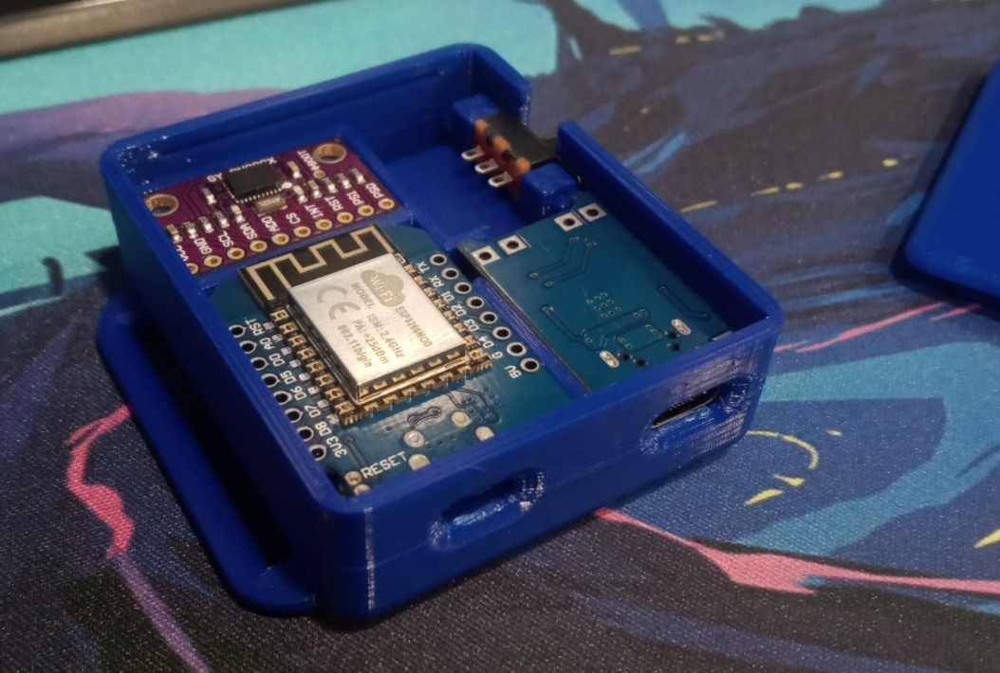

* D1 Mini.
* TP4056 Type-C charge board.
* BNO08x's.
* 783448 1200mAh LiPo.

[Link](../assets/cases/RedSlimeBasic.zip)

## SlimeVR Hello
*Design by Guiguig*

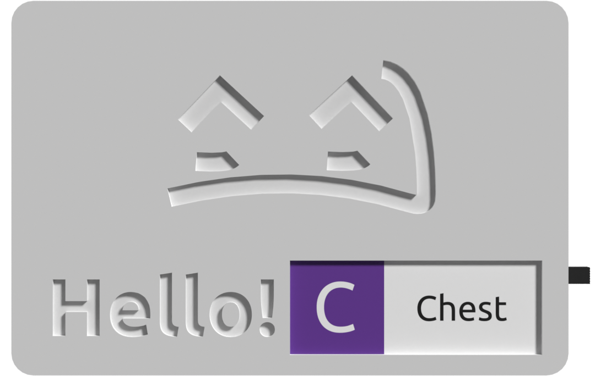

* Wemos D1 Mini ESP8266.
* SPDT 1P2T Slide Switch.
* BNO085.
* 18650 Battery.

[STL](../assets/cases/SlimeVR_Hello_STL.zip)
[Fusion 360](../assets/cases/SlimeVR_Hello_v13.f3d)

## QuantumSlime
*Design by QuantumRed*

* WeMos D1 Mini.
* SS-12F15(VG6) Micro Slide Switch.
* GY-BNO08X.
* 803040 3.7V 1000mAh Li-Po.

[Github](https://github.com/Quantum-Red/QuantumSlimes/releases/tag/V4)

## Frozen Slimes V2
*Design by artemis/frosty*

* Supports MPU6050s, BMI160s, BMI270s, and BNO085s all on one pcb!
* 18650 LiIon Battery.

[Github](https://github.com/frosty6742/frozen-slimes-v2#frozen-slimes-v2)

## Sauce Boss's Case
*Design by Sauce Boss*

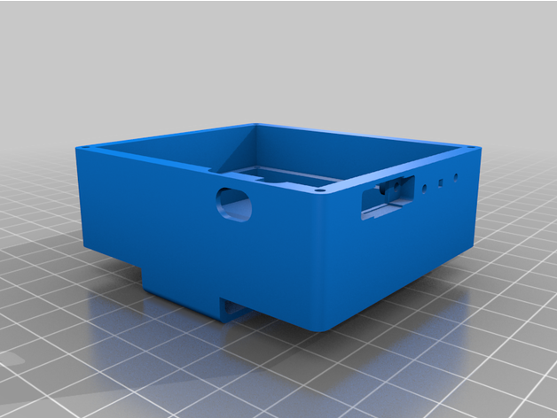

* ESP8266 NodeMCU.
* 2 Pole switch.
* BNO08x.
* 2000mAh battery.

[Thingiverse](https://www.thingiverse.com/thing:4872694)

## SlimeVR Compact Case by Twidge
*Design by Twidge*

* D1 Mini ESP microcontroller.
* 7mm x 3mm x 8.3mm panel switch.
* BNO08x.
* 503450 1000mAh lithium-ion cell.

[Github](https://github.com/TwidgeVR/slimevr_compact_case)

## Arcturus by Lixulia
*Design by Lixulia*

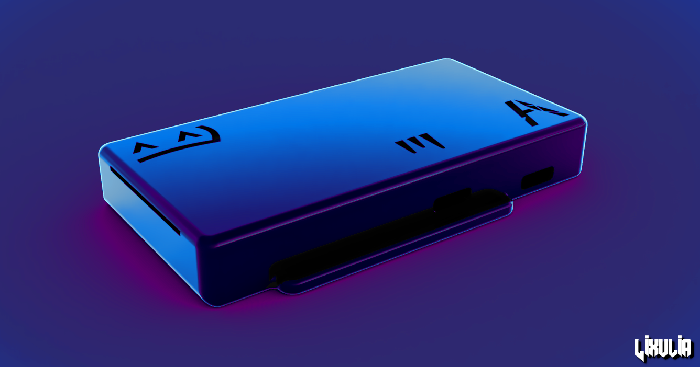

* D1 Mini ESP microcontroller.
* DPDT 2P2T Power Switch.
* BMI160 or BMI270.
* TP4056 USB-C charging module.
* 804040 1200mAh lithium ion cell.

[Github](https://github.com/Lixulia/Arcturus)

## Minted Arcturus by Rosdayle
*Base design by Lixulia*

Modified, refined and with a few feature additions by Rosdayle

* D1 Mini ESP microcontroller.
* DPDT 2P2T Power Switch.
* BMI160 or BMI270.
* TP4056 USB-C charging module.
* 603450 1100mah lithium-ion cell or Smaller than 51x34x6mm.
* Go pro style chest harness.

[Printables](https://www.printables.com/model/647109-minted-arcturus-slimevr-diy-standard-parts)

## SlimeX-FDM
*Design by Yasu3D*

* Wemos D1 Mini V4 Wifi Board
* TP4056 USB-C Charger Board
* SS22F32 Switch
* BMI160 IMUs
* 804040 Li-Po Batteries
* 28AWG stranded silicone wire

[Github](https://github.com/Yasu3D/SlimeX-FDM)

*Thanks to the community for being so awesome and creating so many designs!*
