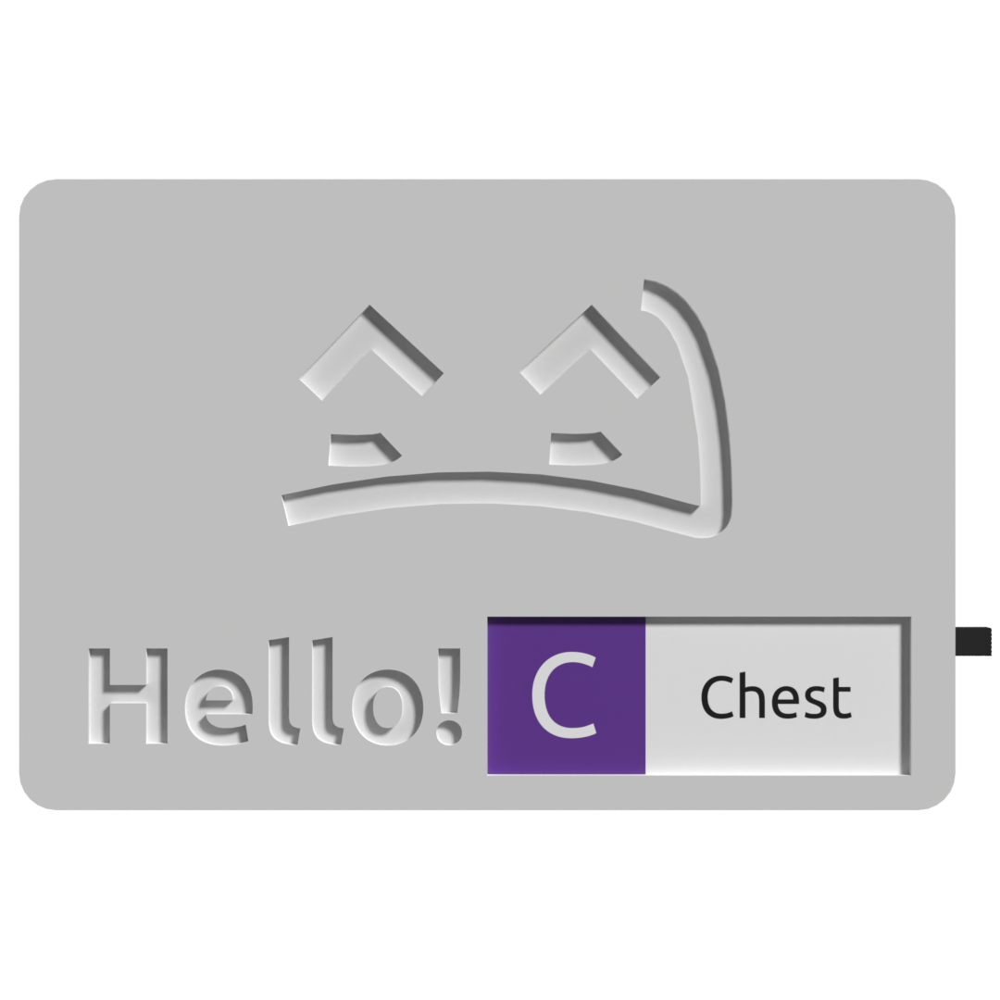

# Community-built Cases
The SlimeVR community has built a huge number of cases for style, internals and purpose. If you wish to add your case to this page, please fork the docs on github.

* TOC
{:toc}

## The Hyperion
*Design by Smeltie*

* Customisable, see the github for more information.
* D1 Mini
* MPU6050, MPU9250 & BNO085
* Various battery sizes and switch types

[Github](https://github.com/Smeltie/Hyperion)

## Zaku² Case
*Design by Tom Yum*

* Wemos D1 Mini
* TP4056 Type-C charge board
* MPU6050
* 804040/BP-5M Battery

[Github](https://github.com/TomYumVR/Zaku2)

## Hexaeder
*Design by MaddesJG*

* Wemos D1 Mini
* MPU9250 or MPU6050
* 804040 Lip Battery

[Thingiverse](https://www.thingiverse.com/thing:5140456)

## Red's Case
*Design by Red*

* D1 Mini
* TP4056 Type-C charge board
* BNO08x's
* 783448 1200mAh LiPo

[Link](../assets/cases/RedSlimeBasic.zip)

## SlimeVR Hello
*Design by Guiguig*

* Wemos D1 Mini ESP8266
* SPDT 1P2T Slide Switch
* BNO085
* 18650 Battery

[STL](../assets/cases/SlimeVR_Hello_STL.zip)
[Fusion 360](../assets/cases/SlimeVR_Hello_v13.f3d)

## QuantumSlime
*Design by QuantumRed*

* WeMos D1 Mini
* SS-12F15(VG6) Micro Slide Switch
* GY-BNO08X
* 803040 3.7V 1000mAh Li-Po

[Github](https://github.com/Quantum-Red/QuantumSlimes/releases/tag/V4)

## Frozen slimes
*Design by lynxo/frosty*

* Wemos D1 Mini
* MPU9250 or MPU6050
* 18650 LiIon Battery
* SS22F32 Switch
* Frozen Slimes PCB Reccomended

[Github](https://github.com/frosty6742/frozen-slimes)

## Sauce Boss's Case
*Design by Sauce Boss*

* esp8266 NodeMCU
* 2 Pole switch
* BNO08x
* 2000mAh battery

[Thingiverse](https://www.thingiverse.com/thing:4872694)

## SlimeVR Compact Case by Twidge
*Design by Twidge*

* D1 Mini ESP microcontroller
* 7mm x 3mm x 8.3mm panel switch
* BNO08x
* 503450 1000mAh lithium ion cell

[Github](https://github.com/TwidgeVR/slimevr_compact_case)

## Arcturus by Lixulia
Design by Lixulia

* D1 Mini ESP microcontroller
* DPDT 2P2T Power Switch
* BMI160
* TP4056 USB-C charging module
* 804040 1200mAh lithium ion cell

[Github](https://github.com/Lixulia/Arcturus)

*Thanks to the community for being so awesome and creating so many designs!*
