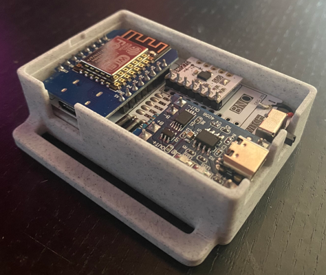
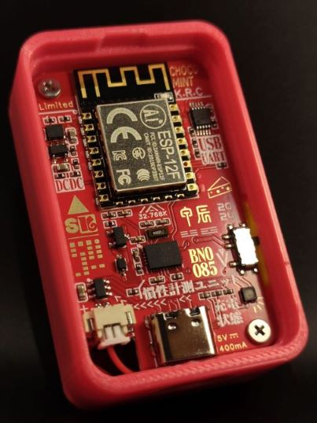
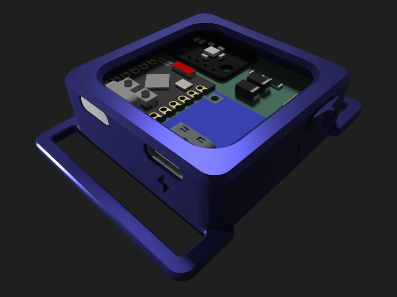
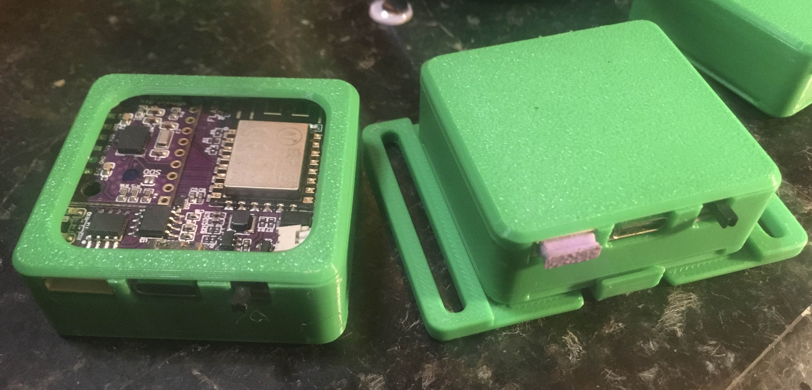

# Community-built Cases

```admonish warning
Choose a case with a PCB if possible!
```

```admonish info
If you are looking for official cases as a replacement or for official DIY kits [those can be found here!](https://shop.slimevr.dev/products/copy-of-slimevr-main-case-pc-plastic).
```

The SlimeVR community has built a huge number of cases for style, internals and purpose. If you wish to add your case to this page, please fork the docs on Github.


## Table Of Contents

* TOC
{:toc}

## Community Case Designs Recommended for New Builds 

### Shine Bright's meowCarrier PCB Case
<b><p style="color: green;">This is the most recommended case for new builds</p></b>
*PCB, Case, and Accessories as a DIY solution, designed by Shine Bright*



*Image: Meia*

* Customisable, see the Github for more information on ordering and assembly.
* PCB, see Github for more details.
* LSM6DSR, LSM6DSV, ICM-45686, BNO085
* Some community made adaptations/modifications.
* Specific components, battery sizes and switch types.

[Github](https://github.com/Shine-Bright-Meow/meowCarrier)

### Sorakage's CheeseCake PCB Case
<b><p style="color: green;">This is a recommended case for new builds.</p></b>
*Very delicious cakes, designed by Sorakage*



*Image: Sorakage*

* Customisable, see the Github for more information.
* PCB, see Github for more details.
* BMI-160, BMI-270, BNO085, LSM6DSVTR, ICM-42688
* A popular choice with a good variety of community made adaptations/modifications, mainly for bigger batteries.
* Specific battery sizes (803035 or 903035)

[Github](https://github.com/Sorakage033/SlimeVR-CheeseCake)

## Community Case Designs

### Gorbit99's Tiny-Slime PCB Case
*A tiny and cheap module based SlimeVR tracker design by Gorbit99*



*Image: Gorbit99*

* Customisable, see the Github for more information.
* PCB, see Github for more details.
* LSM6DSR, LSM6DSV, ICM-45686
* Some community made adaptations/modifications.
* The antenna is only usable within the same room.
* Specific battery size, IMUs, MCU, power board.

[Github](https://github.com/gorbit99/tiny-slime/)

### ZRock35's Tiny-Official SlimeVR PCB Case
*A remix of Gorbit99's TinySlime case for the Official SlimeVR PCB with adapted version of Pixel's clip to fit it onto!*



*Image: ZRock35*

* Very simple and tiny PCB case, designed to fit the Official SlimeVR PCB and battery with no modifications needed.
* Open or closed top option, with clip backplate  allowing for easy removing.
* BNO085 Official PCB
* Official SlimeVR standard battery.

[Github](https://github.com/ZRock35/TinyOfficial-Case)

### Frozen Slimes V2
*Design by artemis/frosty*


* Supports most IMU's
* 18650 LiIon Battery.

[Github](https://github.com/frosty6742/frozen-slimes-v2#frozen-slimes-v2)

---

*Thanks to the community for being so awesome and creating so many designs!*
