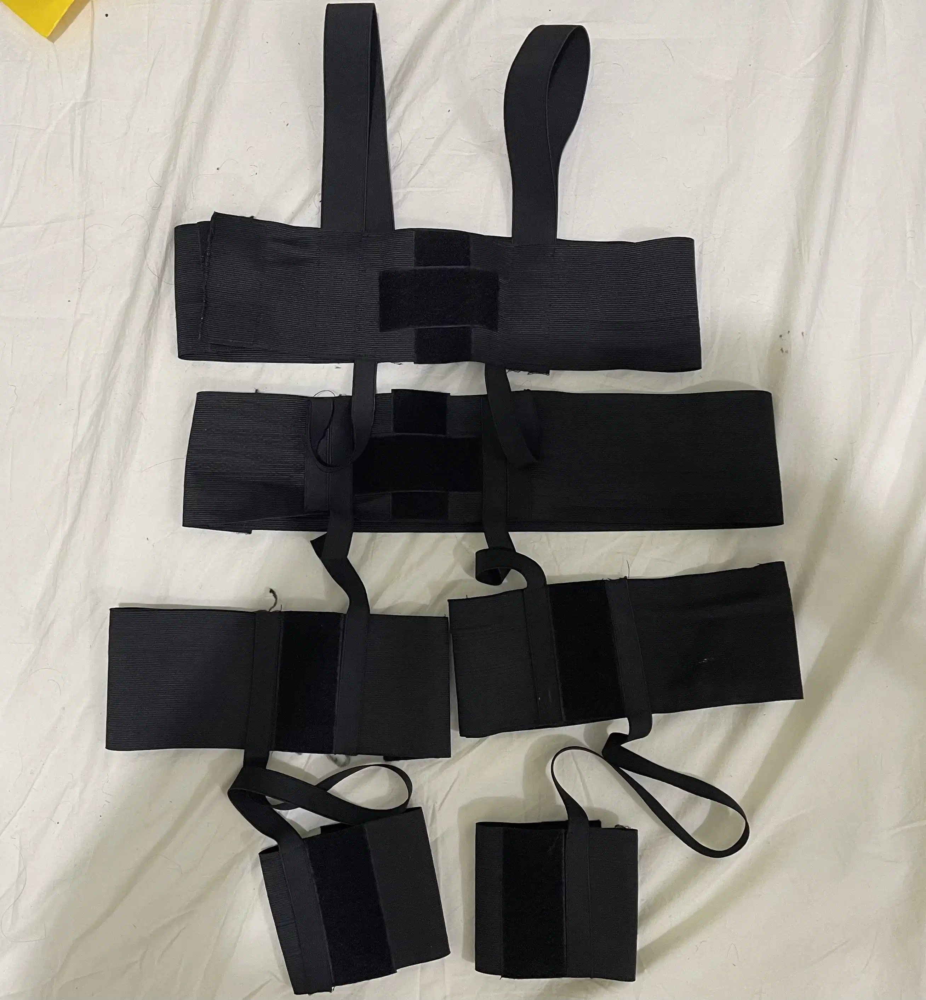
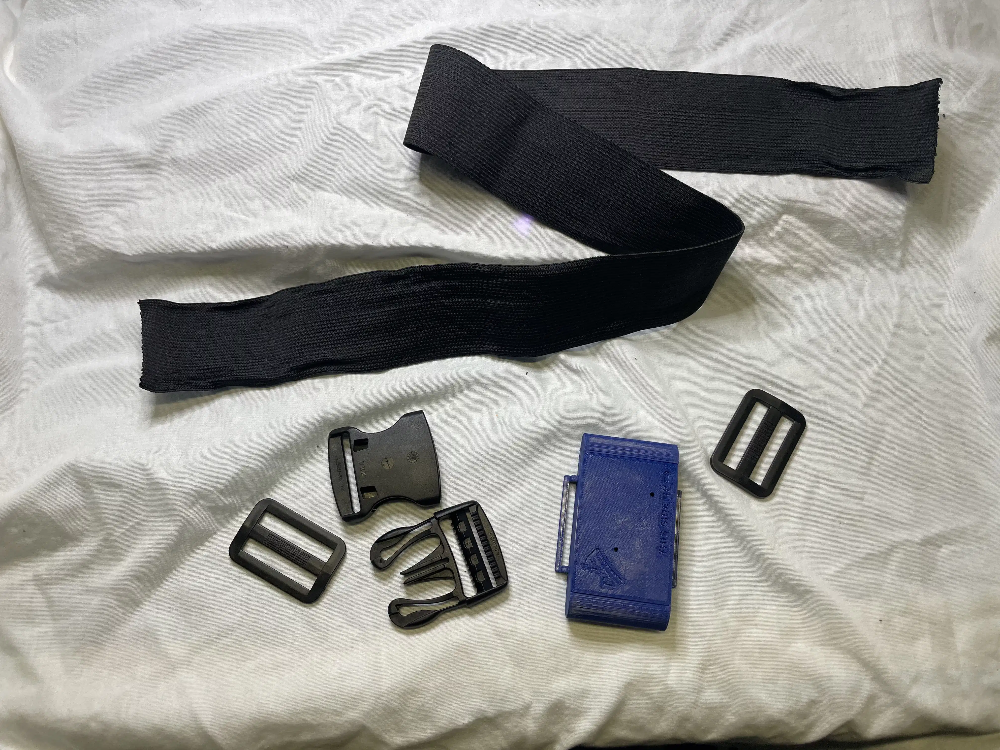
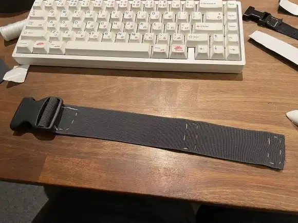
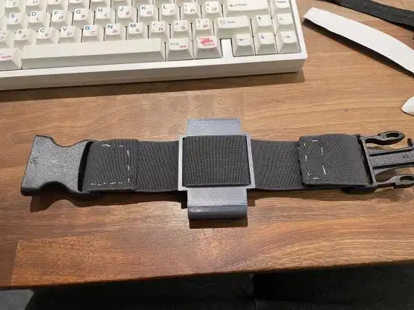

# Community DIY Straps

This page contain strap designs for WiFi slimes submitted by the community.
- This page is not a definitive or step-by-step guide to straps.
- It is meant to inspire you to create your own DIY straps.
- All examples shown are community-made or provided.

For community straps for [Smol Slimes](../smol-slimes/index.md) refer to [Smol Community Straps](../smol-slimes/hardware/smol-slimes-community-straps.md).

## Table of Contents

- TOC
{:toc}

## Common Components

```admonish important
For information on common strap components, 3D-printable buckles, and tracker placement, refer to [DIY Straps Components](../../diy/diy-strap-components.html)
```

## Community Strap Builds

### Tom Yum's

Tom Yum aimed to prevent strap sliding. He directly sewed the velcro into place and used it as the main mounting method. He also chose to mount the trackers using velcro instead of loops to eliminate skin contact with all the parts other than the elastic bands.

These straps require the following materials:

- 105mm Elastic band
- 40mm Elastic band
- 20mm Elastic band
- Velcro Strips (Non-adhesive)



### Fadetoblk27's

Fadetoblk27's build requires no sewing, though sewing can be added for durability.
The setup uses slider buckles to secure the ends.



Materials used:

- Elastic band 50mm
- 50mm Buckles
- 50mm Slider Buckles

Instructions:
Cut a strip of material to the desired length by wrapping it around the desired body part.
Weave the strap through the normal buckle on both ends and instead of sewing the ends, weave them through the slider buckles (as seen in the picture).
This allows the straps to be very adjustable and require no sewing.
Sewing can still be done if the added strength/stability is desired.

### Smeltie's

For Smeltie's straps, the material ELA1300 was used. Unfortunately not widely available outside the EU/UK.
This material can be found at LeDuc (Europe) and various UK based stores.
It is sometimes referred to as Elastic band for underwear/skirts.
You can recognize it by the lack of longitudinal lines in the material (most elastic bands just have a few rubber threads along the length of the material).

These straps require the following materials:

- ELA1300 50mm Elastic band (Can be substituted)
- Velcro strips (Preferably without adhesive)
- 50mm buckles




These straps have one closed end and one end with velcro.

Instructions:
Cut the strap to fit your body part, leaving extra length.
Weave one end of the strap through one of the buckle halves, and sew it ~1 inch past the edge.
Weave the other end through the other half of the buckle, but instead of sewing, attach a strip of velcro on either side.
Fit the strap and test tightness before you sew the velcro in place.
Once finished, you can make an exact replica for the opposite side of your body.

## Contributing

Want to share your own DIY strap design, tip, or resource?  
We welcome community contributions!

- **How to contribute:**  
  - Open a pull request on the [SlimeVR Docs GitHub repository](https://github.com/SlimeVR/SlimeVR-Docs-Site).
  - Or, suggest changes and share your ideas in the [SlimeVR Discord](https://discord.gg/slimevr) -> [Suggestions on strap improvements](https://discord.com/channels/817184208525983775/1202031023945416725) channel.

When contributing, please include clear photos, a description, and any relevant links or files.
Your contribution helps make VR more accessible and easier to build for everyone!

---

*Created by smeltie, tomyum3dp, fadetoblk27, and Depact*
