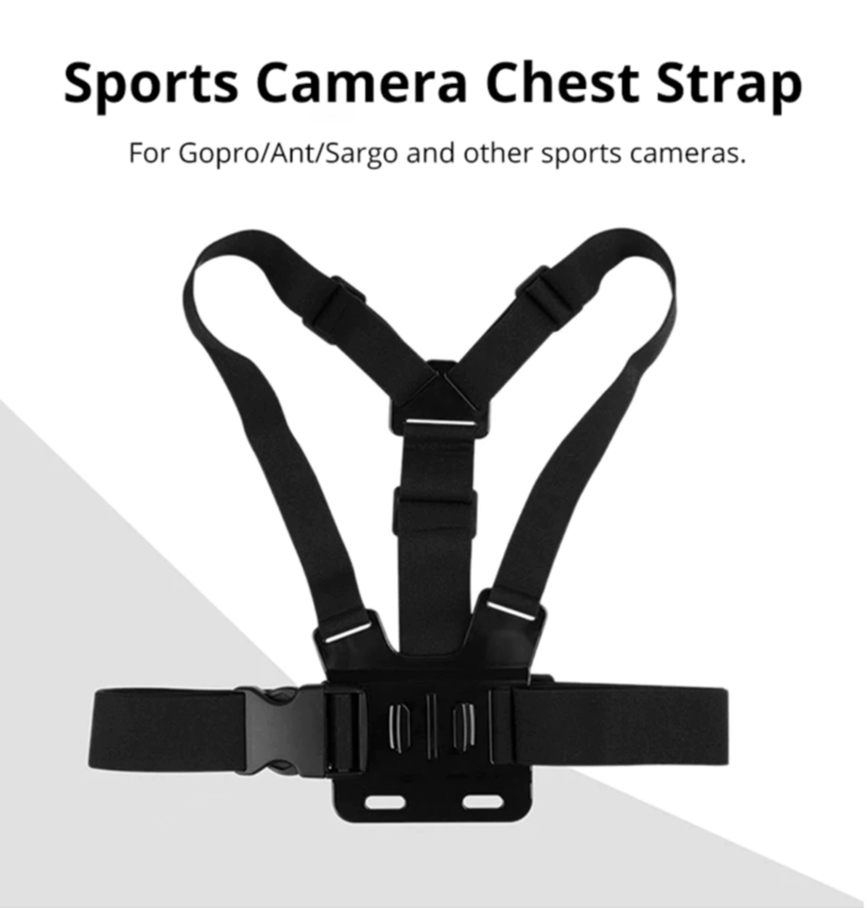
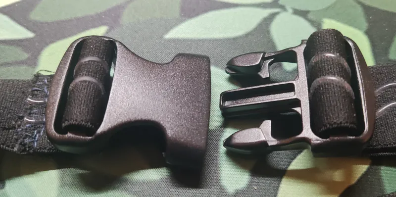
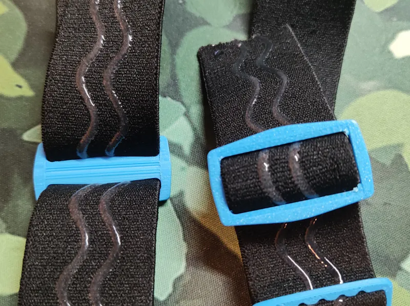
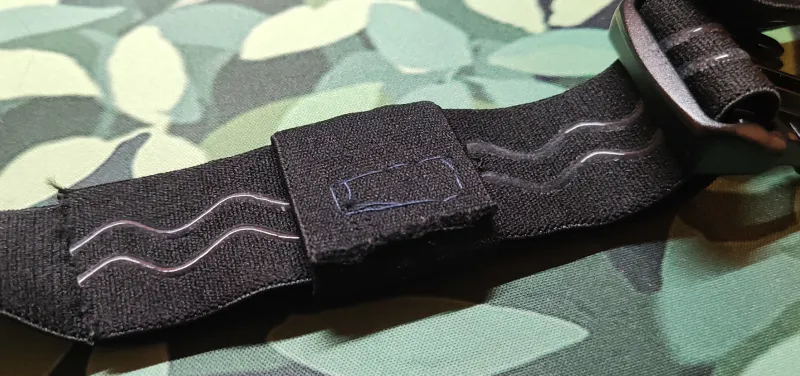

# DIY Straps Components

This page covers the components you need to build tracker straps.

Component recommendations are based on testing and feedback from the SlimeVR community.

## Table of Contents

- TOC
{:toc}

## Community Strap Designs for WiFi and Smol Slimes

```admonish important
For information on existing community designs for WiFi Slime straps refer to [Community DIY Straps](./community-diy-straps.md), and [Smol Community Straps](../smol-slimes/hardware/smol-slimes-community-straps.md) for [Smols](../smol-slimes/index.md) straps.
```

Key differences affecting WiFi Slimes and Smol Slimes strap designs:

| Parameter              | WiFi Slime | Smol Slime                        |
| ---------------------- | ---------- | --------------------------------- |
| Tracker Size           | Bigger     | Around 40x50mm (with strap mount) |
| Regular Strap width    | 50mm       | 30mm                              |
| Extension Trackers     | Yes        | No                                |
| Average Tracker Weight | 50g        | ~10-15g                           |


## Tracker Placement


## Strap Parts

## 🎗️ Band

### Band Materials

#### Elastic Band with Non-Slip Webbing


The foundation of most entry level DIY straps.

This elastic band with integrated non-slip silicone webbing provides better grip against skin compared to standard elastic and nylon, reducing tracker rotation and drift during movement.

Can be found by searching: `Elastic Band With Non-slip Webbing`.

<div class="table-wrapper">
  <table class="band-materials">
    <thead>
      <tr>
        <th>Pros</th>
        <th>Cons</th>
        <th>Link</th>
      </tr>
    </thead>
    <tbody>
      <tr>
        <td>
          <ul>
            <li>Available in multiple widths.</li>
            <li>Simple & cheap.</li>
            <li>Easy to work with.</li>
            <li>Strong initial grip.</li>
            <li>Easy to wash & dry.</li>
          </ul>
        </td>
        <td>
          <ul>
            <li>Rotates easily.</li>
            <li>Less stable tracking (bounce).</li>
          </ul>
        </td>
        <td>
          <a href="https://www.aliexpress.com/item/1005003917576160.html"> AliExpress </a>
        </td>
      </tr>
    </tbody>
  </table>
</div>

### Band Support

#### 🟢 GoPro Chest Strap



A purpose-built harness for chest-mounted action cameras. When paired with a tracker mounting adapter, it provides excellent stability for chest trackers for minimal price. Ideal if you want a pre-made solution without custom sewing.

Can be found by searching: `Chest Strap Mount Belt for GoPro`.

<div class="table-wrapper">
  <table class="band-materials">
    <thead>
      <tr>
        <th>Pros</th>
        <th>Cons</th>
        <th>Link</th>
      </tr>
    </thead>
    <tbody>
      <tr>
        <td>
          <ul>
            <li>Robust chest tracker mounting.</li>
            <li>Purpose-built for chest mounting.</li>
          </ul>
        </td>
        <td>
          <ul>
            <li>Only suitable for chest placement.</li>
          </ul>
        </td>
        <td>
          <a href="https://www.aliexpress.com/item/1005004792179605.html"> AliExpress </a>
        </td>
      </tr>
    </tbody>
  </table>
</div>

#### Compression Knee Brace


A ready-made support garment designed to stay firmly in place on the leg. The built-in compression and non-slip material make it an excellent choice for thigh tracker placement without requiring additional modifications. Contributed by Dean Ravencrest dot dog.

<div class="table-wrapper">
  <table class="band-materials">
    <thead>
      <tr>
        <th>Pros</th>
        <th>Cons</th>
      </tr>
    </thead>
    <tbody>
      <tr>
        <td>
          <ul>
            <li>Designed to stay in place on limbs.</li>
            <li>Good grip and friction.</li>
          </ul>
        </td>
        <td>
          <ul>
            <li>Limited to knee/thigh placement.</li>
            <li>May be uncomfortable for extended wear.</li>
          </ul>
        </td>
      </tr>
    </tbody>
  </table>
</div>

### Measuring Band Length for Making Straps

##### What You Need
- Soft measuring tape  

##### 1. Measure Placement Areas
Wrap the band **snug, not tight** around each [spot of tracker placement](#tracker-placement). Keep the band flat and level.

##### 2. Add Allowance
Add **10 cm** to each measurement. You can always cut down.

Some of the added length is needed to hold strap in place by buckles and slides.

##### 3. Final Check
Bands should:
- Stay secure during movement.
- Not restrict circulation.
- Have **5 cm** of adjustment.

**Example:**  
5 meters of elastic band are generally enough to make 6 straps for an average man wearing European size XL.

## 🔒 Buckle

### Buckle Tier Rankings

Ranking criteria:
- Ease of opening and closing on limb blindly - can you easily close it on limb without looking?
- Comfort while standing - does it dig in or feel bulky?
- Comfort while laying on it - Do you feel it while lying on it?
- Friction for band fragment it holds - does the band slip through?
- Tactile markers to help prevent twisted band locking, by telling where top and bottom is - can you orient it correctly by touch, when closing it?

### 🟢 Recommended Buckles

#### 🟢 Brackles V2 30/38/50Mm for Elastic Straps by RDTiel


<div class="table-wrapper">
  <table class="3d-printable-buckles">
    <thead>
      <tr>
        <th>Pros</th>
        <th>Cons</th>
        <th>Width</th>
        <th>Link</th>
      </tr>
    </thead>
    <tbody>
      <tr>
        <td>
          <ul>
            <li>Decent blind opening.</li>
            <li>Flat, short, shape reduce feeling on skin.</li>
          </ul>
        </td>
        <td>
          <ul>
            <li>Shrek ears are weak point, and break off after long usage.</li>
          </ul>
        </td>
        <td>30mm, 38mm, 50mm</td>
        <td>
          <a href="https://www.thingiverse.com/thing:6815793"> Thingiverse </a>
        </td>
      </tr>
    </tbody>
  </table>
</div>

#### 🟢 Dovetail Strap Latch 30Mm/40Mm/50Mm by MoDErahN


<div class="table-wrapper">
  <table class="3d-printable-buckles">
    <thead>
      <tr>
        <th>Pros</th>
        <th>Cons</th>
        <th>Width</th>
        <th>Link</th>
      </tr>
    </thead>
    <tbody>
      <tr>
        <td>
          <ul>
            <li>Small, flat shape, with no bumps.</li>
          </ul>
        </td>
        <td>
          <ul>
            <li>Poor blind opening & closing.</li>
            <li>Robust construction.</li>
          </ul>
        </td>
        <td>30mm, 40mm, 50mm</td>
        <td>
          <a href="https://www.thingiverse.com/thing:6929026"> Thingiverse </a>
        </td>
      </tr>
    </tbody>
  </table>
</div>

### 🟠 Acceptable Buckles, but Better Options Exist

#### 🟠 Common AliExpress Plastic Buckle


<div class="table-wrapper">
  <table class="3d-printable-buckles">
    <thead>
      <tr>
        <th>Pros</th>
        <th>Cons</th>
        <th>Width</th>
        <th>Link</th>
      </tr>
    </thead>
    <tbody>
      <tr>
        <td>
          <ul>
            <li>Inexpensive and widely available.</li>
          </ul>
        </td>
        <td>
          <ul>
            <li>Bulky against skin.</li>
            <li>Barely prevents band from slipping.</li>
            <li>Lack of tactile markers to tell where top and bottom is.</li>
          </ul>
        </td>
        <td>30mm, 40mm, 50mm</td>
        <td>
          <a href="https://pl.aliexpress.com/item/32804319193.html"> AliExpress </a>
        </td>
      </tr>
    </tbody>
  </table>
</div>

### 🔴 Poor Buckles, Generally Not Recommended

#### 🔴 SlimeVR Straps Clip Hook Extended by Astrlx


<div class="table-wrapper">
  <table class="3d-printable-buckles">
    <thead>
      <tr>
        <th>Pros</th>
        <th>Cons</th>
        <th>Width</th>
        <th>Link</th>
      </tr>
    </thead>
    <tbody>
      <tr>
        <td>
          <ul>
            <li>Simple clip design.</li>
          </ul>
        </td>
        <td>
          <ul>
            <li>Difficult to open blindly.</li>
            <li>Can catch skin during use.</li>
            <li>Limited size options.</li>
            <li>Lack of tactile markers to tell where top and bottom is.</li>
          </ul>
        </td>
        <td>50mm</td>
        <td>
          <a href="https://www.thingiverse.com/thing:6811130"> Thingiverse </a>
        </td>
      </tr>
    </tbody>
  </table>
</div>

#### 🔴 Velcro Strap Quick Clip Hooks by Kurzaq


<div class="table-wrapper">
  <table class="3d-printable-buckles">
    <thead>
      <tr>
        <th>Pros</th>
        <th>Cons</th>
        <th>Width</th>
        <th>Link</th>
      </tr>
    </thead>
    <tbody>
      <tr>
        <td>
          <ul>
            <li>Quick to fasten with velcro.</li>
          </ul>
        </td>
        <td>
          <ul>
            <li>Velcro degrades over time.</li>
            <li>Can feel bulky on skin.</li>
            <li>Limited width options, of more rarely used width.</li>
            <li>Barely prevents band from slipping.</li>
            <li>Lack of tactile markers to tell where top and bottom is.</li>
          </ul>
        </td>
        <td>25mm, 35mm</td>
        <td>
          <a href="https://www.thingiverse.com/thing:6178909"> Thingiverse </a>
        </td>
      </tr>
    </tbody>
  </table>
</div>

## ↔️ Slide

### Tri-glide Slide, a.k.a. Webbing Slide

A small but essential component for adjustable straps. This simple device consists of a rectangle with a dividing bar, creating two openings. The band threads through one opening and back through the other, allowing you to adjust strap tightness without sewing. Works best in combination with a primary buckle for maximum security.

### Slide Tier Rankings

Ranking criteria:
- Comfort while standing - minimal bulk and pinching.
- Comfort while laying on it - smooth surface without sharp edges.
- Friction for band band it holds - secure grip without slipping.

### 🟢 Recommended Slides

#### 🟢 30mm, Slide Buckle by Guidoo


<div class="table-wrapper">
  <table class="3d-printable-Slides">
    <thead>
      <tr>
        <th>Pros</th>
        <th>Cons</th>
        <th>Width</th>
        <th>Link</th>
      </tr>
    </thead>
    <tbody>
      <tr>
        <td>
          <ul>
            <li>Simple tri-glide design.</li>
            <li>Adjustable strap length.</li>
          </ul>
        </td>
        <td>
          <ul>
            <li>May require secondary buckle for security.</li>
          </ul>
        </td>
        <td>30mm</td>
        <td>
          <a href="https://www.thingiverse.com/thing:1023595"> Thingiverse </a>
        </td>
      </tr>
    </tbody>
  </table>
</div>

### 🔴 Poor Slides, Generally Not Recommended

#### 🔴 Keeper Loop

Keeper loop is fixed or movable loop that holds the loose end of the strap flat against the strap after it's buckled.



<div class="table-wrapper">
  <table class="3d-printable-Slides">
    <thead>
      <tr>
        <th>Pros</th>
        <th>Cons</th>
        <th>Width</th>
        <th>Link</th>
      </tr>
    </thead>
    <tbody>
      <tr>
        <td>
          <ul>
            <li>Keeps strap end neat.</li>
          </ul>
        </td>
        <td>
          <ul>
            <li>Does not stop band from sliding.</li>
            <li>Only works for low movement usage.</li>
            <li>Only effective with buckles that already stop band from sliding.</li>
          </ul>
        </td>
        <td>Flexible</td>
        <td>
          N/A
        </td>
      </tr>
    </tbody>
  </table>
</div>

## 🖨️ Buckles and Slides Printing Material

### 🟢 Best Performance

#### 🟢 PETG
- **Strength**: Good impact resistance, less brittle than PLA
- **Durability**: Holds up well to repeated use and sweat exposure
- **Print Settings**: Print as hot as the filament can handle (typically higher temps). Use high heat with slow cooling for strongest results. Reserve cooling for bridges and support interfaces only. Lower print speeds yield even better results.
- **Issues**: Stringing is caused by wet filament and insufficient retraction settings, not by lack of cooling
- **Availability**: One of the widely available FDM 3D printing materials

### 🔴 Breaks Apart from Active Usage over Time

**Not recommended:** These materials are acceptable to use if no other option is available. They have issues with properties critical for printing parts that work and last.

#### 🔴 PLA+/PLA Pro
- **Strength**: Better than standard PLA
- **Durability**:🔴 Moderate; can crack under repeated stress
- **Friction**: Higher friction than PETG, slides may stick
- **Issues**: Brittle, heat sensitivity (hot rooms/sunlight)

#### 🔴 Standard PLA
- **Strength**: Weakest option, prone to snapping
- **Durability**: 🔴 Poor for functional parts with repeated use, better not use
- **Friction**: Can work for slides but wears faster
- **Issues**: Brittle, especially in thin sections. Very bad for smol cases
- **Availability**: One of the most available FDM 3D printing materials
- **Best for**: Testing fit before printing in better material

## Strap Sliding Troubleshooting

Straps slipping is one of the most common issues when making your own straps. This causes trackers to move and rotate, degrading tracking accuracy. For good tracking it is critical for your straps to not slide.

There are a few things you can try to prevent or minimize this issue.

Things to check:
- Material that is too flexible-stiffer materials with more grip resist sliding better.
- Your straps are too narrow/small. Wider straps distribute pressure more evenly and slide less.

Ideas:
- Add a few lines of hot glue on the strap for added grip on the skin-facing side.
- Use secondary straps to keep the trackers in place (like [Tom Yum's design](./community-diy-straps.md#tom-yums)).

## Contributing

Want to share your own DIY strap design, tip, or resource?  
We welcome community contributions!

- **How to contribute:**  
  - Suggest changes, share your ideas and experience in the [SlimeVR Discord](https://discord.gg/slimevr) -> [Suggestions on strap improvements](https://discord.com/channels/817184208525983775/1202031023945416725) channel.
  - Or, open a pull request on the [SlimeVR Docs GitHub repository](https://github.com/SlimeVR/SlimeVR-Docs-Site).

When contributing, please include clear photos, a description, and any relevant links or files.
Your contribution helps make VR more accessible and easier to build for everyone!

---

*Created by smeltie, tomyum3dp, fadetoblk27, and Depact*
