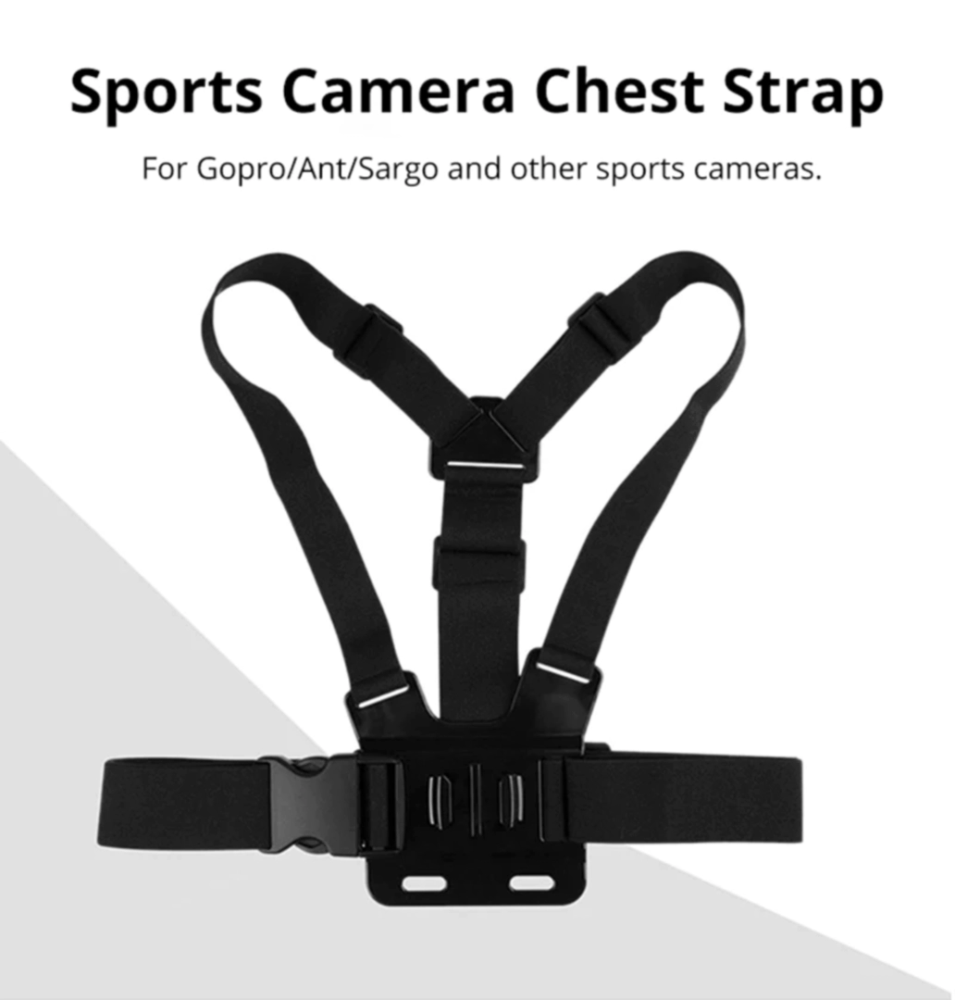
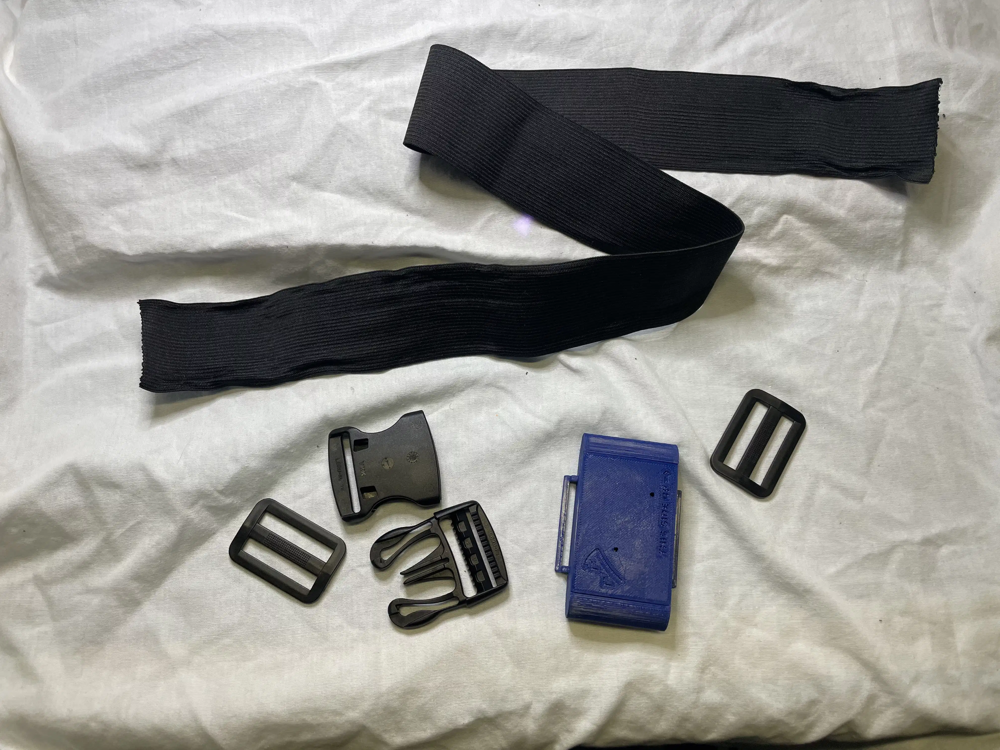

# DIY Straps Guide

```admonish warning
- This page is not a definitive or step-by-step guide to straps.
- This page is meant to be used as inspiration to make your own DIY straps.
- All examples on this page are community made/provided.
- This page contains community straps only for Slimes. For [Smols Slimes](../smol-slimes/index.md) community straps refer to [Smol Community Straps](../smol-slimes/hardware/smol-slimes-community-straps.md).
```

Welcome to the DIY Straps page!  
Here you'll find a curated collection of community strap solutions, tips, and resources contributed by the SlimeVR community. 

This guide covers:
- Tracker placement
- Suggested components and materials for making your own straps
- 3D printable buckles
- Links to useful resources and product listings

Whether you're looking for inspiration, step-by-step instructions, or looking to see what others have built, this page is your starting point for making comfortable, reliable straps for your Slimes.

## Table Of Contents

- TOC
{:toc}

## Tracker Placement


## Components Guide

Here is a list of useful items for making your own straps.

### Band

#### GoPro Chest Strap + Adapter for case

<div class="embeddedVideo">
    
    Image is taken from <a href="https://www.aliexpress.com/item/1005004792179605.html">this Aliexpress listing</a>
</div>

Provides robust chest tracker mounting.

It can be found by `Chest Strap Mount Belt for GoPro`.

#### Compression Knee Brace 

<div class="embeddedVideo">
    
    Original idea and photo by Dean Ravencrest dot dog.
</div>

A solution for thigh tracker slipping.

#### Elastic Band With Non-slip Webbing

<div class="embeddedVideo">
    
</div>

Enhanced grip compared to regular bands.

Can be found by `Elastic Band With Non-slip Webbing`.

### 3D Printable Buckles

<div class="table-wrapper">
  <table class="3d-printable-buckles">
    <thead>
      <tr>
        <th>Image</th>
        <th>Name</th>
        <th>Author</th>
        <th>Width</th>
        <th>Link</th>
      </tr>
    </thead>
    <tbody>
      <tr>
        <td>
          
        </td>
        <td>Dovetail Strap Latch 30mm 40mm 50mm SlimeVR Buckles</td>
        <td>MoDErahN</td>
        <td>30mm, 40mm, 50mm</td>
        <td>
          <a href="https://www.thingiverse.com/thing:6929026"> Thingiverse </a>
        </td>
      </tr>
      <tr>
        <td>
          
        </td>
        <td>Brackles V2 30/38/50mm for elastic straps</td>
        <td>RDTiel</td>
        <td>30mm, 38mm, 50mm</td>
        <td>
          <a href="https://www.thingiverse.com/thing:6815793"> Thingiverse </a>
        </td>
      </tr>
      <tr>
        <td>
          
        </td>
        <td>SlimeVR Straps Clip Hook Extended (Astrix Remix)</td>
        <td>Astrlx</td>
        <td>50mm</td>
        <td>
          <a href="https://www.thingiverse.com/thing:6811130"> Thingiverse </a>
        </td>
      </tr>
      <tr>
        <td>
          
        </td>
        <td>Stock Slime VR Velcro Strap Quick Clip Hooks by Kurzaq</td>
        <td>Kurzaq</td>
        <td>25mm, 35mm</td>
        <td>
          <a href="https://www.thingiverse.com/thing:6178909"> Thingiverse </a>
        </td>
      </tr>
    </tbody>
  </table>
</div>

### Prevent Sliding

Trackers sliding around is one of the most common issues when making your own straps.
However, there are a few things you can try to prevent or minimize this issue.

Things to check:

- Your material is too flexible.
- Your straps are too narrow/small.

Ideas:

- Add a few lines of hot glue on the strap for added grip.
- Add straps in between the trackers to keep them in place (like Tom Yum).

## Community strap builds

```admonish info
This is a list of straps for regular Slimes. For community straps for [Smols Slimes](../smol-slimes/index.md) refer to [Smol Community Straps](../smol-slimes/hardware/smol-slimes-community-straps.md).
```

### Tom Yum's

Tom Yum wanted to prevent his straps from sliding. He opted to directly sew the velcro and use it as the main mounting system. He also chose to mount the trackers using velcro instead of loops to eliminate skin contact with all the parts other than the elastic bands.

These straps require the following materials:

- 105mm Elastic band
- 40mm Elastic band
- 20mm Elastic band
- Velcro Strips (Non-adhesive)


### Fadetoblk27's

Fadetoblk27 took an approach that does not require sewing—sewing can be done for added strength.
This is achieved by using slider buckles.



Materials used:

- Elastic band 50mm
- 50mm Buckles
- 50mm Slider Buckles

Instructions:
Cut a strip of material to the desired length by wrapping it around the desired body part.
Weave the strap through the normal buckle on both ends and instead of sewing the ends, weave them through the slider buckles (as seen in the picture).
This allows the straps to be very adjustable and require no sewing.
Sewing can still be done if the added strength/stability is desired.

### Smeltie's

For Smeltie's straps, the material ELA1300 was used. Sadly, this material isn't readily available outside of the EU and UK neighboring countries.
This material can be found at LeDuc in Europe and various UK based stores.
It is sometimes referred to as Elastic band for underwear/skirts.
You can recognize it by the lack of longitudinal lines in the material (most elastic bands just have a few rubber threads along the length of the material).

These straps require the following materials:

- ELA1300 50mm Elastic band (Can be substituted)
- Velcro strips (Preferably without adhesive)
- 50mm buckles


These straps have one closed end and one end with velcro.

Instructions:
Wrap the material around the desired body part and cut to length, keep a little extra material just in case.
Weave one end of the strap through one of the buckle halves, make it protrude just over an inch and sew it shut.
Weave the other end through the other half of the buckle, but instead of sewing, attach a strip of velcro on either side.
Test fit your straps and ensure the correct tightness before you sew the velcro in place.
Once you have finished the strap, you can make an exact replica for the opposite side of your body.

---

### Credits

*Created by smeltie, tomyum3dp, fadetoblk27 and Depact*
