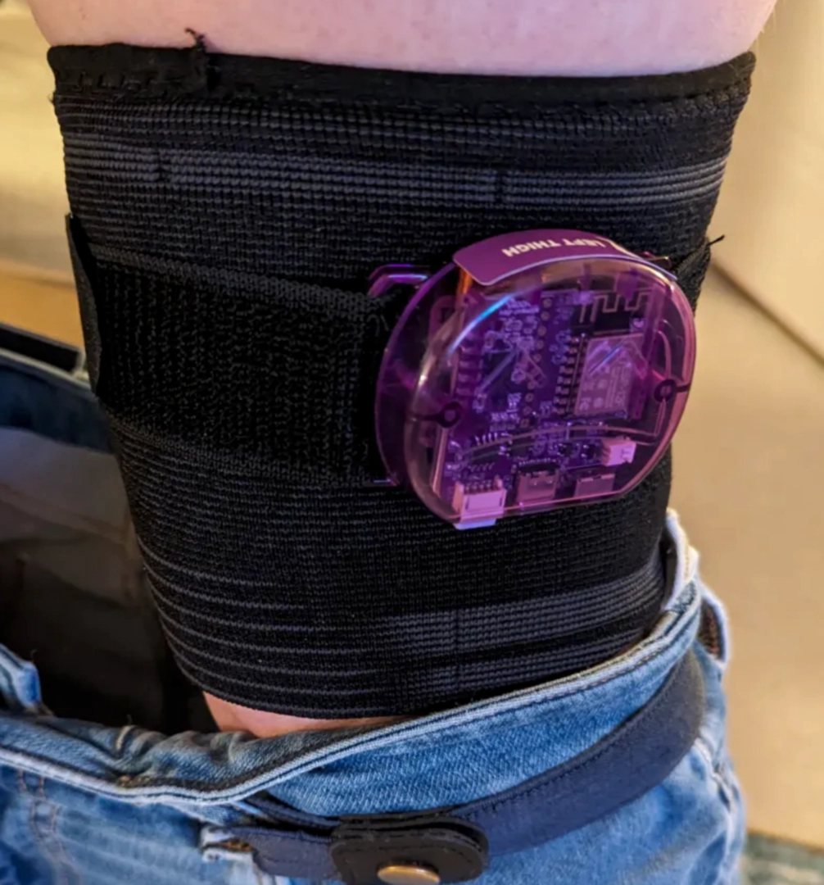

# DIY Straps Guide

```admonish warning
- This page is not a definitive or step-by-step guide to straps.
- It is meant to inspire you to create your own DIY straps.
- All examples shown are community-made or provided.
```

Welcome to the DIY Straps page! Here you'll find a curated collection of community strap solutions, tips, and resources contributed by the SlimeVR community. 

Whether you're looking for inspiration, step-by-step ideas, or just want to see what others have built, this page is your starting point for making comfortable, reliable straps for your Slimes.

## Table Of Contents

- TOC
{:toc}

## Tracker Placement


## Strap Key Components

Here is a list of useful items for making your own straps.

### 🎗️ Band

#### Length
5 meters of elastic band are generally enough to make 6 straps for an average man wearing European size XL.

#### Band Materials

##### GoPro Chest Strap + Adapter for Case
Provides robust chest tracker mounting.
Can be found by searching: `Chest Strap Mount Belt for GoPro`.

| Image             | Component                                                                                                                        | Listing Name | Color/Variant                                                       | Link |
| ----------------- | -------------------------------------------------------------------------------------------------------------------------------- | ------------ | ------------------------------------------------------------------- | ---- |
|   Image is taken from <a href="https://www.aliexpress.com/item/1005004792179605.html">this AliExpress listing</a> | GoPro Chest Strap | Chest Strap Mount Belt for Gopro Hero 9 8 7 6 5 4 Insta360 R X2 DJI OSMO Action Camera Harness for Go Pro SJCAM EKEN Accessories | Black        | [AliExpress](https://www.aliexpress.com/item/1005004792179605.html) |      |

##### Elastic Band With Non-slip Webbing
Offers improved grip compared to regular elastic bands.
Can be found by `Elastic Band With Non-slip Webbing`.

| Image                                                                                                                                                                                    | Component                                              | Listing Name                                                                                                                   | Color/Variant             | Link                                                                |
| ---------------------------------------------------------------------------------------------------------------------------------------------------------------------------------------- | ------------------------------------------------------ | ------------------------------------------------------------------------------------------------------------------------------ | ------------------------- | ------------------------------------------------------------------- |
|  | 5m of 30mm Elastic Band with Non-slip Silicone Webbing | Meetee 2/5/10Meters Elastic Band 20-50mm Non-slip Webbing For Belt Garment Wave Silicone Ribbon DIY Clothes Sewing Accessories | EB312-Black-30mm, 5Meters | [AliExpress](https://www.aliexpress.com/item/1005003917576160.html) |      

##### Compression Knee Brace 

<div class="embeddedVideo">
    
    Original idea and photo by Dean Ravencrest dot dog.
</div>

A useful solution to prevent thigh trackers from slipping.

#### Prevent Sliding

Straps slipping is one of the most common issues when making your own straps.
However, there are a few things you can try to prevent or minimize this issue.

Things to check:

- Material that is too flexible.
- Your straps are too narrow/small.

Ideas:

- Add a few lines of hot glue on the strap for added grip.
- Use secondary straps to keep the trackers in place (like Tom Yum).


### Buckle

#### Buckle Tier Rankings

Ranking criteria:
- Ease of opening and closing on limb blindly
- Feeling against skin while standing.
- Feeling against skin while laying on it.
- Comfort when laid on it.
- Friction for band fragment it holds.
- Tactile markers to help prevent twisted band locking, by telling where top and bottom is.</li>

#### 🟢 Recommended Buckles

##### 🟢 Brackles V2 30/38/50mm for elastic straps by RDTiel


<div class="table-wrapper">
  <table class="3d-printable-buckles">
    <thead>
      <tr>
        <th>Pros</th>
        <th>Cons</th>
        <th>Width</th>
        <th>Link</th>
      </tr>
    </thead>
    <tbody>
      <tr>
        <td>
          <ul>
            <li>Decent blind opening.</li>
            <li>Flat, short, shape reduce feeling on skin.</li>
          </ul>
        </td>
        <td>
          <ul>
            <li>Lack of tactile markers to tell where top and bottom is.</li>
          </ul>
        </td>
        <td>30mm, 38mm, 50mm</td>
        <td>
          <a href="https://www.thingiverse.com/thing:6815793"> Thingiverse </a>
        </td>
      </tr>
    </tbody>
  </table>
</div>

#### 🟠 Acceptable Buckles, but better options exist

##### 🟠 Dovetail Strap Latch 30mm/40mm/50mm by MoDErahN


<div class="table-wrapper">
  <table class="3d-printable-buckles">
    <thead>
      <tr>
        <th>Pros</th>
        <th>Cons</th>
        <th>Width</th>
        <th>Link</th>
      </tr>
    </thead>
    <tbody>
      <tr>
        <td>
          <ul>
            <li>Small, flat shape, with no bumps.</li>
          </ul>
        </td>
        <td>
          <ul>
            <li>Poor blind opening.</li>
            <li>Slips.</li>
          </ul>
        </td>
        <td>30mm, 40mm, 50mm</td>
        <td>
          <a href="https://www.thingiverse.com/thing:6929026"> Thingiverse </a>
        </td>
      </tr>
    </tbody>
  </table>
</div>

##### 🟠 Common AliExpress Plastic Buckle


<div class="table-wrapper">
  <table class="3d-printable-buckles">
    <thead>
      <tr>
        <th>Pros</th>
        <th>Cons</th>
        <th>Width</th>
        <th>Link</th>
      </tr>
    </thead>
    <tbody>
      <tr>
        <td>
          <ul>
            <li>Inexpensive and widely available.</li>
          </ul>
        </td>
        <td>
          <ul>
            <li>Bulky against skin.</li>
            <li>Barely prevents band from slipping.</li>
            <li>Lack of tactile markers to tell where top and bottom is.</li>
          </ul>
        </td>
        <td>30mm, 40mm, 50mm</td>
        <td>
          AliExpress
        </td>
      </tr>
    </tbody>
  </table>
</div>

#### 🔴 Poor Buckles, generally not recommended

##### 🔴 SlimeVR Straps Clip Hook Extended by Astrlx


<div class="table-wrapper">
  <table class="3d-printable-buckles">
    <thead>
      <tr>
        <th>Pros</th>
        <th>Cons</th>
        <th>Width</th>
        <th>Link</th>
      </tr>
    </thead>
    <tbody>
      <tr>
        <td>
          <ul>
            <li>Simple clip design.</li>
          </ul>
        </td>
        <td>
          <ul>
            <li>Difficult to open blindly.</li>
            <li>Can catch skin during use.</li>
            <li>Limited size options.</li>
            <li>Lack of tactile markers to tell where top and bottom is.</li>
          </ul>
        </td>
        <td>50mm</td>
        <td>
          <a href="https://www.thingiverse.com/thing:6811130"> Thingiverse </a>
        </td>
      </tr>
    </tbody>
  </table>
</div>

##### 🔴 Velcro Strap Quick Clip Hooks by Kurzaq


<div class="table-wrapper">
  <table class="3d-printable-buckles">
    <thead>
      <tr>
        <th>Pros</th>
        <th>Cons</th>
        <th>Width</th>
        <th>Link</th>
      </tr>
    </thead>
    <tbody>
      <tr>
        <td>
          <ul>
            <li>Quick to fasten with velcro.</li>
          </ul>
        </td>
        <td>
          <ul>
            <li>Velcro degrades over time.</li>
            <li>Can feel bulky on skin.</li>
            <li>Limited width options, of more rarely used width.</li>
            <li>Barely prevents band from slipping.</li>
            <li>Lack of tactile markers to tell where top and bottom is.</li>
          </ul>
        </td>
        <td>25mm, 35mm</td>
        <td>
          <a href="https://www.thingiverse.com/thing:6178909"> Thingiverse </a>
        </td>
      </tr>
    </tbody>
  </table>
</div>

### ↔️ Slide

##### Tri-glide Slide, a.k.a. Webbing Slide Slide type
Small item forming a rectangle with a bar in the middle—there are thus two separate openings.
They are utilized when band is slid through one and then out of the other opening, for the purpose of holding buckle and strap being effectively shortened or lengthened to an extent.

#### Buckle Tier Rankings

#### 🟢 Recommended Slides

##### 🟢 Slide Buckle by Guidoo


<div class="table-wrapper">
  <table class="3d-printable-Slides">
    <thead>
      <tr>
        <th>Pros</th>
        <th>Cons</th>
        <th>Width</th>
        <th>Link</th>
      </tr>
    </thead>
    <tbody>
      <tr>
        <td>
          <ul>
            <li>Simple tri-glide design.</li>
            <li>Adjustable strap length.</li>
          </ul>
        </td>
        <td>
          <ul>
            <li>May require secondary buckle for security.</li>
          </ul>
        </td>
        <td>30mm</td>
        <td>
          <a href="https://www.thingiverse.com/thing:1023595"> Thingiverse </a>
        </td>
      </tr>
    </tbody>
  </table>
</div>

#### 🔴 Poor Slides, generally not recommended

##### 🔴 Keeper Loop

Keeper loop is fixed or movable loop that holds the loose end of the strap flat against the strap after it's buckled.


<div class="table-wrapper">
  <table class="3d-printable-Slides">
    <thead>
      <tr>
        <th>Pros</th>
        <th>Cons</th>
        <th>Width</th>
        <th>Link</th>
      </tr>
    </thead>
    <tbody>
      <tr>
        <td>
          <ul>
            <li>Keeps strap end neat.</li>
          </ul>
        </td>
        <td>
          <ul>
            <li>Does not stop band from sliding.</li>
            <li>Only works for low movement usage.</li>
            <li>Only effective with buckles that already stop band from sliding.</li>
          </ul>
        </td>
        <td>Flexible</td>
        <td>
          N/A
        </td>
      </tr>
    </tbody>
  </table>
</div>

## Community strap builds

```admonish info
This is a list of straps for regular Slimes. For community straps for [Smols Slimes](../smol-slimes/index.md) refer to [Smol Community Straps](../smol-slimes/hardware/smol-slimes-community-straps.md).
```

### Tom Yum's

Tom Yum aimed to prevent strap sliding. He directly sewed the velcro into place and used it as the main mounting method. He also chose to mount the trackers using velcro instead of loops to eliminate skin contact with all the parts other than the elastic bands.

These straps require the following materials:

- 105mm Elastic band
- 40mm Elastic band
- 20mm Elastic band
- Velcro Strips (Non-adhesive)


### Fadetoblk27's

Fadetoblk27's build requires no sewing, though sewing can be added for durability.
The setup uses slider buckles to secure the ends.


Materials used:

- Elastic band 50mm
- 50mm Buckles
- 50mm Slider Buckles

Instructions:
Cut a strip of material to the desired length by wrapping it around the desired body part.
Weave the strap through the normal buckle on both ends and instead of sewing the ends, weave them through the slider buckles (as seen in the picture).
This allows the straps to be very adjustable and require no sewing.
Sewing can still be done if the added strength/stability is desired.

### Smeltie's

For Smeltie's straps, the material ELA1300 was used. Unfortunately not widely available outside the EU/UK.
This material can be found at LeDuc (Europe) and various UK based stores.
It is sometimes referred to as Elastic band for underwear/skirts.
You can recognize it by the lack of longitudinal lines in the material (most elastic bands just have a few rubber threads along the length of the material).

These straps require the following materials:

- ELA1300 50mm Elastic band (Can be substituted)
- Velcro strips (Preferably without adhesive)
- 50mm buckles


These straps have one closed end and one end with velcro.

Instructions:
Cut the strap to fit your body part, leaving extra length.
Weave one end of the strap through one of the buckle halves, and sew it ~1 inch past the edge.
Weave the other end through the other half of the buckle, but instead of sewing, attach a strip of velcro on either side.
Fit the strap and test tightness before you sew the velcro in place.
Once finished, you can make an exact replica for the opposite side of your body.

---

## Credits

*Created by smeltie, tomyum3dp, fadetoblk27, and Depact*
