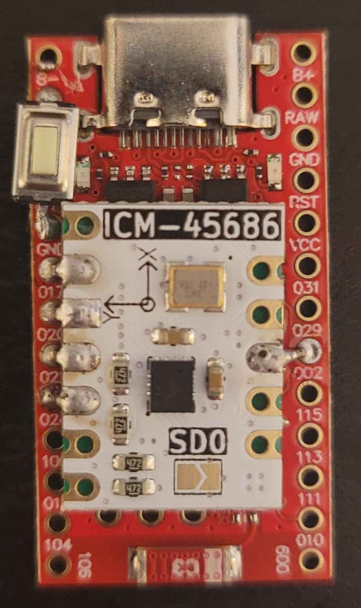

# Smol Slime
Smol Slimes, also known as nRF Trackers, uses a protocol called Enhanced ShockBurst (ESB) on Nordic Semiconductor nRF52 and nRF54L series System-on-Chip (SoC). These are very power-efficient trackers, requiring a much smaller battery that can last from days to weeks compared to traditional ESP (WiFi) SlimeVR Trackers. A Receiver, or dongle, is required to bridge communication between trackers and the SlimeVR Server. This method does not work with Quest Standalone without using a computer for OSC.

```admonish warning
**Disclaimer:** This project is highly experimental. These devices may be incompatible with newer versions of SlimeVR Server and may require frequent firmware updates. Nothing is final at this stage; this includes hardware, firmware, protocols used, etc.
```

Interested, have questions, or issues with this project? Chat with us in ***#smol-slimes*** on <a href="https://discord.gg/SlimeVR" target="_blank">SlimeVR Discord</a>!

## Table of Contents
* TOC
{:toc}

## 📡 Receiver Hardware
It is essential to use boards equipped with high-quality antennas to ensure signal integrity and range. Hardware featuring PCB antennas is generally the best option for use as a receiver.

### USB Dongles
These dongles feature a well-optimized PCB antenna. If you experience issues with signal integrity, it is advisable to use a USB extension cable.

| Dongle                                          | Description                                                                                                                                                                                                                                                                                                                                                                         |
| ----------------------------------------------- | ----------------------------------------------------------------------------------------------------------------------------------------------------------------------------------------------------------------------------------------------------------------------------------------------------------------------------------------------------------------------------------- |
| eByte Dongle (E104-BT5040U)                     | The most affordable option featuring a PCB antenna. It is available on AliExpress, with free shipping. <br /> It can also be found on Alibaba by `Chengdu Ebyte Electronic Technology Co., Ltd.` <br/> - `E104-BT5040U` is fully compatible with the Nordic Semiconductor nRF52840 Dongle. <br/> - The `E104-BT5032U` and `E104-BT5040UA` model, however, is not compatible. They are only capable of capturing BLE4.2 and BLE5.0 protocol packets. |
| Nordic Semiconductor nRF52840 Dongle (PCA10059) | Official Nordic development hardware. They are available for purchase on Digikey or Mouser.                                                                                                                                                                                                                                                                                                         |

### Microcontroller Boards
These boards utilize antenna designs that are not optimized for range. If you are using the same boards for both trackers and receiver, they will likely perform poorly without modifications.

| Board                      | Description                                                                                                                                            |                                                                                                                                         |
| -------------------------- | ------------------------------------------------------------------------------------------------------------------------------------------------------ | --------------------------------------------------------------------------------------------------------------------------------------- |
| SuperMini nRF52840         | The most affordable option overall. It is a clone of the nice!nano board. It is available on AliExpress with `compatible with nice!nano` or `Pro Micro` branding.<br>If you wish to enhance signal strength, you can replace the built-in antenna with a 30.5 mm wire, which will create a basic monopole antenna. |
| Seeed Studio XIAO nRF52840 | Compact board available at Seeed Studio. |


## 🏃 Tracker Hardware
Before you begin, determine [how many trackers you may need](../slimevr101.md#how-many-trackers-do-you-need).

Trackers are required to be equipped with a battery and an inertial measurement unit (IMU). A magnetometer is optional.

Buttons can be incorporated to control the tracker, while a slide switch can be utilized to physically disconnect the tracker's battery.

### Microcontroller Boards

| Board                      | Description                                                                                                                                            |
| -------------------------- | ------------------------------------------------------------------------------------------------------------------------------------------------------ |
| SuperMini nRF52840         | The most affordable option overall. It is a clone of the nice!nano board. It is available on AliExpress with `compatible with nice!nano` or `Pro Micro` branding. |
| Seeed Studio XIAO nRF52840 | Compact board available at Seeed Studio. |

### Inertial Measurement Units
 - BMI270
 - ICM-42688-P
 - ICM-42688-V
 - ICM-45686
 - ISM330BX
 - ISM330DHCX
 - LSM6DSO
 - LSM6DSR
 - LSM6DSV
 - LSM6DSV16B

### Magnetometers
 - AK09940
 - BMM150*
 - BMM350*
 - IIS2MDC
 - IST8306
 - IST8308
 - LIS2MDL
 - LIS3MDL*
 - MMC5983MA

*Sensor driver has not been tested.

### Sensor Modules

#### IMU Modules
Some of the supported sensor modules are described on the [IMU Comparison page](imu-comparison.md). Please note that the most common sensor modules are not supported.

#### IMU + Magnetometer Modules
Meia, a member of the [SlimeVR Discord](#discord), produces and sells sensor modules with an onboard magnetometer. These modules are compatible with standard sensor modules, and their form factor is designed for stacked builds.

| IMU + Magnetometer                                 | Product Page                                                                 |
| -------------------------------------------------- | ---------------------------------------------------------------------------- |
| [ICM-45686](imu-comparison.md#ICM-45686) + IST8306 | [store.kouno.xyz](https://store.kouno.xyz/products/icm-45686-ist8306-module) |
| LSM6DSR + IST8306                                  | [store.kouno.xyz](https://store.kouno.xyz/products/lsm6dsr-ist8306-module)   |

### Buttons
Push buttons and momentary switches are utilized to control the tracker. Multiple button configurations are supported. A tracker can be equipped with either a reset button, a user button, or both.

The reset button is designed to support all functionalities. If an user-specific button is available, it will be utilized instead.

If a button is unavailable, tweezers can be used to short the pins for the initial tracker setup.

### Switches
A slide switch can be used to physically disconnect a battery. Some circuit boards have a high standby power draw and will require a switch.

If a switch is not utilized, a tracker can enter deep sleep mode by pressing and holding down the user-specific button.

### Batteries
Most boards support a 3.7V Li-ion/LiPo battery. Typically, these batteries have a maximum charge rate of 1C, which corresponds to a one-hour charge time. Do not use a battery if its charge rating will be exceeded.

To extend the lifespan of the battery, a significantly lower charge rate of approximately 0.5C is recommended.
## Schematics

| Default SuperMini Build                                                                                                                                         | Stacked 🥪 SuperMini Build[^note]                                                                                                                                                            |
| --------------------------------------------------------------------------------------------------------------------------------------------------------------- | --------------------------------------------------------------------------------------------------------------------------------------------------------------------------------------------- |
| <a href="../assets/img/smol_slime_schematic.png" target="_blank"></a> | <a href="../assets/img/smol_slime_stacked_schematic.png" target="_blank"></a> |

[^note]: Requires special firmware that supplies power from the GPIO pins. <a href="https://youtu.be/qTmIfa_Asic" target="_blank">YouTube Tutorial</a>

## Software
For those interested in building the firmware yourself:
* <a href="https://git-scm.com/download/win" target="_blank">Git Client</a>
* <a href="https://www.nordicsemi.com/Products/Development-tools/nRF-Connect-for-Desktop" target="_blank">nRF Connect for Desktop</a> with various integrated tools:
    * Programmer (for flashing Nordic and eByte Dongles only)
    * Serial Terminal (for sending commands to your Receiver/Trackers, [see alternatives](#accessing-the-serial-console))
    * Toolchain Manager (for automatic setup of the toolchain for building firmware)
        * 2.9.0 (Inside Toolchain Manager) Do not use a newer version!
    * NOTE: Installing the Segger J-Link is not necessary for pre-defined boards.
* <a href="https://code.visualstudio.com/download" target="_blank">VS Code</a> (For development purposes only)
    * <a href="https://www.nordicsemi.com/Products/Development-tools/nRF-Connect-for-VS-Code" target="_blank">nRF Connect for VS Code</a> (Recommended)
        * Install within VS Code extension tab, see the <a href="https://youtu.be/EAJdOqsL9m8" target="_blank">video tutorial</a>
        * You may either install the <a href="https://marketplace.visualstudio.com/items?itemName=nordic-semiconductor.nrf-connect" target="_blank">extension itself</a> or the <a href="https://marketplace.visualstudio.com/items?itemName=nordic-semiconductor.nrf-connect-extension-pack" target="_blank">extension pack</a> for additional development tools
    * You may also set up a manual build environment in VS Code as the extension is known to fail on some certain Linux distributions.
* <a href="https://slimevr.dev/download" target="_blank">SlimeVR Server</a>
    * 0.13.2 or later version

You only need the following if you are using precompiled firmware:
* <a href="https://www.nordicsemi.com/Products/Development-tools/nRF-Connect-for-Desktop" target="_blank">nRF Connect for Desktop</a> (Programmer) for flashing Nordic or eByte Dongles only
* <a href="https://www.nordicsemi.com/Products/Development-tools/nRF-Connect-for-Desktop" target="_blank">nRF Connect for Desktop</a> (Serial Terminal) for sending commands to your Receiver/Trackers, [see alternatives](#accessing-the-serial-console)
* <a href="https://slimevr.dev/download" target="_blank">SlimeVR Server</a>
    * 0.13.2 or later version

## Firmware
```admonish important
The recommended method of getting the firmware is in the [pre-compiled section](#pre-compiled-firmware-for-default-pins) if you don't need custom config or pin defines.
```

### Cloning Repositories
1. Open the Command Prompt by typing ```cmd``` in the Start Menu.
1. Navigate to the directory where you want to clone the repositories.. (Type "cd" followed by a space and then the full path to the desired folder or drive.)
1. Cloning SlimeNRF Receiver Repository.
```
git clone --single-branch --recurse-submodules -b master https://github.com/SlimeVR/SlimeVR-Tracker-nRF-Receiver.git
```
4. Cloning the SlimeNRF Tracker Repository.
```
git clone --single-branch --recurse-submodules -b master https://github.com/SlimeVR/SlimeVR-Tracker-nRF.git
```
**Note:** It is recommended to clone to a file path that does not contain whitespace or Unicode characters. You may encounter errors when building the firmware.

### Building Firmware using nRF Connect for VS Code
1. Launch VS Code using the nRF Connect's Toolchain Manager.
1. Open the folder for one of the repositories.
1. Make any pin changes or necessary adjustments to ```boards\MANUFACTURER\BOARD_NAME.dts```.
1. Click on the nRF Connect tab located on the left side of your screen, approximately halfway down.
1. Under "Applications" , click on "+ Add build configuration."
1. Select a preset from the "Board Target".
1. Scroll down and click the "Build Configuration" button.

**Note:** For trackers, settings can be found in the "nRF Kconfig GUI" under "Actions" and expand the "SlimeNRF" section.

#### Changing Board Defines
Board defines can be found in ```\boards\``` for overlays (Boards within the Zephyr library), while custom boards are located in ```boards\MANUFACTURER\BOARD_NAME.dts```.
1. Navigate to the board's .dts file.
1. The I2C (SCL/SDA) lines can be assigned to different pins. Ensure that you are using "High Frequency" pins and that you change the pins for both lines accordingly.
1. SW0 can be enabled by uncommenting (removing the ```// ```) from the lines below the description comment. If you are using VS Code, you can select the lines and press **Ctrl /** if you are using VS Code. Additionally, redefine the GPIO pin if necessary.
1. The INT (int0-gpios) can be redefined in the Zephyr user section.
1. The CLK (clk-gpios) can be uncommented and redefined if you are using an IMU with an external clock or crystal oscillator, such as the ICM-42688 or ICM-45686.

#### Adjusting settings in the Kconfig
1. Navigate to the nRF Connect tab of VS Code.
1. Build the desired board once.
1. A section titled **Actions** should be displayed on the left navigation panel.
1. Select your built board under **Applications**, then scroll down to the **Actions** section.
1. Double-click **nRF Kconfig GUI**.
1. Scroll down to the **SlimeNRF** section.
1. Enable or disable any necessary configurations, or adjust them as needed.
1. Click the "Apply" button, then click the "Save to File" button.
1. If prompted to select a file to save, choose **prj.conf**.
1. Click the "Pristine Build" button located next to **Build** in the **Actions** section.

### Building Firmware Manually (Linux)
This is only recommended if you are experiencing issues with nRF Connect for Desktops Toolchain Manager or nRF Connect for VS Code, as you will need to manually set up the toolchain.

#### Setup Python Venv
Using a virtual environment (venv) will keep all build tools for zephyr (like `west`) contained. <br>
`python3 -m venv ~/.venv/nrf52` <br>
`source ~/.venv/nrf52/bin/activate` (run whenever you use or modify your setup) <br>
`pip3 install west`

#### Setup nRF Connect SDK code
Pick a suitable folder to install the toolchain into, like `~/.toolchain-nrf52`. <br>
Then execute: <br>
`west init -m https://github.com/nrfconnect/sdk-nrf --mr v2.9.0 nrf52-sdk-2.9.0` <br>
`cd nrf52-sdk-2.9.0` <br>
`west update` (this will download dozens of git repositories, it may take a bit) <br>
`pip install -r zephyr/scripts/requirements-base.txt` (Install remaining requirements for building) <br>
`west zephyr-export` (this will register the required cmake files in your home directory) <br>
If you end up moving this folder you just need to re-run the last command.

#### Setup Zephyr SDK
The nRF Connect SDK relies on the Zephyr SDK, so go back to your toolchain folder (e.g. `~/.toolchain-nrf52`) to install it: <br>
`wget -q https://github.com/zephyrproject-rtos/sdk-ng/releases/download/v0.17.0/zephyr-sdk-0.17.0_linux-x86_64_minimal.tar.xz` <br>
`tar xf zephyr-sdk-0.17.0_linux-x86_64_minimal.tar.xz -C .` <br>
`cd zephyr-sdk-0.17.0` <br>
`./setup.sh -c -t arm-zephyr-eabi` (this will register the required cmake files in your home directory) <br>
If you end up moving this folder you just need to re-run the last command.

#### Compiling Manually
Assuming your toolchain is installed in `~/.toolchain-nrf52` and your are in the firmware directory:
``` sh
source ~/.venv/nrf52/bin/activate
source ~/.toolchain-nrf52/nrf52-sdk-2.9.0/zephyr/zephyr-env.sh
west build --board BOARD --build-dir build . -- -DNCS_TOOLCHAIN_VERSION=NONE -DBOARD_ROOT=.
```
Replace BOARD with your board (e.g. `supermini_uf2/nrf52840` for the SuperMini, `nrf52840dongle/nrf52840` for a dongle receiver). <br>
The compiled firmware will be `PROJECT_DIR/build/PROJECT_DIR/zephyr/zephyr[.hex|.uf2]`.

#### Compiling with VS Code (without Extensions)
Assuming your toolchain is installed in `~/.toolchain-nrf52`, use the following tasks (placed in `.vscode/tasks.json'):
``` JSON
{
    "version": "2.0.0",
    "tasks": [
        {
            "label": "Build",
            "type": "shell",
            "group": "build",
            "command": "source",
            "args": [
                "~/.venv/nrf52/bin/activate", "&&",
                "source", "~/.toolchain-nrf52/nrf52-sdk-2.9.0/zephyr/zephyr-env.sh", "&&",
                "west", "build", "--board", "BOARD", "--build-dir", "build",
                "${workspaceFolder}", "--",
                "-DNCS_TOOLCHAIN_VERSION=NONE", "-DBOARD_ROOT=${workspaceFolder}"
            ]
        },
    ]
}
```
Replace BOARD with your board (e.g. `supermini_uf2/nrf52840` for the SuperMini, `nrf52840dongle/nrf52840` for a dongle receiver). <br>
The compiled firmware will be `PROJECT_DIR/build/PROJECT_DIR/zephyr/zephyr[.hex|.uf2]`.


### Pre-Compiled Firmware for Default Pins

#### Latest Builds (Automated)
| Type         | Device                     | Clock (ICM) | Sleep (WOM) | SW0 Disabled                                                                                                                             | SW0 Enabled                                                                                                                                  |
| ------------ | -------------------------- | ----------- | ----------- | ---------------------------------------------------------------------------------------------------------------------------------------- | -------------------------------------------------------------------------------------------------------------------------------------------- |
| 📡 Receiver | Nordic/eByte               | N/A         | N/A         | [Link](https://github.com/Shine-Bright-Meow/SlimeNRF-Firmware-CI/releases/download/latest/SlimeNRF_Receiver_Nordic_eByte_Dongle.hex)     | N/A                                                                                                                                          |
| 📡 Receiver | SuperMini                  | N/A         | N/A         | [Link](https://github.com/Shine-Bright-Meow/SlimeNRF-Firmware-CI/releases/download/latest/SlimeNRF_Receiver_SuperMini.uf2)               | N/A                                                                                                                                          |
| 📡 Receiver | XIAO                       | N/A         | N/A         | [Link](https://github.com/Shine-Bright-Meow/SlimeNRF-Firmware-CI/releases/download/latest/SlimeNRF_Receiver_XIAO.uf2)                    | N/A                                                                                                                                          |
| 🏃 Tracker  | SuperMini                  | Disabled    | Enabled     | [Link](https://github.com/Shine-Bright-Meow/SlimeNRF-Firmware-CI/releases/download/latest/SlimeNRF_Tracker_SuperMini.uf2)                | [Link](https://github.com/Shine-Bright-Meow/SlimeNRF-Firmware-CI/releases/download/latest/SlimeNRF_Tracker_SW0_SuperMini.uf2)                |
| 🏃 Tracker  | SuperMini                  | Disabled    | Disabled    | [Link](https://github.com/Shine-Bright-Meow/SlimeNRF-Firmware-CI/releases/download/latest/SlimeNRF_Tracker_NoSleep_SuperMini.uf2)        | [Link](https://github.com/Shine-Bright-Meow/SlimeNRF-Firmware-CI/releases/download/latest/SlimeNRF_Tracker_SW0_NoSleep_SuperMini.uf2)        |
| 🏃 Tracker  | SuperMini                  | Enabled     | Enabled     | [Link](https://github.com/Shine-Bright-Meow/SlimeNRF-Firmware-CI/releases/download/latest/SlimeNRF_Tracker_CLK_SuperMini.uf2)            | [Link](https://github.com/Shine-Bright-Meow/SlimeNRF-Firmware-CI/releases/download/latest/SlimeNRF_Tracker_SW0_CLK_SuperMini.uf2)            |
| 🏃 Tracker  | SuperMini                  | Enabled     | Disabled    | [Link](https://github.com/Shine-Bright-Meow/SlimeNRF-Firmware-CI/releases/download/latest/SlimeNRF_Tracker_NoSleepCLK_SuperMini.uf2)     | [Link](https://github.com/Shine-Bright-Meow/SlimeNRF-Firmware-CI/releases/download/latest/SlimeNRF_Tracker_SW0_NoSleepCLK_SuperMini.uf2)     |
| 🏃 Tracker  | SuperMini (Stacked 🥪)    | Enabled     | Enabled     | [Link](https://github.com/Shine-Bright-Meow/SlimeNRF-Firmware-CI/releases/download/latest/SlimeNRF_Tracker_SuperMiniStacked.uf2)         | [Link](https://github.com/Shine-Bright-Meow/SlimeNRF-Firmware-CI/releases/download/latest/SlimeNRF_Tracker_SW0_SuperMiniStacked.uf2)         |
| 🏃 Tracker  | SuperMini (Stacked 🥪)    | Enabled     | Disabled    | [Link](https://github.com/Shine-Bright-Meow/SlimeNRF-Firmware-CI/releases/download/latest/SlimeNRF_Tracker_NoSleep_SuperMiniStacked.uf2) | [Link](https://github.com/Shine-Bright-Meow/SlimeNRF-Firmware-CI/releases/download/latest/SlimeNRF_Tracker_SW0_NoSleep_SuperMiniStacked.uf2) |
| 🏃 Tracker  | XIAO                       | Disabled    | Enabled     | [Link](https://github.com/Shine-Bright-Meow/SlimeNRF-Firmware-CI/releases/download/latest/SlimeNRF_Tracker_XIAO.uf2)                     | [Link](https://github.com/Shine-Bright-Meow/SlimeNRF-Firmware-CI/releases/download/latest/SlimeNRF_Tracker_SW0_XIAO.uf2)                     |
| 🏃 Tracker  | XIAO                       | Disabled    | Disabled    | [Link](https://github.com/Shine-Bright-Meow/SlimeNRF-Firmware-CI/releases/download/latest/SlimeNRF_Tracker_NoSleep_XIAO.uf2)             | [Link](https://github.com/Shine-Bright-Meow/SlimeNRF-Firmware-CI/releases/download/latest/SlimeNRF_Tracker_SW0_NoSleep_XIAO.uf2)             |
| 🏃 Tracker  | XIAO                       | Enabled     | Enabled     | [Link](https://github.com/Shine-Bright-Meow/SlimeNRF-Firmware-CI/releases/download/latest/SlimeNRF_Tracker_CLK_XIAO.uf2)                 | [Link](https://github.com/Shine-Bright-Meow/SlimeNRF-Firmware-CI/releases/download/latest/SlimeNRF_Tracker_SW0_CLK_XIAO.uf2)                 |
| 🏃 Tracker  | XIAO                       | Enabled     | Disabled    | [Link](https://github.com/Shine-Bright-Meow/SlimeNRF-Firmware-CI/releases/download/latest/SlimeNRF_Tracker_NoSleepCLK_XIAO.uf2)          | [Link](https://github.com/Shine-Bright-Meow/SlimeNRF-Firmware-CI/releases/download/latest/SlimeNRF_Tracker_SW0_NoSleepCLK_XIAO.uf2)          |
| 🏃 Tracker  | R3                         | Enabled     | Enabled     | [Link](https://github.com/Shine-Bright-Meow/SlimeNRF-Firmware-CI/releases/download/latest/SlimeNRF_Tracker_R3.uf2)                       | N/A                                                                                                                                          |
| 🏃 Tracker  | R3                         | Enabled     | Disabled    | [Link](https://github.com/Shine-Bright-Meow/SlimeNRF-Firmware-CI/releases/download/latest/SlimeNRF_Tracker_NoSleep_R3.uf2)               | N/A                                                                                                                                          |
| 🏃 Tracker  | SlimeVR Mini (Prototype 1) | Enabled     | Enabled     | [Link](https://github.com/Shine-Bright-Meow/SlimeNRF-Firmware-CI/releases/download/latest/SlimeNRF_Tracker_SlimevrMini.uf2)              | N/A                                                                                                                                          |
| 🏃 Tracker  | SlimeVR Mini (Prototype 1) | Enabled     | Disabled    | [Link](https://github.com/Shine-Bright-Meow/SlimeNRF-Firmware-CI/releases/download/latest/SlimeNRF_Tracker_NoSleep_SlimevrMini.uf2)      | N/A                                                                                                                                          |
| 🏃 Tracker  | SlimeVR Mini (Prototype 2) | Enabled     | Enabled     | [Link](https://github.com/Shine-Bright-Meow/SlimeNRF-Firmware-CI/releases/download/latest/SlimeNRF_Tracker_SlimevrMini2.uf2)             | N/A                                                                                                                                          |
| 🏃 Tracker  | SlimeVR Mini (Prototype 2) | Enabled     | Disabled    | [Link](https://github.com/Shine-Bright-Meow/SlimeNRF-Firmware-CI/releases/download/latest/SlimeNRF_Tracker_NoSleep_SlimevrMini2.uf2)     | N/A                                                                                                                                          |

<details>
  <summary>Previous builds</summary>

Previous builds can be found here: <a href="https://github.com/Shine-Bright-Meow/SlimeNRF-Firmware-CI/actions" target="_blank">https://github.com/Shine-Bright-Meow/SlimeNRF-Firmware-CI/actions</a>

1. Click on a successful workflow run ✅ for the specified date range.
1. Scroll down to the **Artifacts** section.
1. Download the desired device firmware.
1. Extract the ZIP file.

</details>

### Flashing Boards with Adafruits UF2 Bootloader (SuperMini / XIAO)

#### Flashing the Bootloader
1. You can download them here: <a href="https://github.com/adafruit/Adafruit_nRF52_Bootloader/releases" target="_blank">https://github.com/adafruit/Adafruit_nRF52_Bootloader/releases</a>
1. For the SuperMini, download ```update-nice_nano_bootloader-x.x.x_nosd.uf2```. For the XIAO, download ```update-xiao_nrf52840_ble_sense_bootloader-x.x.x_nosd.uf2```. (The appropriate non-Sense version does not update the bootloader.)
1. Connect the device to your computer using a USB data cable.
1. The device should initially start in DFU mode when new and without a bootloader. The LED should fade on and off.
1. If the device's LED is not fading on and off, press the reset button twice (or briefly short the RST and GND pins) twice within 0.5 seconds. If the device has existing SlimeNRF firmware, reset it four times.
1. Navigate to your Downloads folder and copy the UF2 file.
1. Navigate to the Mass Storage Drive (ex. NICENANO/XIAO-SENSE) from ThisPC.
1. Paste the file there, and the window should close, causing the device to reboot.

```admonish important
Update the bootloader on your SuperMini and XIAO boards before flashing the firmware; otherwise, there is a significant risk of bricking your device. eByte and Nordic dongles are not included in this category.
```

#### Flashing the Firmware using UF2
1. Connect the device to your computer using a USB data cable.
1. The device should initially start in DFU mode when new and without a bootloader. The LED should fade on and off.
1. If the device's LED is not fading on and off, press the reset button twice (or briefly short the RST and GND pins) twice within 0.5 seconds. If the device has existing SlimeNRF firmware, reset it four times.
1. Navigate to your local Receiver or Tracker repository, then go to ```build\REPOSITORY_NAME\zephyr\```.
1. Copy zephyr.uf2 file.
1. Navigate to the Mass Storage Drive (ex. NICENANO/XIAO-SENSE) from ThisPC.
1. Paste the file there, and the window should close, causing the device to reboot.

#### Flashing the Firmware using adafruit-nrfutil
This uses the bootloaders serial protocol to flash it using command line tools. <br>
See <a href="https://github.com/adafruit/Adafruit_nRF52_nrfutil" target="_blank">Adafruit nRF52 nrfutil Github Repo</a> for install and usage instructions. <br>
Recommended: Use a python venv to install the adafruit-nrfutil python tool.

### Flashing Dongles with SoftDevice/Nordic Bootloader (eByte/Nordic)

This bootloader will appear as "Open DFU Bootloader" by Nordic Semiconductor. Currently, the only confirmed method for flashing firmware onto these devices is through <a href="https://www.nordicsemi.com/Products/Development-tools/nRF-Connect-for-Desktop" target="_blank">nRF Connect for Desktop</a>, though it should also be possible to use <a href="https://www.nordicsemi.com/Products/Development-tools/nRF-Util" target="_blank">nRF Util</a> (but it is more complex and practically equivalent). <br>
NOTE: Installing the Segger J-Link is not required for this bootloader. <br>
NOTE: On Linux, nRF Connect for Desktop installs nodeJS tools into `~/.nrfconnect-apps/`, nRF Util installs binary tools into `~/.nrfutil/`.

#### Flashing using nRF Connect for Desktop
1. Open "Programmer" in the nRF Connect.
1. Press the reset button, and the LED should begin to fade on and off, placing the device in DFU Mode. For eByte dongle, this is the right button. For Nordic dongle, it is the side button (not the round white button).
1. In the top left corner, select your Device.
1. Click on "Add File".
1. Navigate to your local Receiver repository, then select the file located at ```build\REPOSITORY_NAME\zephyr\zephyr.hex```.
1. Click the "Write button".

#### Flashing using nRF Util
Not documented yet. Relevant documentation:
- <a href="https://docs.nordicsemi.com/bundle/nrfutil/page/nrfutil-device/guides/programming.html" target="_blank">device command documentation</a>
- <a href="https://docs.nordicsemi.com/bundle/nrfutil/page/guides-nrf5sdk/dfu_generating_packages.html" target="_blank">nrf5sdk pkg building guide</a>

## Firmware Setup

### Accessing the Serial Console

You can interact with the firmware by connecting to the serial console it provides, which is used for pairing and calibration. <br>
The following examples will utilize nRF Connect for Desktop; however, you may choose from a wide variety of alternative tools. <br>
For example, by using the standard Linux `screen` utility, you can access the serial console as follows: <br>
`sudo screen /dev/ttyACMX 115200` <br>
You can determine which serial port to use by running `sudo dmesg` after connecting your nRF device. <br>
For Windows, there are similar tools available, such as <a href="https://www.chiark.greenend.org.uk/~sgtatham/putty/latest.html" target="_blank">PuTTY</a> that you can use to <a href="https://documentation.help/PuTTY/using-serial.html" target="_blank">access a serial console</a>.

### Pairing Mode

#### Tracker

##### Method 1: Console
1. Launch nRF Connect for Desktop.
1. Open the Serial Terminal in nRF Connect.
1. Ensure that your tracker is connected to your computer using a cable.
1. In the top left corner, select your tracker from the Device menu.
1. Click the "Connect to Port" button.
1. Type ```pair``` into the console.

##### Method 2: Button
1. Press the Reset button (or short RST/GND pins) or the Function button (if SW0 is defined) three times.

The device's LED should blink once every second.

#### Receiver

1. Launch nRF Connect for Desktop.
1. Open the Serial Terminal in nRF Connect.
1. Ensure that your tracker is connected to your computer using a cable.
1. In the top left corner, select your dongle from the Device menu.
1. Click the "Connect to Port" button.
1. Type ```pair``` into the console.

The device's LED should blink once every second.

Once the trackers are paired, the LED indicator should stop blinking once per second. To exit pairing mode on the Receiver, type ```reboot``` in the console, or press the left button once on the eByte Dongle, or the round white button once on the Nordic Dongle.

### Calibration

#### Basic

##### Method 1: Console

1. Launch nRF Connect for Desktop.
1. Open the Serial Terminal in nRF Connect.
1. Ensure that your tracker is connected to your computer using a cable.
1. In the top left corner, select your tracker under Devices.
1. Click the "Connect to Port" button.
1. Type ```calibrate``` into the console while the tracker is placed on a flat surface.
1. Wait for the logs to reboot and print out again.

##### Method 2: Button
1. Press the Reset or SW0 (Functional) button twice, then place the tracker on a flat surface and allow it to remain still for a few seconds.

#### 6-Sided
1. Ensure that the power switch is turned on so that the tracker can operate on battery power when unplugged.
1. Launch the nRF Connect for Desktop.
1. Open the Serial Terminal in nRF Connect.
1. Ensure that your tracker is connected to your computer using a cable.
1. In the top left corner, select your tracker under Devices.
1. Click the "Connect to Port" button.
1. Enter the ```6-side``` command in the console. (Currently, there is no button combination available to initiate this calibration.)
1. Follow the console log while rotating the sides on a flat surface. Leave the cable side for last.
1. When prompted for the final side, disconnect your USB cable and position the side with the USB port on a flat surface.
1. Wait a moment until the calibration is complete.

### Updating Firmware
1. If your receiver requires a firmware update, please do this first.
1. Open the Serial Terminal in nRF Connect's Serial Terminal.
1. Select your Receiver from the Device list.
1. Click the "Connect to Port" button.
1. Enter ```clear``` to unpair all of your trackers from the Receiver. The Receiver will automatically enter pairing mode.
1. Connect the tracker to your computer using a USB cable and ensure that the power switch is turned on. This allows the tracker to operate on battery power when unplugged for 6-Side calibration.
1. Select your tracker from the Device List.
1. Click the "Connect to Port" button.
1. Enter ```dfu``` to go into DFU Mode.
1. Copy the UF2 file to your tracker.
1. Enter ```6-side``` to begin the 6-Side calibration.
1. After completing the 6-side calibration, enter ```calibrate``` to adjust the ZRO.
1. Enter ```pair``` to enter pairing mode.
1. Wait for the tracker to pair with the Receiver, and then disconnect.
1. Please repeat process for all trackers.
1. Select your Receiver from the Device list.
1. Click the "Connect to Port" button.
1. Enter ```reboot``` to exit pairing mode.

### Console Commands

#### Receiver
* ```info``` - Get device information
* ```list``` - Get paired devices
* ```reboot``` - Soft reset the device
* ```pair``` - Enter pairing mode
* ```clear``` - Clear stored devices
* ```dfu``` - Enter DFU bootloader (only available if your device has one)
* ```uptime``` - Get device uptime
* ```meow``` - Meow!

#### Tracker
* ```info``` - Get device information
* ```reboot``` - Soft reset the device
* ```calibrate``` - Calibrate sensor ZRO
* ```6-side``` - Calibrate 6-side accelerometer
* ```pair``` - Enter pairing mode
* ```dfu``` - Enter DFU bootloader (only available if your device has one)
* ```uptime``` - Get device uptime
* ```meow``` - Meow!

### Button
* Reset - 1 Press
* Calibration - 2 Presses
* Pairing Mode - 3 Presses
* DFU Bootloader - 4 Presses
* Deep Sleep - Press and Hold

### LED Codes
* 1 short blink per second - Pairing mode.
* 1 long blink per second - Low battery.
* 2, 3, 4 long blinks every 5 seconds - Error.
    * 2 blinks - Sensor error.
    * 3 blinks - Connection error.
    * 4 blinks - Hardware error.
* Fade on and off - DFU mode.
* Very short blink - Normal operation or wake on motion.
* While plugged in: Pulsing - Charging.
* While plugged in: Solid - Fully charged.

### Status Codes

Status codes consist of one or more status values (added together) listed below:

* SYS_STATUS_SENSOR_ERROR - 1,
* SYS_STATUS_CONNECTION_ERROR - 2
* SYS_STATUS_SYSTEM_ERROR - 4
* SYS_STATUS_USB_CONNECTED - 8
* SYS_STATUS_PLUGGED - 16

## Protocols
```admonish important
This section offers advanced information about the communication protocol and is not necessary for building your own smol slimes.
```

<details>
  <summary>HID Protocol</summary>

```admonish warning
The HID Protocol is not finalized and is subject to change in future versions of the SlimeVR Server.
```

### Tracker -> Server
```b0      |b1      |b2      |b3      |b4      |b5      |b6      |b7      |b8      |b9      |b10     |b11     |b12     |b13     |b14     |b15     |
type    |id      |packet data                                                                                                                  |
0       |id      |proto   |batt    |batt_v  |temp    |brd_id  |mcu_id  |imu_id  |mag_id  |fw_date          |major   |minor   |patch   |rssi    | info
1       |id      |q0               |q1               |q2               |q3               |a0               |a1               |a2               | full precision quat
2       |id      |batt    |batt_v  |temp    |q_buf                              |a0               |a1               |a2               |rssi    | reduced precision quat
3       |id      |svr_stat|status  |resv                                                                                              |rssi    | status
```

### Tracker <-> Receiver
```b0      |b1      |b2      |b3      |b4      |b5      |b6      |b7      |b8      |b9      |b10     |b11     |b12     |b13     |b14     |b15     |
type    |id      |packet data                                                                                                                  |
64      |id      |addr                                                 |resv                                                                   | pairing data from tracker
65      |id      |addr                                                 |addr_rcv                                             |channel |resv    | pairing data to tracker
66      |id      |addr                                                 |time                                                                   | timing data to tracker (why addr?)
67      |id      |addr                                                 |cmd_data                                                               | some command to tracker? (need to be part of timing?)
```

### Tracker <-> Server
```b0      |b1      |b2      |b3      |b4      |b5      |b6      |b7      |b8      |b9      |b10     |b11     |b12     |b13     |b14     |b15     |
type    |id      |packet data                                                                                                                  |
128     |id      |addr                                                 |cmd_data                                                               | some command to tracker? (field too large?)
128     |id      |addr                                                 |ack                                                                    | acknowledge?
```

### Receiver <-> Server
```b0      |b1      |b2      |b3      |b4      |b5      |b6      |b7      |b8      |b9      |b10     |b11     |b12     |b13     |b14     |b15     |
type    |id      |packet data                                                                                                                  |
192     |id      |resv                                                                                                                         | 192+ should be some interaction b/w receiver and server
254     |resv                                                                                                                                  | filler, this packet is ignored by the server
255     |id      |addr                                                 |resv                                                                   | tracker id association
```

</details>

## Troubleshooting
```admonish important
Please open a GitHub issue for any firmware bugs or issues in the corresponding repositories.
```

### Check Console Logs

1. Launch nRF Connect for Desktop.
1. Open the Serial Terminal in nRF Connect.
1. Ensure that your tracker is connected to your computer using a cable.
1. In the top left corner, select your tracker under Devices.
1. Click the "Connect to Port" button.

#### Improving Logging

- In order to change the log level you see (e.g., LOG_DBG instead of just LOG_INF), you may need to edit the `LOG_MODULE_REGISTER` macro at the top of the relevant module or file you are interested in and then recompile the firmware.<br>

- If you need to view the logs prior to connecting to the serial console, you may need to explicitly initiate the logging backend by adding the following code snippet in the main function of main.c:
    ``` C
    const struct log_backend *backend = log_backend_get_by_name("log_backend_uart");
    log_backend_enable(backend, backend->cb->ctx, CONFIG_LOG_MAX_LEVEL);
    ```
    Additionally, add the following include to the top of the main.c file: <br>
    ```C
    #include <zephyr/logging/log_ctrl.h>
    ```
- If you notice that the logs are truncated at a certain point, the buffer size may be insufficient. This issue has not been fully resolved yet, as simply increasing `CONFIG_LOG_BUFFER_SIZE` in `prj.conf` does not appear to be effective.

#### SWD Debugging
* Instructions for the Raspberry Pi, Raspberry Pi Pico, ST-Link V2, and other debuggers will be added in the future.
**Resource:** <a href="https://github.com/joric/nrfmicro/wiki/Bootloader" target="_blank">https://github.com/joric/nrfmicro/wiki/Bootloader</a>

##### J-Link, nRF52/nRF52840 Development Kit, and OB-ARM Debugger
1. Install J-Link Software and Documentation Pack: <a href="https://www.segger.com/downloads/jlink/#J-LinkSoftwareAndDocumentationPack" target="_blank">https://www.segger.com/downloads/jlink/#J-LinkSoftwareAndDocumentationPack</a>
1. Download Bootloader HEX File for your device (SuperMini - ```nice_nano_bootloader-x.x.x_sxxx_x.x.x.hex```, XIAO - ```xiao_nrf52840_ble_sense_bootloader-x.x.x_sxxx_x.x.x.hex```): <a href="https://github.com/adafruit/Adafruit_nRF52_Bootloader/releases" target="_blank">https://github.com/adafruit/Adafruit_nRF52_Bootloader/releases</a>
1. Connect Debugger to SWD IO, CLK, and GND Pins. (It is safer to power up your device by plugging into USB instead of using the VDD pin)

###### Flashing/Fixing bricked bootloader
1. Launch "J-Flash Lite."
    * **Target Device:** NRF52840_XXAA
    * **Target Interface:** SWD
    * **Speed:** 4000
1. Click the "OK" button.
1. Click on the "..." button and select the downloaded HEX file.
1. Click the "Program Device" button.

###### RTT/Debugging
1. Launch "RTT Viewer."
    * **Connection to J-Link:** USB
    * **Specify Target Device:** NRF52840_XXAA
    * **Force go on connect:** Checked
    * **Target Interface & Speed:** SWD / 4000 hKz
    * **RTT Control Block:** Auto Detect
1. Click the "OK" button.

##### Recommended Hardware/Tools
**OB-ARM Debugger:** <a href="https://www.aliexpress.us/item/3256806507382540.html" target="_blank">https://www.aliexpress.us/item/3256806507382540.html</a>

**Pogo Pin Test Clip (1.5mm Pitch, 4P, Single Row):** <a href="https://www.aliexpress.us/item/3256805646654844.html" target="_blank">https://www.aliexpress.us/item/3256805646654844.html</a>

**Note:** This clip is designed exclusively for SuperMini. While there are less expensive clips available, they do not convert the pins from a 1.5mm pitch to a 2.54mm pitch suitable for Dupont wires.

## Links

### Discord

**SlimeVR Discord:** <a href="https://discord.gg/SlimeVR" target="_blank">https://discord.gg/SlimeVR</a>

### Firmware Source Code
| Name                         | Links                                                             |
| ---------------------------- | ----------------------------------------------------------------- |
| SlimeVR Tracker nRF Receiver | [Github](https://github.com/SlimeVR/SlimeVR-Tracker-nRF-Receiver) |
| SlimeVR Tracker nRF          | [Github](https://github.com/SlimeVR/SlimeVR-Tracker-nRF)          |

## Community projects

### Firmware

| Name              | Author     | Description                                                                | Links                                                      |
| ----------------- | ---------- | -------------------------------------------------------------------------- | ---------------------------------------------------------- |
| Stacked-SmolSlime | LyallUlric | Fork of main branch with firmware tailored for stacked SuperMini trackers. | [Github](https://github.com/LyallUlric/Stacked-SmolSlime/) |


### Hardware

| Name             | Author     | PCB | Battery                        | Links                                                        |
| ----------------- | ---------- | --- | ------------------------------ | ------------------------------------------------------------ |
| Aed-Slimes        | Aed        | Yes | LIR2450                        | [Github](https://github.com/Aed-1/Aed-Slimes)                |
| Gremlin           | ManicQuinn | N/A | 401230 110mAh                  | [Github](https://github.com/ManicQuinn/SlimeVR-Gremlin)      |
| Marzipan          | Colanns    | Yes | 401230 110mAh or 501230 170mAh | [Github](https://github.com/colasama/Marzipan)               |
| SlimeNRF-Fuimini  | fui        | Yes | 100mAh                         | [Github](https://github.com/Zipra1/SlimeNRF-Fuimini)         |
| SlimeNRF R1/R2    | sctanf     | Yes | 602030 300mAh                  | [Github](https://github.com/SlimeVR/SlimeVR-Tracker-nRF-PCB) |
| SlimeNRF R3       | sctanf     | Yes | Unspecified                    | [Oshwlab](https://oshwlab.com/sctanf/slimenrf3)              |
| Stacked SmolSlime | LyallUlric | No  | 401030 100mAh                  | [Thingiverse](https://www.thingiverse.com/thing:6941615)      |

*Created by Shine Bright ✨, [Depact](https://github.com/Depact) and [Seneral](https://github.com/Seneral)*
