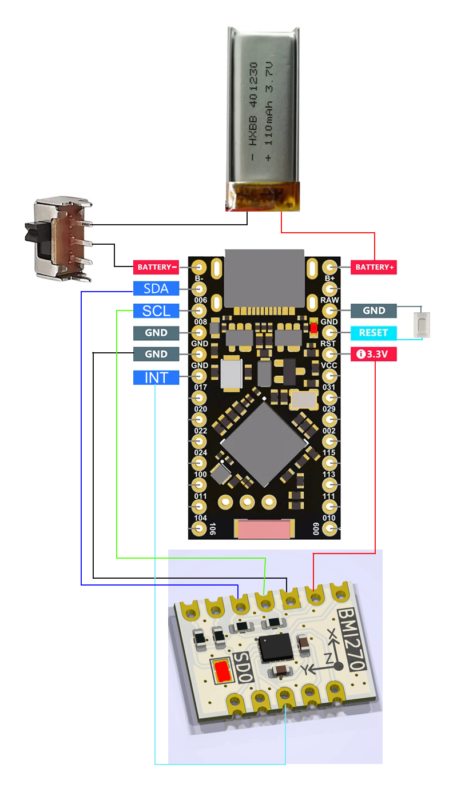

# Smol Slime

Smol Slimes (also known as nRF Trackers) uses a protocol called Enhanced ShockBurst (ESB) on Nordic Semiconductor nRF52x and nRF52840 System-on-Chip (SoC). These are very power-efficient trackers, requiring a much smaller battery that can last for days to weeks compared to traditional ESP (WiFi) SlimeVR Trackers. A Receiver (also known as a dongle) is required to bridge the communications between the trackers and SlimeVR Server. This method doesn't work with Quest Standalone without using a computer for OSC.

## Hardware

### Receiver
* **eByte Dongle (E104-BT5040U)** - Cheapest Receiver, free shipping from AliExpress, and has PCB Trace Antenna.
* **Nordic Semiconductor nRF52840 Dongle (PCA10059)** - More expensive, not free shipping from Digikey/Mouser, and has PCB Trace Antenna.
* **SuperMini nRF52840** - Cheapest option, but having a ceramic antenna and your trackers also having a ceramic antenna will reduce signal strength and range.

### Tracker
* **SuperMini nRF52840** (Cheapest) or **Seeed Studio XIAO nRF52840** (Smaller, but very expensive)
* Compatible **IMU Breakout Board**
    * ICM-42688-P
    * ICM-42688-V
    * ICM-45686
    * LSM6DSR
    * ISM330DHCX
    * LSM6DSO
    * LSM6DSV
    * LSM6DSV16B
    * ISM330BX
* **Push Button/Momentary Switch** (One is recommended for Resetting, Pairing, Calibration, Sleep, putting the tracker in DFU mode for firmware. A second can be used to separate the original Reset functions from the other features.) A tweezer can be used to short the pins for the initial tracker setup instead.
* **Slide Switch** - Recommended, but optional. Allowing you to turn on/off your tracker. Deep sleep by holding down the push button puts the tracker in a very low power state (not completely off).
* **3.7V LiPo Battery** - Battery must be 50ma or larger with XIAO nRF52840 and 100ma or larger with SuperMini.

#### Schematic
<a href="smol-slime/schematic.png" target="_blank"></a>

## Software
* [Git Client](https://git-scm.com/download/win)
* [nRF Connect for Desktop](https://www.nordicsemi.com/Products/Development-tools/nRF-Connect-for-Desktop)
    * Programmer (Inside nRF Connect; needed for Nordic and eByte Dongles only)
    * Serial Terminal (Inside nRF Connect; recommended to send commands to your Receiver/Trackers)
    * Toolchain Manager (Inside nRF Connect; needed for building firmware for receiver and tracker)
        * 2.6.2 (Inside Toolchain Manager) Don't use a newer version!
* [Visual Studio Code](https://code.visualstudio.com/download)
    * nRF Connect for VS (Install within VS Code Extension tab)
* [SlimeVR Server](https://slimevr.dev/download)
    * 0.13.2 or later version

## Firmware

### Cloning Repositories
1. Open Command Prompt (Type ```cmd``` in Start Menu).
1. Change to a directory you want the repositories to clone to. (Use "cd" followed by space and then a full path to a folder or drive.)
1. Cloning SlimeNRF Receiver Repository.
```
git clone --single-branch --recurse-submodules -b master https://github.com/SlimeVR/SlimeVR-Tracker-nRF-Receiver.git
```
4. Cloning SlimeNRF Tracker Repository.
```
git clone --single-branch --recurse-submodules -b master https://github.com/SlimeVR/SlimeVR-Tracker-nRF.git
```

### Building firmware
1. Launch VS Code using nRF Connect's Toolchain Manager.
1. Open the folder to one of the repositories.
1. Make any pin changes or necessary adjustments to `board\arm followed by board_name*board_name*.dts`.
1. Click on the nRF Connect tab on the left side of your screen (about half way down).
1. Under "Applications" , click on "+ Add build configuration."
1. For Receiver, under "CMake Preset", select the board and then scroll to the bottom and "Build Configuration". For Tracker, under "Board Target", select the "Custom" Radio button first, then select the board, and scroll to the bottom to "Build Configuration."

**Note:** For trackers, settings are found in "nRF Konfig GUI" under "Actions" and expand the "SlimeNRF" section.

#### Pre-Compiled firmware for default pins
* SlimeNRF Receiver (Nordic/eByte Dongle): <https://cdn.shinebright.dev/SlimeNRF_Receiver_Nordic_eByte_Dongle.hex>
* SlimeNRF Receiver (SuperMini): <https://cdn.shinebright.dev/SlimeNRF_Receiver_SuperMini.uf2>
* SlimeNRF Tracker (SuperMini): <https://cdn.shinebright.dev/SlimeNRF_Tracker_SuperMini.uf2>
* SlimeNRF Tracker (XIAO): <https://cdn.shinebright.dev/SlimeNRF_Tracker_XIAO.uf2>
* SlimeNRF Tracker (r3): <https://cdn.shinebright.dev/SlimeNRF_Tracker_r3.uf2>

### Updating Adafruit Bootloader (Make sure this step is completed before flashing firmware or you may brick your device)
1. You can download them here. <a href="https://github.com/adafruit/Adafruit_nRF52_Bootloader/releases" target="_blank">https://github.com/adafruit/Adafruit_nRF52_Bootloader/releases</a>
1. For SuperMini, download `update-nice_nano_bootloader-x.x.x_nosd.uf2`. For XIAO, download `update-xiao_nrf52840_ble_bootloader-x.x.x_nosd.uf2`.
1. Plug the device into your computer via data USB cable.
1. The device should start off in DFU mode when new without a bootloader. The LED should be fading on and off.
1. If device's LED is not fading on and off, press the reset button twice (or short RST/GND pins) twice within 0.5s. If device with existing SlimeNRF firmware, reset 4 times.
1. Navigate to your Downloads folder and copy the uf2 file.
1. Navigate to the Mass Storage Drive (ex. NICENANO) from ThisPC.
1. Paste the file into there, and the window should close and the device will reboot.

### Flashing firmware to device

#### Dongles (Nordic/eByte)
1. Open "Programmer" in nRF Connect.
1. Press the reset button, and the LED should start fading on and off, putting the device in DFU Mode. For eByte, it is the right button. For Nordic, it is a side button (not the round white button).
1. On the top left corner, select your Device.
1. Click on "Add File".
1. Navigate to your local Receiver repository, then select file in build\zephyr\zephyr.hex.
1. Click the "Write button".

#### SuperMini and other Devices with Adafruit Bootloader as Receiver/Tracker (Make sure Bootloader is updated first!):
1. Plug the device into your computer via data USB cable.
1. The device should start off in DFU mode when new without a bootloader. The LED should be fading on and off.
1. If device's LED is not fading on and off, press the reset button twice (or short RST/GND pins) twice within 0.5s. If device with existing SlimeNRF firmware, reset 4 times.
1. Navigate to your local Receiver or Tracker repository, then go to `build\zephyr\`.
1. Copy zephyr.uf2 file.
1. Navigate to the Mass Storage Drive (ex. NICENANO) from ThisPC.
1. Paste the file into there and the window should close and device will reboot.

### Pairing Mode

#### Tracker

##### Method 1: Console
1. Open nRF Connect for Desktop.
1. Open Serial Terminal from nRF Connect.
1. Ensure your tracker is connected to your computer via cable.
1. On the top left corner, select your tracker under Devices.
1. Click the "Connect to Port" button.
1. Type ```pair``` into the console.

##### Method 2: Button
1. Press the Reset (or short RST/GND pins) or Function button (if you have SW0 defined) 3 times.

Device's LED should blink once every sec.

#### Receiver

##### Method 1: Console
1. Open nRF Connect for Desktop.
1. Open Serial Terminal from nRF Connect.
1. Ensure your tracker is connected to your computer via cable.
1. On the top left corner, select your dongle under Devices.
1. Click the "Connect to Port" button.
1. Type ```pair``` into the console.

##### Method 2: Button
1. On the eByte dongle, press the left button 3 times. On the Nordic dongle, press the round white button 3 times.

Device's LED should blink once every sec.

Once trackers are paired, the LED should stop blinking once per sec. To exit pairing mode on Receiver, type ```reboot``` in the console or press the left button once on eByte Dongle or the white button once on Nordic Dongle.

### Calibration

#### Basic

##### Method 1: Console
1. Open nRF Connect for Desktop.
1. Open Serial Terminal from nRF Connect.
1. Ensure your tracker is connected to your computer via cable.
1. On the top left corner, select your tracker under Devices.
1. Click the "Connect to Port" button.
1. Type ```calibrate``` into the console.
1. Wait for the logs to reboot and print out again.

##### Method 2: Button
1. Press your Reset or SW0 (Functional) button twice.

#### 6-Sided (VQF Only)
* To be added in the future. Thanks for the implementation, ErrorBox.

### Console Commands

#### Receiver
* ```info``` - Get device information
* ```list``` - Get paired devices
* ```reboot``` - Soft reset the device
* ```pair``` - Enter pairing mode
* ```clear``` - Clear stored devices
* ```meow``` - Meow!

#### Tracker
* ```info``` - Get device information
* ```reboot``` - Soft reset the device
* ```calibrate``` - Calibrate sensor ZRO
* ```pair``` - Enter pairing mode
* ```meow``` - Meow!

## Troubleshooting

### Check Console Logs
1. Open nRF Connect for Desktop.
1. Open Serial Terminal from nRF Connect.
1. Ensure your tracker is connected to your computer via cable.
1. On the top left corner, select your tracker under Devices.
1. Click the "Connect to Port" button.

### Error LED Codes

#### Debugger
* Instructions for the Raspberry Pi, Raspberry Pi Pico, ST-Link V2, J-Link, nRF52/nRF52840 DevKit, OB-ARM, and other debuggers to be added in the future.


*Created by Shine Bright*
