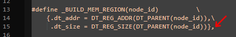

# Smol Compiling Firmware

```admonish warning
This is the method of compiling firmware if [pre-compiled firmware for default pins](./smol-pre-compiled-firmware.md) doesn't fit your needs.
```

* TOC
{:toc}

## Required Tools
For those interested in building the firmware yourself:
* <a href="https://git-scm.com/download/win">Git Client</a>
* <a href="https://www.nordicsemi.com/Products/Development-tools/nRF-Connect-for-Desktop">nRF Connect for Desktop</a> with various integrated tools:
    * Programmer (for flashing Nordic and eByte Dongles only)
    * Serial Terminal (for sending commands to your Receiver/Trackers, [see alternatives](#accessing-the-serial-console))
    * Toolchain Manager (for automatic setup of the toolchain for building firmware)
        * 2.9.0 (Inside Toolchain Manager) Do not use a newer version!
    * NOTE: Installing the Segger J-Link is not necessary for pre-defined boards.
* <a href="https://code.visualstudio.com/download">VS Code</a> (For development purposes only)
    * <a href="https://www.nordicsemi.com/Products/Development-tools/nRF-Connect-for-VS-Code">nRF Connect for VS Code</a> (Recommended)
        * Install within VS Code extension tab, see the <a href="https://youtu.be/EAJdOqsL9m8">video tutorial</a>
        * You may either install the <a href="https://marketplace.visualstudio.com/items?itemName=nordic-semiconductor.nrf-connect">extension itself</a> or the <a href="https://marketplace.visualstudio.com/items?itemName=nordic-semiconductor.nrf-connect-extension-pack">extension pack</a> for additional development tools
    * You may also set up a manual build environment in VS Code as the extension is known to fail on some certain Linux distributions.
* <a href="https://slimevr.dev/download">SlimeVR Server</a>
    * 0.13.2 or later version

## Cloning Repositories
1. Open the Command Prompt by typing ```cmd``` in the Start Menu.
1. Navigate to the directory where you want to clone the repositories.. (Type "cd" followed by a space and then the full path to the desired folder or drive.)
1. Cloning SlimeNRF Receiver Repository.
```bash
git clone --single-branch --recurse-submodules -b master https://github.com/SlimeVR/SlimeVR-Tracker-nRF-Receiver.git
```
4. Cloning the SlimeNRF Tracker Repository.
```bash
git clone --single-branch --recurse-submodules -b master https://github.com/SlimeVR/SlimeVR-Tracker-nRF.git
```

If you're using an existing case design, you can opt for prebuilt firmware; otherwise, build your own. See Smol Firmware for more details.

**Note:** It is recommended to clone to a file path that does not contain whitespace or Unicode characters. You may encounter errors when building the firmware.

## Building Firmware using nRF Connect for VS Code
```admonish important
***Bug Fix for Zephyr 2.9.0***

1. Open ```C:\ncs\v2.9.0\zephyr\drivers\retained_mem\retained_mem_nrf_ram_ctrl.c``` in your preferred code editor.
1. Add a comma at the end of Line 15.
1. Save the file.

```

```admonish important
***SuperMini Build Variants***
**I2C:** Edit `supermini_uf2.dts` and build using `supermini_uf2/nrf52840/i2c`.
**SPI:** Edit `supermini_uf2.dts` and build using `supermini_uf2/nrf52840/spi`.
```

1. Launch VS Code using the nRF Connect's Toolchain Manager.
1. Open the folder for one of the repositories.
1. Make any pin changes or necessary adjustments to ```boards\MANUFACTURER\BOARD_NAME.dts```.
1. Click on the nRF Connect tab located on the left side of your screen, approximately halfway down.
1. Under "Applications" , click on "+ Add build configuration."
1. Select a preset from the "Board Target".
1. Scroll down and click the "Build Configuration" button.

**Note:** For trackers, settings can be found in the "nRF Kconfig GUI" under "Actions" and expand the "SlimeNRF" section.

### Changing Board Defines
Board defines can be found in ```\boards\``` for overlays (Boards within the Zephyr library), while custom boards are located in ```boards\MANUFACTURER\BOARD_NAME.dts```.
1. Navigate to the board's .dts file.
1. The I2C (SCL/SDA) lines can be assigned to different pins. Ensure that you are using "High Frequency" pins and that you change the pins for both lines accordingly.
1. SW0 can be enabled by uncommenting (removing the ```// ```) from the lines below the description comment. If you are using VS Code, you can select the lines and press **Ctrl /** if you are using VS Code. Additionally, redefine the GPIO pin if necessary.
1. The INT (int0-gpios) can be redefined in the Zephyr user section.
1. The CLK (clk-gpios) can be uncommented and redefined if you are using an IMU with an external clock or crystal oscillator, such as the ICM-42688 or ICM-45686.

### Adjusting settings in the Kconfig
1. Navigate to the nRF Connect tab of VS Code.
1. Build the desired board once.
1. A section titled **Actions** should be displayed on the left navigation panel.
1. Select your built board under **Applications**, then scroll down to the **Actions** section.
1. Double-click **nRF Kconfig GUI**.
1. Scroll down to the **SlimeNRF** section.
1. Enable or disable any necessary configurations, or adjust them as needed.
1. Click the "Apply" button, then click the "Save to File" button.
1. If prompted to select a file to save, choose **prj.conf**.
1. Click the "Pristine Build" button located next to **Build** in the **Actions** section.

## Building Firmware Manually (Linux)
This is only recommended if you are experiencing issues with nRF Connect for Desktops Toolchain Manager or nRF Connect for VS Code, as you will need to manually set up the toolchain.

### Setup Python Venv
Using a virtual environment (venv) will keep all build tools for Zephyr, such as `west`, contained. <br>
`python3 -m venv ~/.venv/nrf52` <br>
`source ~/.venv/nrf52/bin/activate` (Run the setup whenever you use or modify it.) <br>
`pip3 install west`

### Setup nRF Connect SDK code
Please select an appropriate folder for installing the toolchain, such as `~/.toolchain-nrf52`. <br>
Then execute: <br>
`west init -m https://github.com/nrfconnect/sdk-nrf --mr v2.9.0 nrf52-sdk-2.9.0` <br>
`cd nrf52-sdk-2.9.0` <br>
`west update` (This will download dozens of Git repositories; it may take some time.) <br>
`pip install -r zephyr/scripts/requirements-base.txt` (Install the remaining requirements for building.) <br>
`west zephyr-export` (This will register the necessary CMake files in your home directory.) <br>
If you move this folder, you simply need to re-run the last command.

### Setup Zephyr SDK
The nRF Connect SDK depends on the Zephyr SDK, so please return to your toolchain folder (e.g. `~/.toolchain-nrf52`) to install it: <br>
`wget -q https://github.com/zephyrproject-rtos/sdk-ng/releases/download/v0.17.0/zephyr-sdk-0.17.0_linux-x86_64_minimal.tar.xz` <br>
`tar xf zephyr-sdk-0.17.0_linux-x86_64_minimal.tar.xz -C .` <br>
`cd zephyr-sdk-0.17.0` <br>
`./setup.sh -c -t arm-zephyr-eabi` (This will register the necessary CMake files in your home directory.) <br>
If you move this folder, you simply need to re-run the last command.

### Compiling Manually
Assuming your toolchain is installed in `~/.toolchain-nrf52` and you are in the firmware directory:
``` sh
source ~/.venv/nrf52/bin/activate
source ~/.toolchain-nrf52/nrf52-sdk-2.9.0/zephyr/zephyr-env.sh
west build --board BOARD --build-dir build . -- -DNCS_TOOLCHAIN_VERSION=NONE -DBOARD_ROOT=.
```
Replace BOARD with your specific board (e.g. `supermini_uf2/nrf52840` for the SuperMini, `nrf52840dongle/nrf52840` for a dongle receiver). <br>
The compiled firmware will be located at `PROJECT_DIR/build/PROJECT_DIR/zephyr/zephyr[.hex|.uf2]`.

### Compiling with VS Code (Without Extensions)
Assuming your toolchain is installed in `~/.toolchain-nrf52`, use the following tasks, which should be placed in `.vscode/tasks.json`:
``` JSON
{
    "version": "2.0.0",
    "tasks": [
        {
            "label": "Build",
            "type": "shell",
            "group": "build",
            "command": "source",
            "args": [
                "~/.venv/nrf52/bin/activate", "&&",
                "source", "~/.toolchain-nrf52/nrf52-sdk-2.9.0/zephyr/zephyr-env.sh", "&&",
                "west", "build", "--board", "BOARD", "--build-dir", "build",
                "${workspaceFolder}", "--",
                "-DNCS_TOOLCHAIN_VERSION=NONE", "-DBOARD_ROOT=${workspaceFolder}"
            ]
        },
    ]
}
```
Replace BOARD with your specific board (e.g. `supermini_uf2/nrf52840` for the SuperMini, `nrf52840dongle/nrf52840` for a dongle receiver). <br>
The compiled firmware will be located at `PROJECT_DIR/build/PROJECT_DIR/zephyr/zephyr[.hex|.uf2]`.

## Protocols
```admonish important
This section offers advanced information about the communication protocol and is not necessary for building your own smol slimes.
```

<details>
  <summary>HID Protocol</summary>

```admonish warning
The HID Protocol is not finalized and is subject to change in future versions of the SlimeVR Server.
```

### Tracker -> Server
```b0      |b1      |b2      |b3      |b4      |b5      |b6      |b7      |b8      |b9      |b10     |b11     |b12     |b13     |b14     |b15     |
type    |id      |packet data                                                                                                                  |
0       |id      |proto   |batt    |batt_v  |temp    |brd_id  |mcu_id  |imu_id  |mag_id  |fw_date          |major   |minor   |patch   |rssi    | info
1       |id      |q0               |q1               |q2               |q3               |a0               |a1               |a2               | full precision quat
2       |id      |batt    |batt_v  |temp    |q_buf                              |a0               |a1               |a2               |rssi    | reduced precision quat
3       |id      |svr_stat|status  |resv                                                                                              |rssi    | status
4       |id      |q0               |q1               |q2               |q3               |m0               |m1               |m2               |
255     |id      |addr                                                 |resv                                                                   |
```

### Tracker <-> Receiver
```b0      |b1      |b2      |b3      |b4      |b5      |b6      |b7      |b8      |b9      |b10     |b11     |b12     |b13     |b14     |b15     |
type    |id      |packet data                                                                                                                  |
64      |id      |addr                                                 |resv                                                                   | pairing data from tracker
65      |id      |addr                                                 |addr_rcv                                             |channel |resv    | pairing data to tracker
66      |id      |addr                                                 |time                                                                   | timing data to tracker (why addr?)
67      |id      |addr                                                 |cmd_data                                                               | some command to tracker? (need to be part of timing?)
```

### Tracker <-> Server
```b0      |b1      |b2      |b3      |b4      |b5      |b6      |b7      |b8      |b9      |b10     |b11     |b12     |b13     |b14     |b15     |
type    |id      |packet data                                                                                                                  |
128     |id      |addr                                                 |cmd_data                                                               | some command to tracker? (field too large?)
128     |id      |addr                                                 |ack                                                                    | acknowledge?
```

### Receiver <-> Server
```b0      |b1      |b2      |b3      |b4      |b5      |b6      |b7      |b8      |b9      |b10     |b11     |b12     |b13     |b14     |b15     |
type    |id      |packet data                                                                                                                  |
192     |id      |resv                                                                                                                         | 192+ should be some interaction b/w receiver and server
254     |resv                                                                                                                                  | filler, this packet is ignored by the server
255     |id      |addr                                                 |resv                                                                   | tracker id association
```

</details>

## Troubleshooting
```admonish important
Please open a GitHub issue for any firmware bugs or issues in the corresponding repositories.
```

### Check Console Logs

1. Launch nRF Connect for Desktop.
1. Open the Serial Terminal in nRF Connect.
1. Ensure that your tracker is connected to your computer using a cable.
1. In the top left corner, select your tracker under Devices.
1. Click the "Connect to Port" button.

#### Improving Logging

- In order to change the log level you see (e.g., LOG_DBG instead of just LOG_INF), you may need to edit the `LOG_MODULE_REGISTER` macro at the top of the relevant module or file you are interested in and then recompile the firmware.<br>

- If you need to view the logs prior to connecting to the serial console, you may need to explicitly initiate the logging backend by adding the following code snippet in the main function of main.c:
    ``` C
    const struct log_backend *backend = log_backend_get_by_name("log_backend_uart");
    log_backend_enable(backend, backend->cb->ctx, CONFIG_LOG_MAX_LEVEL);
    ```
    Additionally, add the following include to the top of the main.c file: <br>
    ```C
    #include <zephyr/logging/log_ctrl.h>
    ```
- If you notice that the logs are truncated at a certain point, the buffer size may be insufficient. This issue has not been fully resolved yet, as simply increasing `CONFIG_LOG_BUFFER_SIZE` in `prj.conf` does not appear to be effective.

#### SWD Debugging
* Instructions for the Raspberry Pi, Raspberry Pi Pico, ST-Link V2, and other debuggers will be added in the future.
**Resource:** <a href="https://github.com/joric/nrfmicro/wiki/Bootloader">https://github.com/joric/nrfmicro/wiki/Bootloader</a>

#### J-Link, nRF52/nRF52840 Development Kit, and OB-ARM Debugger
1. Install J-Link Software and Documentation Pack: <a href="https://www.segger.com/downloads/jlink/#J-LinkSoftwareAndDocumentationPack">https://www.segger.com/downloads/jlink/#J-LinkSoftwareAndDocumentationPack</a>
1. Download Bootloader HEX File for your device (SuperMini - ```nice_nano_bootloader-x.x.x_sxxx_x.x.x.hex```, XIAO - ```xiao_nrf52840_ble_sense_bootloader-x.x.x_sxxx_x.x.x.hex```): <a href="https://github.com/adafruit/Adafruit_nRF52_Bootloader/releases">https://github.com/adafruit/Adafruit_nRF52_Bootloader/releases</a>
1. Connect Debugger to SWD IO, CLK, and GND Pins. (It is safer to power up your device by plugging into USB instead of using the VDD pin)

##### Flashing/Fixing bricked bootloader
1. Launch "J-Flash Lite."
    * **Target Device:** NRF52840_XXAA
    * **Target Interface:** SWD
    * **Speed:** 4000
1. Click the "OK" button.
1. Click on the "..." button and select the downloaded HEX file.
1. Click the "Program Device" button.

##### RTT/Debugging
1. Launch "RTT Viewer."
    * **Connection to J-Link:** USB
    * **Specify Target Device:** NRF52840_XXAA
    * **Force go on connect:** Checked
    * **Target Interface & Speed:** SWD / 4000 hKz
    * **RTT Control Block:** Auto Detect
1. Click the "OK" button.

#### Recommended Hardware/Tools
**OB-ARM Debugger:** <a href="https://www.aliexpress.us/item/3256806507382540.html">https://www.aliexpress.us/item/3256806507382540.html</a>

**Pogo Pin Test Clip (1.5mm Pitch, 4P, Single Row):** <a href="https://www.aliexpress.us/item/3256805646654844.html">https://www.aliexpress.us/item/3256805646654844.html</a>

**Note:** This clip is designed exclusively for SuperMini. While there are less expensive clips available, they do not convert the pins from a 1.5mm pitch to a 2.54mm pitch suitable for Dupont wires.

## Links

### Firmware Source Code
| Name                         | Links                                                             |
| ---------------------------- | ----------------------------------------------------------------- |
| SlimeVR Tracker nRF Receiver | [Github](https://github.com/SlimeVR/SlimeVR-Tracker-nRF-Receiver) |
| SlimeVR Tracker nRF          | [Github](https://github.com/SlimeVR/SlimeVR-Tracker-nRF)          |

### Community Firmware

| Name              | Author     | Description                                                                | Links                                                      |
| ----------------- | ---------- | -------------------------------------------------------------------------- | ---------------------------------------------------------- |
| Stacked-SmolSlime | LyallUlric | Fork of main branch with firmware tailored for stacked SuperMini trackers. | [Github](https://github.com/LyallUlric/Stacked-SmolSlime/) |

*Created by Shine Bright ✨, [Depact](https://github.com/Depact) and [Seneral](https://github.com/Seneral)*
