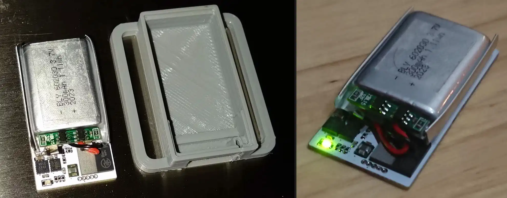
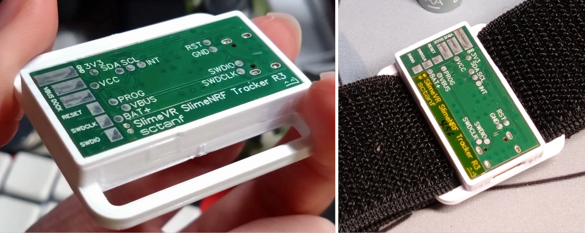
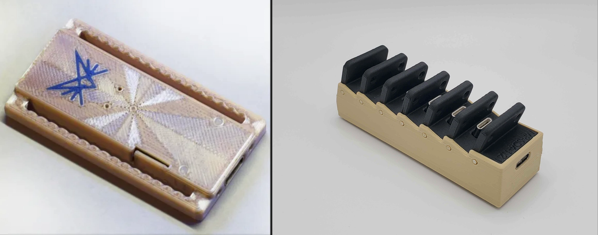
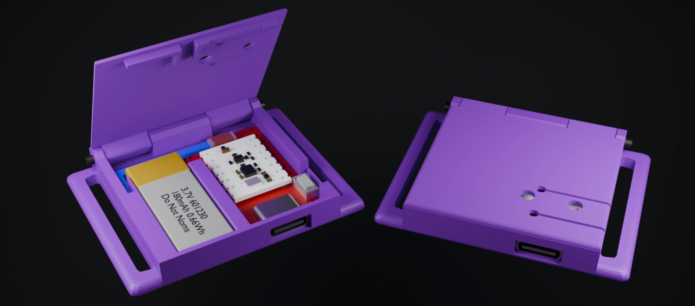
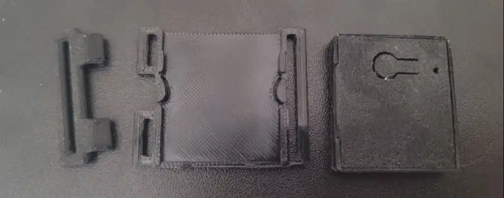

<link rel="stylesheet" href="smol-slimes.css">

# Smol Community Builds

```admonish info
This page is dedicated only to builds that others can build themselves. Builds that are not open-source or do not provide sufficient documentation to be replicated are not listed here.
```

## Contribution

**Want to contribute your design?** Awesome! To have your build added to this list, please ensure the following:

- Your case must be **publicly accessible** (e.g. GitHub(Preferable), Thingiverse, etc).
- Include at least one clear image or render of your build with 2x1, 3x1 aspect ratio.
- Provide basic build information (does it have USB port, does it have usb PCB, battery size, does it have dock).
  - Does it have USB port?
  - Does it needs PCB to build?
  - What battery size and battery type does it have?
  - Does it have dock?
- Submit your case by opening a pull request.

## Builds table

<table class="community-builds-table table-sort table-arrows">
  <thead>
    <tr>
      <th class="disable-sort">Image</th>
      <th class="onload-sort">Name</th>
      <th>Author</th>
      <th>Link</th>
      <th>USB</th>
      <th>PCB</th>
      <th>Battery</th>
      <th>Dock</th>
    </tr>
  </thead>
  <tbody>
    <tr>
      <td class="case-image" data-label="Image">
        
      </td>
      <td class="case-name" data-label="Name">Aed-Slimes</td>
      <td class="case-author" data-label="Author">Aed</td>
      <td class="case-link" data-label="Link">
        <a href="https://github.com/Aed-1/Aed-Slimes">GitHub</a>
      </td>
      <td class="case-usb" data-label="USB">✅</td>
      <td class="case-pcb" data-label="PCB">✅</td>
      <td class="case-battery" data-label="Battery">
        <div class="tooltip-text-container">
          120 mAh
          <span class="tooltip-text">LIR2450 Battery</span>
        </div>
      </td>
      <td class="case-dock" data-label="Dock">✖️</td>
    </tr>
    <tr>
      <td class="case-image" data-label="Image">
        
      </td>
      <td class="case-name" data-label="Name">Gremlin</td>
      <td class="case-author" data-label="Author">ManicQuinn</td>
      <td class="case-link" data-label="Link">
        <a href="https://github.com/ManicQuinn/SlimeVR-Gremlin">GitHub</a>
      </td>
      <td class="case-usb" data-label="USB">✅</td>
      <td class="case-pcb" data-label="PCB">✖️</td>
      <td class="case-battery" data-label="Battery">
        <div class="tooltip-text-container">
          110 mAh
          <span class="tooltip-text">401230 Battery</span>
        </div>
      </td>
      <td class="case-dock" data-label="Dock">✖️</td>
    </tr>
    <tr>
      <td class="case-image" data-label="Image">
        
      </td>
      <td class="case-name" data-label="Name">Marzipan</td>
      <td class="case-author" data-label="Author">Colanns</td>
      <td class="case-link" data-label="Link">
        <a href="https://github.com/colasama/Marzipan">GitHub</a>
      </td>
      <td class="case-usb" data-label="USB">✅</td>
      <td class="case-pcb" data-label="PCB">✅</td>
      <td class="case-battery" data-label="Battery" style="white-space: nowrap">
        <div class="tooltip-text-container">
          110 mAh
          <span class="tooltip-text">401230 Battery</span>
        </div>
        /
        <div class="tooltip-text-container">
          170 mAh
          <span class="tooltip-text">501230 Battery</span>
        </div>
      </td>
      <td class="case-dock" data-label="Dock">✖️</td>
    </tr>
    <tr>
      <td class="case-image" data-label="Image">
        
      </td>
      <td class="case-name" data-label="Name">SlimeNRF R1/R2</td>
      <td class="case-author" data-label="Author">sctanf</td>
      <td class="case-link" data-label="Link">
        <a href="https://github.com/SlimeVR/SlimeVR-Tracker-nRF-PCB">GitHub</a>
      </td>
      <td class="case-usb" data-label="USB">✖️</td>
      <td class="case-pcb" data-label="PCB">✅</td>
      <td class="case-battery" data-label="Battery">
        <div class="tooltip-text-container">
          300 mAh
          <span class="tooltip-text">601230 Battery</span>
        </div>
      </td>
      <td class="case-dock" data-label="Dock">✅</td>
    </tr>
    <tr>
      <td class="case-image" data-label="Image">
        
      </td>
      <td class="case-name" data-label="Name">SlimeNRF R3</td>
      <td class="case-author" data-label="Author">sctanf</td>
      <td class="case-link" data-label="Link">
        <a href="https://oshwlab.com/sctanf/slimenrf3">Oshwlab</a>
      </td>
      <td class="case-usb" data-label="USB">✅</td>
      <td class="case-pcb" data-label="PCB">✅</td>
      <td class="case-battery" data-label="Battery" style="white-space: nowrap;">
        <div class="tooltip-text-container">80 mAh
          <span class="tooltip-text">301230 Battery</span>
        </div>
        /
        <div class="tooltip-text-container">100 mAh
          <span class="tooltip-text">242030 Battery</span>
        </div>
      </td>
      <td class="case-dock" data-label="Dock">
        <div class="tooltip-text-container">✅
          <span class="tooltip-text">Use SlimeNRF R1/R2 dock.</span>
        </div>
      </td>
    </tr>
    <tr>
      <td class="case-image" data-label="Image">
        
      </td>
      <td class="case-name" data-label="Name">SlimeNRF-Fuimini</td>
      <td class="case-author" data-label="Author">Zipra1</td>
      <td class="case-link" data-label="Link">
        <a href="https://github.com/Zipra1/SlimeNRF-Fuimini">GitHub</a>
      </td>
      <td class="case-usb" data-label="USB">✅</td>
      <td class="case-pcb" data-label="PCB">✅</td>
      <td class="case-battery" data-label="Battery">100 mAh</td>
      <td class="case-dock" data-label="Dock">✅</td>
    </tr>
    <tr>
      <td class="case-image" data-label="Image">
        
      </td>
      <td class="case-name" data-label="Name">Smol Panini Case</td>
      <td class="case-author" data-label="Author">TigsterCox</td>
      <td class="case-link" data-label="Link">
        <a href="https://github.com/TigsterCox/Smol-Panini-Case/">Github</a>
      </td>
      <td class="case-usb" data-label="USB">✅</td>
      <td class="case-pcb" data-label="PCB">✖️</td>
      <td class="case-battery" data-label="Battery">
        <div class="tooltip-text-container">
          180 mAh
          <span class="tooltip-text">601230 Battery</span>
        </div>
      </td>
      <td class="case-dock" data-label="Dock">✖️</td>
    </tr>
    <tr>
      <td class="case-image" data-label="Image">
        
      </td>
      <td class="case-name" data-label="Name">Ibis Trackers</td>
      <td class="case-author" data-label="Author">brisfknibis</td>
      <td class="case-link" data-label="Link">
        <a href="https://github.com/brisfknibis/ibis-trackers/">Github</a>
      </td>
      <td class="case-usb" data-label="USB">✅</td>
      <td class="case-pcb" data-label="PCB">✖️</td>
      <td class="case-battery" data-label="Battery">
        <div class="tooltip-text-container">
          100 mAh
          <span class="tooltip-text">401030 Battery</span>
        </div>
      </td>
      <td class="case-dock" data-label="Dock">✖️</td>
    </tr>
    <tr>
      <td class="case-image" data-label="Image">
        
      </td>
      <td class="case-name" data-label="Name">Stacked SmolSlime</td>
      <td class="case-author" data-label="Author">LyallUlric</td>
      <td class="case-link" data-label="Link">
        <a href="https://www.thingiverse.com/thing:6941615">Thingiverse</a>
      </td>
      <td class="case-usb" data-label="USB">✅</td>
      <td class="case-pcb" data-label="PCB">✖️</td>
      <td class="case-battery" data-label="Battery">
        <div class="tooltip-text-container">
          100 mAh
          <span class="tooltip-text">401030 Battery</span>
        </div>
      </td>
      <td class="case-dock" data-label="Dock">✖️</td>
    </tr>
  </tbody>
</table>

_Created by Shine Bright ✨ and [Depact](https://github.com/Depact)_