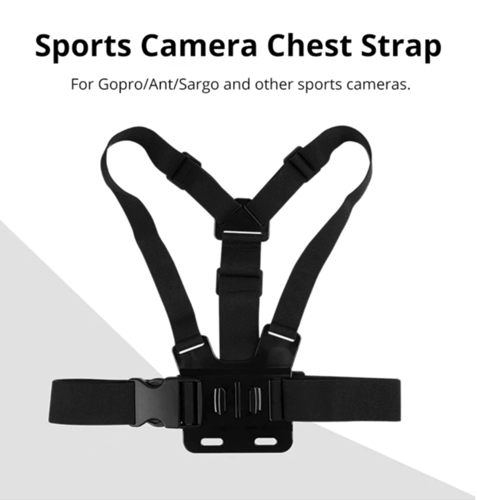
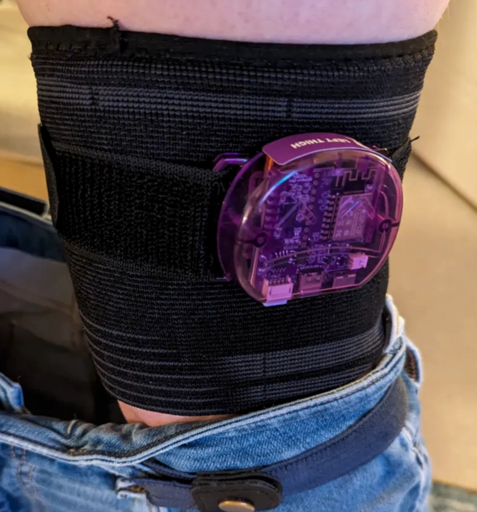

<link rel="stylesheet" href="smol-slimes.css">

# Smol Community Straps

This page documents DIY strap solutions from the community.

## Table Of Contents

- TOC
  {:toc}

## Tracker Placement

    

## Components Guide

Here is a list of useful items for making your own straps.

### Band

#### GoPro Chest Strap + Adapter for case

    
    Image is taken from <a href="https://www.aliexpress.com/item/1005004792179605.html">this Aliexpress listing</a>

Provides robust chest tracker mounting.

It can be found by `Chest Strap Mount Belt for GoPro`.

#### Compression Knee Brace 

    
    Original idea and photo by Dean Ravencrest dot dog.

A solution for thigh tracker slipping.

#### Elastic Band With Non-slip Webbing

    

Enhanced grip compared to regular bands.

Can be found by `Elastic Band With Non-slip Webbing`.

### 3D Printable Buckles
<table>
  <thead>
    <tr>
      <th>Image</th>
      <th>Name</th>
      <th>Author</th>
      <th>Link</th>
    </tr>
  </thead>
  <tbody>
    <tr>
      <td>
        
      </td>
      <td>Dovetail Strap Latch 30mm 40mm 50mm SlimeVR Buckles</td>
      <td>MoDErahN</td>
      <td>
        <a href="https://www.thingiverse.com/thing:6929026">Thingiverse</a>
      </td>
    </tr>
    <tr>
      <td>
        
      </td>
      <td>Brackles V2 30/38/50mm for elastic straps</td>
      <td>RDTiel</td>
      <td>
        <a href="https://www.thingiverse.com/thing:6815793">Thingiverse</a>
      </td>
    </tr>
    <tr>
      <td>
        
      </td>
      <td>SlimeVR Straps Clip Hook Extended (Astrix Remix)</td>
      <td>Astrlx</td>
      <td>
        <a href="https://www.thingiverse.com/thing:6811130">Thingiverse</a>
      </td>
    </tr>
    <tr>
      <td>
        
      </td>
      <td>Stock Slime VR Velcro Strap Quick Clip Hooks by Kurzaq</td>
      <td>Kurzaq</td>
      <td>
        <a href="https://www.thingiverse.com/thing:6178909">Thingiverse</a>
      </td>
    </tr>
  </tbody>
</table>

## Full Strap Builds

### Depact V1 Smol Strap

_Design by Depact_

#### Summary

**👍 Pros:**
- No sewing required
- Minimal tools needed (scissors only)

**👎 Cons:**
- Straps may slide within the buckle
- Less secure attachment

#### Making Steps

1. Wrap band around tracker position.
2. Cut band slightly longer than needed to wrap around.
3. Put case and buckles on band.

#### Required Components

| Component                                              | Listing Name                                                                                                                     | Color/Variant             | Link                                                                |
| ------------------------------------------------------ | -------------------------------------------------------------------------------------------------------------------------------- | ------------------------- | ------------------------------------------------------------------- |
| Belt Buckles with webbing size 32mm, 10pcs pack        | 20mm 25mm 32mm~50mm Plastic Hardware Dual Adjustable Side Release Buckles Molle Tatical Backpack Belt Bag Parts Strap Webbing    | Webbing Size 32mm, 10pcs  | [Aliexpress](https://pl.aliexpress.com/item/32804319193.html)       |
| 5m of 30mm Elastic Band with Non-slip Silicone Webbing | Meetee 2/5/10Meters Elastic Band 20-50mm Non-slip Webbing For Belt Garment Wave Silicone Ribbon DIY Clothes Sewing Accessories   | EB312-Black-30mm, 5Meters | [Aliexpress](https://www.aliexpress.com/item/1005003917576160.html) |
| GoPro Chest Strap                                      | Chest Strap Mount Belt for Gopro Hero 9 8 7 6 5 4 Insta360 R X2 DJI OSMO Action Camera Harness for Go Pro SJCAM EKEN Accessories | Black                     | [Aliexpress](https://www.aliexpress.com/item/1005004792179605.html) |
