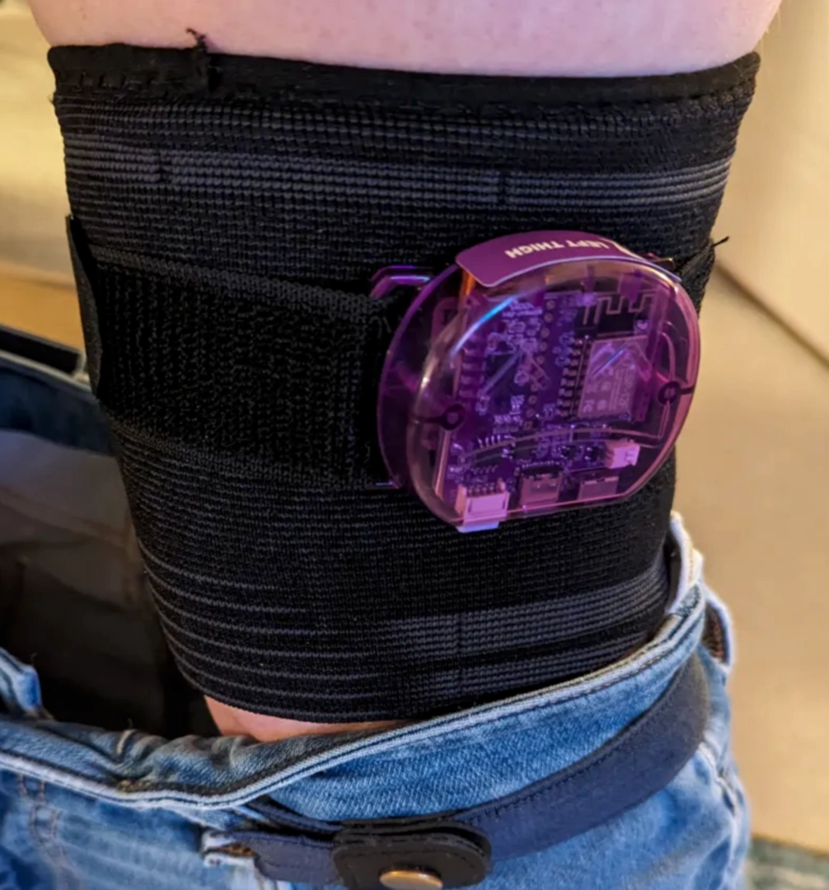

<link rel="stylesheet" href="smol-slimes.css">

# Smol Community Straps

Welcome to the Smol Community Straps page!  
Here you'll find a curated collection of DIY strap solutions, tips, and resources contributed by the SlimeVR community. This guide covers:

- Tracker placement
- Suggested components and materials for making your own straps
- 3D printable buckles
- Complete build guides from the community
- Links to useful resources and listings

Whether you're looking for inspiration, step-by-step instructions, or just want to see what others have built, this page is your starting point for making comfortable, reliable straps for your Smol Slimes.

## Table Of Contents

- TOC
  {:toc}

## Tracker Placement

    

## Components Guide

Here is a list of useful items for making your own straps.

### Band

#### GoPro Chest Strap + Adapter for case

    
    Image is taken from <a href="https://www.aliexpress.com/item/1005004792179605.html">this Aliexpress listing</a>

Provides robust chest tracker mounting.

It can be found by `Chest Strap Mount Belt for GoPro`.

#### Compression Knee Brace 

    
    Original idea and photo by Dean Ravencrest dot dog.

A solution for thigh tracker slipping.

#### Elastic Band With Non-slip Webbing

    

Enhanced grip compared to regular bands.

Can be found by `Elastic Band With Non-slip Webbing`.

### 3D Printable Buckles
<table>
  <thead>
    <tr>
      <th>Image</th>
      <th>Name</th>
      <th>Author</th>
      <th>Link</th>
    </tr>
  </thead>
  <tbody>
    <tr>
      <td>
        
      </td>
      <td>Dovetail Strap Latch 30mm 40mm 50mm SlimeVR Buckles</td>
      <td>MoDErahN</td>
      <td>
        <a href="https://www.thingiverse.com/thing:6929026">Thingiverse</a>
      </td>
    </tr>
    <tr>
      <td>
        
      </td>
      <td>Brackles V2 30/38/50mm for elastic straps</td>
      <td>RDTiel</td>
      <td>
        <a href="https://www.thingiverse.com/thing:6815793">Thingiverse</a>
      </td>
    </tr>
    <tr>
      <td>
        
      </td>
      <td>SlimeVR Straps Clip Hook Extended (Astrix Remix)</td>
      <td>Astrlx</td>
      <td>
        <a href="https://www.thingiverse.com/thing:6811130">Thingiverse</a>
      </td>
    </tr>
    <tr>
      <td>
        
      </td>
      <td>Stock Slime VR Velcro Strap Quick Clip Hooks by Kurzaq</td>
      <td>Kurzaq</td>
      <td>
        <a href="https://www.thingiverse.com/thing:6178909">Thingiverse</a>
      </td>
    </tr>
  </tbody>
</table>

## Full Strap Builds

### Depact V1 Smol Strap

_Design by Depact_

#### Summary

As bare bone as things can be. Buckle recommended to replace with good 3D printed one.

**👍 Pros:**
- So bare bone, that any part can be replaced if needed.
- No sewing required.
- Only scissors needed from tools.

**👎 Cons:**
- Straps may slide within the buckle.
- Less secure attachment.
- May not be as convenient as straps with hook and loop.

#### Making Steps

1. Wrap band around tracker position.
2. Cut band slightly longer than needed to wrap around.
3. Put case and buckles on band.

#### Required Components

| Component                                              | Listing Name                                                                                                                     | Color/Variant             | Link                                                                |
| ------------------------------------------------------ | -------------------------------------------------------------------------------------------------------------------------------- | ------------------------- | ------------------------------------------------------------------- |
| Belt Buckles with webbing size 32mm, 10pcs pack        | 20mm 25mm 32mm~50mm Plastic Hardware Dual Adjustable Side Release Buckles Molle Tatical Backpack Belt Bag Parts Strap Webbing    | Webbing Size 32mm, 10pcs  | [Aliexpress](https://pl.aliexpress.com/item/32804319193.html)       |
| 5m of 30mm Elastic Band with Non-slip Silicone Webbing | Meetee 2/5/10Meters Elastic Band 20-50mm Non-slip Webbing For Belt Garment Wave Silicone Ribbon DIY Clothes Sewing Accessories   | EB312-Black-30mm, 5Meters | [Aliexpress](https://www.aliexpress.com/item/1005003917576160.html) |
| GoPro Chest Strap                                      | Chest Strap Mount Belt for Gopro Hero 9 8 7 6 5 4 Insta360 R X2 DJI OSMO Action Camera Harness for Go Pro SJCAM EKEN Accessories | Black                     | [Aliexpress](https://www.aliexpress.com/item/1005004792179605.html) |

### Depact V2 Smol Strap

_Design by Depact_

#### Summary

Same bare bone and modular approach as V1, but needs needle and thread on top. Buckle recommended to replace with good 3D printed one.

**👍 Pros:**
- So bare bone, that any part can be replaced if needed.
- A little sewing required, with big tolerance for error.
- Minimal tools needed. Scissors and needle.

**👎 Cons:**
- May not be as convenient as straps with hook and loop.

#### Making Steps

1. Wrap band around tracker position.
2. Cut band slightly longer than needed to wrap around.
3. Put case and buckles on band.
4. Sew to band one of the buckle ends.
5. From remaining band, not used for straps, cut one piece per each strap with length slightly less than band width. This gives slight tightness fixating band on unsewn end of strap. 
   1. Wrap this piece around strap slightly tight, so it fixate unsewn end with buckle

#### Additional links

1. <a href="https://www.wikihow.com/Sew" target="_blank">WikiHow: How to Sew Basic Stitches by Hand for Beginners</a>

#### Required Components

| Component                                              | Listing Name                                                                                                                     | Color/Variant             | Link                                                                |
| ------------------------------------------------------ | -------------------------------------------------------------------------------------------------------------------------------- | ------------------------- | ------------------------------------------------------------------- |
| Belt Buckles with webbing size 32mm, 10pcs pack        | 20mm 25mm 32mm~50mm Plastic Hardware Dual Adjustable Side Release Buckles Molle Tatical Backpack Belt Bag Parts Strap Webbing    | Webbing Size 32mm, 10pcs  | [Aliexpress](https://pl.aliexpress.com/item/32804319193.html)       |
| 5m of 30mm Elastic Band with Non-slip Silicone Webbing | Meetee 2/5/10Meters Elastic Band 20-50mm Non-slip Webbing For Belt Garment Wave Silicone Ribbon DIY Clothes Sewing Accessories   | EB312-Black-30mm, 5Meters | [Aliexpress](https://www.aliexpress.com/item/1005003917576160.html) |
| GoPro Chest Strap                                      | Chest Strap Mount Belt for Gopro Hero 9 8 7 6 5 4 Insta360 R X2 DJI OSMO Action Camera Harness for Go Pro SJCAM EKEN Accessories | Black                     | [Aliexpress](https://www.aliexpress.com/item/1005004792179605.html) |
| Needle and thread                                      | Common in DIY and specialized shops                                                                                              |                           |                                                                     |

## Contributing

Want to share your own DIY strap design, tip, or resource?  
We welcome community contributions!

- **How to contribute:**  
  - Open a pull request on the [SlimeVR Docs GitHub repository](https://github.com/SlimeVR/SlimeVR-Docs-Site).
  - Or, suggest changes and share your ideas in the [SlimeVR Discord](https://discord.gg/slimevr) -> [Suggestions on strap improvements](https://discord.com/channels/817184208525983775/1202031023945416725) channel.

Please include clear photos, a description, and any relevant links or files.  
Your contribution helps others build better, more accessible VR experiences!
