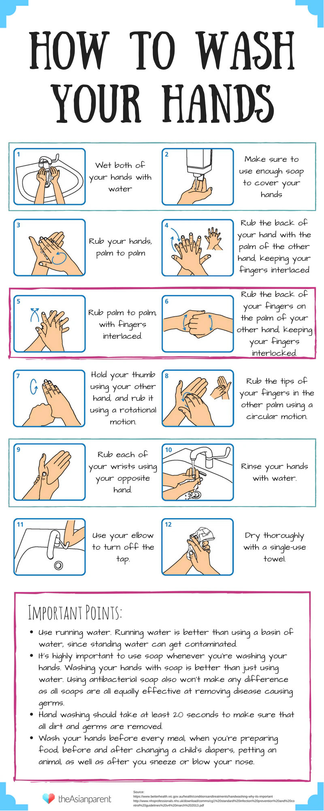

# Tools for Soldering Trackers

This is a curated list of soldering gear and supplies, chosen for providing affordable and performing well entry point. 

If you cannot order from AliExpress, try to find them by name on your preferred online store.

## Table of Contents

* TOC
{:toc}

## Tools

### Soldering Iron

 - [Sequre S99 (AliExpress)](https://www.aliexpress.com/item/1005007348547222.html) - Recommend the K-tip bundle, you can get it with or without a power supply. 
   Uses JBC T245 series tips, and if paired with a genuine tip this iron is basically endgame.
   Uses type-c cable, 21V maximum used voltage, up to 150W depending on tip type.

### Diagonal Pliers

For legs cutting.

**Warning:** When cutting legs use safety glasses, as legs tend to fly away with dangerous velocity.

- [Generic brand (AliExpress)](https://aliexpress.com/item/1005010218011214.html)

### Tweezers

**Example links (Not Community Tested):**
- [Mechanic AAC-14/15 (AliExpress)](https://aliexpress.com/item/1005011921624287.html) - Careful, very sharp!
- [RELIFE RT-15E Precision Tweezers - Curved Ceramic Tips (Allegro)](https://allegro.pl/oferta/precyzyjna-pinceta-peseta-relife-rt-15e-zakrzywione-ceramiczne-koncowki-17578464488)

### Silicone Soldering Mat

Can be substituted with stacks of newspaper, cardboard
- [Generic mat (AliExpress)](https://aliexpress.com/item/1005007861075029.html) - S100 (20cm x 30cm) is minimal, the bigger, the more convenient

### Desoldering Pump (Optional, Convenience)

SS-03 clones:
- [Aluminum Desoldering Pump Suction (AliExpress)](https://aliexpress.com/item/1005008464311159.html)
- [ANSIKI MJF-D9 Solder Sucker (AliExpress)](https://aliexpress.com/item/1005006861778398.html)

Original SS-03:
- [SS-03 (tme.eu)](https://www.tme.eu/en/details/fut.ss-03/desoldering-pumps/engineer/ss-03/)
- [SS-03 (amazon)](https://www.amazon.com/ENGINEER-Engineer-Solder-Suction-SS-03/dp/B0D7Q293KV)

### USB Type-C Cable for Soldering Iron

Tend to come with soldering iron.

**Store Links:**
- [UGREEN 100W Type-C to Type-C (AliExpress)](https://aliexpress.com/item/1005006505041416.html) - do not buy non braided versions

### USB Charger to Power Soldering Iron

If not bought in set with soldering iron. 

**Example links (Not Community Tested):**
- [UGREEN Nexode X, 100W, USB-C x2, USB-A, GaN (EU brand store)](https://eu.ugreen.com/products/ugreen-nexode-x-100w-mini-gan-charger)
- [Anker Nano Charger, 100W, USB-C (official store)](https://www.anker.com/products/b2679-nano-100w-usb-c-charger?variant=44058225737878)

### Protection Glasses aka Protection Goggles aka Safety Goggles

Safety glasses and goggles are measure to reduce risk of cut pin header hitting your eye.
They are very common personal protection item, and likely sold in your local retail stores.
They can be supplemented with using regular glasses, but with higher risk of hitting eyes.

**Example links (Not Community Tested):**
- [2025 New Style PC Window Protection Goggles - Splash, Dust, Fogproof, Windproof, Transparent Safety Glasses (AliExpress)](https://aliexpress.com/item/1005010129737000.html)
- [Safety Glasses Anti Fog Goggles with Side Shields, Anti Blue Light Eyeglasses for Men Women Daily Use (AliExpress)](https://aliexpress.com/item/1005010089097974.html)

## Expendables

### Solder Wire

- 0.4mm wire recommended

**🟢 Sn63Pb37**

- **Category:** ⚠️ Leaded (Eutectic)
- **Recommended Iron Temp:** 320 - 350°C
- **Safety measures:** [SnPb, Sn60Pb40, Sn63Pb37 Solder Safety Rules](#️-snpb-sn60pb40-sn63pb37-solder-safety-rules)

Easy to Use, Affordable and ⚠️ Toxic. Solidifies instantly (Eutectic).

Links:
- [Mechanic HX-T100 (AliExpress)](https://www.aliexpress.com/item/1005006709799515.html)

**🟢 Sn60Pb40**

- **Category:** ⚠️ Leaded (Non-Eutectic)
- **Recommended Iron Temp:** 320 - 350°C
- **Safety measures:** [SnPb, Sn60Pb40, Sn63Pb37 Solder Safety Rules](#️-snpb-sn60pb40-sn63pb37-solder-safety-rules)

Same as Sn63Pb37, but stays flexible couple seconds till cools down(Non-Eutectic)

**🔴 Sn99.3Cu0.7, Sn99Cu0.7б, SnCu**

- **Category:** 🟢 Lead-Free
- **Recommended Iron Temp:** 320 - 360°C

Do not buy. Hard to work for beginner. Brittle (source: https://pmc.ncbi.nlm.nih.gov/articles/PMC6735330/).

### Solder Flux

Useful for reworking or if the flux in your solder burns up.

**Example links (Not Community Tested):**
- [Mechanic UV559 (AliExpress)](https://www.aliexpress.com/item/4000105248849.html) - or any other NC-559 flux

### Solder Wick

For removing solder.

**Example links (Not Community Tested):**
- [Mechanic R300 (AliExpress)](https://www.aliexpress.com/item/4001306099305.html) - Has flux in the wick itself, but adding extra always helps

### Solder Tip Cleaner

Don't use copper sponge!
Use it when tip is dirty with old solder. Dirty on tip looks like dark, crusty smudges.

**Example links (Not Community Tested):**
- [Generic brass wool (AliExpress)](https://aliexpress.com/item/1005012114874141.html)
- [Generic soldering sponge (AliExpress)](https://aliexpress.com/item/1005005758558591.html) - Needs to be wet, when used. Ideally deionised water.

### Solder Tip Tinner (Optional, Likely Not Gonna Be Needed)

Not likely to be needed if making bellow 20 Smols. 

Use if your tip is oxidized. Oxidized tip looks dark, rough, not as reflective.

- [Tip tinner, generic brand (AliExpress)](https://www.aliexpress.com/item/1005008124514052.html) - Apparently quite toxic but it works really well. Get the powder not the goop, 6 grams is plenty

## SnPb, Sn60Pb40, Sn63Pb37 Solder Safety Rules

**RULE 1: Blow the Smoke Away: Flux Smoke Is Respiratory Hazard (Causes Astma)**

- Minimum: Solder next to an open window with a small fan blowing the smoke away from you
- Better: Use cheap fume extractor(fan with charcoal filter) and place it right next to your iron.

**RULE 2: No Eating, Drinking, or Smoking in Soldering Area: Microplastic Is Bad, Lead Dust Is Worse**

- Soldering release lead dust in the air, that settle around you. Getting your favourite mug with a note of lead is not great. Keep everything that you eat, drink or touch with your mouth out of soldering area.

**RULE 3: Wash Your Hands: Microscopic Lead Dust Is Bad**

- Wash your hands after soldering. Do not slack on it.

## Smols Soldering Text and Video Manuals

- [Smol Tracker Soldering - SlimeVR Documentation](../smol-slimes/hardware/smol-tracker-soldering.html)

---

**Contributors**

Created by @nahkiofficial, Depact, @cosmica_t, @ashyfire33 and q3k