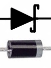
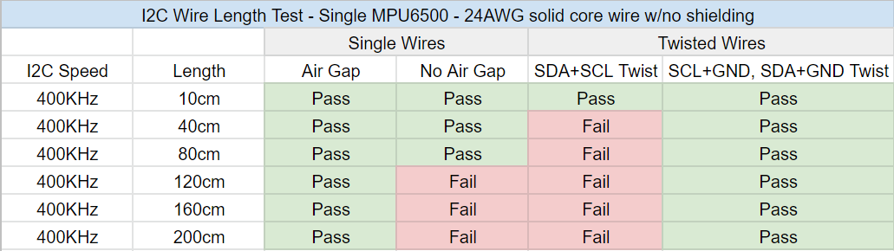

# Tracker Schematics

## Wemos D1 Mini

* IMU
  - <input id="bno" type="radio" name="d1-imu" value="bno"> <label for="bno">BNO085</label> - Great but expensive $$$.
   - <input id="bno_ada" type="radio" name="d1-imu" value="bno_ada"> <label for="bno_ada">BNO085 (Adafruit)</label> - Adafruit version of BNO085.
  - <input id="mpu" type="radio" name="d1-imu" value="mpu" checked="checked"> <label for="mpu">MPU6050</label> - Cheap but drifts quite a bit.
  - <input id="mpu9250" type="radio" name="d1-imu" value="mpu9250"> <label for="mpu9250">MPU9250 (GY-91)</label> - Good but plagued with fakes.
  - <input id="bmi" type="radio" name="d1-imu" value="bmi"> <label for="bmi">BMI160</label> - Cheap and good performance.
  - <input id="qmc" type="radio" name="d1-imu" value="qmc"> <label for="qmc">MPU6050 + QMC5883L</label> - <b>Experimental</b> cheaper MPU9250 equivalent.
* <input id="d1-aux" type="checkbox" name="d1-aux"> <label for="d1-aux">Auxiliary tracker</label> - Allows for a second motion sensor to be connected.
* <input id="d1-battery-sense" type="checkbox" name="d1-battery-sense"> <label for="d1-battery-sense">Battery sense</label> - The device is able to sense the battery life remaining using a 180k resistor.
* <input id="d1-charge-diodes" type="checkbox" name="d1-charge-diodes" checked="checked"> <label for="d1-charge-diodes">Charge diodes (1N5817)</label> - Allows for usage even when charging, and is a **recommended safety measure**.

**Note: If you are using the charge diodes the grey band goes on the side representated by the tip of the arrows in the diagram above.**

| Label |  GPIO  |       Input      |    Output   |                     Description                     |
|:-----:|:------:|:----------------:|:-----------:|:---------------------------------------------------:|
| A0    | ADC0   | Analog Input     | No          | For analog input from 0 to 3.3v and no output.      |
| RX    | GPIO3  | Yes              | RX pin only | High at Boot.                                       |
| TX    | GPIO1  | Tx pin only      | Yes         | High at Boot.                                       |
| D0    | GPIO16 | No interrupt     | No I2C, PWM | Used to wake up chip from deep sleep, High at Boot. |
| D1    | GPIO5  | Yes              | Yes         | Often used as SCL                                   |
| D2    | GPIO4  | Yes              | Yes         | Often used as SDA                                   |
| D3    | GPIO0  | Pulled up        | Yes         | Connected to Flash button                           |
| D4    | GPIO2  | Pulled up        | Yes         | Connected to built-in LED, High at Boot.            |
| D5    | GPIO14 | Yes              | Yes         | SCLK pin for SPI interface                          |
| D6    | GPIO12 | Yes              | Yes         | MISO pin for SPI interface                          |
| D7    | GPIO13 | Yes              | Yes         | MOSI pin for SPI interface                          |
| D8    | GPIO15 | Pulled to ground | Yes         | CS pin for SPI interface                            |

## Cable layout recommendation for auxiliary tracker

Note that while schematics show SDA and SCL running adjacent to each other, make sure that they are not physically adjacent
when running in the auxiliary tracker cable. This is to avoid [crosstalk](https://www.i2cchip.com/i2c_connector.html#Crosstalk) and ensure stable operation of both trackers when cable and allows the extension to safely reach more than 80cm.

If you are using a ribbon cable or similar layout, use the following cable layout as a reference:

If you are using a twisted pair cable or similar layout, use the following cable layout as a reference:

*Code put together by Carl (<https://github.com/carl-anders>), with images made by Lune#0241, NWB#5135, and Reclusious#2022 thanks to the help of the whole DIY community. Doc page integration by Emojikage#3095. Edited by CalliePepper#0666. Thanks to Snapchat_Hotdog#6124 for the testing on the extension lengths.*

