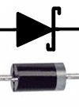
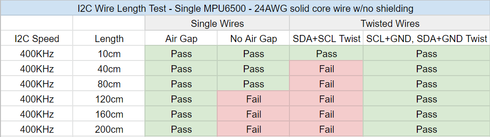
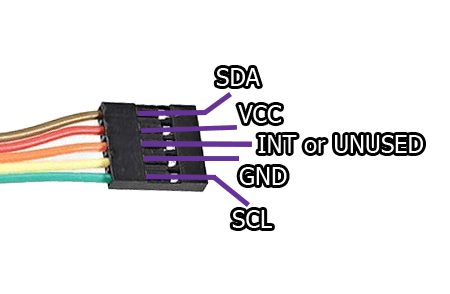
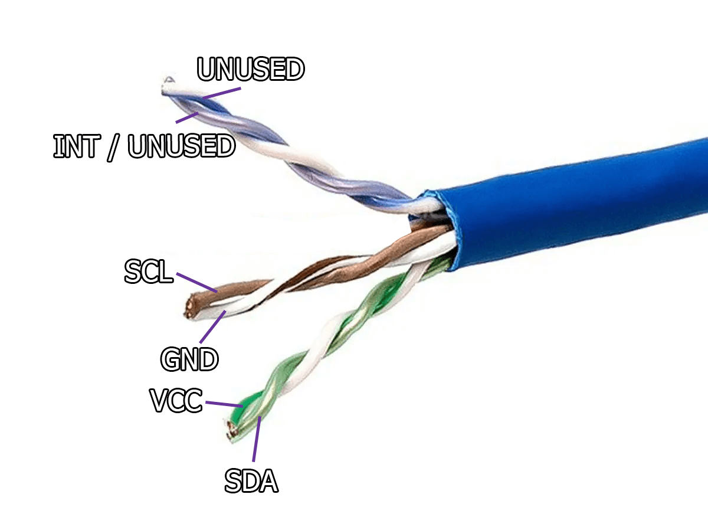

# Tracker Schematics

```admonish important
SPI is the preferred protocol due to its better performance and energy efficiency. As a result, I2C may eventually be phased out and might not be supported in future firmware updates. Note that the magnetometer is not yet available over SPI.
```

If you are new to DIY projects it is recommended to use a carrier PCB like [Shine Bright's meowCarrier](/diy/cases.html#shine-brights-meowcarrier-pcb-case) PCB ([GitHub](https://github.com/Shine-Bright-Meow/meowCarrier)) instead of using wires to assemble your trackers, since using wires can result in lower durability and a shorter tracker lifespan. 

If you are using wires to assemble your trackers it is generally recommended to use 28AWG shielded, stranded wiring. Alternatively, you can salvage shielded wires out of various disused cables you might have, such as VGA cables, Ethernet, or USB.

## Wemos D1 Mini

* IMUs ranked from best - worst ([IMU Comparison Guide](/diy/imu-comparison.html))
  - <input id="ICM45" type="radio" name="d1-imu" value="ICM45" checked="checked"> <label for="ICM45">ICM-45686</label> - Best currently available. Reliable, accurate, and stays accurate the longest.
  - <input id="DSV" type="radio" name="d1-imu" value="DSV"> <label for="DSV">LSM6DSV</label> - About equal to ICM45686, reliable, accurate.
  - <input id="DSR" type="radio" name="d1-imu" value="DSR"> <label for="DSR">LSM6DSR</label> - Recommended budget pick, less accurate than ICM-45 and DSV.
* <input id="d1-aux" type="checkbox" name="d1-aux"> <label for="d1-aux">Auxiliary tracker</label> - Allows for a second motion sensor to be connected.
* <input id="d1-battery-sense" type="checkbox" name="d1-battery-sense"> <label for="d1-battery-sense">Battery sense</label> - The device is able to sense the battery life remaining using a 180k resistor.
* <input id="d1-charge-diodes" type="checkbox" name="d1-charge-diodes" checked="checked"> <label for="d1-charge-diodes">Charge diodes (1N5817)</label> - Allows for usage even when charging, and is a **recommended safety measure**.

<div class="chip" id="d1" style="position: relative; width: 100%;"></div>

<div class="diodeDirectionCont">
  
  Note: If you are using the charge diodes the grey band goes on the side represented by the tip of the arrows in the diagram above.
</div>

| Label |  GPIO  |       Input      |    Output   |                     Description                     |
|:-----:|:------:|:----------------:|:-----------:|:---------------------------------------------------:|
| A0    | ADC0   | Analog Input     | No          | For analog input from 0 to 3.3v and no output.      |
| RX    | GPIO3  | Yes              | RX pin only | High at Boot.                                       |
| TX    | GPIO1  | Tx pin only      | Yes         | High at Boot.                                       |
| D0    | GPIO16 | No interrupt     | No I2C, PWM | Used to wake up chip from deep sleep, High at Boot. |
| D1    | GPIO5  | Yes              | Yes         | Often used as SCL                                   |
| D2    | GPIO4  | Yes              | Yes         | Often used as SDA                                   |
| D3    | GPIO0  | Pulled up        | Yes         | Connected to Flash button                           |
| D4    | GPIO2  | Pulled up        | Yes         | Connected to built-in LED, High at Boot.            |
| D5    | GPIO14 | Yes              | Yes         | SCLK pin for SPI interface                          |
| D6    | GPIO12 | Yes              | Yes         | MISO pin for SPI interface                          |
| D7    | GPIO13 | Yes              | Yes         | MOSI pin for SPI interface                          |
| D8    | GPIO15 | Pulled to ground | Yes         | CS pin for SPI interface                            |

## IMU Breakout Modules

Many IMU Breakout Modules provided by the community have pads that you need to bridge in order to connect the IMU to the main board. Most breakout modules have similar pads that you need to bridge, but be sure to check the schematic provided by the seller to verify it is the same as this!

| Bridge Pad | Pin | When to bridge | Description |
|:---:|:---:|:---:|:---:|
| 1 | SCL | Using I2C | Connects 4k7R pull-up to +3v3 for the SCL pin |
| 2 | SDA | Using I2C | Connects 4k7R pull-up to +3v3 for the SDA pin |
| 3 | CS | Using I2C | Connects 4k7R pull-up to +3v3 for the CS pin |
| 4 | SD0 | Using I2C (Only Aux Sensor / Extension IMU) | Connects 4k7R pull-up to +3v3 for the SD0 pin |
| 5 | IMU SCX → Mag SCL | Using I2C & Magnetomer | Connects the magnetometer's SCL pin to the IMU's SCX pin |
| 6 | SCX | Using I2C & Magnetomer | Connects 10kR pull-up to +3v3 for SCX |
| 7 | IMU SDX → Mag SCA | Using I2C & Magnetomer | Connects the magnetometer's SDA pin to the IMU's SDX pin |
| 8 | SCX | Using I2C & Magnetomer | Connects 10kR pull-up to +3v3 for SDX |
| 9 | SD0 | Using I2C (Only Main Sensor) | Connects SD0 to GND |

Usually, for the Main IMU you want to bridge pads 1, 2, 3, and 9. Usually for the Extension IMU you want to bridge pads 1, 2, 3, and 4. If you want to hook up the magnetometer you will also need to bridge pads 5, 6, 7, and 8 in addition to the IMU bridge pads.

| ICM-45686 (SlimeVR) | LSM6DSV (Moffshop) |
| --- | --- |
| [](/assets/img/diy_slimevr-icm-45686.png) | [](/assets/img/diy_imu-module-lsm6dsv.png) |

## Cable layout recommendation for auxiliary tracker

Note that while schematics show SDA and SCL running adjacent to each other, make sure that they are not physically adjacent
when running in the auxiliary tracker cable. This is to avoid [crosstalk](https://www.i2cchip.com/i2c_connector.html#Crosstalk) and ensure stable operation of both trackers when cabled and allow the extension to safely reach more than 80cm.



If you are using a ribbon cable or similar layout, use the following cable layout as a reference:



If you are using a twisted pair cable or similar layout, use the following cable layout as a reference:



*Code put together by Carl (<https://github.com/carl-anders>), with images made by Lune#0241, nwbx01, Meia, Aed and Reclusious#2022 thanks to the help of the whole DIY community. Doc page integration by emojikage. Edited by calliepepper, Aed, and Amebun. Thanks to snapchat_hotdog for the testing on the extension lengths.*

<script src="../assets/js/schematics.js"></script>
