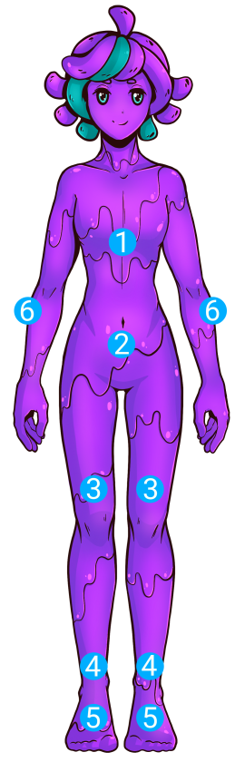
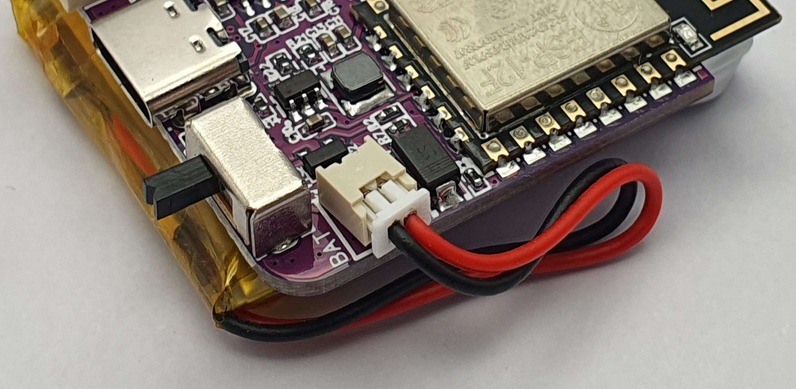

# SlimeVR DIY Kit

## Thank you for purchasing the SlimeVR DIY kit!
To get your DIY set operational, first it will need some additional attention. On this page we will guide you through the basic steps involved into creating your own ready-to-use set of SlimeVR trackers. While this guide contains some general recommendations, feel free to deviate from the norm and make them truly your own! Have fun!

## Introduction
### Box contents
Inside your SlimeVR DIY kit are 7 large SlimeVR Mainboards, 3 small SlimeVR Tracker extensions, and 3 Extension cables (1 long, 2 short).

TODO: Currently placeholder image

### Required extras
To complete your SlimeVR trackers, you will need some parts in addition to your SlimeVR DIY kit. These include enclosures, straps, batteries, and a USB cable. These are detailed below to make it easier for you to complete your project.

### Recommended mounting layout
TODO: Currently placeholder image

<table class="bpTable">
   <tr>
      <td>
         
      </td>
      <td>
         <ol>
            <li>Chest (Extension)</li>
            <li>Waist</li>
            <li>Upper legs</li>
            <li>Lower legs</li>
            <li>Feet (Extension)</li>
            <li>Upper arms</li>
         </ol>
      </td>
   </tr>
</table>

## Designing your case
DIY kits do not come with cases and such require enclosures to protect them and allow strap attachment. These can be printed, purchased, or crafted. While the official SlimeVR Main and Extension cases are designed to fit the boards included in this kit, they are not optimised for home 3d printers due to their curved surfaces. As such, we recommend printing up your own using a modified design, or designing your own!

The 3D models for the official main and extension cases can be found [here](TODO:linktofiles). Modified versions of these official cases more suited for home 3D printers, made by Tom Yum#0069, can be found [here](TODO:linktoprintables?). 

For those planning to design your own enclosure, you can find the model of the Mainboard [here](TODO:linktomainboardstepfile) and Extension PCBs [here](TODO:linktoextensionstepfile).

<u>Using the official case designs?</u>

 
TODO: assembly guide

 

## Choosing your battery
The SlimeVR Mainboards included in your DIY kit require power from a battery for the best experience. SlimeVR trackers use approximately 100mAh during use. When choosing a battery, **select a capacity rating of at least 500mAh to ensure safe use.** Charging rate is limited to 500mA to ensure optimal battery lifespan. 

We recommend the following specifications:
* Capacity: 1000-1800 mAh
* Nominal Voltage: 3.7v
* Connection: Micro JST 1.25mm

The battery dimensions will depend on which case you choose to use or make. Lithium-ion Polymer (LiPo) pouch batteries come in various shapes and sizes, indicated by an `XXYYZZ` naming scheme that denotes their dimensions in thickness (X.Xmm), width (YYmm), and length (ZZmm). As an example, the official SlimeVR case design uses an 803443 battery, denoting a battery of 8.0mm thickness, 34mm width, and 43mm length.

The mainboards feature a Micro JST 1.25mm male connector port for attaching a battery. As such, it is best to choose a battery that has a matching female connector. Alternatively, you can solder or crimp these connectors onto a battery for easy attachment to the Mainboard.

TODO: placeholder image

Extensions do not require their own battery, as they use power from the attached Mainboard.

## Choosing your straps
You have the option of buying, crafting, and/or customising your straps to your personal preferences. We highly recommend you use elasticised straps with hook and loop fastening, to ensure a comfortable experience and prevent tracker migration. 

*For tips on making your own straps, check out the [DIY Straps Guide](https://docs.slimevr.dev/diy/diy-straps.html).*

We recommend the following strap lengths as a baseline guide for choosing your strap design:
* Chest and Hip: 100cm / 40"
* Upper legs (2): 50cm / 20"
* Lower legs (2) and Arms (2): 35cm / 14"
* Feet (2): 30cm / 12"

*Note: elastic straps stretch, so you may need less than you think!*

The width of your straps you chose are determined by the case you have designed or opted to use. 

<u>Using the official case designs?</u>

 
The official cases use 38mm width straps for main trackers, and 25mm width straps for extensions. The following table of strap sizes used in official SlimeVR sets can be used as a starting reference for purchasing or crafting your own:

| Body location      | Amount | Strap size (mm) |
| ------------------ | :----: | --------------- |
| Chest strap        | 1      | 38x1000         |
| Hip strap          | 1      | 25x1000         |
| Upper leg straps   | 2      | 38x500          |
| Lower leg straps   | 2      | 38x350          |
| Foot straps        | 2      | 25x300          |
| Arm straps         | 2      | 38x350          |

 

## Optional accessories
SlimeVR DIY Kits Mainboard features a USB Type-C female connector for both recharging and serial connection. As such, at least 1 USB-C cable is required. 

We recommend a USB-C to USB-A cable to charge your SlimeVR trackers, and charging using an external USB-A power supply.

Not all cables are built equal, however,  most cables will work for charging, as SlimeVR only uses 5 volts at low current. For serial connection, a cable with Data connections is required. If USB serial connection issues arise, ensure your cable features data lines or try a different cable.

---
*Created by Vyolex#1715 and Spazzwan#0001.*
