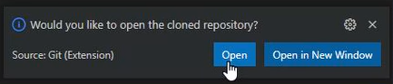
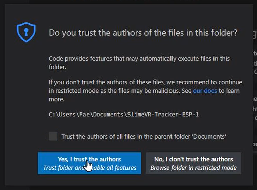

# Setting up the Environment

This procedure will show how to prepare your system for uploading the firmware to your tracker.

## 1. Install Visual Studio Code

Download the [latest Visual Studio Code](https://code.visualstudio.com/download) and install it.

	<video name="Downloading Visual Studio Code" autoplay muted loop controls playsinline>
	  <source src="../assets/videos/downloadVSC.webm" type="video/webm">
	  <source src="../assets/videos/downloadVSC.mov" type="video/quicktime">
	</video> 
	Choose the correct environment

	<video name="Installing Visual Studio Code" autoplay muted loop controls playsinline>
	  <source src="../assets/videos/installVSC.webm" type="video/webm">
	  <source src="../assets/videos/installVSC.mov" type="video/quicktime">
	</video> 
	Follow the installation process

## 2. Install PlatformIO IDE

Once Visual Studio Code is installed, open it and install [PlatformIO IDE for VSCode](https://marketplace.visualstudio.com/items?itemName=platformio.platformio-ide), an extension that will allow you to connect to the tracker, build and upload the firmware.

	<video name="Installing PlatformIO" autoplay muted loop controls playsinline>
	  <source src="../assets/videos/installPIO.webm" type="video/webm">
	  <source src="../assets/videos/installPIO.mov" type="video/quicktime">
	</video> 

## 3. Install Device Drivers

**Please note: these drivers will be automatically installed if you download and run the SlimeVR server.**

### For CH340 (NodeMCU v3, Wemos D1 Mini, and official SlimeVR trackers)

Download the `CH341SER.EXE` file from [here](https://cdn.sparkfun.com/assets/learn_tutorials/8/4/4/CH341SER.EXE), run it and follow installation instructions.

	<video name="The Install wizard for CH341SER" autoplay muted loop controls playsinline>
	  <source src="../assets/videos/installCH.webm" type="video/webm">
	  <source src="../assets/videos/installCH.mov" type="video/quicktime">
	</video> 

### For CP210X (NodeMCU v2)

1. Download the zip archive with the drivers from silicon labs [here](https://www.silabs.com/documents/public/software/CP210x_Windows_Drivers.zip).

   For any other OS, the drivers can be found [here](https://www.silabs.com/developers/usb-to-uart-bridge-vcp-drivers).

1. Extract the files from the downloaded zip archive, then launch `CP210xVCPInstaller_x64.exe` (`CP210xVCPInstaller_x86.exe` if you are using 32-bit Windows) and follow installation instructions.

## 4. Install Git Client

For Windows, you can download and install [Git for Windows](https://git-scm.com/download/win). If you have other OS, visit [https://git-scm.com/downloads](https://git-scm.com/downloads).

	<video name="Installing Git for Windows" autoplay muted loop controls playsinline>
	  <source src="../assets/videos/installGit.webm" type="video/webm">
	  <source src="../assets/videos/installGit.mov" type="video/quicktime">
	</video> 
   Note: you will most likely have to click "Click here to download manually". If that doesn't work, you can try <a href="https://gitforwindows.org/">here</a>.

## 5. Choose a Firmware Version

Some hardware configurations may require different versions of firmware.

For most trackers, using `https://github.com/SlimeVR/SlimeVR-Tracker-ESP.git` is fine.

For MPU+QMC5883L trackers, you need `https://github.com/deiteris/SlimeVR-Tracker-ESP.git`.

## 6. Clone the Firmware Project

Make sure you close any current projects you have open or open a new window before moving forward with these steps.

1. Click the **Source Control** button, click on **Clone Repository** and enter the link to the firmware version you chose in step 5.

   If you installed git while Visual Studio Code was open you may have to close it and re-open it first.

   

      <video name="The Cloning process in VSC" autoplay muted loop controls playsinline>
       <source src="../assets/videos/cloneVSC.webm" type="video/webm">
       <source src="../assets/videos/cloneVSC.mov" type="video/quicktime">
      </video> 
   

1. Once you have chosen a download location click the **Open button** that appears at the bottom right.

   

1. Click **Yes, I trust the authors**.

   

1. **(MPU+QMC5883L only)** Click the **Source Control** button, click on **main** and choose either **qmc-mag-new** or **hmc-mag** from the dropdown depending on whether you're using a QMC5883L or an HMC5883L.

   

      <video name="Where to find the changes for MPU+QMC5883L" autoplay muted loop controls playsinline>
       <source src="../assets/videos/MPUChanges.webm" type="video/webm">
       <source src="../assets/videos/MPUChanges.mov" type="video/quicktime">
      </video> 
   

