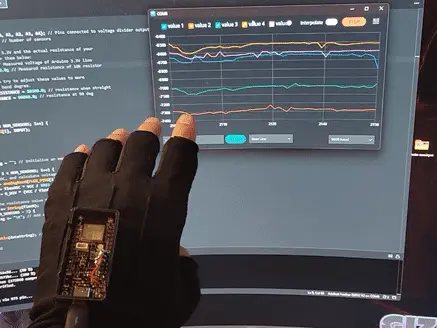
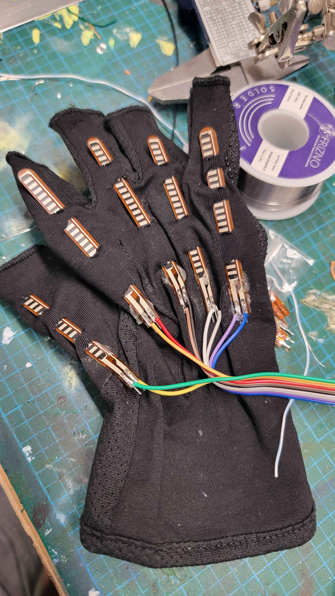
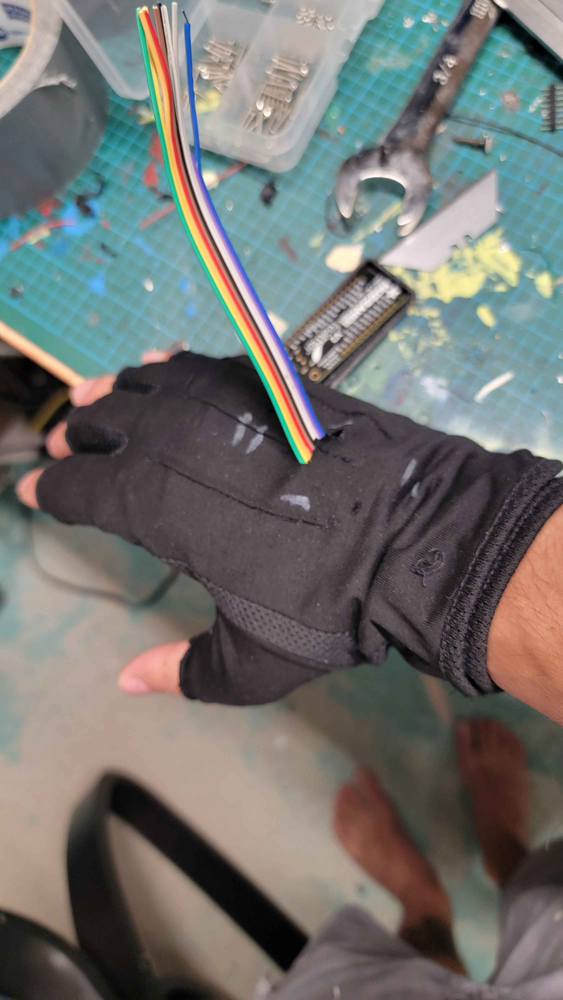
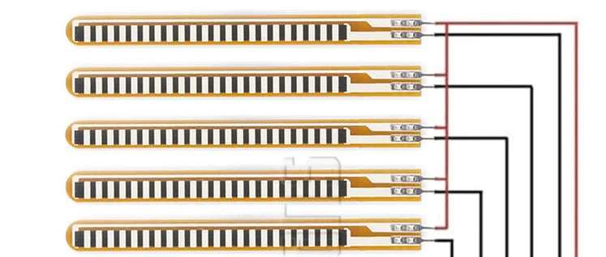
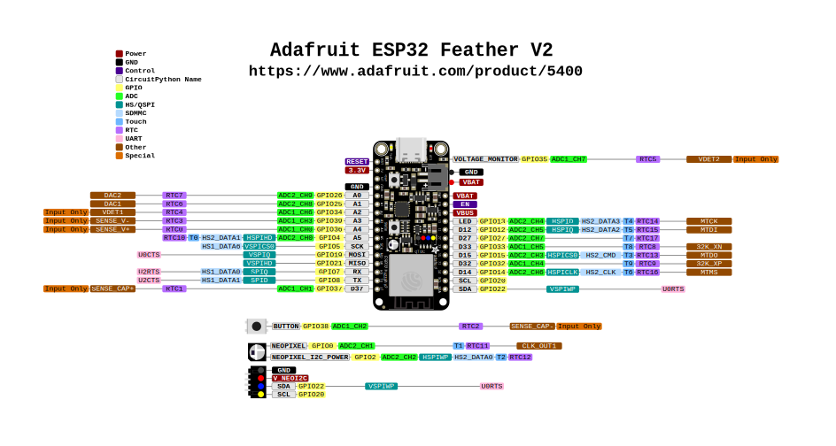
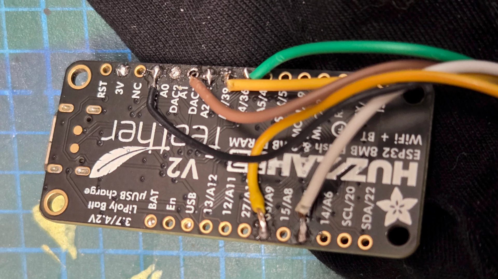
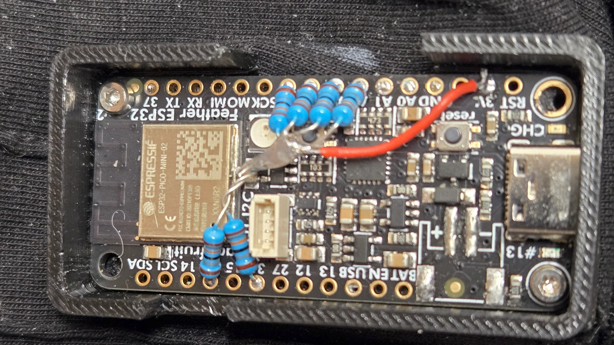
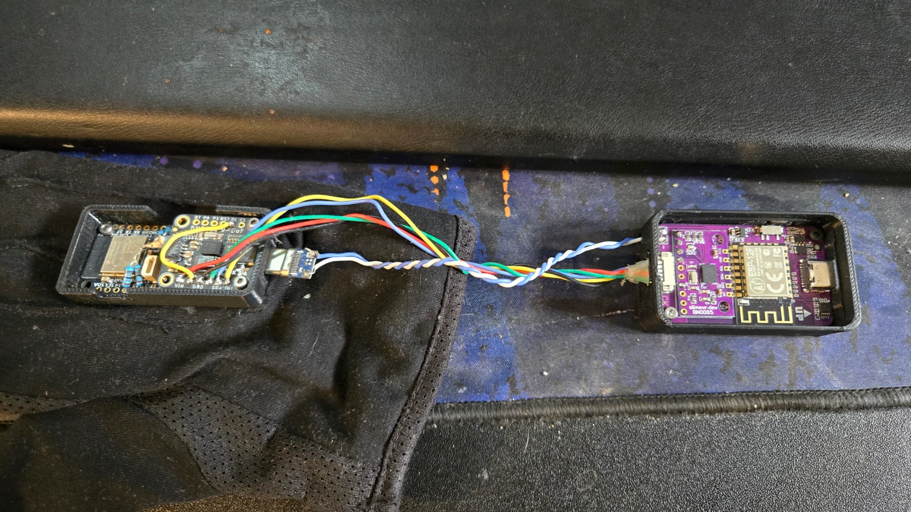

# SlimeVR Gloves

```admonish warning
**Disclaimer:** This project is highly experimental. These devices may be incompatible with newer versions of the SlimeVR Server and may require frequent firmware updates. Hardware, firmware, and communication protocols are subject to change.
```

```admonish info
Are you interested, have questions, or running into issues? Chat with us in ***#finger-tracking*** on the <a href="https://discord.gg/SlimeVR" target="_blank">SlimeVR Discord</a>!
```

Looking for a way to add finger tracking to your VR setup? SlimeVR Gloves are a community-driven project designed to make finger tracking accessible and easy to implement.

The gloves utilize flex sensors and microcontrollers to capture finger movements accurately.

They are fully compatible with the SlimeVR server.

## 🧤 Guizmo12 Glove
Currently, the Guizmo12 Glove is the primary project for SlimeVR Gloves.

<div class="embeddedVideo">
    
  Guizmo12 gloves
</div>

## Glove Hardware

### Required tools

<table>
  <thead>
    <tr>
      <th>Component</th>
      <th>Example/Notes</th>
      <th>Price</th>
      <th>Store Link</th>
    </tr>
  </thead>
  <tbody>
    <tr>
      <td>Soldering supplies</td>
      <td>Solder, iron, etc.</td>
      <td>Varies</td>
      <td>
        <ul>
          <li><a href="https://www.amazon.com/s?k=soldering+kit">Amazon</a></li>
          <li><a href="https://aliexpress.com/w/wholesale-soldering-kit.html?g=y&SearchText=soldering+kit&sortType=total_tranpro_desc">AliExpress</a></li>
        </ul>
      </td>
    </tr>
  </tbody>
</table>

### Required Components

<div class="table-wrapper">
  <table class="community-builds-table">
  <thead>
    <tr>
      <th>Component</th>
      <th>Example/Notes</th>
      <th>Price</th>
      <th>Store Link</th>
    </tr>
  </thead>
  <tbody>
    <tr>
      <td>Microcontroller</td>
      <td>Adafruit ESP32 Feather V2</td>
      <td>$19.95</td>
      <td><a href="https://www.adafruit.com/product/5400">Adafruit</a></td>
    </tr>
    <tr>
      <td>Flex sensors (5x)</td>
      <td>For each finger</td>
      <td>~$5-8 each</td>
      <td><a href="https://www.adafruit.com/product/1070">Adafruit</a></td>
    </tr>
    <tr>
      <td>Glove base</td>
      <td>Any fabric glove</td>
      <td>~$5-10</td>
      <td><a href="https://www.amazon.ca/-/fr/dp/B07FPN6WF4">Amazon</a></td>
    </tr>
    <tr>
      <td>10k Resistors</td>
      <td>For voltage divider</td>
      <td>&lt;$1</td>
      <td><a href="https://pl.aliexpress.com/w/wholesale-10k-resistor.html?spm=a2g0o.home.search.0">AliExpress</a></td>
    </tr>
    <tr>
      <td>Wires</td>
      <td>Thin, flexible</td>
      <td>~$5</td>
      <td></td>
    </tr>
    <tr>
      <td>Battery</td>
      <td>LiPo, e.g. 150-300mAh</td>
      <td>~$5-10</td>
      <td><a href="https://www.adafruit.com/product/1317">Adafruit</a></td>
    </tr>
    <tr>
      <td>Connectors (optional)</td>
      <td>JST or similar for battery/sensors</td>
      <td>~$2-5</td>
      <td></td>
    </tr>
    <tr>
      <td>3d Printed Case</td>
      <td>
        Guizmo12 Glove files for printing:
         <ol>
          <li><a href="./assets/index/stl/feather_TX_enclosure_V2_bottom_holes.stl">GizmoQC case enclosure</a></li>
          <li><a href="./assets/index/stl/feather_TX_underside.stl">GizmoQC case underside</a></li>
         </ol>
      </td>
      <td></td>
      <td></td>
    </tr>
  </tbody>
</table>
</div>

## Building Guide

Carefully cut small slits in the glove to insert each flex sensor.

Ensure that the base of each sensor is secured while allowing the tip to move freely in both forward and backward directions.

<div style="display: flex">
  
  
</div>

Solder the wires on the same side of each flex sensor and connect them to the Feather V2’s GND pin.

Next, connect the opposite side of each sensor to the corresponding Feather V2 pins:
- A9: Thumb
- A7: Index
- A2: Middle
- A3: Ring
- A4: Little




```admonish danger
⚠️ This vector image may need editing or replacement. Use FOSS editor like Inkscape if needed.
```

<div class="embeddedVideo">
    
  Adafruit ESP32 Feather V2 Pinout
</div>



Place the resistors on one side of the Feather V2 and solder them together to form a voltage divider.

Afterward, connect a wire from the 3V pin to the junction of the resistors.




In this setup, the Feather V2 is powered via USB from the wrist tracker.



## Firmware Setup

```admonish danger
⚠️ Firmware flashing instructions must be added with step-by-step guidance.
```

### Firmware Flashing

To compile and flash the glove firmware, you will need the [Arduino IDE](https://www.arduino.cc/en/software).

Then, clone the firmware repository from [GizmoGlovesMocap GitHub](https://github.com/Guizmo12/gizmoglovesmocap).

### Firmware Variants
| Firmware Name   | Usage Description                                                            |
| --------------- | ---------------------------------------------------------------------------- |
| ConnectToSlime  | For use with the [SlimeVR Server](https://github.com/SlimeVR/SlimeVR-Server) |
| FullGloveWIFI   | For use with server_tester.py                                                |
| FullGloveNoWiFi | For use with a serial console                                                |


## References

- 🔗 [GizmoQC Mocap Glove GitHub repository](https://github.com/Guizmo12/gizmoglovesmocap/tree/main)

<hr/>

*Created by Shine Bright ✨, [Depact](https://github.com/Depact) and [GizmoQC](https://github.com/Guizmo12)*