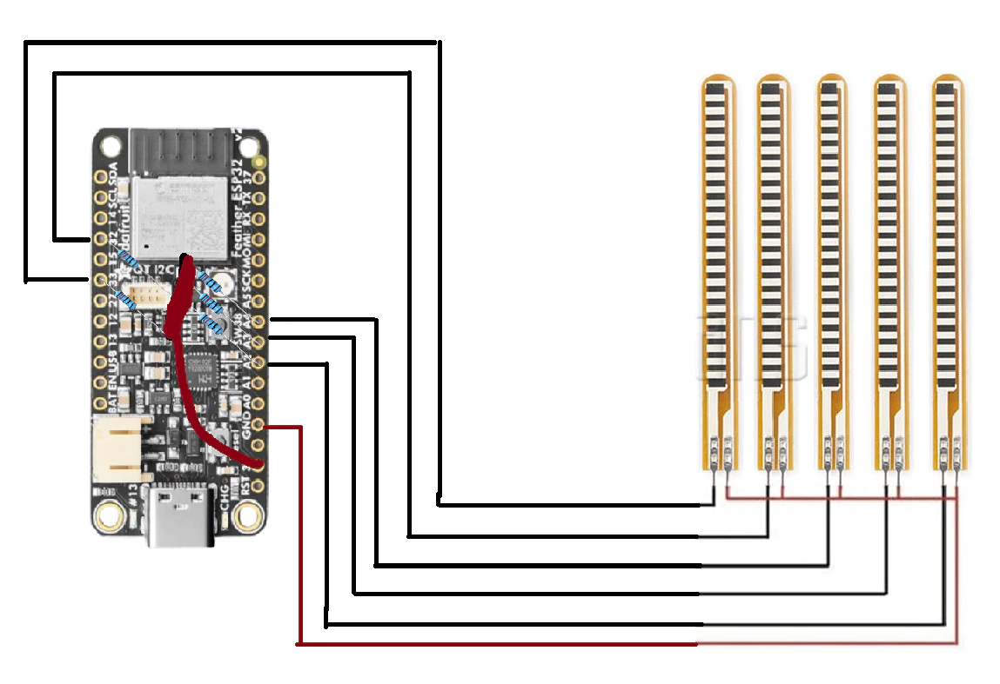

# SlimeVR Gloves

```admonish warning
**Disclaimer:** This project is highly experimental. These devices may be incompatible with newer versions of the SlimeVR Server and may require frequent firmware updates. Hardware, firmware, and communication protocols are subject to change.
```

```admonish info
Are you interested, have questions, or running into issues? Chat with us in ***#finger-tracking*** on the <a href="https://discord.gg/SlimeVR" target="_blank">SlimeVR Discord</a>!
```

Looking for a way to add finger tracking to your VR setup? SlimeVR Gloves are a community-driven project designed to make finger tracking accessible and easy to implement.

The gloves utilize flex sensors and microcontrollers to capture finger movements accurately.

They are fully compatible with the SlimeVR server.

## Table Of Contents

- TOC
{:toc}

## 🧤 Guizmo12 Glove
Currently, the Guizmo12 Glove is the primary project for SlimeVR Gloves.

<div class="embeddedVideo">
    
  Guizmo12 glove in development values reading
</div>

## Glove Hardware

### Required tools

<table>
  <thead>
    <tr>
      <th>Component</th>
      <th>Example/Notes</th>
      <th>Price</th>
      <th>Store Link</th>
    </tr>
  </thead>
  <tbody>
    <tr>
      <td>Soldering supplies</td>
      <td>Solder, iron, etc.</td>
      <td>Varies</td>
      <td>
        <ul>
          <li><a href="https://www.amazon.com/s?k=soldering+kit">Amazon</a></li>
          <li><a href="https://aliexpress.com/w/wholesale-soldering-kit.html?g=y&SearchText=soldering+kit&sortType=total_tranpro_desc">AliExpress</a></li>
        </ul>
      </td>
    </tr>
  </tbody>
</table>

### Required Components

<div class="table-wrapper">
  <table class="community-builds-table">
  <thead>
    <tr>
      <th>Component</th>
      <th>Example/Notes</th>
      <th>Price</th>
      <th>Store Link</th>
    </tr>
  </thead>
  <tbody>
    <tr>
      <td>Microcontroller</td>
      <td>Adafruit ESP32 Feather V2</td>
      <td>$19.95</td>
      <td><a href="https://www.adafruit.com/product/5400">Adafruit</a></td>
    </tr>
    <tr>
      <td>Flex sensors (5x)</td>
      <td>For each finger</td>
      <td>~$5-8 each</td>
      <td><a href="https://www.adafruit.com/product/1070">Adafruit</a></td>
    </tr>
    <tr>
      <td>Glove base</td>
      <td>Any fabric glove</td>
      <td>~$5-10</td>
      <td><a href="https://www.amazon.ca/-/fr/dp/B07FPN6WF4">Amazon</a></td>
    </tr>
    <tr>
      <td>10k Resistors</td>
      <td>For voltage divider</td>
      <td>&lt;$1</td>
      <td><a href="https://pl.aliexpress.com/w/wholesale-10k-resistor.html?spm=a2g0o.home.search.0">AliExpress</a></td>
    </tr>
    <tr>
      <td>Wires</td>
      <td>Thin, flexible</td>
      <td>~$5</td>
      <td></td>
    </tr>
    <tr>
      <td>Battery</td>
      <td>LiPo, e.g. 150-300mAh</td>
      <td>~$5-10</td>
      <td><a href="https://www.adafruit.com/product/1317">Adafruit</a></td>
    </tr>
    <tr>
      <td>Connectors (optional)</td>
      <td>JST or similar for battery/sensors</td>
      <td>~$2-5</td>
      <td></td>
    </tr>
    <tr>
      <td>3d Printed Case</td>
      <td>
        Guizmo12 Glove files for printing:
         <ol>
          <li><a href="./assets/index/stl/feather_TX_enclosure_V2_bottom_holes.stl">GizmoQC case enclosure</a></li>
          <li><a href="./assets/index/stl/feather_TX_underside.stl">GizmoQC case underside</a></li>
         </ol>
      </td>
      <td></td>
      <td></td>
    </tr>
  </tbody>
</table>
</div>

### Building Guide

Carefully cut small slits in the glove to insert each flex sensor.

Ensure that the base of each sensor is secured while allowing the tip to move freely in both forward and backward directions.

<div style="display: flex">
  
  
</div>

Next, connect the opposite side of each sensor to the corresponding Feather V2 pins:
- A9: Thumb
- A7: Index
- A2: Middle
- A3: Ring
- A4: Little

<div class="embeddedVideo">
  
  Guizmo12 Glove schematic 
</div>


Solder the wires on the same side of each flex sensor and connect them to the Feather V2’s GND pin.


<div class="embeddedVideo">
  
  Guizmo12 Glove schematic 
</div>

Place the resistors on one side of the Feather V2 and solder them together to form a voltage divider.

Afterward, connect a wire from the 3V pin to the junction of the resistors.


In this setup, the Feather V2 is powered via USB from the wrist tracker.


### Firmware Variants

| Firmware Name                                                                             | Usage Description                                                            |
| ----------------------------------------------------------------------------------------- | ---------------------------------------------------------------------------- |
| [ConnectToSlime](https://github.com/Guizmo12/gizmoglovesmocap/tree/main/ConnectToSlime)   | For use with the [SlimeVR Server](https://github.com/SlimeVR/SlimeVR-Server) |
| [FullGloveWIFI](https://github.com/Guizmo12/gizmoglovesmocap/tree/main/FullGloveWiFi)     | For use with server_tester.py                                                |
| [FullGloveNoWiFi](https://github.com/Guizmo12/gizmoglovesmocap/tree/main/FullGolveNoWiFi) | For use with a serial console                                                |

### Compiling and Flashing SlimeVR compatible Glove Firmware

Below is a step-by-step guide to compiling and flashing the glove firmware using the `ConnectToSlime/GizmoSlimeFirmware.ino` example.

#### 1. Download and Install Arduino IDE

- Download the [Arduino IDE](https://www.arduino.cc/en/software) and install it on your computer.

#### 2. Install ESP32 Board Support

- Open Arduino IDE.
- Go to **File > Preferences**.
- In the "Additional Boards Manager URLs" field, add:
  ```
  https://raw.githubusercontent.com/espressif/arduino-esp32/gh-pages/package_esp32_index.json
  ```
- Go to **Tools > Board > Boards Manager**.
- Search for "esp32" and install the latest version by Espressif Systems.

#### 3. Download the Firmware

- Clone or download the firmware repository from [GizmoGlovesMocap GitHub](https://github.com/Guizmo12/gizmoglovesmocap).
- Open `ConnectToSlime/GizmoSlimeFirmware.ino` in Arduino IDE.

#### 4. Install Required Libraries

- In Arduino IDE, go to **Sketch > Include Library > Manage Libraries...**
- Search for and install:
  - `WiFi`
  - `WiFiUdp`
  - Any other libraries required by the firmware (e.g., `ByteBuffer.h` if not included in the repo).

#### 5. Configure WiFi Credentials

- In the code, find these lines:
  ```cpp
  const char* ssid = "your_ssid";
  const char* password = "your_password";
  ```
- Replace `"your_ssid"` and `"your_password"` with your WiFi network's SSID and password.

#### 6. Select the Board and Port

- Go to **Tools > Board** and select `Adafruit ESP32 Feather`.
- Go to **Tools > Port** and select the port corresponding to your device.

#### 7. Compile and Upload

- Click the **Upload** button (right arrow) in Arduino IDE.
- Wait for the upload to complete. The glove will reboot and attempt to connect to your WiFi.

#### 8. Verify Operation

- Open the Serial Monitor (**Tools > Serial Monitor**) at 9600 baud to view debug output.
- The glove should connect to WiFi and begin sending data to the SlimeVR server.

## References

- 🔗 [GizmoQC Mocap Glove GitHub repository](https://github.com/Guizmo12/gizmoglovesmocap/tree/main)

<hr/>

*Created by Shine Bright ✨, [Depact](https://github.com/Depact) and [GizmoQC](https://github.com/Guizmo12)*