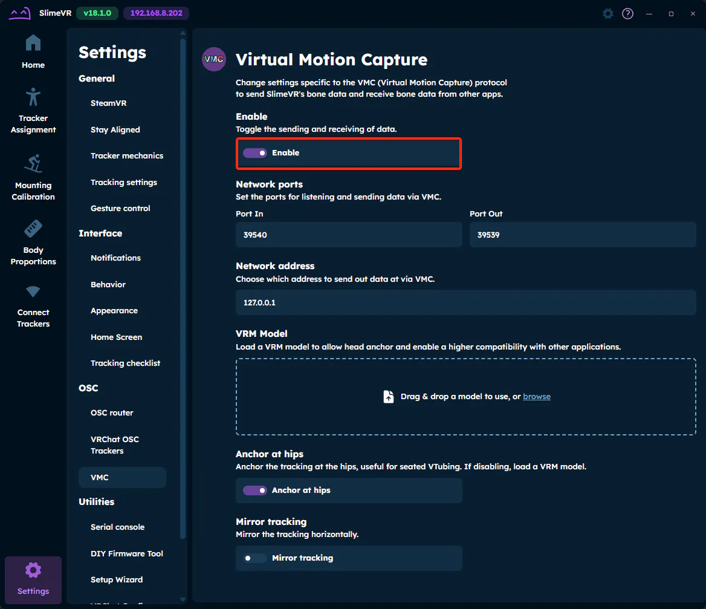
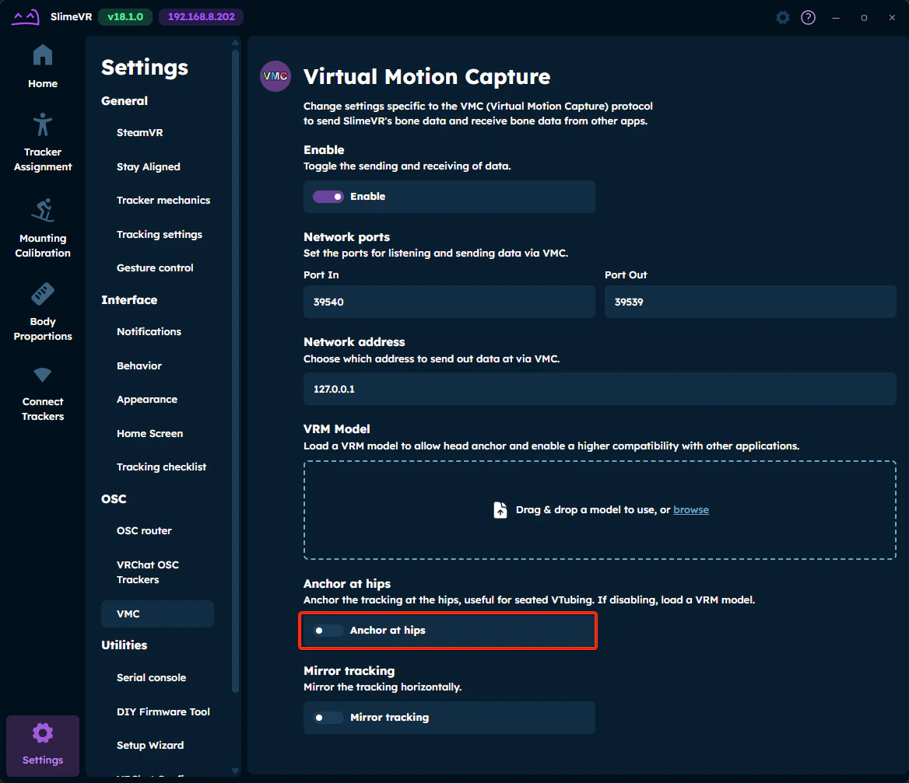
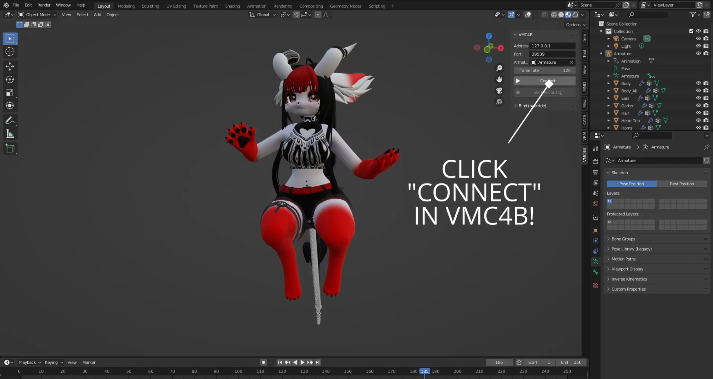
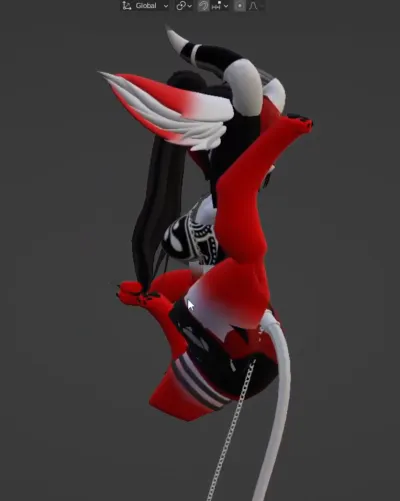
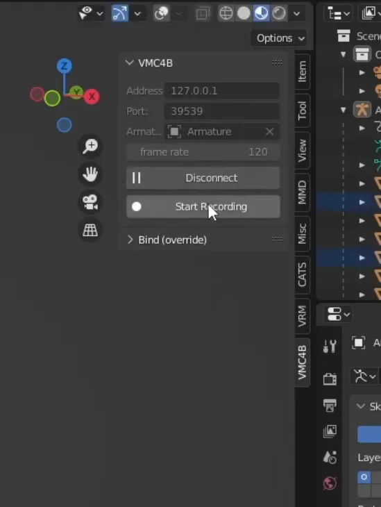

# OSC (Open Sound Control) Live Recording

OSC (Open Sound Control) is a protocol for networking sound synthesizers, computers, and other multimedia devices for purposes such as musical performance or show control.

SlimeVR uses OSC as one of its live output methods to send tracking data to various applications in real-time.

## Table of Contents

- TOC
{:toc}

## Known Recording Approaches

### Recording Motion with Blender Through VMC4B Add-On

**Requirements**

- VMC4B add-on: https://booth.pm/ja/items/3432915 
  - Paid
  - Supported blender versions: 2.93.5, 3.0.0, 3.2.2
- Blender 2.93.5, 3.0.0 or 3.2.2

**Enable OSC Output**

In SlimeVR Server:

1. Open **Settings**
2. Navigate to **OSC/VMC** tab
3. Enable **OSC Tracker** output

4. Disable **Anchor at hips**

In Blender:
1. In Blender tools panel open VMC4B panel. Click **Connect**.

1. At first you will get rough looking pose in blender. It's okay.

In SlimeVR Server:
1. In **Home** tab do "Full Reset" and "Reset Mounting"
Head needs to tilt forward during "Reset Mounting" 

In Blender:
1. In Blender tools panel on VMC4B panel click "Start Recording". 

2. When you finished recording, you press "Stop Recording" in same panel.

If you play recording, without disconnecting, it will bug out. This is purely visual glitch.

## Additional Resources

- SlimeVR Discord #motion-capture channel
- OSC Specification: [https://opensoundcontrol.stanford.edu/](https://opensoundcontrol.stanford.edu/)

---

_Created by Shine Bright ✨, [ZRock35](https://github.com/ZRock35) and [Depact](https://github.com/Depact)_