# Quick Setup

This guide should help you with setting up **prebuilt Slime trackers** as fast as possible. If you are using phones, DIY trackers or substituting some body locations with anything not prebuilt there are added complications.

## Making sure your system is ready
If you are intending to use SteamVR with your slimes, make sure it is installed and **run it at least once** before moving forward.

## Install the latest SlimeVR Installer
The latest [SlimeVR Installer can be found here.](https://slimevr.dev/download) Download it and install it, this installer can be used to update the server software in the future.

If you are on Windows and encounter the following pop up, click _**More info**_ text to show the run button. Once it is visible, click **Run anyway** to progress.

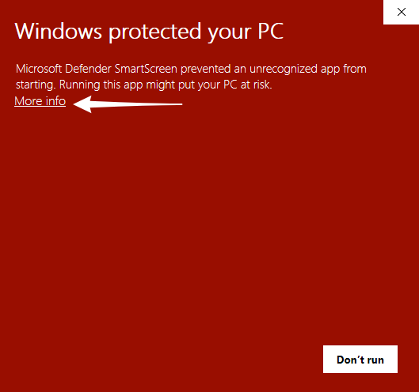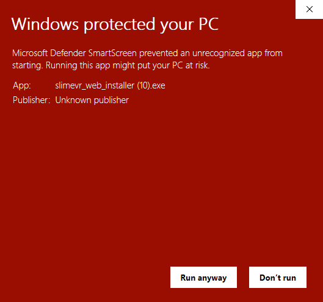

If this doesn't solve your issues, try unblocking the file via right clicking on it, properties, and then ticking the **Unblock** checkbox.

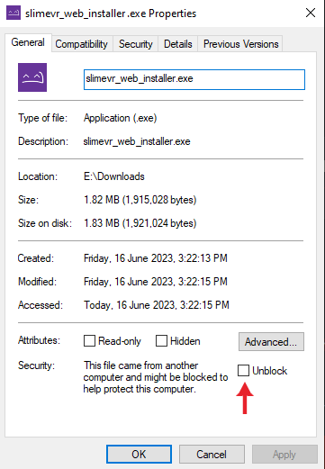

Once you have the installer launched, click **Next >** to move through the process. Be sure not to change the pre-checked install packages for use with SteamVR.

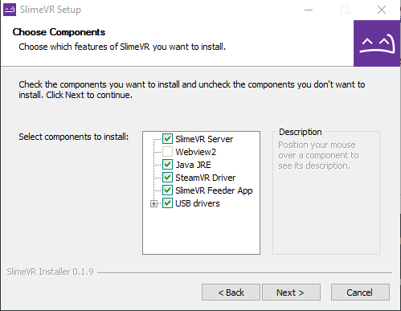

Bear in mind, if you plan on using the server purely for [standalone usage via OSC](server/osc-information.md), and not PC VR via SteamVR, you can de-select **SteamVR Driver**, **SlimeVR Feeder App**, and **USB drivers**. If you don't already have SteamVR installed and have launched it previously, you may encounter an error.

## Connecting and preparing your trackers

1. Open the SlimeVR Server. On this first page you can change the applications language via the button on the bottom right. Once you are ready click **Let's get set up!**

   

1. Input your 2.4GHz Wi-Fi credentials, so that your tracker can connect to Wi-Fi, then click **Submit**.

   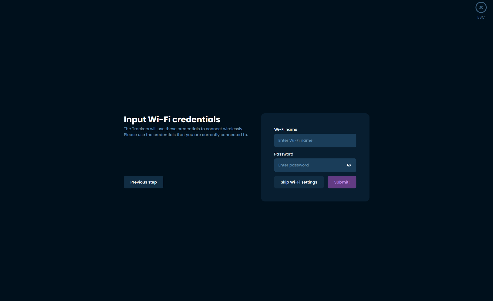

1. Plug your trackers in one at a time and turn them on, you should see the progress bar on the left update to show the Wi-Fi details being sent. Make sure you use the cable included with your trackers, as other cables may not be suited to send data.

	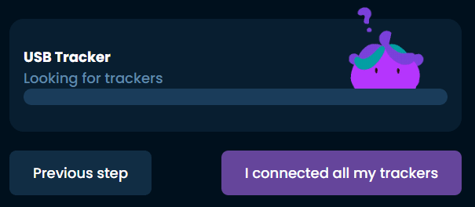

1. Once you have connected all your trackers, you should see them listed with numbers on the right. If you have forgotten which trackers have yet to be plugged in, shaking a connected tracker will highlight it in the list. Click **I connected all my trackers** once you are finished.

   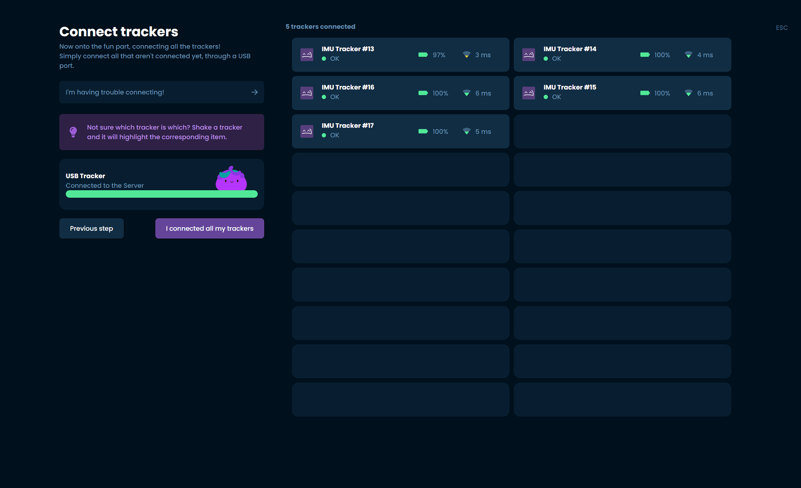

1. Following the directions shown on the page, place your trackers on a flat surface while powered on and click **I placed my trackers on the table** before waiting for the process to complete.

	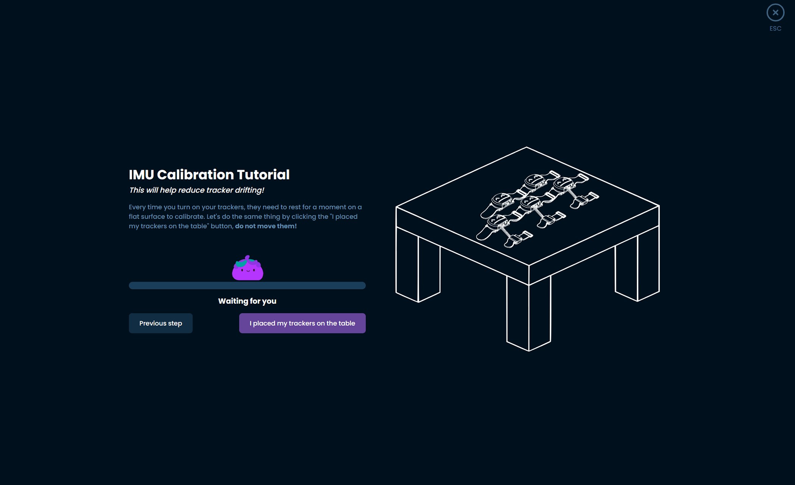

	Please note: You should calibrate your trackers by following this same process every time you switch them on to use them!

1. Once calibration is complete, click **Continue** to continue.

	

1. Following the directions shown on the page, prepare your trackers by attaching straps and decorating them with stickers to help you remember which tracker is set up for each body part. Once all your trackers are prepared, click **I put stickers and straps!** to move forward.

    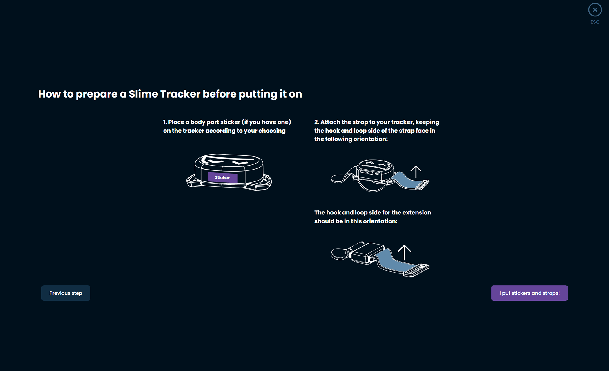

## Choosing and assigning body locations

1. Figure out which body parts you will need to assign. Depending on how many trackers you have these are the suggested locations:

	* Lower-Body Set (5 trackers) - Chest, both thighs, both ankles.
	* Core Set (5 trackers with one extension) - Chest and hip/waist (via the tracker with an extension), both thighs, both ankles.
	* Enhanced Core Set (5 trackers with three extensions) - Chest and hip/waist (via trackers with extension), both thighs, both ankles and feet (via trackers with extensions).
	* Full-Body Set (7 trackers with three extensions) - Both upper arms, chest and hip/waist (via trackers with extension), both thighs, both ankles and feet (via trackers with extensions).

1. Using this list choose the location on SlimeVR's mascot, Nighty, that corresponds with the area you wish to choose a tracker for.

	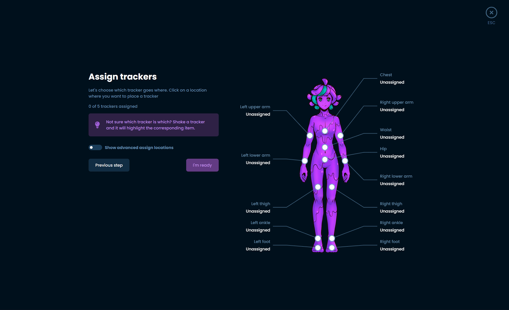

1. While the pop up is open, you can tap the tracker you wish to use for that location twice to automatically assign it. You can also choose the specific tracker in the list you wish to assign if you find that easier.

	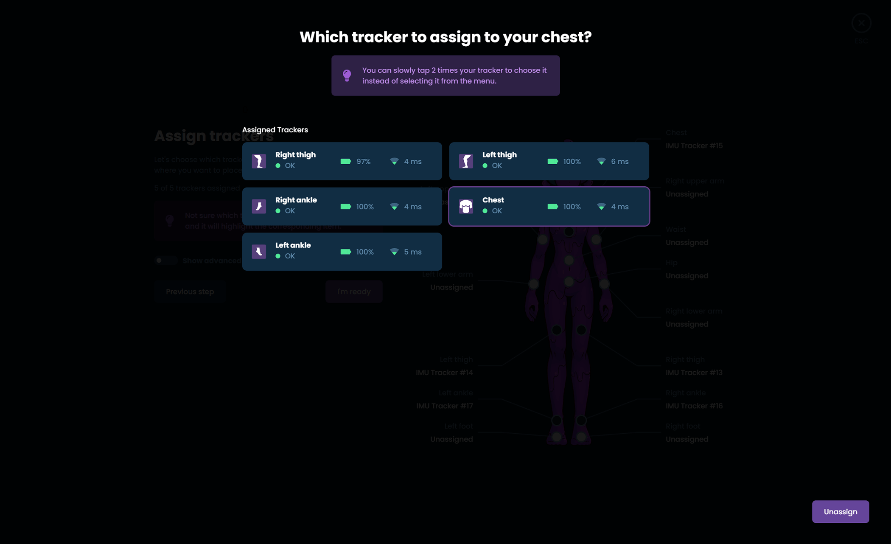

1. Once you have assigned all your trackers, click **I'm ready** to move forward.

1. Take a moment to put all of your trackers on. You can wear them on the front, back or either side of your body at the location marked, taking note of the following suggestions:
	* Heavily muscular areas tend to deform easily and can throw off tracking, try to find a position that minimises this.
	* The diagram of Nighty should give you a rough area for where to wear them, but you can rotate the position around your body. For example, the chest tracker could be more comfortable on the front *or* back depending on clothing and body shapes.
	* Make sure your trackers are at a cardinal direction from you, they must be facing **front**, **back**, **left** or **right**.
	* Make sure your trackers are the right way up, the Slime's face should upright with the flat part of the tracker facing towards the floor.
	* Once you have the tracker on, try moving around and see if they sit still during movement. Some areas (such as ankles) work a lot better on the side of the ankle instead of the front.
	* All bodies are different! Mounting orientations that work for others might not work for you, and you might need to experiment to find the best place for you.

	Once you have your trackers on, hit *I'm ready* to move to the next step.

1. SlimeVR offers an automatic and manual process for determining mounting orientation, automatic calibration can lead to better tracking quality, but improper calibration can make it worse. It requires some time to figure out and check if it's right for you and the way you put on your trackers. We're working on making it better, but we suggest **new users use the manual process**.

	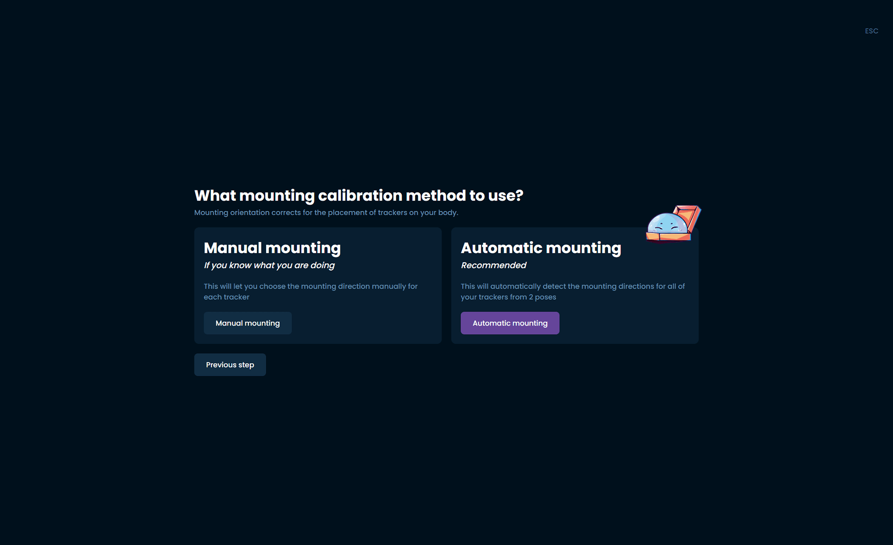

1. Click on one of your trackers to bring up a list of mounting orientations.

	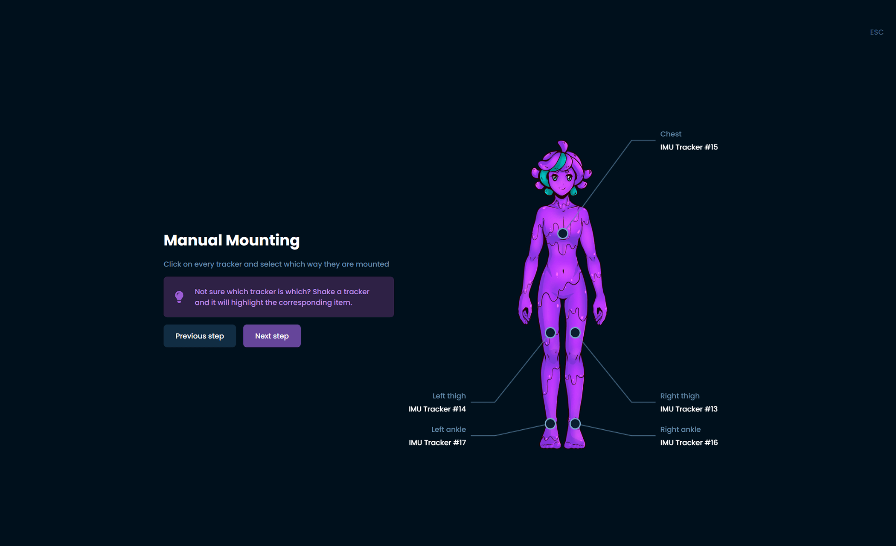

1. Choose the orientation that best represents the mounting orientation of that tracker.

	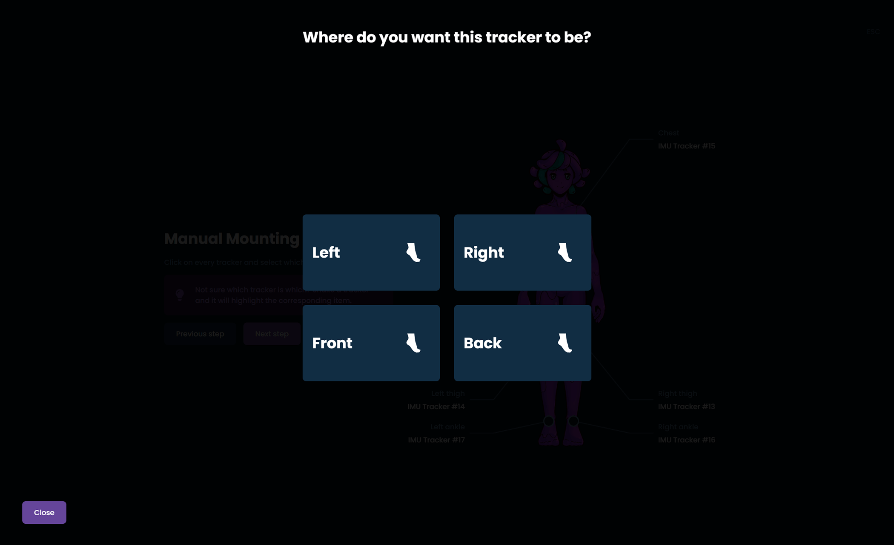

1. Repeat for each of your trackers, when you have completed this process click **Next step**.

### Automatically setting mounting

SlimeVR offers an automated process for recording which mounting orientation you have set up with your trackers, which can lead to issues for new users but for experienced users can give better results. Make sure you boot up SteamVR and put on your headset from this point. If you are using your trackers for only VMC or OSC, please use the previous steps for manually setting mounting orientation.

During the automated process follow the directions and SlimeVR will deduce where the trackers are on your body.

> **Note:** Automatic mounting may not work if you do not have your headset on and SteamVR running. Automatic mounting can lead to better tracking quality, but improper calibration can make it worse. Only choose this option if you are experienced with SlimeVR.

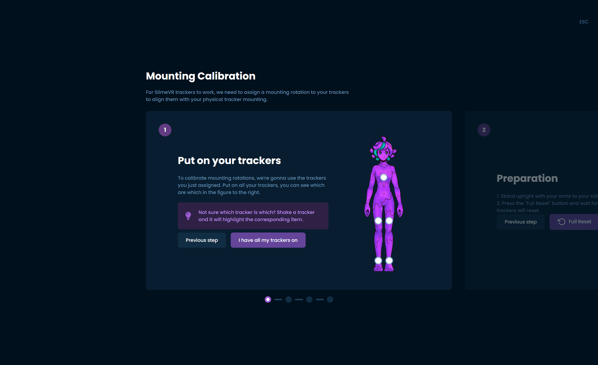

## Reset Tutorial

1. Follow the process to learn about the three different types of resets built into the trackers:

	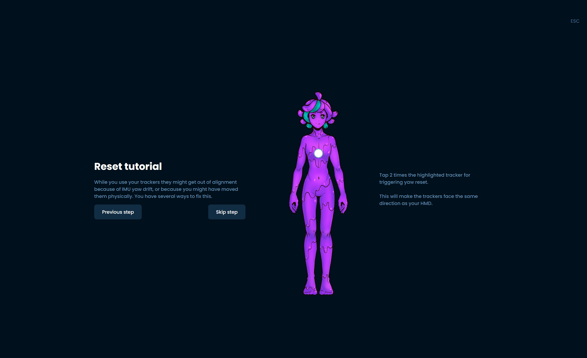

	* **Tapping Chest** - Yaw reset, resets the trackers to assume they are facing their defined mounting orientation.
	* **Tapping Left Thigh** -	Full reset, resets the trackers to the assumption that you are in an I-pose.
	* **Tapping Right Thigh** - Mounting reset, resets the trackers to an estimated mounting orientation. You must be in the ski position as illustrated in the mounting calibration wizard for this to work.

1. To move through this process, follow the steps shown and tap the indicated tracker.

## Configuring Proportions

1. The last configuration is for SlimeVR to figure out what your proportions are! This is a vital step to replicating your movements in virtual space.

	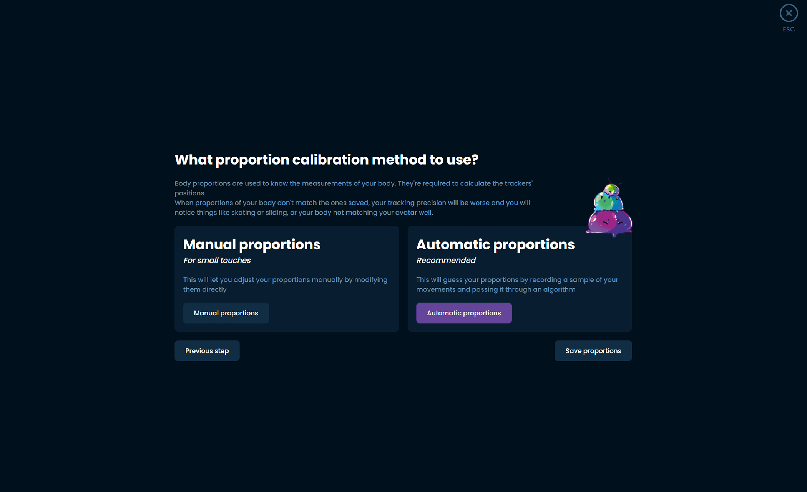

	If you are using SlimeVR with SteamVR, you can automate this process. Make sure that you are wearing your trackers and your headset, and that SteamVR is running. It is very important to have a properly set floor from your headset as well before trying this.

	If you are not using SlimeVR with SteamVR, you will have to [manually set your proportions](#manual-proportions).

1. Follow the prompts in order to have SlimeVR measure your proportions automatically.

	> **Note:** Automatic proportions will not work if you do not have your headset on and SteamVR running. Do not lift or move your feet at all during this process.

   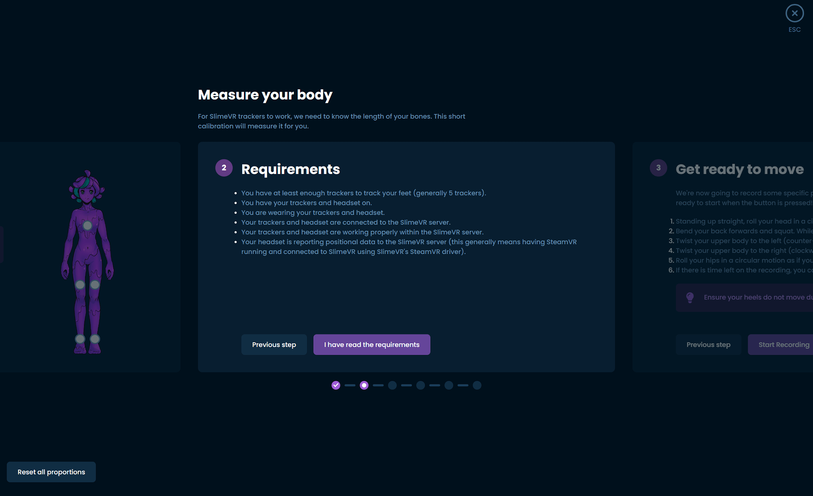

### Manual Proportions

If you are not using SteamVR you will have to manually set each of these values. For more information on how to measure each value please refer to the information at the top of the [body proportions configuration page](server/body-config.html#measurements).

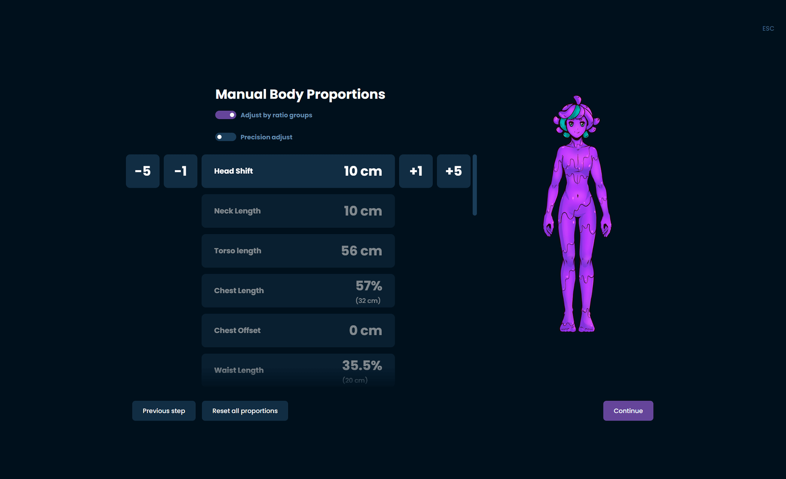

## Final settings

The last step is to go to the settings page and set up the specifics of how you want to use it.

### Spawning trackers

The SlimeVR Server now has automatic assignment for SteamVR trackers, this shows what toggles will activate for each set:

* Lower-Body Set (5 trackers) - Chest, waist, knees and feet.
* Core Set (5 trackers with one extension) - Chest, waist, knees and feet.
* Enhanced Core Set (5 trackers with three extensions) - Chest, waist, knees and feet.
* Full-Body Set (7 trackers with three extensions) - Chest, waist, knees, feet and elbows.

### OSC

If you are primarily using OSC, make sure you first disable all of the trackers for SteamVR before going to OSC on the settings page.

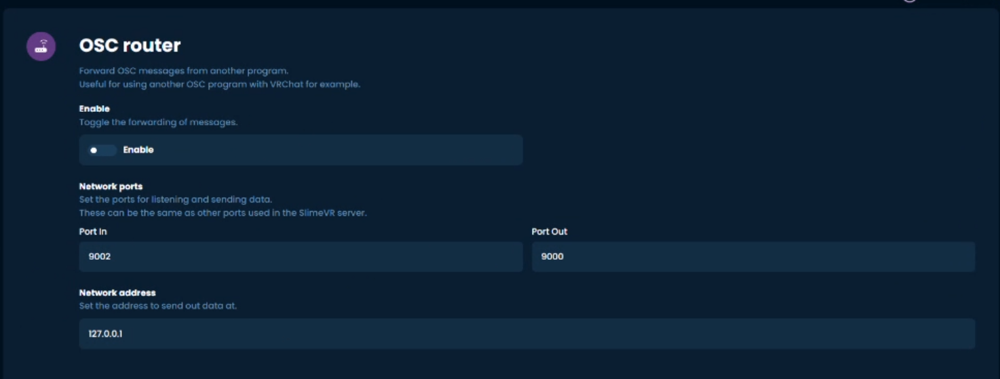

If you wish to change to SteamVR trackers you will have to disable OSC and turn the SteamVR trackers back on first.

For more information on OSC, please visit the [OSC page](server/osc-information.md).

**More info to come on this process soon.**

## Congratulations, your Slime trackers should now be set up!

### Putting them on again after this setup

The next time you want to use your trackers, all you need to do is put them on and go through the Mounting Calibration wizard quickly. All other settings should be saved from your initial setup! Make sure that you have your headset on and SteamVR running before going through this process.

### Having problems?

**My trackers in SteamVR aren't set up properly**

If this is in SteamVR before launching any games, go to Settings > Controllers > Manage Vive Trackers, and manually set up the trackers' positions to match the virtual trackers' names. If this is in game it could be a calibration issue!

**My trackers don't connect to my Wi-Fi**

If you are having issues with your Wi-Fi, you can try an alternative Wi-Fi network or [host a hotspot with your PC](server/alternate-wifi.md).

For all other problems, check the [Common Issues page](common-issues.md)
