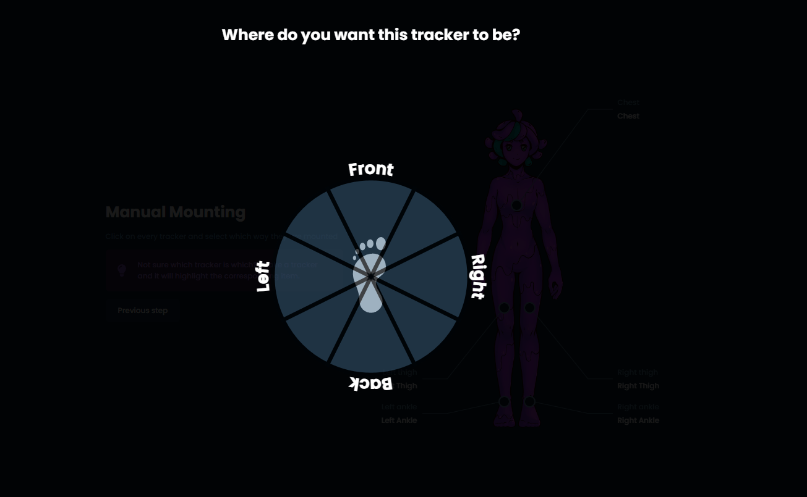
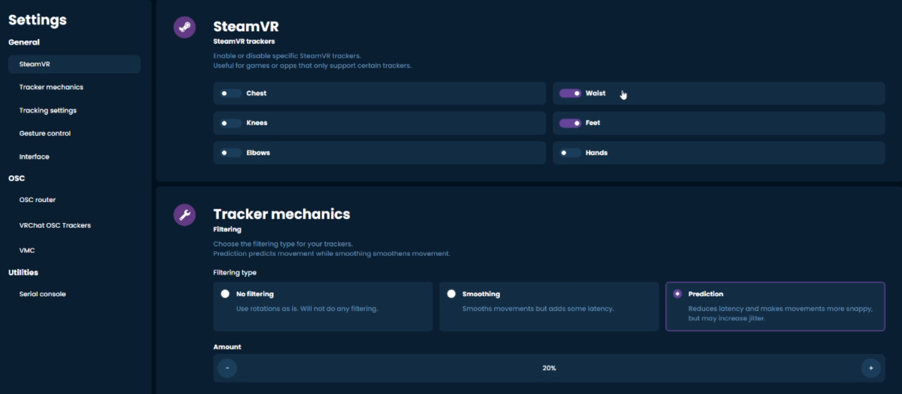

# Quick Setup

This guide provides a quick and simple overview to setting up **prebuilt Slime trackers**. If you are using phones, DIY trackers, joycons, or substituting body locations with anything other than a prebuilt SlimeVR compatible tracker, there are added complications and large parts of this guide may not apply to you.

## Making sure your system is ready
If you intend to use SteamVR with your SlimeVR trackers, make sure SteamVR has been installed and **opened at least once** before moving forward.

## Install the latest SlimeVR Installer
The latest [SlimeVR Installer can be found here.](https://slimevr.dev/download) Download it and follow the installation steps. Keep in mind that this installer can be used to update or repair your SlimeVR server in the future/

If you are on Windows and encounter the following pop up, click on the _**More info**_ text to show the run button. Once it is visible, click **Run anyway** to progress.


If this doesn't solve your issues, try unblocking the file by right clicking on it, then properties, and then ticking the **Unblock** checkbox.


Once the installer is open, click **Next >** to move through the process. Be sure not to change the pre-checked install packages for use with SteamVR.


Bear in mind, if you plan on using SlimeVR purely for [standalone Quest usage](server/osc-information.md), and not PCVR, you may optionally de-select **SteamVR Driver**, **SlimeVR Feeder App**, and **USB drivers**. If you don't already have SteamVR installed and have launched it previously, you may encounter an error.

## Connecting and preparing your trackers

**Video Guide:**
<div class="video-container">
<iframe width="100%" height="auto" src="https://www.youtube.com/embed/SkfdraicN5s" title="YouTube video player" frameborder="0" allow="accelerometer; autoplay muted; clipboard-write; encrypted-media; gyroscope; picture-in-picture" allowfullscreen></iframe>
</div>

**Connecting Your Trackers:**
````admonish note
This part of the guide covers WiFi-based SlimeVR trackers. For receiver-based SlimeVR trackers, simply plug the receiver into the device running the SlimeVR server and proceed to the next section.
````
Be aware that SlimeVR tracker will only connect to 2.4GHz band WiFi networks and your host (pc or phone) need to be connected to the same network.
1. Open the SlimeVR Server. On this first page you can change the applications language via the button on the bottom right. Once you are ready click **Let's get set up!**

   

1. Input your 2.4GHz Wi-Fi credentials, so that your tracker can connect to Wi-Fi, then click **Submit**. If your trackers use a receiver, plug it into your computer, press the **Continue with a dongle** button and proceed past this section to [Assigning Trackers](#assigning-body-locations).

   

1. Plug your trackers in one at a time and turn them on, you should see the progress bar on the left update to show Wi-Fi details being sent to each tracker. Make sure you use the cable included with your trackers, or any cable marked as "data transfer", as other cables may not be suited for connecting your trackers to WiFi.

	

1. Once you have connected all your trackers, you should see them listed with numbers on the right. If you have forgotten which tracker is which, or want to confirm all of your trackers have been connected, shaking a tracker will highlight it on the list. Click **I connected all my trackers** once you are finished to proceed to the next step.

   

1. Following the directions shown on the page, place your trackers on a flat surface while powered on and click **I placed my trackers on the table** before waiting for the process to complete. 

	

```admonish note
	In the future, make sure to leave your trackers on a flat undisturbed surface for 10 to 15 seconds after turning them on. This helps minimize drift.
```

1. Once calibration is complete, click **Continue** to continue. If the **Continue** button does not highlight after 15 seconds, press skip.

	

## Assigning Body Locations

1. Figure out which body parts you will need to assign. For official SlimeVR trackers, these are the suggested locations for each set:

	* Lower-Body Set (5 trackers) - Chest, both thighs, both ankles.
	* Core Set (6 trackers) - Chest, hip, both thighs, both ankles.
	* Enhanced Core Set (6 trackers with two extensions) - Chest, hip, both thighs, both ankles and feet (via trackers with extensions).
	* Full-Body Set (8 trackers with two extensions) - Both upper arms, chest, hip, both thighs, both ankles and feet (via trackers with extensions).

```admonish note
A full tracker may be used instead of an extension if extensions are not available.
```

1. Following this list, click the location on SlimeVR's mascot—Nighty—that corresponds with each chosen mounting location on your body.

	

1. While the pop-up is open, choose the tracker in the list to assign it to each location. You may also tap the tracker you wish to use for that location twice to automatically assign it.

	

1. Once you have assigned all your trackers, click **Continue** to proceed

1. Take a moment to put all of your trackers on. You can wear them on the front, back or either side of your body at the location marked, taking note of the following suggestions:
	* Heavily muscular areas tend to deform easily and may throw off tracking, try to find a position that minimises this.
	* The diagram of Nighty should give you a rough area for where to wear them, but you can rotate the position around your body. For example, the chest tracker could be more comfortable on the front *or* back depending on clothing and body shapes.
	* Make sure your trackers are at a cardinal direction from you, they must be facing **front**, **back**, **left** or **right**.
	* Make sure your trackers are the right way up, the Slime's face should upright with the flat part of the tracker facing towards the floor.
	* Once you have the tracker on, try moving around and see if they sit still during movement. Some areas (such as ankles) work a lot better on the side of the ankle instead of the front.
	* All bodies are different! Mounting orientations that work for others might not work for you, and you might need to experiment to find the best place for you.

	Once you have your trackers on, hit *I'm ready* to move to the next step.

1. SlimeVR offers an automatic and manual process for determining mounting orientation—automatic calibration will lead to better tracking quality, though improper calibration may make it worse. It may require some time to figure out and depends on the way you put on your trackers. Automatic mounting is recommended for both new and experienced users—keep in mind that while manual mounting may be easier for new users to set up, it will besignificantly less accurate than automatic mounting.

	

### Automatic Mounting


SlimeVR offers an automated process for recording mounting orientation based on a set of poses. For best results, ensure that you boot up SteamVR and put on your headset from this point onwards. For VMC based tracking, make sure that you have both head and feet trackers assigned in SlimeVR.

Simply follow the directions and SlimeVR will automatically find the mounting orientations for each tracker.

```admonish note
 Automatic mounting may not work correctly if you do not have your headset on and SteamVR running.
```

### Manual Mounting
1. Click on one of your trackers to bring up a list of mounting orientations.

	

1. Choose the orientation that best represents the mounting orientation of that tracker.

	

1. Repeat for each of your trackers, when you have completed this process click **Next step**.

## Configuring Proportions

1. The last configuration is for SlimeVR to figure out what your proportions are! This is a vital step to replicating your movements in virtual space.

	

	If you are using SlimeVR with SteamVR, you can automate this process. Make sure that you are wearing your trackers and your headset, and that SteamVR is running. It is very important to have a properly set floor from your headset as well before trying this.

	If you are not using SlimeVR with SteamVR, you will have to [manually set your proportions](#manual-proportions).

1. Follow the prompts in order to have SlimeVR measure your proportions automatically.

	> **Note:** Automatic proportions will not work if you do not have your headset on and SteamVR running. Do not lift or move your feet at all during this process.

   

### Manual Proportions

If you are not using SteamVR you will have to manually set each of these values or use VRChat OSC Query to enable the use of automatic proportions. For more information on how to measure each value please refer to the information at the top of the [body proportions configuration page](server/body-config.html#measurements).


For more information on how to set up VRChat OSC Query please refer to the [mobile installation]

## Final settings

The last step is to go to the settings page and set up the specifics of how you want to use it.

### Spawning trackers

The SlimeVR Server now has automatic assignment of SteamVR trackers, this shows what will activate for each set with that toggle on:

* Lower-Body Set (5 trackers) - Chest, waist, knees and feet.
* Core Set (5 trackers with one extension) - Chest, waist, knees and feet.
* Enhanced Core Set (5 trackers with three extensions) - Chest, waist, knees and feet.
* Full-Body Set (7 trackers with three extensions) - Chest, waist, knees, feet and elbows.



## Enabling trackers on SteamVR

1. Make sure you installed SlimeVR with the installer to have the right SteamVR driver.
1. Make sure the SlimeVR addon is enabled in SteamVR Settings > Startup/Shutdown > Manage Add-ons.
1. Make sure you have SteamVR Trackers enabled in the SlimeVR settings.

### OSC

If you decide to use OSC Trackers with the Steam version of VRChat, make sure you first disable all of the SteamVR trackers before going to the OSC settings.


From here you will need to make sure that the network address is set correctly. This will depend on what device you are running VRChat or another program with OSC compatibility on. If you are using this all on the same device, the default `127.0.0.1` should be fine, but if you are using a different device (for example, connecting your trackers to standalone quest), you will need to find the IP address of that device.

Then, you can toggle on which locations that you need using the following suggestions: 

* Lower-Body Set (5 trackers) - Waist, knees and feet.
* Core Set (5 trackers with 1 extension) - Chest, waist, knees and feet.
* Enhanced Core Set (5 trackers with 3 extensions) - Chest, waist, knees and feet.
* Full-Body Set (7 trackers with 3 extensions) - Chest, waist, knees, feet and elbows.

If you wish to change to SteamVR trackers, you will have to disable OSC and turn the SteamVR trackers back on first.

For more information on OSC, please visit the [OSC page](server/osc-information.md).

## Congratulations, your Slime trackers should now be set up!


### Putting them on again after this setup

The next time you want to use your trackers, all you need to do is put them on and go through the Mounting Calibration wizard quickly. All other settings should be saved from your initial setup! Make sure that you have your headset on and SteamVR running before going through this process.


### Having problems?

**My trackers in SteamVR aren't set up properly**

If this is in SteamVR before launching any games, open SlimeVR Settings > SteamVR > Tracker Assignment and ensure that all trackers in use have been assigned. Note that foot and ankle trackers are merged into one tracker in SteamVR. If this is in game it could be a calibration issue!

**My trackers don't connect to my Wi-Fi**

If you are having issues with your Wi-Fi, you can try an alternative Wi-Fi network or [host a hotspot with your PC](server/alternate-wifi.md).

For all other problems, check the [Common Issues page](common-issues.md)
