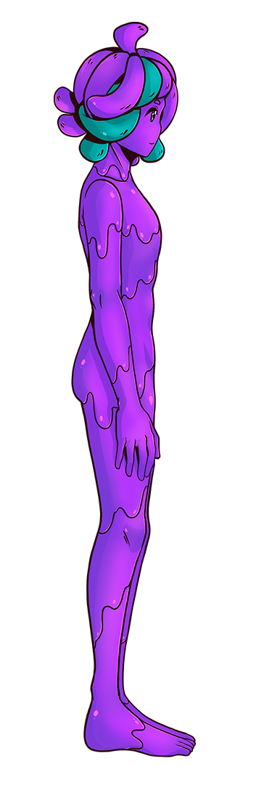

# Body Proportions Configuration

SlimeVR uses a virtual skeleton to compute positions from the data it receives from your trackers. As part of the setup procedure, this skeleton is made using your real-world measurements (in cm) for various body parts in order for SlimeVR to compute its skeleton accurately to your real body.
While these values can be input directly into the SlimeVR server, it is recommended you use the AutoBone system. Once you have completed the auto-configuration process, it is also recommended to use the measurements above to confirm the accuracy before finalising the automatic values. There is also an option to [visually check within VR](#configuring-body-proportions-manually), described at the bottom of this page.

## Measurements

<table class="bpTable">
   <tr>
      <td>
         
      </td>
      <td>
         <details>
            <summary id="ho">Head Shift</summary>
            The head shift value is from your headset to about the middle of your head.
         </details>
         <details>
            <summary id="nl">Neck Length</summary>
            The neck length value is the distance from about the middle of your head to your shoulders.
         </details>
         <details>
            <summary id="chest">Upper Chest Length (est. 12-20) + Chest length (est. 12-20)</summary>
            The Chest Length is roughly the distance from the end of your neck to the end of your chest.
            When using a single chest tracker, only the sum of the two values is important.
            When using two chest trackers, the SteamVR tracker will still be calculated from a single chest tracker, but the rest of the spine will use both.
         </details>
         <details>
            <summary id="waist">Waist Length (est. 20-35)</summary>
            The Waist Length is the distance from your chest to your hips minus whatever you set for Hip Length. For example, if your chest to hip distance is 30 and your Hip Length is 5 your Waist Length would be 25.
         </details>
         <details>
            <summary id="hip">Hip Length (est. 2-6)</summary>
            This length is used for calculating hip movement, experiment with it but it should be between 2 and 6.
         </details>
         <details open="">
            <summary id="hw">Hips width</summary>
            The hips width value is the distance between your femurs.
         </details>
         <details>
            <summary id="ul">Upper Leg Length (est. 35-60)</summary>
            The Upper Leg Length is from your hip to your knee.
         </details>
         <details>
            <summary id="ll">Lower Leg Length (est. 45-65)</summary>
            The Lower Leg Length is from the knee to your ankle.
         </details>
         <details>
            <summary id="foot">Foot Length</summary>
            The foot length value is the length of your foot, from your ankle to your toes.
         </details>
         <details>
            <summary id="offsets">Hip offset / Chest offset / Foot shift</summary>
            These values offset your real trackers from virtual ones, if your avatar has non-human or unusual proportions. A good example of this would be changing your foot shift for an avatar with digitigrade legs that may have the foot further out or back, or to facilitate calibration depending on the viewpoint of the avatar.<br>
            This also may be used to compensate for a game's particular expectation for trackers, Increasing the value moves the offset Down(Chest, Hip) or Forward(Foot)
         </details>
         <details>
            <summary id="skelloffsets">Skeleton offset</summary>
            The Skeleton offset value offsets all your trackers from their physical position forward (with a positive value) or backwards (with a negative value). This can be left untouched unless you need it.
         </details>
      </td>
   </tr>
</table>

## AutoBone / Automatic body proportions calibration

AutoBone (also known as "automatic body proportions calibration") removes the need to manually input bone lengths using automatic bone length calculations recorded through user movements. AutoBone is available as "Automatic calibration" under the "Body Proportions" tab of the GUI.

This bypasses the need to manually set the bone lengths, although it is still possible to fine-tune values manually if needed.

### How to Use

```admonish warning
- Make sure the headset is ON and worn on your head during this process.
- If you use an standalone headset, remember to enable the Guardian/Boundary as SlimeVR can't get your height correctly otherwise.
- During the recording, you **must** keep your heels in the same position, otherwise the resulting values will be invalid.
```

#### Text guide

To use AutoBone, follow these steps:

1. Before following any of the instructions below, ensure that:
   - You have at least enough trackers to track your feet (generally 5 trackers).
   - You have your trackers and headset on and are wearing them.
   - Your trackers and headset are connected to the SlimeVR server and are working properly (ex. no stuttering, disconnecting, etc).
   - Your headset is reporting positional data to the SlimeVR server (this generally means having SteamVR running and connected to SlimeVR using SlimeVR's SteamVR driver).
   - Your trackers and headset are tracking properly within the SlimeVR server (ex. mounting is set correctly and you have performed a full reset, legs move the right direction when kicking, bending over, sitting, etc).
2. Optionally reset proportions to set a baseline (this is covered by the height step in the GUI since v0.9.0):
   1. Navigate to the "Body Proportions" tab and ensure you're on "Automatic calibration" and not "Manual calibration".
   2. Stand up straight and press the **"Reset all proportions"** button.
3. Follow the steps shown on the GUI.
4. Make sure to keep your heels on the ground and in the same position for the duration of the recording.
5. Press the **"Start Recording"** button, the GUI will indicate that the recording has started. The recording will last for approximately 30 seconds.
6. **Move** until the text on the button changes back to "Start Recording", the current best-known movements for calibration are as follows, returning to standing up straight after each step:
   1. Standing up straight, roll your head in a circle.
   2. Bend your back forwards and squat. While squatting, look to your left, then to your right.
   3. Twist your upper body to the left (counter-clockwise), then reach down towards the ground.
   4. Twist your upper body to the right (clockwise), then reach down towards the ground.
   5. Roll your hips in a circular motion as if you're using a hula hoop.
   6. If there is time left on the recording, you can repeat these steps until it's finished.
7. When the recording is done, SlimeVR will process the recording. After processing is done, you will be able to see new values for your body proportions reported in cm.
8. To use the calculated values, press the **"They're correct"** button. If the values do not look right, you can try recording again using the "Redo recording" button - the recording will start immediately, so make sure you're ready.

#### Visual reference for movement calibration steps

<div class="embeddedVideo">
   <video name="AutoBone Visual Reference" autoplay muted playsinline loop controls>
      <source src="../assets/videos/AutoBone_Visual_Reference.webm" type="video/webm">
      <source src="../assets/videos/AutoBone_Visual_Reference.mov" type="video/quicktime">
   </video><br>
   Video example recorded by ZRock35.
</div>


### Common Issues / Debugging

If you are having issues with AutoBone:

- Make sure you kept your heels in the same position while recording, don't lift your legs or walk around.
- Make sure your headset isn't lagging, freezing, or teleporting (use the desktop view in SteamVR to start recording rather than Virtual Desktop).
- Double-check that your trackers are mounted correctly and functioning properly.
- Make sure the height in the "Check your height" step of AutoBone is accurate to your own height. It is expected that the HMD height is lower than your real height as it should be around the height of your eyes. The "actual height" reported does not matter and will not affect the process.

If none of these help, you can ask for help in the [#support-forum](https://discord.com/channels/817184208525983775/1025104406393405491) or [#technical-support](https://discord.com/channels/817184208525983775/878727840118505533) channels in the [SlimeVR Discord](https://discord.gg/SlimeVR).

To help with debugging in the SlimeVR Discord, you can send a recording while asking for help. A recording includes a recording of all your tracker information to help recreate your setup and will include any movements you do, but no personally identifying information. If you are comfortable with sharing your tracker data, you can find your recordings at "`%AppData%\dev.slimevr.SlimeVR\AutoBone Recordings`". The most recent recording is auto-saved as "`LastABRecording.pfr`" and any manually saved recordings will be "`ABRecording1.pfr`", "`ABRecording2.pfr`", etc., with the highest number being the most recent.

For more information on how AutoBone functions, check [how AutoBone works](#how-autobone-works).

## Configuring Body Proportions Manually

All this configuration can be done from the SteamVR dashboard or within VRChat (in front of a mirror). Press the `+` or `-` buttons to change lengths, all lengths are in centimeters. Pressing **Reset all proportions** will change the value to a default based on the HMDs current height.

Make sure you have [proper mounting](putting-on-trackers.md) before doing this as it will influence your results.

You can use a mirror in VRChat to see your trackers' positions. However, compare SteamVR tracker position to IRL joint's position, not your VRChat avatar's joints positions.

Alternatively, you can use the [SlimeVR Overlay](https://github.com/SlimeVR/SlimeVR-Rust#installation) in SteamVR to visualize your bones.

Make sure to adjust the values from the top-down.

##### Head Shift (8-12)

Shake your head left to right as if you’re disagreeing. Adjust your head offset until any movement is negligible. All trackers should stay in place.

##### Neck Length (8-14)

Move your head up and down as if you’re nodding OR tilt your head to the left and right like a cute, confused, dog. Adjust your neck length until any movement is negligible. All trackers should stay in place.

##### Upper Chest Length (12-20) + Chest length (12-20)

Modify value until your SteamVR chest tracker is about at the middle of your spine.

- If you only have a single chest tracker, which of the 2 values you change does not matter, only the sum of them.
- If you have two chest trackers, adjust their ratios after adjusting Hip and Waist Lengths so that your spine is the most stable when moving your chest

##### Hip Length (2-6)

At first set this between 2 and 6, it may require experimentation and changes based on movement observed once all other values are set. If you increase this value you must decrease the Waist Length value an equal amount.

##### Waist Length (20-35)

Modify value until your SteamVR waist/hip tracker lines up with your hip bones (you can use your controller to line up your IRL hip and tracker).

##### Upper Leg Length (35-65)

Modify until your SteamVR knee trackers are at your knee joints.

##### Lower Leg Length (45-60)

Modify until your SteamVR feet trackers are at the level of your ankles.

##### Feet (when using feet extensions)

Set “foot length” at 0, change “foot offset” (default -5) until feet trackers are inside your avatar’s ankles during T-Pose calibration, or at the same level horizontally, and set “foot length” back to 5.

##### Hips width (26-32)

Default value is good. Can try to tweak to make your leg trackers line up when resetting, but do not increase this value with the goal of preventing leg crossing.

##### Hip Offset and Chest Offset

Keep at 0 unless you have a particular problem with your avatar or application/game.

##### Skeleton Offset (0)

Keep at 0 unless you have a particular problem with your avatar.

##### Shoulders distance (4-10) and Shoulders width (30-42)

Set Upper arm length to 0 and adjust the values until the elbow trackers are on your shoulders.

##### Upper/Lower arm distance (20-35)

Adjust so that the SteamVR tracker is on your elbow.

##### Controller Distance Z (10-20) and Controller Distance Y (2-8)

Rotate wrist and adjust until elbow tracker has the least amount of sliding.

##### Elbow offset (0)

Keep at 0 unless you have arm tracking problems using lower + upper arm tracking from controller or an elbow tracker binding to your chest.

## How AutoBone works

AutoBone works by recording movement data and simulating that movement rapidly while gradually adjusting the bone lengths. When adjusting bone lengths, the algorithm measures the amount the feet slide to know whether it's achieving a better or worse outcome with each adjustment. By iterating over the data multiple times, the algorithm is able to obtain reasonable bone length values with minimal foot sliding.

The AutoBone algorithm uses [hyperparameter optimization][1] to estimate bone length values. First, a defined number of samples of movement data are recorded, then using [hyperparameter optimization][1], the algorithm gradually adjusts the bone lengths to minimize the error of foot sliding. Error is calculated through multiple different methods, but generally it is formulated to retain the headset's reported height, "average" human body proportionality, and reduce the amount that the feet slide during movement.

Almost all of the algorithm's internal values are exposed through the config file. Read the following [Configuration documentation](#configuration-documentation) section to learn more.

### Configuration Documentation

All configuration options should be placed in the `vrconfig.yml` file and are sub-configs to `autoBone`, for example:

```yaml
autoBone:
  numEpochs: 100
  initialAdjustRate: 10.0
  adjustRateDecay: 1.0
```

| Config Option                 |  Value Type  | Default Value | Description |
| :---------------------------- | :----------: | :-----------: | :---------- |
| `cursorIncrement`             | Integer      | `2`           | The number of samples to increment the cursor by each step |
| `minDataDistance`             | Integer      | `1`           | The minimum distance between samples to be used while adjusting |
| `maxDataDistance`             | Integer      | `1`           | The maximum distance between samples to be used while adjusting |
| `numEpochs`                   | Integer      | `100`         | The number of epochs (full loops) to iterate over the data |
| `printEveryNumEpochs`         | Integer      | `25`          | The number of epochs before the progress is logged |
| `initialAdjustRate`           | Float        | `10.0`        | The factor to adjust the values by each iteration |
| `adjustRateDecay`             | Float        | `1.0`         | The factor to decay the adjust rate by each epoch |
| `slideErrorFactor`            | Float        | `0.0`         | The factor of which the foot slide error is used in the error calculation |
| `offsetSlideErrorFactor`      | Float        | `2.0`         | The factor of which the foot offset error is used in the error calculation (captures sliding) |
| `footHeightOffsetErrorFactor` | Float        | `0.0`         | The factor of which the foot height (y axis) offset error is used in the error calculation |
| `bodyProportionErrorFactor`   | Float        | `0.825`       | The factor of which the body proportion error is used in the error calculation (based on human averages) |
| `heightErrorFactor`           | Float        | `0.0`         | The factor of which the body height error is used in the error calculation |
| `positionErrorFactor`         | Float        | `0.0`         | The factor of which the absolute position error is used in the error calculation |
| `positionOffsetErrorFactor`   | Float        | `0.0`         | The factor of which the absolute position offset error is used in the error calculation |
| `calcInitError`               | Boolean      | `false`       | When true, the initial error over the data is reported as epoch 0 |
| `targetHmdHeight`             | Float        | `-1.0`        | The head/eye height in meters to use in calculations, this is calculated automatically when negative (set by GUI since v0.9.0) |
| `targetFullHeight`            | Float        | `-1.0`        | The full/total height in meters to use in calculations, this is calculated automatically when negative (set by GUI since v0.9.0) |
| `randomizeFrameOrder`         | Boolean      | `true`        | When true, the frame order will be shuffled for each epoch |
| `scaleEachStep`               | Boolean      | `true`        | When true, the proportions will be scaled to the target height at the end of each epoch |
| `sampleCount`                 | Integer      | `1500`        | The number of pose samples to record |
| `sampleRateMs`                | Long Integer | `20`          | The millisecond interval between each sample to record |
| `saveRecordings`              | Boolean      | `false`       | When true, recordings will automatically be saved |
| `useSkeletonHeight`           | Boolean      | `false`       | When true, the automatic height will be calculated from the current body proportions rather than from the recording |
| `randSeed`                    | Long Integer | `4`           | The seed to use for randomization to make it predictable between runs |

[1]: https://wikipedia.org/wiki/Hyperparameter_optimization "Wikipedia - In machine learning, hyperparameter optimization or tuning is the problem of choosing a set of optimal hyperparameters for a learning algorithm."

*Created by butterscotch.v, eiren and calliepepper, edited and styled by calliepepper, erimel, emojikage, butterscotch.v, and spazzwan.*

<script src="../assets/js/bp.js"></script>
