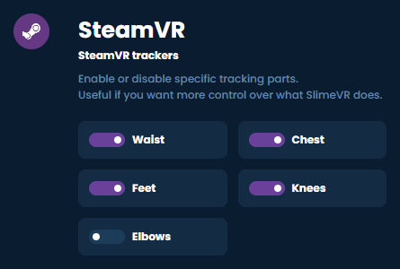

# Configuring Your Trackers

## Configuring How Many Virtual Trackers You Need

Before launching SteamVR, check the checkboxes relative to how many SteamVR virtual trackers you wish to spawn.

Please note that this only affects the virtual trackers in Steam and not your SlimeVR trackers. If you only have Waist and Feet enabled, they will still be accessing up to an 8 IMU setup (waist, chest, upper legs, lower legs and feet). At the moment, VRChat supports 11 virtual trackers, including headset and controllers.

### SteamVR Trackers to Enable Depending on Your Set

- 5+0: waist and feet.
- 5+1: *chest*, waist and feet.
- 5+3: *chest*, waist, *knees*, feet.
- 7+3: *chest*, waist, *knees*, feet, *elbows*

*Trackers marked in italic should only be enabled if your game or application supports it (VRChat does).*

One peculiarity to note is that SlimeVR lower leg and feet trackers will combine into a single SteamVR tracker. Similarly, hip and waist trackers will also combine into a single SteamVR tracker.

Do not enable trackers you do not need as this could lead to in-game calibration issues.

Launch SteamVR when you're ready.

### Access the SlimeVR Server in VR

There are several ways you can view and interact with the SlimeVR GUI while in VR. These include using the Steam dashboard (free), [Desktop+](https://store.steampowered.com/app/1494460/Desktop/) (free) [OVR Toolkit](https://store.steampowered.com/app/1068820/OVR_Toolkit/) (paid) or [XSOverlay](https://store.steampowered.com/app/1173510/XSOverlay/) (paid).

### Reset Trackers

When getting in VR, your trackers will be floating all over the place and won't be following your body. To fix this, you need to perform a tracker reset.

To Perform a tracker reset:

1. Stand straight, legs vertical (not together), trackers facing their designated direction.
1. Press the **RESET** button in the SlimeVR Server.
1. Look forward and maintain your pose until the countdown finishes.
1. After the timer ends you should see that the trackers point in the right direction and are under you.

Look down. After resetting, the trackers should be directly under you and follow your movement; however as you haven't configured the body proportions yet, they may not be positioned accurately compared to your real body.

See [setting a reset keybind](setting-reset-bindings.md) for a quick and easy way to reset your trackers while in VR.

*Created by eiren, edited by adigyran, calliepepper, smeltie, erimel, emojikage and nwbx01, styled by calliepepper.*
