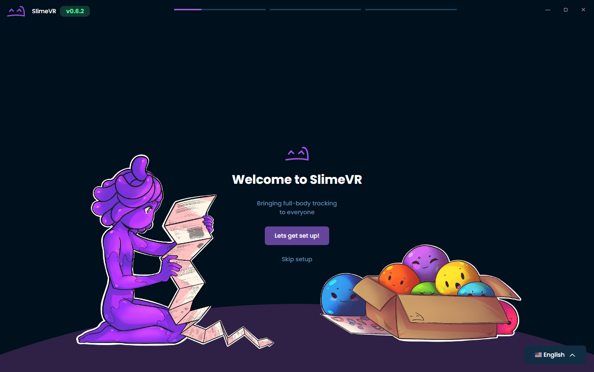
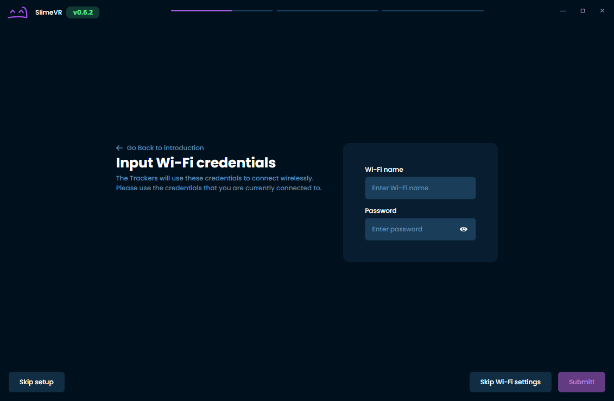
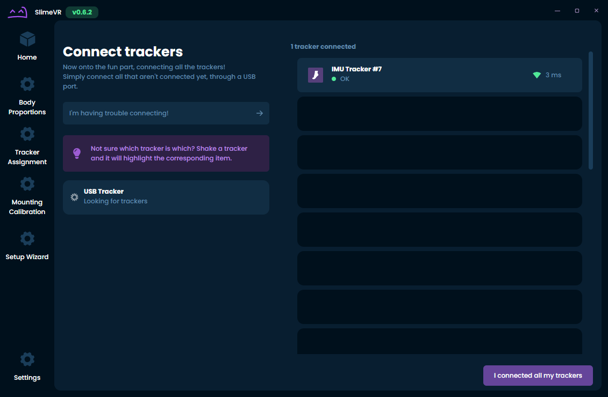
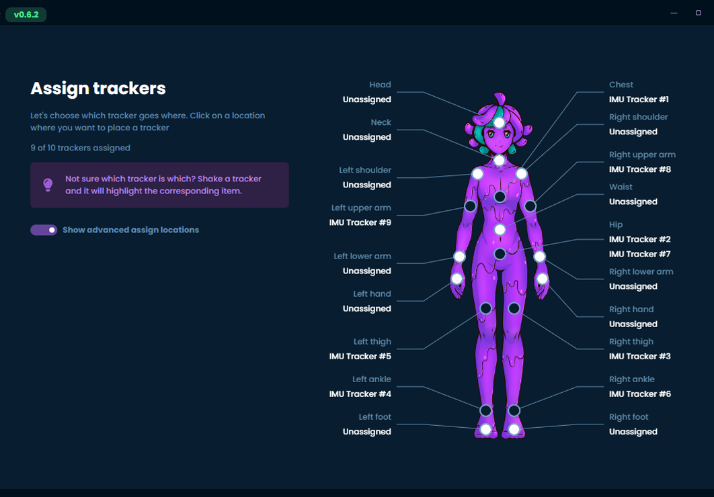
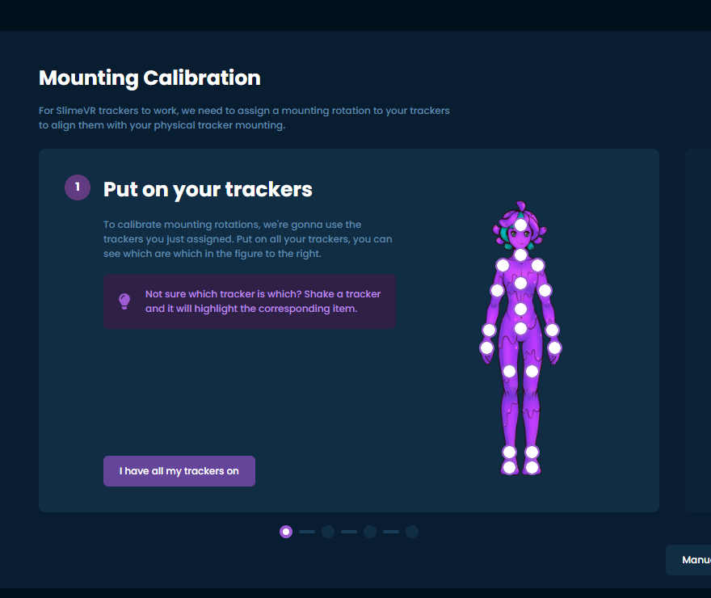
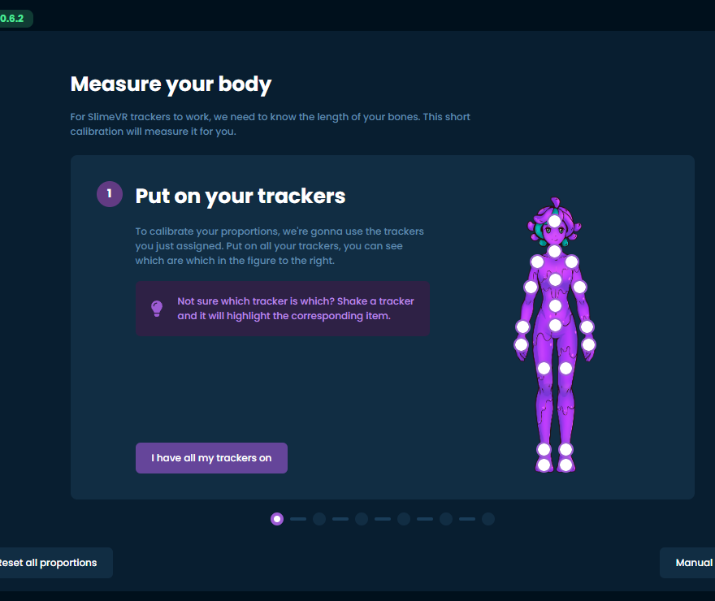

# Connecting your Trackers
{:.no_toc}

This guide should help you set up SlimeVR trackers and software.

## Connecting trackers

> **Note:** If you are using DIY trackers with hardcoded the WiFi credentials or phones with owoTrack, you can skip to assigning your trackers. However, if you hardcoded the WiFi credentials and are having trouble connecting these steps may still be helpful for diagnosing the issue.

1. Open the SlimeVR Server and click **Setup Wizard**.

   

1. Input your WiFi credentials, so that your tracker can connect to WiFi, then click **Submit**.

   

1. Plug in a tracker one at a time. You should then see your tracker appear after a little while. Click **I connected all my trackers** once you're done.

   

1. Hover over and click on the unassigned tracking points that you want to use. Shaking your tracker will highlight it. Click **I Assigned all the trackers** once you're done.

   

1. Congratulations! You connected all of your trackers, but there's still more left to do. Click **I'm ready** once you have your trackers on.

   

1. This next part is for making sure that your trackers will move in the right direction. Simply follow the instructions shown and the click **Next step** once your mounting rotations have been calibrated. More information on mounting can be found on the [Putting on your trackers page](putting-on-trackers.md).

   

1. At this time, the reset tutorial isn't ready, but you can check [the page on reset bindings](setting-reset-bindings.md) for more information in the meantime. Simply click **Continue**.

   

1. You'll want to be in VR for this final step. This involves wiggling around with your feet planted so that your body proportions can be determined. Simply follow the instructions shown. Be sure to verify your results and that nothing is obviously incorrect like having a neck length of 100 cm! Click **Continue** once you're done.

   

1. You're done! If you've made it through all that, you should be ready to start using SlimeVR!

   

### Troubleshooting

If all trackers don't show up, this can be caused by Windows Firewall blocking the connection. To fix this, go to SlimeVR Server folder and run `firewall.bat` as administrator. There are additional steps that can be taken on the [common issues page](../common-issues.md#the-trackers-are-connected-to-my-wifi-but-dont-turn-up-on-slimevr) if this does not work.

For additional information on trackers, you may want to enable **Developer mode**. The setting for this can be found under **Settings**, **General**, and then **Interface**.

If some trackers don't show up, try turning them off and on again. You can rotate tracker around and see it change rotation in the server to figure out which tracker is which.

If some trackers don't change their rotation as you move them (including extensions), or display 0 0 0 rotation, try turning them off and on again, usually it should fix the issue.

If any tracker displays ERROR as it's status, or have orange and blue light permanently on, that's not good. Try restarting them and see if it helps. If not, contact Eiren.

***Next step - [Configuring the trackers](configuring-trackers.md)***

*Created by Eiren, edited by adigyran#1121, CalliePepper#0666, Emojikage#3095 and NWB#5135, styled by CalliePepper#0666.*