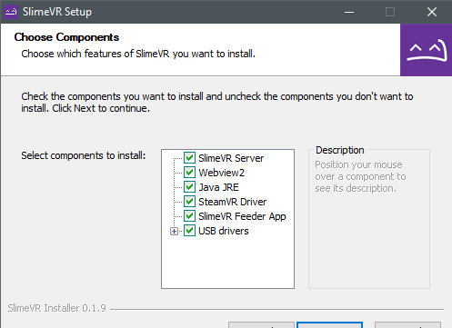
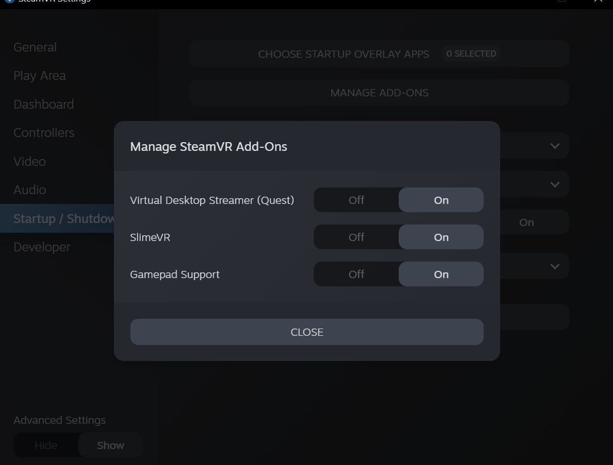
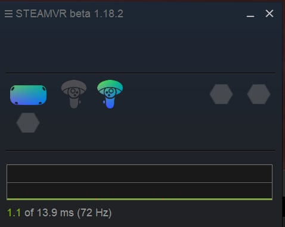
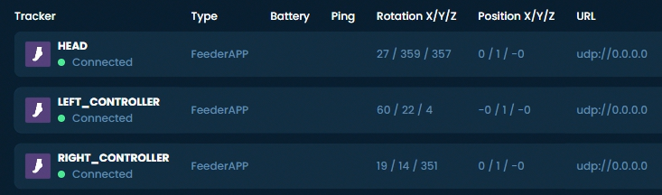

# Initial Setup

This guide should help you with installing the SlimeVR Server and getting things set up so that everything is functioning as it should.

## Install the Latest SlimeVR Installer
The latest [SlimeVR Installer can be found here.](https://slimevr.dev/download) Download it and install it, this installer can be used to update the server software in the future.

Bear in mind, if you plan on using the server purely for [standalone usage via OSC](osc-information.md), and not PC VR via SteamVR, you can de-select **SteamVR Driver**, **SlimeVR Feeder App**, and **USB drivers**. If you don't already have SteamVR installed and have launched it previously, you may encounter an error.

## Test Your Trackers
Turn each tracker on and see if they work.

Each tracker should blink an LED briefly on startup, and then blink every few seconds to indicate its status as follows:

| Number of blinks | Status                                             |
| :--------------: |:-------------------------------------------------: |
| 1                | Tracker is ready                                   |
| 2                | Connecting to SlimeVR server                       |
| 3                | Connecting to wifi                                 |
| 5                | IMU error                                          |

If a tracker doesn't start up, try charging it. Connect the tracker via USB port to your PC or any USB charger. A red LED light should light up to indicate that it's charging. A green LED or blue LED light means it's fully charged (LED might be a different colour depending on your charging board). Try turning the tracker on during charging to see if it works.

**Please note that as a rule, DIY trackers should be kept off while charging outside of this specific case.**

## IMU Calibration

Depending on what IMU you are using, you will need to calibrate them in different ways. To find out how to calibrate your IMU, go to the [IMU Calibration page](imu-calibration.md).

## Check that the Driver Loads and Connects

1. Start SteamVR, go to **Settings** > **Manage Add-Ons**. Check if SlimeVR exists here, set it to **On**.

   
1. Start the SlimeVR Server through the start menu via the "SlimeVR Server" shortcut.
1. Restart SteamVR. Now you should see 3 trackers active in SteamVR:

   
1. In SlimeVR Server, you should see the rotation change for your headset and controllers as you move them around:

   

*Created by Eiren, edited by adigyran, calliepepper, emojikage and nwbx01, styled by calliepepper.*
