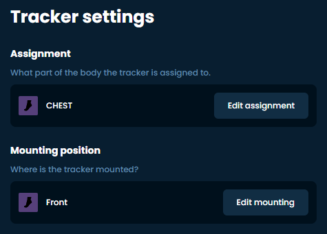

# Putting on Your Trackers

Put trackers on based on your predefined positions. You can use any comfortable position for you, but there are a few rules:

1. You should set Tracker role to the proper role according to body part you put your tracker on. This includes tracker extensions. Use pictures to reference role names and their recommended mounting points.
2. You should set Tracker direction according to your mounting direction. When you mount it, make sure they sit tight, and face as much in this direction as possible when you're standing straight. I.e. "Forward" should face the same way your HMD is facing when you look forward while standing! Alternatively, you can try the automatic mounting.
3. You can mount trackers tiled forward/backward or on the side, this will not mess up the tracking.
4. You can mount trackers in any place on the designated body part you find comfortable, however the less the area is deformed by muscular movement the better the tracking will be. Make sure the tracker moves when you bend the joint to register movement. **Pay special attention to the waist tracker, there are many places where you can mount it and it won't register you bending over. Mount it above your hip, around the level of your belly button.**

## Recommended Tracker Placement

- 5 trackers: chest, upper legs and lower legs.
- 6 trackers: chest, hip, upper legs and lower legs.
- 7 trackers: chest, waist, hip, upper legs and lower legs.
- 8 trackers: chest, hip, upper legs, lower legs and feet.
- 9 trackers: chest, waist, hip, upper legs, lower legs and feet.
- 10 trackers: chest, hip, upper legs, lower legs, feet and upper arms.
- 11 trackers: chest, waist, hip, upper legs, lower legs, feet and upper arms.
- 12 trackers: upper chest, chest, waist, hip, upper legs, lower legs, feet and upper arms.
- 14 trackers: upper chest, chest, waist, hip, upper legs, lower legs, feet, upper arms and shoulders OR lower arms (for VRChat shoulder-tracking only).

## Recommended Mounting Points

- Upper Chest: facing forward, above the breasts.
- Chest: facing forward, on the middle or lower part of the chest.
- Waist: facing foward or to the side on your waist (above you hip, around the level of your belly button) depending on your build.
- Hip: facing forward or back on your hip (where you put your belt).
- Upper leg: just above the knee or higher up the thigh depending on your build.
- Lower leg: on the ankle facing any direction you like.
- Foot: on top of the foot. Trackers 'up' facing toward the ankle, and 'front' facing the ceiling.
- Upper arm: on upper arm (above elbow), on the side or back (forward being your bicep).
- Shoulder: on top of the shoulder.
- Lower arm: on lower arm (below elbow), inwards, close to the elbow.

It is also recommended to mount your trackers directly on bare skin for better adhesion (more stability and less sliding).

### Alternative mounting points

Ultimately the perfect mounting positions are dependant on the person, as body shapes differ greatly. Feel free to experiment by changing trackers one at a time to see what difference it makes.

<iframe width="100%" height="auto" src="https://www.youtube.com/embed/MMJ8843zqNM" title="YouTube video player" frameborder="0" allow="accelerometer; autoplay muted; clipboard-write; encrypted-media; gyroscope; picture-in-picture" allowfullscreen></iframe>

 

<iframe width="100%" height="auto" src="https://www.youtube.com/embed/aM0jXEYQAeY" title="YouTube video player" frameborder="0" allow="accelerometer; autoplay muted; clipboard-write; encrypted-media; gyroscope; picture-in-picture" allowfullscreen></iframe>

_Created by eiren, edited by adigyran, calliepepper, spazzwan, erimel, emojikage and nwbx01, styled by calliepepper. Videos created by zrock35_
