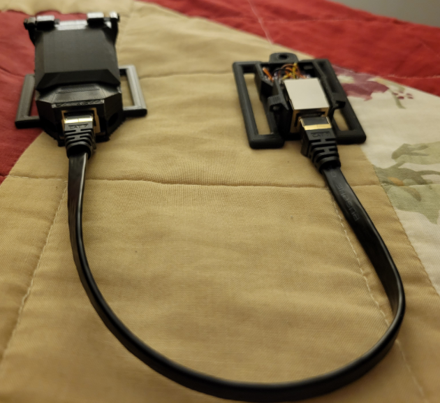

# SlimeVR 101

## What is SlimeVR?

SlimeVR is a low-cost solution to Full Body Tracking in VR. It uses forward kinematics to build a model of your skeleton calculated from the rotation of each individual tracker, with your headset and controllers being the only absolute position known.

	<video name="Firmware Tools Example" codecs='video/webm;codecs="vp9"' autoplay muted loop>
	  <source src="./assets/videos/ostriches.webm">
	</video> 
	Gif thanks to Butterscotch. Dance thanks to ToriKari

Because the headset is a known position and rotation is derived from it, it does not require lighthouses or other forms of additional tracking to model your movement. Your headset and controllers’ built in tracking of the hands manages your shoulders and arms. SlimeVR uses data from Inertial measurement units (IMU) to determine this rotation, and the number of IMU used determines how many tracking points are available.

## How many trackers do you need?

Depending on how you plan to use FBT in VR, choose one of the following options:

* Lower-Body Set (5 IMUs) - Your waist, legs, knees and feet are positionally tracked. Any bending of the waist or sitting down will have issues with tracking, and the orientation of your feet will not be tracked.
* Core Set (6 IMUs) - In addition to the previous set this adds a tracker to the chest, this allows for much more accurate tracking while you're laying down, sitting or even just bending over.
* Enhanced Core Set (8 IMUs) - In addition to the previous set, you can now also wiggle your peets. If you plan on lying or sitting down a lot this adds a lot of emotiveness to your poses.
* Full-Body Set (10 IMUs) - In addition to the previous set, you can now move your elbows independently from your controllers in VR. Useful for dancers or additional immersion.

If you look at the gif above, each line there represents a tracked 'bone'. The more points of rotation you add the more defined the final tracking is, as an example the gif above only has the "Core Set" and as such there is no feet rotation.

For more information on what these tracking options look like, please refer to this video:

<iframe width="100%" height="auto" src="https://www.youtube.com/embed/KN3dxGNAq34" title="YouTube video player" frameborder="0" allow="accelerometer; autoplay muted; clipboard-write; encrypted-media; gyroscope; picture-in-picture" allowfullscreen></iframe>

## What is an extension?

An extension is a singular auxiliary IMU attached to a primary tracker and placed at another location. This allows you to build a secondary tracker without the need for an extra battery, charge board or microcontroller. These are sometimes referred to as AUX trackers.

Extensions allow a tracker to give accurate detail between two bend points that sit close to each other, such as tracking both the lower leg and the foot, without needing another tracker that needs to communicate or be charged separately.

 
*Example extension built by Rames The Generic#3540*

The length of the extension is dependent on the cabling used to connect them (shorter than 80cm is a safe range). For more information please [check the tracker schematics page.](diy/tracker-schematics.md)

The suggested extension locations are:

1. A chest extension attached to the waist tracker.
1. A left foot extension attached to the left ankle tracker.
1. A right foot extension attached to the right ankle tracker.

On the Crowd Supply store page and on our discord server, you may find a notation that specifies the number of primary and auxiliary IMUs with a plus sign. For example, the Enhanced Core Set noted above would be called a 5+3 set up, which consists of 5 microcontrollers and 8 IMU. For a better visual on how this looks when on a person, please check the [recommended mounting points section of the server set up](server/putting-on-trackers.md#recommended-mounting-points).

Please note: Building extensions is not necessary, as the foot and chest trackers will work as standalone trackers if you prefer. However, these docs assume that you are building them as extensions.

*Created by calliepepper. Edited by spazzwan. Video created by zrock35*
