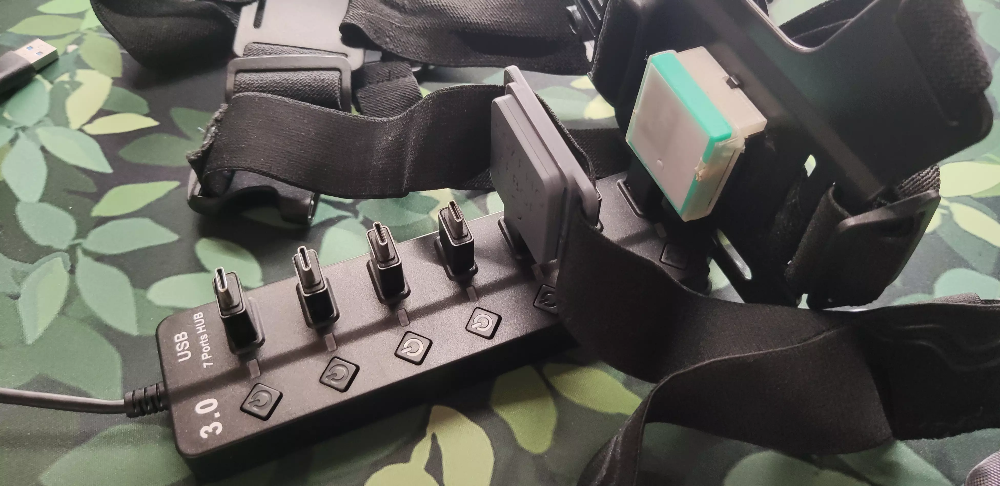

<link rel="stylesheet" href="../assets/css/smol-slimes.css">

# Smol Community Docks

Welcome to the Smol Community Docks page!
Here you'll find a curated collection of DIY dock solutions contributed by the SlimeVR community.

## Table Of Contents

- TOC
{:toc}

## Community Dock Builds

### Depact Smol Sudo Dock

An extremely minimal dock setup using a USB hub and OTG connectors.

#### Parts

| Part Description                        | Link                                                            | Notes                                             |
| --------------------------------------- | --------------------------------------------------------------- | ------------------------------------------------- |
| 7-Port USB 3.0 Hub| [AliExpress](https://aliexpress.com/item/1005008981599421.html) | Any USB 3.0 hub with sufficient ports should work |
| Type-C Male to USB-A Male OTG Connector | [AliExpress](https://aliexpress.com/item/1005007396270447.html) | Can be replaced with short USB-A to USB-C cables|

#### Assembly

Assembly is as simple as inserting the OTG connectors into the hub.

#### Pros and Cons

**Pros:**

- Extremely affordable and very easy to assemble
- Flexible, with readily available parts
- Allows storing trackers without removing straps

**Cons:**

- OTG connectors may loosen or fall out
- Overall structure can feel flimsy

---

## Contributing

Want to share your own DIY dock design, tip, or resource?
We welcome community contributions!

- **How to contribute:**
- Suggest changes and share your ideas in the [SlimeVR Discord](https://discord.gg/slimevr)
- Or open a pull request on the [SlimeVR Docs GitHub repository](https://github.com/SlimeVR/SlimeVR-Docs-Site)

When contributing, please include clear photos, a description, and any relevant links or files.
Your contribution helps make VR more accessible and easier to build for everyone!

*Created by Shine Bright ✨ and [Depact](https://github.com/Depact)*