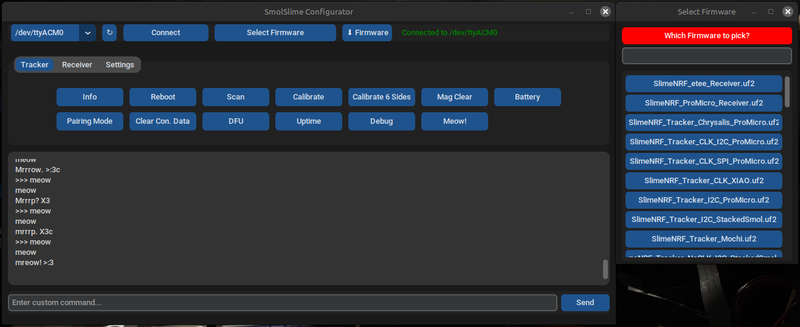
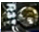
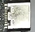
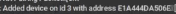

# SmolSlimeConfigurator
Pure Simple UI Configurator for SlimeVR Smol Slimes (Unofficial)
Github page: [SmolSlimeConfigurator](https://github.com/ICantMakeThings/SmolSlimeConfigurator/tree/main)



# Features

- **Easy-to-use interface** — clean, modern, and simple to navigate.
- **Effortless configuration** — one-click buttons for calibration, pairing, and more.
- **Helpful tooltips** — hover over any button to see what it does, perfect for beginners.
- **Automatic firmware updater** — just plug your tracker in via USB, select your firmware type, and flash the latest build instantly.
- **Always up to date** — the firmware list automatically fetches the latest daily builds from GitHub.
- **Custom firmware support** — flash your own `.uf2` file with a single click.
- **Favorites system** — star your most-used firmware versions by right-clicking.
- **Cross-platform** — available for **Windows**, **Linux**, **macOS**, and **Android**.
- **Theme customization** — switch between **light/dark mode** and choose your favorite accent color.

# Download
There are 2 options to run the Configurator:
- Single-file executables are available from [Releases](https://github.com/ICantMakeThings/SmolSlimeConfigurator/releases) (Windows, Linux, macOS, Android).
- Python file from the uploaded files above.
- To build it from source, run:
```bash
pyinstaller --onefile --windowed --icon=icon.png --add-data "icon.png:." SmolSlimeConfiguratorVx.py
```

# Instructions
**Note:** There is a [video tutorial](https://youtu.be/2PHelwy7Rcs) explaining general usage, and [this video](https://www.youtube.com/watch?v=ENINHh4L8tk) covers **Android usage** in detail.

### **First install**

+ Plug in the tracker or reciever, press reset twice, or on boards that dont have a button, hold one side of a wire on rst pin 
and double tap a gnd pin (The usbc connector on the Nice!Nano/ProMicro)
+ Press "↻" refresh, then select the port from the dropdown menu on the left of the refresh button, then press "Connect"
+ Select the version of hardware from the dropdown menu called "Select Firmware", press "⬇ Firmware",  Wait ~20 seconds, the tracker will flash.

### **Pairing**
  
+ Plug in your Reciever, press "↻" refresh and select the port And then press "Connect"
+ To Configure your reciever, select the reciever tab, press pairing mode and power on each reciever one by one, you should notice  the trackers being added, once all the trackers have been paired, press "Exit Pairing Mode"

### **Calibration**

+ Plug in a tracker, Press "↻" refresh, select the COM port & "Connect", press "Calibrate 6 Sides", do what the terminal says.
+ Then press "Calibrate", leave the tracker on a desk for 5~ seconds and done!
**Note: You can also doubble tap the trackers button instead of pressing "Calibrate"**

### **Updating Firmware**

+ Connect to the port, select the firmware, press "⬇ Firmware" and wait ~20 seconds.

**Note: Trackers and recievers need to be all updated on the same version or they wont want to pair**
