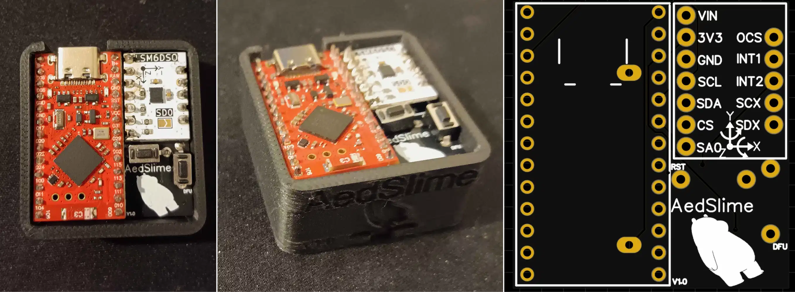
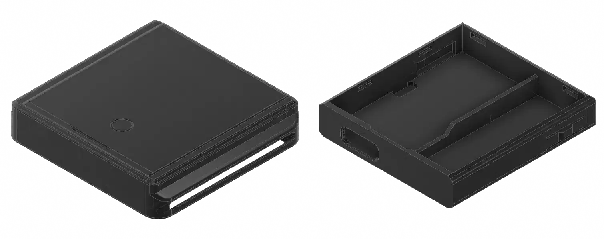
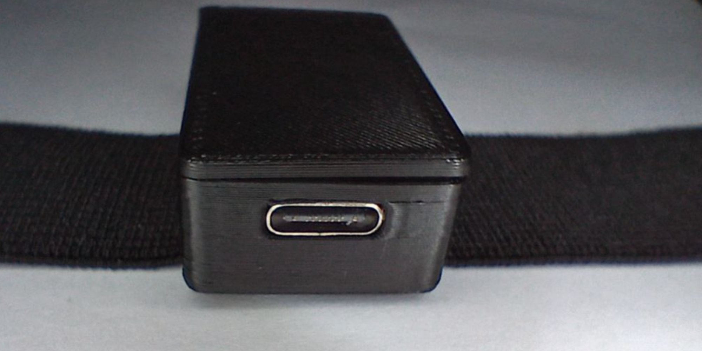
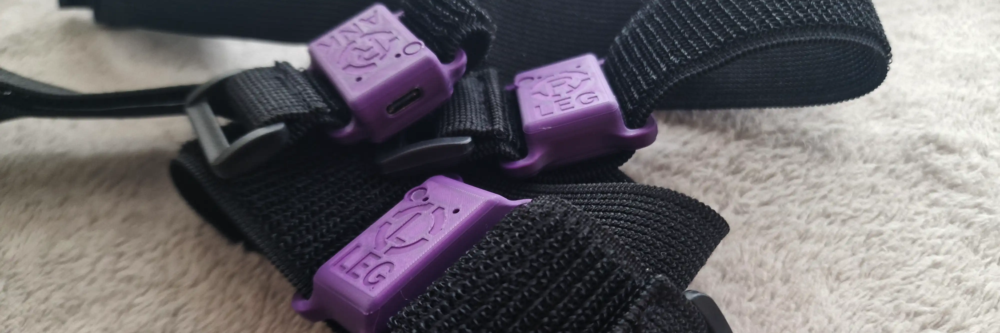
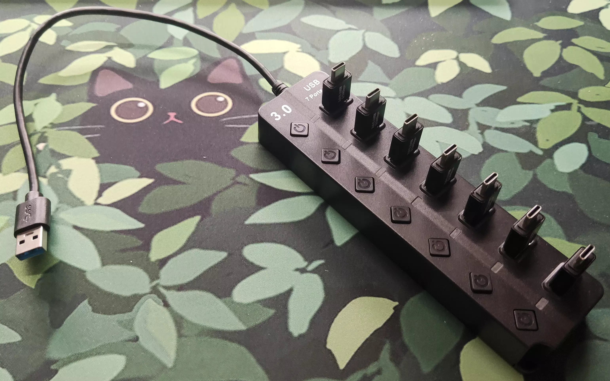
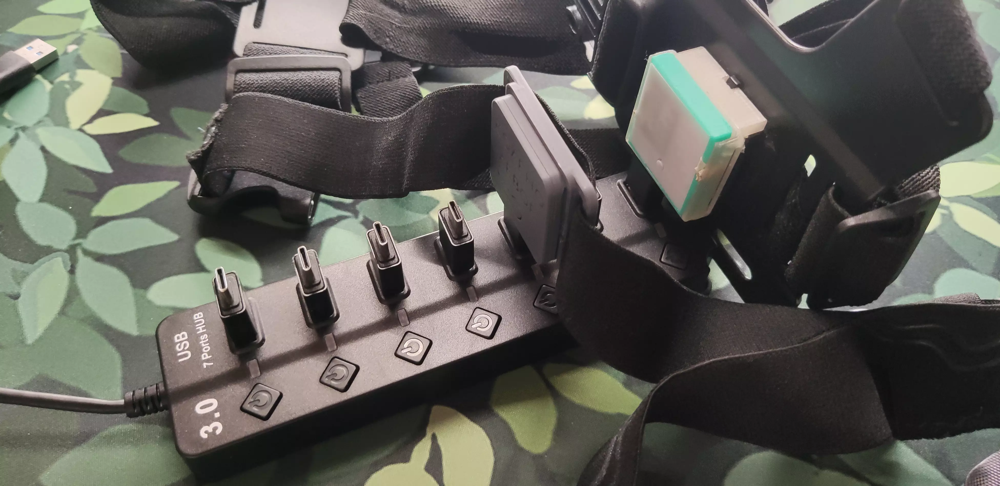

<link rel="stylesheet" href="../assets/css/smol-slimes.css">

# Smol Community Builds

This page is dedicated to builds that anyone can reproduce.

Builds that are not open-source or lack sufficient documentation to be replicated are not listed here.

## Table Of Contents

- TOC
{:toc}

## Community Builds

  <table class="community-builds-table table-sort table-arrows">
    <thead>
      <tr>
        <th class="disable-sort">Image</th>
        <th class="onload-sort">Name</th>
        <th>Author</th>
        <th>Link</th>
        <th>USB</th>
        <th>PCB</th>
        <th>Battery</th>
        <th>Dock</th>
        <th>Dongle</th>
        <th>Strap Width</th>
      </tr>
    </thead>
    <tbody>
      <tr>
        <td class="case-image" data-label="Image">
          
        </td>
        <td class="case-name" data-label="Name">Aed-Slimes</td>
        <td class="case-author" data-label="Author">Aed</td>
        <td class="case-link" data-label="Link">
          <a href="https://github.com/Aed-1/Aed-Slimes">GitHub</a>
        </td>
        <td class="case-usb" data-label="USB">✅</td>
        <td class="case-pcb" data-label="PCB">✅</td>
        <td class="case-battery" data-label="Battery">
          

            120 mAh
            LIR2450 Battery
          

        </td>
        <td class="case-dock" data-label="Dock">✖️</td>
        <td class="case-dongle" data-label="Dongle">✖️</td>
        <td class="case-strap-width" data-label="Strap Width">35 mm</td>
      </tr>
      <tr>
        <td class="case-image" data-label="Image">
          
        </td>
        <td class="case-name" data-label="Name">Gremlin</td>
        <td class="case-author" data-label="Author">ManicQuinn</td>
        <td class="case-link" data-label="Link">
          <a href="https://github.com/ManicQuinn/SlimeVR-Gremlin">GitHub</a>
        </td>
        <td class="case-usb" data-label="USB">✅</td>
        <td class="case-pcb" data-label="PCB">✖️</td>
        <td class="case-battery" data-label="Battery">
          

            110 mAh
            401230 Battery
          

        </td>
        <td class="case-dock" data-label="Dock">✖️</td>
        <td class="case-dongle" data-label="Dongle">✖️</td>
        <td class="case-strap-width" data-label="Strap Width">30 mm</td>
      </tr>
      <tr>
        <td class="case-image" data-label="Image">
          
        </td>
        <td class="case-name" data-label="Name">Marzipan</td>
        <td class="case-author" data-label="Author">Colanns</td>
        <td class="case-link" data-label="Link">
          <a href="https://github.com/colasama/Marzipan">GitHub</a>
        </td>
        <td class="case-usb" data-label="USB">✅</td>
        <td class="case-pcb" data-label="PCB">✅</td>
        <td class="case-battery" data-label="Battery">
          

            110 mAh
            401230 Battery
          

          /
          

            170 mAh
            501230 Battery
          

        </td>
        <td class="case-dock" data-label="Dock">✖️</td>
        <td class="case-dongle" data-label="Dongle">✖️</td>
        <td class="case-strap-width" data-label="Strap Width">25 mm</td>
      </tr>
      <tr>
        <td class="case-image" data-label="Image">
          
        </td>
        <td class="case-name" data-label="Name">Smol Panini Case</td>
        <td class="case-author" data-label="Author">TigsterCox</td>
        <td class="case-link" data-label="Link">
          <a href="https://github.com/TigsterCox/Smol-Panini-Case/">Github</a>
        </td>
        <td class="case-usb" data-label="USB">✅</td>
        <td class="case-pcb" data-label="PCB">✖️</td>
        <td class="case-battery" data-label="Battery">
          

            180 mAh
            601230 Battery
          

        </td>
        <td class="case-dock" data-label="Dock">✖️</td>
        <td class="case-dongle" data-label="Dongle">✖️</td>
        <td class="case-strap-width" data-label="Strap Width">30 mm</td>
      </tr>
      <tr>
        <td class="case-image" data-label="Image">
          
        </td>
        <td class="case-name" data-label="Name">Ibis Trackers</td>
        <td class="case-author" data-label="Author">brisfknibis</td>
        <td class="case-link" data-label="Link">
          <a href="https://github.com/brisfknibis/ibis-trackers/">Github - Stacked</a> 
          <a href="https://github.com/brisfknibis/Chrysalis-Trackers/">Github - Chrysalis</a>
        </td>
        <td class="case-usb" data-label="USB">✅</td>
        <td class="case-pcb" data-label="PCB">✖️</td>
        <td class="case-battery" data-label="Battery">
          

            120 mAh
            401230 Battery
          

        </td>
        <td class="case-dock" data-label="Dock">✅</td>
        <td class="case-dongle" data-label="Dongle">✖️</td>
        <td class="case-strap-width" data-label="Strap Width">30 mm</td>
      </tr>
      <tr id="LyallUlric-Stacked-SmolSlime-build">
        <td class="case-image" data-label="Image">
          
        </td>
        <td class="case-name" data-label="Name">Stacked SmolSlime</td>
        <td class="case-author" data-label="Author">LyallUlric</td>
        <td class="case-link" data-label="Link">
          <a href="https://www.thingiverse.com/thing:6941615">Thingiverse</a>
        </td>
        <td class="case-usb" data-label="USB">✅</td>
        <td class="case-pcb" data-label="PCB">✖️</td>
        <td class="case-battery" data-label="Battery">
          

            100 mAh
            401030 Battery
          

        </td>
        <td class="case-dock" data-label="Dock">✖️</td>
        <td class="case-dongle" data-label="Dongle">✅</td>
        <td class="case-strap-width" data-label="Strap Width">30 mm</td>
      </tr>
      <tr>
        <td class="case-image" data-label="Image">
          
        </td>
        <td class="case-name" data-label="Name">SmolSlimeSMOL</td>
        <td class="case-author" data-label="Author">ICantMakeThings</td>
        <td class="case-link" data-label="Link">
          <a href="https://thingiverse.com/thing:7062978">Thingiverse</a>
        </td>
        <td class="case-usb" data-label="USB">✅</td>
        <td class="case-pcb" data-label="PCB">✖️</td>
        <td class="case-battery" data-label="Battery">
          

            500 mAh
            402035 Battery
          

        </td>
        <td class="case-dock" data-label="Dock">✖️</td>
        <td class="case-dongle" data-label="Dongle">✖️</td>
        <td class="case-strap-width" data-label="Strap Width">25mm</td>
      </tr>
      <tr>
        <td class="case-image" data-label="Image">
          
        </td>
        <td class="case-name" data-label="Name">Miro Trackers</td>
        <td class="case-author" data-label="Author">spiro.ooo</td>
        <td class="case-link" data-label="Link">
          <a href="https://github.com/spironoo/miro-cases">Github</a>
        </td>
        <td class="case-usb" data-label="USB">✅</td>
        <td class="case-pcb" data-label="PCB">✖️</td>
        <td class="case-battery" data-label="Battery">
          

            120 mAh
            401230 Battery
          

        </td>
        <td class="case-dock" data-label="Dock">✖️</td>
        <td class="case-dongle" data-label="Dongle">✖️</td>
        <td class="case-strap-width" data-label="Strap Width">25mm/38mm</td>
      </tr>
    </tbody>
  </table>

## Not Recommended For New Tracker Builds

  <table class="community-builds-table table-sort table-arrows">
    <thead>
      <tr>
        <th class="disable-sort">Image</th>
        <th class="onload-sort">Name</th>
        <th>Reason Not Recommended</th>
        <th>Author</th>
        <th>Link</th>
        <th>USB</th>
        <th>PCB</th>
        <th>Battery</th>
        <th>Dock</th>
        <th>Dongle</th>
        <th>Strap Width</th>
      </tr>
    </thead>
    <tbody>
      <tr>
        <td class="case-image" data-label="Image">
          
        </td>
        <td class="case-name" data-label="Name">SlimeNRF R1/R2</td>
        <td class="case-not-recommended-reason" data-label="Reason Not Recommended">I2C only design</td>
        <td class="case-author" data-label="Author">sctanf</td>
        <td class="case-link" data-label="Link">
          <a href="https://github.com/SlimeVR/SlimeVR-Tracker-nRF-PCB"
            >GitHub</a
          >
        </td>
        <td class="case-usb" data-label="USB">✖️</td>
        <td class="case-pcb" data-label="PCB">✅</td>
        <td class="case-battery" data-label="Battery">
          

            300 mAh
            601230 Battery
          

        </td>
        <td class="case-dock" data-label="Dock">✅</td>
        <td class="case-dongle" data-label="Dongle">✖️</td>
        <td class="case-strap-width" data-label="Strap Width">35 mm</td>
      </tr>
      <tr>
        <td class="case-image" data-label="Image">
          
        </td>
        <td class="case-name" data-label="Name">SlimeNRF R3</td>
        <td class="case-not-recommended-reason" data-label="Reason Not Recommended">I2C only design</td>
        <td class="case-author" data-label="Author">sctanf</td>
        <td class="case-link" data-label="Link">
          <a href="https://oshwlab.com/sctanf/slimenrf3">Oshwlab</a>
        </td>
        <td class="case-usb" data-label="USB">✅</td>
        <td class="case-pcb" data-label="PCB">✅</td>
        <td class="case-battery" data-label="Battery">
          

            80 mAh
            301230 Battery
          

          /
          

            100 mAh
            242030 Battery
          

        </td>
        <td class="case-dock" data-label="Dock">
          

            ✅
            Use SlimeNRF R1/R2 dock.
          

        </td>
        <td class="case-dongle" data-label="Dongle">✖️</td>
        <td class="case-strap-width" data-label="Strap Width">35 mm</td>
      </tr>
      <tr>
        <td class="case-image" data-label="Image">
          
        </td>
        <td class="case-name" data-label="Name">SlimeNRF-Fuimini</td>
        <td class="case-not-recommended-reason" data-label="Reason Not Recommended">I2C only design</td>
        <td class="case-author" data-label="Author">Zipra1</td>
        <td class="case-link" data-label="Link">
          <a href="https://github.com/Zipra1/SlimeNRF-Fuimini">GitHub</a>
        </td>
        <td class="case-usb" data-label="USB">✅</td>
        <td class="case-pcb" data-label="PCB">✅</td>
        <td class="case-battery" data-label="Battery">100 mAh</td>
        <td class="case-dock" data-label="Dock">✅</td>
        <td class="case-dongle" data-label="Dongle">
          

            ✅
            Custom case for eByte E104-BT5040U Dongle.
          

        </td>
        <td class="case-strap-width" data-label="Strap Width">50 mm</td>
      </tr>
    </tbody>
  </table>

## Standalone Docks

### Depact Smol Sudo Dock

An extremely minimal setup.

#### Assembly

The making process is as simple as inserting the OTG connectors into the hub.

| Part Description                        | Link                                                               | Notes                                             |
| --------------------------------------- | ------------------------------------------------------------------ | ------------------------------------------------- |
| 7-Port USB 3.0 Hub                      | [AliExpress](https://aliexpress.com/item/1005008981599421.html) | Any USB 3.0 Hub with plenty of ports should work. |
| Type-C Male to USB-A Male OTG Connector | [AliExpress](https://aliexpress.com/item/1005007396270447.html) | Can be replaced with short USB-A to USB-C cables. |

## Contribution

**Want to contribute your design?** Awesome! To have your build added to this list, please ensure the following:

- Your case must be **publicly accessible** (e.g. GitHub (preferable), Thingiverse, etc).
- Include at least one clear image or render of your build with a 2:1 or 3:1 aspect ratio.
- Provide basic build information:
  - Does it have a USB port?
  - Does it need a PCB to build?
  - What battery size/type does it use?
  - Is it compatible with a dock? / Does it include a dock?
- Submit your case by opening a pull request.

_Created by Shine Bright ✨ and [Depact](https://github.com/Depact)_

<!-- Table sorting library table-sort-js - https://www.jsdelivr.com/package/npm/table-sort-js -->

