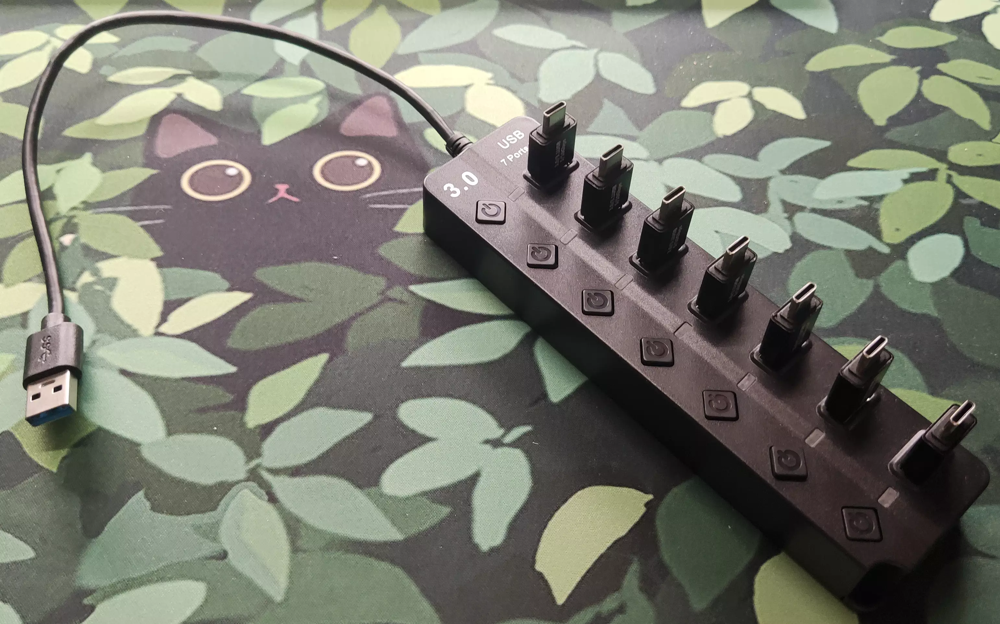

<link rel="stylesheet" href="../assets/css/smol-slimes.css">

# Smol Community Docks

Welcome to the Smol Community Docks page!  
Here you'll find a curated collection of DIY docks solutions contributed by the SlimeVR community.

## Table Of Contents

- TOC
{:toc}

## Smol Slime Community Dock Builds

### Depact Smol Sudo Dock

An extremely minimal setup.

**Assembly**

The making process is as simple as inserting the OTG connectors into the hub.

| Part Description                        | Link                                                               | Notes                                             |
| --------------------------------------- | ------------------------------------------------------------------ | ------------------------------------------------- |
| 7-Port USB 3.0 Hub                      | [AliExpress](https://aliexpress.com/item/1005008981599421.html) | Any USB 3.0 Hub with plenty of ports should work. |
| Type-C Male to USB-A Male OTG Connector | [AliExpress](https://aliexpress.com/item/1005007396270447.html) | Can be replaced with short USB-A to USB-C cables. |

---

## Contributing

Want to share your own DIY strap design, tip, or resource?  
We welcome community contributions!

- **How to contribute:**  
  - Suggest changes, share your ideas and experience in the [SlimeVR Discord](https://discord.gg/slimevr) -> [Suggestions on strap improvements](https://discord.com/channels/817184208525983775/1202031023945416725) channel.
  - Or, open a pull request on the [SlimeVR Docs GitHub repository](https://github.com/SlimeVR/SlimeVR-Docs-Site).

When contributing, please include clear photos, a description, and any relevant links or files.
Your contribution helps make VR more accessible and easier to build for everyone!

*Created by Shine Bright ✨ and [Depact](https://github.com/Depact)*