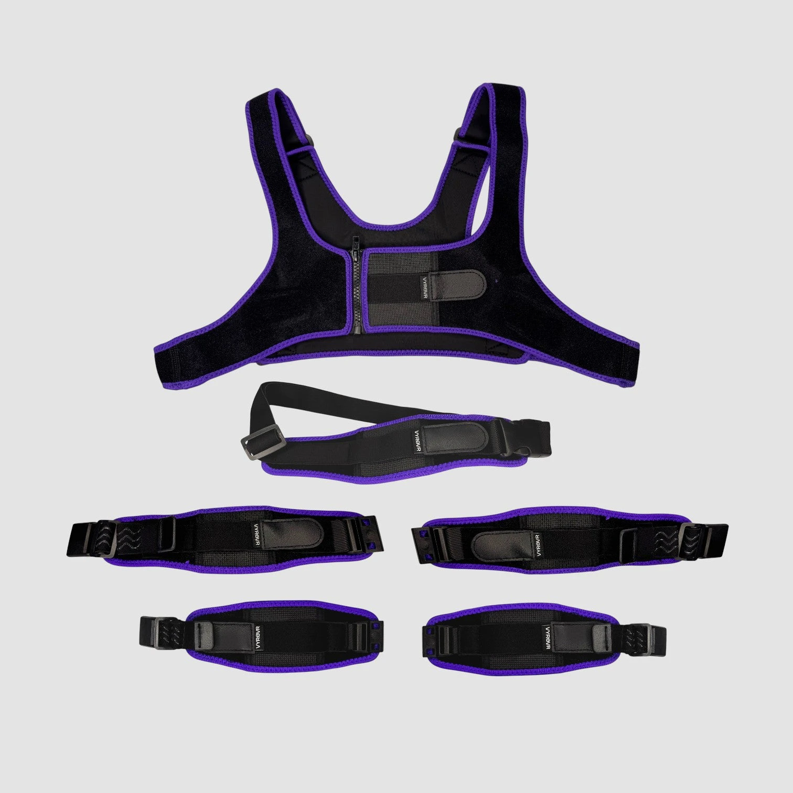
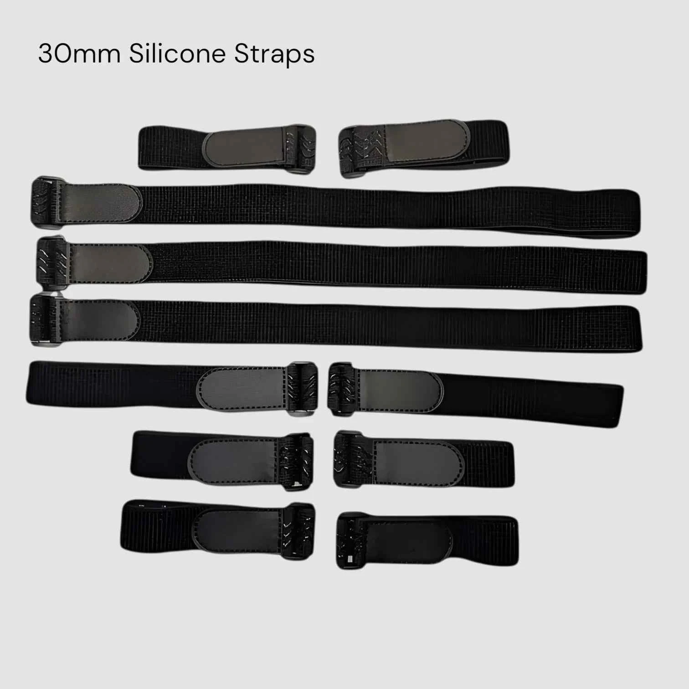
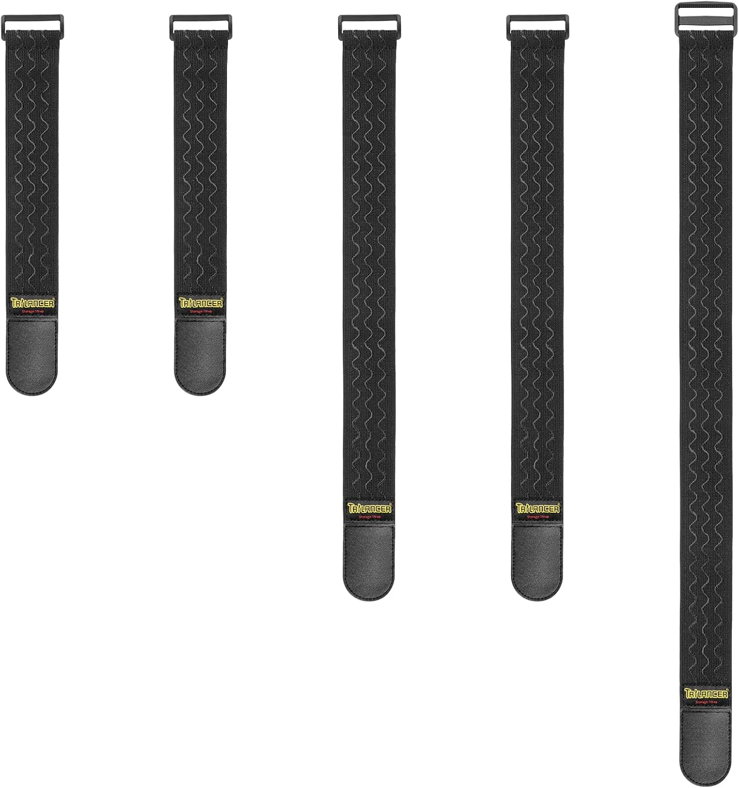

<link rel="stylesheet" href="../assets/css/smol-slimes.css">

# Smol Strap Designs

Here you'll find a curated by community collection of strap designs.

## Table of Contents

- TOC
{:toc}

## Common Components

For information on common strap components, 3D printable buckles, and tracker placement, refer to [DIY Straps Components](../../diy/diy-strap-components.md) page.

## Strap Designs

### 🟢 Recommended Strap Sets

#### 🟢 Depact Smol Strap V3

_Design by Depact_

  

**Summary**

V3 extends V2 and significantly reduces sliding during activities like dancing, and feels way less on skin.

| 👍 Pros:                             | 👎 Cons:                 |
| ----------------------------------- | ----------------------- |
| No sewing needed                    | 3D printing is required |
| Modular: any part can be replaced   |                         |
| Minimal tools needed: just scissors |                         |

  
Parts List

**Notes:**

 - The dovetail design was chosen based on buckle rankings at the time and can be replaced if desired.

*Prices last updated: 2026-06-05*

| Component                                              | Usual Listing Name            | Color/Variant             | Link                                                                                              | Price                |
| ------------------------------------------------------ | ----------------------------- | ------------------------- | ------------------------------------------------------------------------------------------------- | -------------------- |
| GoPro Chest Strap                                      | Chest Strap Mount             | Black                     | [AliExpress](https://www.aliexpress.com/item/1005004792179605.html)                               | $0.99                |
| 5m of 30mm Elastic Band with Non-slip Silicone Webbing | Elastic Band Non-slip Webbing | EB312-Black-30mm, 5Meters | [AliExpress](https://www.aliexpress.com/item/1005003917576160.html)                               | $1.14                |
| 3D Printed Buckle                                      | Dovetail Strap Latch 30mm     | Print in PETG             | [Documentation](../../diy/diy-strap-components.md#-dovetail-strap-latch-30mm40mm50mm-by-moderahn) | 3D print             |
| 3d Printed Slide                                       | 30mm, Slide Buckle by Guidoo  | Print in PETG             | [Documentation](../../diy/diy-strap-components.md#-30mm-slide-buckle-by-guidoo)                   | 3D print             |
| **Total for 6 tracker set**                            |                               |                           |                                                                                                   | **$2.13 + 3D print** |

  
Assembly Steps

**Notes:**

 - Make straps one by one to determine the correct length.

**Assembly Steps**

1. Wrap the band **snug, not tight** around each [spot of tracker placement](../../diy/diy-strap-components.md#tracker-placement). 
 Keep the band flat and level.
 Add 10 cm to each measurement. You can always cut down, but you need to leave enough to be able to adjust.
2. Cut the band using your measurement.
  -  Consider sealing cut edges with heat to reduce fraying, so when you put edges through buckles and a slides, band material not falls apart easily. 
     Be cautious if decide to thermally seal cut edges. 
       - Melting edges of synthetic cloth may drop melted material on skin and cause pain. 
       - Avoid creating a fire hazard. 
       - Avoid breathing synthetic smoke from band.

3. Put the case to the middle of the band. Silicone webbing side to skin, opposite of tracker face side.

  

4. Put the edges of the band through the slides.

  

5. Put the edges of the band through the buckles, making sure they connect together properly (refer to images for examples).

  

6. Put the edges of the band through the slides once more, above the strap that is already there.

  

7. Put strap on your limb. Adjust so it feel snug, not tight.

#### 🟢 VYRO VR Comfort Strap Bundle

**Summary**

| 👍 Pros:                                 | 👎 Cons: |
| --------------------------------------- | ------- |
| One of the best strap options available | Cost    |
| Ready for use                           |         |

**Prices:**
*Prices last updated: 2026-06-05*

Store Link: [VYRO VR Comfort Strap Bundles](https://vyrovr.com/products/vyro-vr-comfort-strap-bundles)

| Variant        | Trackers | Price | Included                                                      |
| -------------- | -------- | ----- | ------------------------------------------------------------- |
| Core           | ≤6       | $109  | 1 Chest + 1 Hip + 2 Thigh + 2 Ankles + 3 Extension Brackets   |
| Advanced       | ≤8       | $114  | Core + 2 extra basic straps for feet trackers                 |
| Full Body      | ≤10      | $139  | Core + 2 extra basic straps + 2 extra Comfort straps for arms |
| Full Body (16) | >10      | $278  | Up to 16 trackers                                             |

### 🟡 Usable Strap Sets

Has one of the following flaws:
- No GoPro-style chest strap: GoPro-style chest strap works great for chest
- Velcro fasteners: Velcro fasteners are not as fast to lock, they stick to different materials, collect lint, loose grip over time, cannot maintain defined length
- Not enough community testing

#### 🟡 VYRO VR Silicone Straps

**Summary**

| 👍 Pros:          | 👎 Cons:                                                                 |
| ---------------- | ----------------------------------------------------------------------- |
| No sewing needed | Velcro fasteners                                                        |
| Ready for use    | No GoPro-style chest strap. Add GoPro style chest strap to improve set. |

10-pack ($30): 2×30cm + 4×35cm + 2×50cm + 2×110cm
- 30cm (~12"): ankles, arms
- 50cm (~20"): thighs, hip
- 110cm (~43"): chest, waist

**Prices:**

Store Link: [VYRO VR Silicone Straps](https://vyrovr.com/products/10-slimevr-compatible-silicone-backed-30mm-straps)

#### 🟡 Generic Amazon Straps

**Summary**

| 👍 Pros:          | 👎 Cons:                                                                |
| ---------------- | ---------------------------------------------------------------------- |
| No sewing needed | Velcro fasteners                                                       |
| Ready for use    | No GoPro-style chest strap. Add GoPro style chest strap to improve set |
|                  | Lack of info on community testing                                      |

**Common strap length for different limbs:**
- 24" (610mm): upper-body main trackers (chest, hip, spine)
- 18" (457mm): thighs
- 12" (305mm): ankles, elbows, arms

**Example set configuration:**
- 5 Lower-Body: 1×3 size combo
- 6 Core: 2×3 size combo
- 8 Enhanced: 2×3 size combo
- 10 Full: 2×3 size combo
- 16 Deluxe: 4×3 size combo

**Prices:**
*Prices last updated: 2026-06-05*

Store link: [Amazon straps](https://www.amazon.com/dp/B09T5YDMTR/)
For $8.99 you get 3 size combo (2 x 12" + 2 x 18" + 1 x 24")

#### 🟡 Depact 30mm Ankle Hook And Loop Smol Strap

_Design by Depact_

**⚠️ Reason Not Recommended:** Digs against skin, sticks to fabrics

  

**Summary**

Design of strap based on common hook and loop bands.

**Summary**

| 👍 Pros:                             | 👎 Cons:                                                                |
| ----------------------------------- | ---------------------------------------------------------------------- |
| No sewing needed                    | Velcro fasteners                                                       |
| Minimal tools needed: just scissors | No GoPro-style chest strap. Add GoPro style chest strap to improve set |
|                                     | Sticks to fabrics                                                      |
|                                     | Self adhesive hook and loop tape comes off case over time              |
|                                     | Velcro collects lint                                                   |

  
Parts List

**Required Components**

| Component                                  | Usual Listing Name | Link                                                                |
| ------------------------------------------ | ------------------ | ------------------------------------------------------------------- |
| Elastic Band Hook Loop with Reverse Buckle | Black, 5cm 45cm    | [AliExpress](https://pl.aliexpress.com/item/1005008080586092.html)  |
| Velcros Self Adhesive Hook and Loop Tape   | Black 1M, 50mm     | [AliExpress](https://www.aliexpress.com/item/1005003917576160.html) |

  
Assembly Steps

**Assembly Steps**

1. Stick adhesive hook tape (rough side) to the case bottom. Press firmly. Cut excess.
1. Put tracker on band.

#### 🟡 Depact 50mm Knee Velcro-Elastic Band Smol Strap

_Design by Depact_

**Summary**

Sidegrade of "Depact Smol Strap V3" design.

Velcro patch sewn onto strap, adhesive side of velcro tape stuck to case bottom.

| 👍 Pros:                                                                                    | 👎 Cons:                                                                     |
| ------------------------------------------------------------------------------------------ | --------------------------------------------------------------------------- |
| Better friction than 30mm versions (important for strap to stay on limb during vr dancing) | No GoPro-style chest strap. Add GoPro style chest strap to improve set      |
| Move flexible vertical position of tracker on strap to reposition tracker on strap         | Require sewing. Tools needed: scissors, needle & thread (or sewing machine) |
| No case mount used: Less things you feel with your skin                                    | Self adhesive hook and loop tape comes off case over time                   |
|                                                                                            | Velcro collects lint                                                        |

  
Parts List

| Item                                     | Notes                                       | Source                                                                                                                     |
| ---------------------------------------- | ------------------------------------------- | -------------------------------------------------------------------------------------------------------------------------- |
| 30mm silicone elastic band (non-slip)    | 2–5m depending on tracker count             | [AliExpress](https://aliexpress.com/item/1005008272812970.html)                                                            |
| Sew-on hook-and-loop tape (non-adhesive) | Loop side (soft) for strap; 16mm–50mm width | [AliExpress](https://www.aliexpress.com/item/1005002862699884.html)                                                        |
| Self-adhesive hook-and-loop tape         | Hook side (rough) for case bottom           | [AliExpress](https://aliexpress.com/item/1005008938790125.html)                                                            |
| Brackles V2 50mm                         | Print in PETG                               | [Documentation](https://docs.slimevr.dev/diy/diy-strap-components.html#-brackles-v2-303850mm-for-elastic-straps-by-rdtiel) |

  
Assembly Steps

**Notes**

- Make straps one by one to determine the correct length.
- Seal raw band edges with brief heat exposure to reduce fraying.

**Assembly Steps**

1. Wrap the band snug, not tight around each [spot of tracker placement](https://docs.slimevr.dev/diy/diy-strap-components.html#tracker-placement). Keep the band flat and level. Add 10 cm to each measurement. You can always cut down.
2. Cut band.
3. Cut a ~50×50 mm square from the sew-on loop tape (soft side, not sticky tape).
   1. Sew it centered on the outer face of the band at the tracker position.
   2. Stitch all four square edges.
   3. Stitch X shape from square corners.
4. Thread the Brackles V2 buckle onto the band.
5. Stick adhesive hook tape (rough side) to the case bottom. Press firmly. Cut excess.

### 🟠 Needs More Testing

#### 🟠 Generic AliExpress Straps + GoPro Chest Strap

**Summary**

| 👍 Pros:                             | 👎 Cons:                                                                |
| ----------------------------------- | ---------------------------------------------------------------------- |
| No sewing needed                    | No community testing info                                              |
| Minimal tools needed: just scissors | Velcro fasteners                                                       |
|                                     | No GoPro-style chest strap. Add GoPro style chest strap to improve set |

  
Parts List

**Parts:**
- [AliExpress (30mm×20-40cm, 5pcs)](https://www.aliexpress.com/item/1005009646538072.html) - Most cases are designed for 30mm wide straps.
- [$0.99 GoPro Chest Strap](https://www.aliexpress.com/item/1005004792179605.html)

**Example set configuration:**
- 5 Lower: 1×5x40cm + 1×5x30cm + 1×5x20cm
- 6 Core: 1×5x40cm + 1×5x30cm + 1×5x20cm
- 8 Enhanced: 1×5x40cm + 1×5x30cm + 1×5x20cm
- 10 Full: 1×5x40cm + 1×5x30cm + 2×5x20cm

### 🚫 Not Recommended

#### 🚫 Depact 30mm Elastic Band Smol Strap V2 

_Design by Depact_

**⚠️ Reason Not Recommended:** Obsoleted by replacement of buckles and loop keepers in V3.

**Summary**
Same bare-bones and modular approach as V1, but it also requires a needle and thread. It’s recommended to replace the buckle with a good 3D printed one.

| 👍 Pros:                                               | 👎 Cons:                                                    |
| ----------------------------------------------------- | ---------------------------------------------------------- |
| So bare-bones that any part can be replaced if needed | Buckles are bulky and dig into skin                        |
| Minimal tools needed: just scissors and a needle      | Buckles keep sliding                                       |
| No 3d printing needed                                 | Strap keepers not provide friction, so strap keeps sliding |

  
Parts List

**Info:** 5 meters of elastic band are generally enough to make 6 straps for an average man wearing European size XL.

| Component                                              | Listing Name                                                                                                                     | Color/Variant             | Link                                                                |
| ------------------------------------------------------ | -------------------------------------------------------------------------------------------------------------------------------- | ------------------------- | ------------------------------------------------------------------- |
| Belt Buckles with webbing size 32mm, 10pcs pack        | 20mm 25mm 32mm~50mm Plastic Hardware Dual Adjustable Side Release Buckles Molle Tatical Backpack Belt Bag Parts Strap Webbing    | Webbing Size 32mm, 10pcs  | [AliExpress](https://pl.aliexpress.com/item/32804319193.html)       |
| 5m of 30mm Elastic Band with Non-slip Silicone Webbing | Meetee 2/5/10Meters Elastic Band 20-50mm Non-slip Webbing For Belt Garment Wave Silicone Ribbon DIY Clothes Sewing Accessories   | EB312-Black-30mm, 5Meters | [AliExpress](https://www.aliexpress.com/item/1005003917576160.html) |
| GoPro Chest Strap                                      | Chest Strap Mount Belt for Gopro Hero 9 8 7 6 5 4 Insta360 R X2 DJI OSMO Action Camera Harness for Go Pro SJCAM EKEN Accessories | Black                     | [AliExpress](https://www.aliexpress.com/item/1005004792179605.html) |
| Needle and thread                                      | Common in DIY and specialized shops                                                                                              |                           |                                                                     |

  
Assembly Steps

**Assembly Steps**

1. Wrap band around tracker position.
2. Cut band slightly longer than needed to wrap around.
3. Put the case and the buckles on the band.
4. Sew one end of the buckle to the band.
5. Now, make the loop keeper.
   1. Cut one piece of band per strap, slightly shorter than three times the strap’s width, so the loop sits snugly when sewn.
   2. Wrap this piece snugly around the strap to secure both the strap and the loose tail extending from the unsewn buckle.
   3. Sew the loop keeper, being careful not to sew it to the strap.

**Additional links**

1. <a href="https://www.wikihow.com/Sew" target="_blank">WikiHow: How to Sew Basic Stitches by Hand for Beginners</a>

#### 🚫 Depact Smol Strap V1

_Design by Depact_

**⚠️ Reason Not Recommended:** Obsoleted by introduction of loop keepers in V2.

**Summary**

This setup is extremely minimal. It's recommended to replace the buckle with a good 3D printed one.

| 👍 Pros:                                               | 👎 Cons:                                                    |
| ----------------------------------------------------- | ---------------------------------------------------------- |
| So bare-bones that any part can be replaced if needed | Buckles are bulky and dig into skin                        |
| No sewing required                                    | Buckles keep sliding                                       |
| No 3d printing needed                                 | Strap keepers not provide friction, so strap keeps sliding |

  
Parts List

**Info:** 5 meters of elastic band are generally enough to make 6 straps for an average man wearing European size XL.

| Component                                              | Listing Name                                                                                                                     | Color/Variant             | Link                                                                |
| ------------------------------------------------------ | -------------------------------------------------------------------------------------------------------------------------------- | ------------------------- | ------------------------------------------------------------------- |
| Belt Buckles with webbing size 32mm, 10pcs pack        | 20mm 25mm 32mm~50mm Plastic Hardware Dual Adjustable Side Release Buckles Molle Tatical Backpack Belt Bag Parts Strap Webbing    | Webbing Size 32mm, 10pcs  | [AliExpress](https://pl.aliexpress.com/item/32804319193.html)       |
| 5m of 30mm Elastic Band with Non-slip Silicone Webbing | Meetee 2/5/10Meters Elastic Band 20-50mm Non-slip Webbing For Belt Garment Wave Silicone Ribbon DIY Clothes Sewing Accessories   | EB312-Black-30mm, 5Meters | [AliExpress](https://www.aliexpress.com/item/1005003917576160.html) |
| GoPro Chest Strap                                      | Chest Strap Mount Belt for Gopro Hero 9 8 7 6 5 4 Insta360 R X2 DJI OSMO Action Camera Harness for Go Pro SJCAM EKEN Accessories | Black                     | [AliExpress](https://www.aliexpress.com/item/1005004792179605.html) |

  
Assembly Steps

**Assembly Steps**

1. Wrap band around tracker position.
2. Cut the band slightly longer than needed to wrap fully around the placement.
3. Attach the case and buckles to the band.

---

## Contributing

Want to share your own DIY strap design, tip, or resource?  
We welcome community contributions!

- **How to contribute:**  
  - Suggest changes, share your ideas and experience in the [SlimeVR Discord](https://discord.gg/slimevr) -> [Suggestions on strap improvements](https://discord.com/channels/817184208525983775/1202031023945416725) channel.
  - Or, open a pull request on the [SlimeVR Docs GitHub repository](https://github.com/SlimeVR/SlimeVR-Docs-Site).

When contributing, please include clear photos, a description, and any relevant links or files.
Your contribution helps make VR more accessible and easier to build for everyone!

*Created by Shine Bright ✨ and [Depact](https://github.com/Depact)*