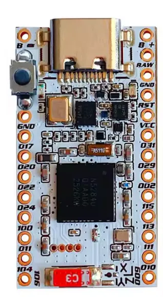
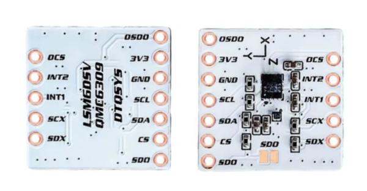
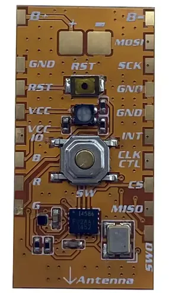
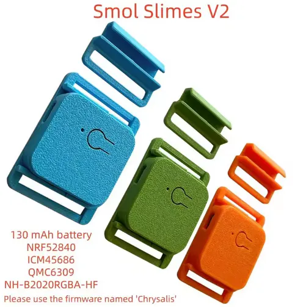

<link rel="stylesheet" href="../assets/css/smol-slimes.css">

# 🏃 Smol Tracker

Before you start, decide on [how many trackers you may need](../../slimevr101.md#how-many-trackers-do-you-need).

Trackers are required to have a battery and an inertial measurement unit (IMU). A magnetometer is optional.\
Buttons and slide switches are recommended but not required. Buttons can be added to control the tracker, and a slide switch can be used to physically disconnect a tracker's battery.

## Table Of Contents

- TOC
  {:toc}

## Schematics

<form id="schematicForm">
  <fieldset class="form-field-group">
    <legend>Schematic:</legend>
    <label class="form-field-input-container">
      <div class="form-field-input">
        <input type="checkbox" name="isStacked" checked="checked" />
        Stacked schematic
        <sup>✅ recommended</sup>
      </div>
      <span class="form-field-description">
        IMU sits on top of the ProMicro. This removes need in additional PCB.
      </span>
    </label>
  </fieldset>
  <fieldset class="form-field-group">
    <legend>IMU's:</legend>
    <label class="form-field-input-container">
      <div class="form-field-input">
        <input type="radio" name="IMU" value="ICM-45686" checked="checked" />
        ICM-45686
        <sup>
          <a href="../../diy/imu-comparison.md#icm-45686" target="_blank"> [more] </a>
        </sup>
      </div>
      <span class="form-field-description">
        More expensive, more precise.
      </span>
    </label>
    <label class="form-field-input-container">
      <div class="form-field-input">
        <input type="radio" name="IMU" value="LSM6DSV" /> LSM6DSV
        <sup>
          <a href="../../diy/imu-comparison.md#lsm6dsv" target="_blank"> [more] </a>
        </sup>
      </div>
    </label>
    <label class="form-field-input-container">
      <div class="form-field-input">
        <input type="radio" name="IMU" value="LSM6DSR" /> LSM6DSR
        <sup>
          <a href="../../diy/imu-comparison.md#lsm6dsr" target="_blank">[more]</a>
        </sup>
      </div>
      <span class="form-field-description">
        Half the price of ICM-45686, with slightly more drift.
      </span>
    </label>
  </fieldset>
  <fieldset class="form-field-group">
    <legend>Communication protocols:</legend>
    <label class="form-field-input-container">
      <div class="form-field-input">
        <input type="radio" name="Protocol" value="SPI" checked="checked" />
        SPI
        <sup>✅ recommended</sup>
      </div>
      <span class="form-field-description">
        Less energy consumption, more performance. Not support yet magnetometer.
      </span>
    </label>
    <label class="form-field-input-container">
      <div class="form-field-input">
        <input type="radio" name="Protocol" value="I2C" /> I2C
      </div>
      <span class="form-field-description">
        Support magnetometer.
      </span>
    </label>
  </fieldset>
  <fieldset class="form-field-group">
    <legend>Extra options:</legend>
    <label class="form-field-input-container">
      <div class="form-field-input">
        <input type="checkbox" name="HasUserButton" checked="checked" />
        User button
        <sup>✅ recommended</sup>
      </div>
      <span class="form-field-description">
        Programmable user button mainly used for deep sleep.
      </span>
    </label>
    <label class="form-field-input-container">
      <div class="form-field-input">
        <input type="checkbox" name="hasResetButton" />
        Reset button
      </div>
      <span class="form-field-description">
        Option is not available on stacked smols.
      </span>
    </label>
    <label class="form-field-input-container">
      <div class="form-field-input">
        <input type="checkbox" name="hasAntenna" />
        Antenna
        <sup>✅ recommended</sup>
      </div>
      <span class="form-field-description">
        Improve range by adding short wire to antenna
        <sup>
          <a
            href="./smol-receiver.html#option-2-wire-antenna-mod"
            target="_blank"
          >
            [more]
          </a>
        </sup>
        or Wi-Fi antenna(for receiver)
        <sup>
          <a
            href="./smol-receiver.html#option-3-wi-fi-antenna-mod"
            target="_blank"
          >
            [more]
          </a>
        </sup>
      </span>
    </label>
  </fieldset>
</form>

<div
  id="schema-canvas"
  class="chip"
></div>

```admonish warning
The INT pin is required, even if the tracker is not sleep enabled.
```

## Tracker Parts

### 📻 Microcontroller Boards

#### ProMicro nRF52840 {#ProMicro}

A clone of the **nice!nano** board. Cheapest option overall. Signal strength can be improved with an antenna mod.

Things to take into account:
- **DOA rates** (Dead On Arrival) - expect 10-20% or higher failure rates
- **Random failures** - Units fail unexpectedly after initial use, not just out of the box
- **Price** - due to how cheap they are, they are common part for DIY smol slimes.

Obtaining:
- Available on AliExpress with `compatible with nice!nano`, `SuperMini`, or `Pro Micro` branding.
- [AliExpress TENSTAR 2pcs pack](https://pl.aliexpress.com/item/1005007738886550.html)

#### Seeed Studio XIAO nRF52840 {#XIAO}
A compact alternative board option.

Obtaining:
- [Manufacturer listing](https://www.seeedstudio.com/Seeed-XIAO-BLE-nRF52840-p-5201.html)

#### White Integrated AliExpress Boards (ICM-45686 + QMC6309)
Can be found under a variety of different names.



Acceptable as a last resort, but expect quality and reliability issues. They can ship with unreliable firmware and may fail randomly, not just on arrival.

- Tend to ship with unreliable or nonfunctional firmware
- Lower-quality components and inadequate testing
- Buyers commonly report issues when trying to get them working
- Higher risk of random failures beyond initial DOA rates

### 🧭 Inertial Measurement Units

Some of the supported sensor modules are described on the [IMU Comparison page](../../diy/imu-comparison.md).

- BMI270
- ICM-42688-P
- ICM-42688-V
- ICM-45686
- ISM330BX
- ISM330DHCX
- ISM330DLC
- LSM6DS3
- LSM6DS3TR-C
- LSM6DSL
- LSM6DSM
- LSM6DSO
- LSM6DSR
- LSM6DSV
- LSM6DSV16B

### 🧲 Magnetometers

- AK09940
- <div class="tooltip-text-container">BMM150
   <span class="tooltip-text">Sensor driver has not been tested.</span>
  </div>
- <div class="tooltip-text-container">BMM350
   <span class="tooltip-text">Sensor driver has not been tested.</span>
  </div>
- IIS2MDC
- IST8306
- IST8308
- LIS2MDL
- <div class="tooltip-text-container">LIS3MDL
   <span class="tooltip-text">Sensor driver has not been tested.</span>
  </div>
- MMC5983MA
- QMC6309

### 🟩 Sensor Modules with IMU and Magnetometer

##### IMU + Magnetometer Modules

<div class="table-wrapper">
    <table>
        <thead>
            <tr>
                <th>IMU + Magnetometer</th>
                <th>Product Page</th>
            </tr>
        </thead>
        <tbody>
            <tr>
                <td>
                    <a href="../../diy/imu-comparison.md#icm-45686">ICM-45686</a> +
                    QMC6309
                </td>
                <td>
                    <a href="https://shop.slimevr.dev/products/slimevr-mumo-breakout-module-v1-icm-45686-qmc6309">
                        shop.slimevr.dev
                    </a>
                </td>
            </tr>
            <tr>
                <td><a href="../../diy/imu-comparison.md#lsm6dsr">LSM6DSR</a> + QMC6309</td>
                <td>
                    <a href="https://moffshop.deyta.de/products/lsm6dsr">
                        moffshop.deyta.de
                    </a>
                </td>
            </tr>
            <tr>
                <td>
                    Chrysalis <a href="../../diy/imu-comparison.md#icm-45686">ICM-45686</a> +
                    QMC6309
                </td>
                <td>
                    <a href="https://nekumori.pink/products/chysalis-v1_3">
                        nekumori.pink
                    </a>
                </td>
            </tr>
        </tbody>
    </table>
</div>

###### White Aliexpress LSM6DSV + QMC6309 Modules

Can be found under variety of different names.

```admonish warning
The magnetometer receives insufficient power and may brown out. Use as IMU only.
```



###### 🚫 Aliexpress Orange Flex PCB Modules with ICM-45686 + QMC6309

Can be found under variety of different names.

Avoid these - flex PCB design is problematic for IMUs.



### 🖲️ Buttons

Push buttons and momentary switches are utilized to control the tracker. The functions of this button—Reset, Calibration, Pairing, Deep Sleep, and entering DFU Mode—depends on the number of press combinations. A tracker can be equipped with either a reset button, a user-specified (SW0) button, or both.

The reset button is designed to support all functionalities. If an user-specified button (SW0) is defined, it will be utilized instead.

If a button is unavailable, tweezers can be used to short the pins for the initial tracker setup.

### 🕹️ Switches

A slide switch can be used to physically disconnect a battery. Some boards have a high standby power draw and will require a switch.

If a switch is not utilized, a tracker can enter Deep Sleep mode by pressing and holding down the user-specified button (SW0).

### 🔋 Batteries

Safe battery charging rates (C) are correlated to their rated capacity (mAh). A 100mAh battery charging at 100mA is 1C, and a 200mAh battery charging at 100mA is 0.5C. Charging at lower rates near 0.5C is recommended to reduce battery stress and extend lifespan.

| Board                      | Default charge rate | Minimum battery capacity | Recommended battery capacity |
| -------------------------- | ------------------- | ------------------------ | ---------------------------- |
| Seeed Studio XIAO nRF52840 | 50mA                | 50mAh                    | 80-300mAh                    |
| ProMicro nRF52840          | 100mA               | 100mAh                   | 180-300mAh                   |

### 📶 Copper Wire for Wire Antenna Mod

Cheap and easy way to improve signal strength.

Consists of 31.2 mm wire attached to the antenna pin to form a basic monopole antenna. Longer is fine too.

Refer to <a href="#schematics">Smol Schematics -> Antenna (extra option)</a> for the solder point location.

Notes:
- Has to be isolated to avoid a short circuit on other components.
- Branded wire slightly worse than solid core, but not significantly.
- Wire can be sourced from ethernet cable.

### 📏 Kapton Tape (Stacked Only)

```admonish warning
Do not skip this part when making stacked smol trackers.
```

It is placed between the board and the IMU, on the back of the IMU, to prevent shorts and protect components.

### 🧤 Strap

Tracker require straps or mounting solutions for practical use.

Community-designed strap solutions can be found on the  
[Smol Community Straps](./smol-slimes-community-straps.md) page.

### 📦 Case

Case protect components, improve durability, and make trackers easier to mount or wear.

Community-designed cases can be found on the  
[Smol Community Builds](./smol-slimes-community-builds.md) page.

### 🚫 Prebuilt AliExpress Trackers


Unauthorized copies of community designs with poor quality control — strongly avoid.

- Can ship with unreliable or nonfunctional firmware
- Lower-quality components and inadequate testing
- Buyers commonly report issues when trying to get them working
- Higher risk of random failures beyond initial DOA rates

**Alternatives:**
Buy IMUs, modules, or trackers built by trusted community members or order official trackers:
- SlimeVR Discord has a marketplace with community IMUs, modules, trackers, and straps
- Pre-order [official Butterfly trackers](../index.md#-introducing-the-butterfly-tracker--slimevrs-official-smol-tracker)

---

*Created by Shine Bright ✨, [Depact](https://github.com/Depact), [Aed](https://github.com/Aed-1), and [Seneral](https://github.com/Seneral) with images from [Meia](https://github.com/kounocom) and [Firmata](https://github.com/Firmatorenio)*

<link rel="stylesheet" href="../assets/css/smol-slimes.css" />
<link rel="stylesheet" href="../assets/css/smol-tracker-schematics.css" />
<script src="../assets/js/smol-tracker-schematics.js"></script>
