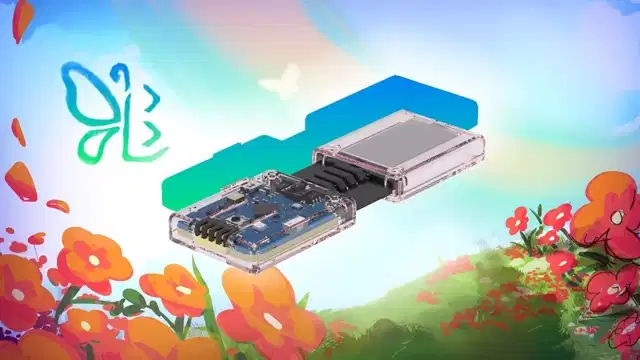

```admonish warning
**Disclaimer:** This project is highly experimental. These devices may be incompatible with older versions of the SlimeVR Server and could require frequent firmware updates. Nothing is final at this stage, including hardware, firmware, and communication protocols.
```
# Smol Slimes vs Normal Wifi-based Slimes
Currently, Official SlimeVR and commonly made DIY trackers connect to your computer via a 2.4ghz WiFi network. Smol Slimes change this by communicating wirelessly to a dongle plugged into the users' computer, circumventing the need for an available WiFi network.
<details>
<summary><u>Quick Comparison Table</u></summary>
<div class="table-wrapper">
<table>
  <thead>
    <tr>
      <th>Tracker Type</th>
      <th>Communication Method</th>
      <th>Average Size</th>
      <th>Battery Life</th>
      <th>Range</th>
      <th>Summary</th>
    </tr>
  </thead>
  <tbody>
    <tr>
      <td>Official WiFi Slimes</td>
      <td data-label="Communication Protocol">2.4ghz WiFi</td>
      <td data-label="Average Size">50g</td>
      <td data-label="Battery Life<">18-20 h</td>
      <td data-label="Range">WiFi coverage</td>
      <td>
        Much greater range. Trackers are bulkier and have lower battery life. Requires WiFi setup and are dependent on network conditions.
      </td>
    </tr>
    <tr>
      <td>Smol/Butterfly Slimes</td>
      <td data-label="Communication Protocol">Enhanced ShockBurst (ESB)</td>
      <td data-label="Average Size">~10-15g</td>
      <td data-label="Battery Life">40-60 h</td>
      <td data-label="Range">7-12m from receiver (21-36ft) </td>
      <td>
         Lower range. Trackers have much greater battery life and are smaller. Trackers must be paired to a dongle connect to host computer.
      </td>
    </tr>
  </tbody>
</table>
</div>
</details>

## So what are the actual differences?
### 1. Protocol
Typical WiFi based Slimes communicate via WiFi to a host computer. Smol Slimes instead use a heavily modified fork of the Enhanced ShockBurst (ESB) protocol on an nRF52 or nRF54 microcontroller to communicate to the host computer via a receiver—allowing for lower latency and lower power draw at the cost of range.

### 3. Size and Battery Life
Current Official Slimes utilize a 1350mah battery, which will last on average between twelve to eighteen hours of use. The recommended Smol Slime design recommends a 401230 110mah battery, targeting a minimum battery life of 24 hours. At the time of writing, the actual battery life far exceeds the target—it is between 40 to 60 hours depending on the individual design and IMU used.

Smol Slimes have the additional benefit of a much smaller PCB, which leads to an average weight between 10-15 grams depending on the design. Official slimes are significantly bulkier, weighing approximately 50 grams.

#### An Official Slime (left) and Ibis 2.0 Smol Slime (right)
</br>
*Picture by zrock35. Maybe we need a banana for scale.*

### 4. DIY differences
*This is explained in greater detail in the respective DIY guides for [WiFi-based](diy/README.md) and [nRF-based](hardware/index.md) slimes.*
- WiFi based slimes currently require a carrier PCB, an IMU board, and a charging board, alongside a battery.
- At the time of writing, Stacked Smol Slimes use a Promicro nRF52 board and an IMU board, with the battery. However, Smol Slimes also require the trackers to be paired to a dongle before use.

### 5. Standalone?
Yes, Smol Slimes are compatible with standalone, though an OTG adapter may be required to plug the dongle into the device running SlimeVR if the device does not have a spare USB type A port. Additionally, the Open Sound Control (OSC) protocol must be configured inside SlimeVR to send data from the server over WiFi to standalone VRChat.

## I heard Butterfly. What's that?
### 🦋 Introducing the Butterfly Tracker – SlimeVR's Official Smol Tracker
Looking for something simpler than building your own? The Butterfly Tracker is SlimeVR’s official take on the Smol Slime—ultra-thin, lightweight, and ready to use out of the box.



🔗 Learn more and pre-order on <a href="https://www.crowdsupply.com/slimevr/slimevr-butterfly-trackers" target="_blank">CrowdSupply</a>.
<hr/>

*Created by Shine Bright ✨, Amebun, [Depact](https://github.com/Depact) and [Seneral](https://github.com/Seneral)*
