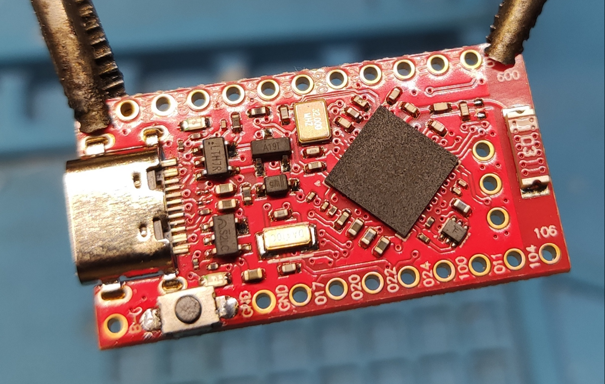
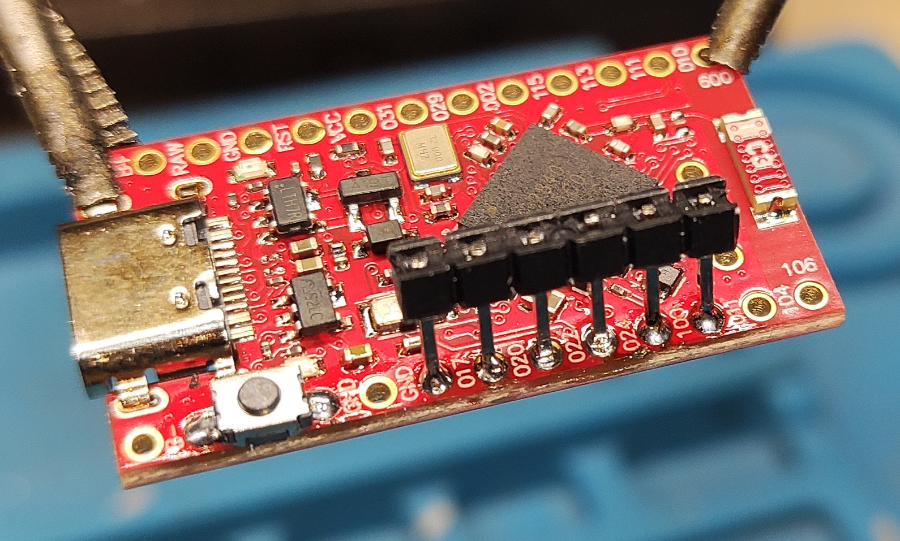
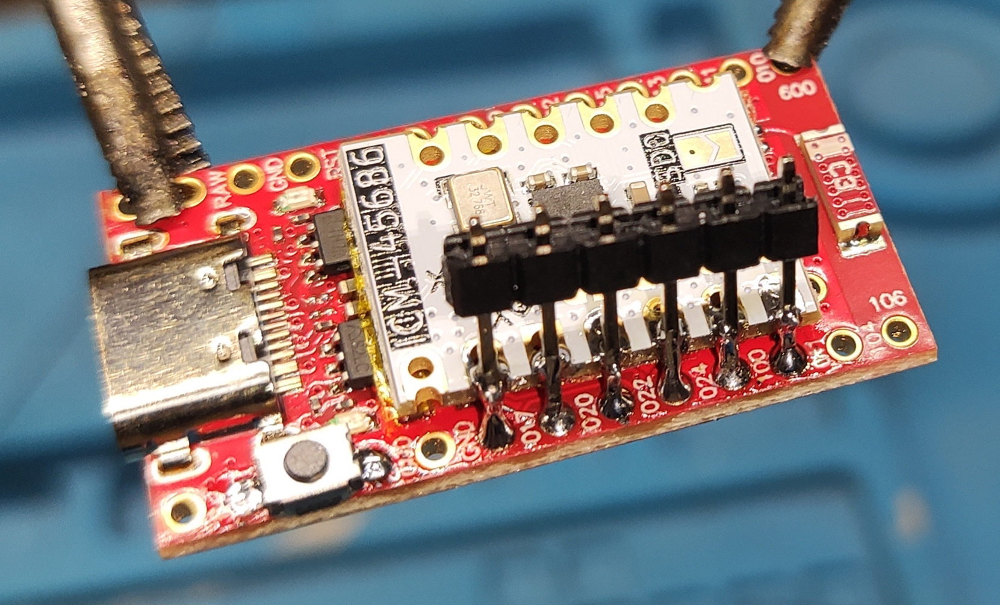

# Smol Tracker Soldering

## Tools used:
- Side cutter pliers
- Tweezers (To keep button and breakaway pins in place while soldering)
- Soldering Jig (To hold board) (unnecessary, but nice to have)
- Soldering iron
- Sponge for soldering
- Flux-Cored Solder Wire (Makes soldering so much easier than separate solder and flux for this scenario)
- Soldering mat (unnecessary, but nice to have)
- Scissors (to cut kapton tape)

## Steps

Solder button.
Prefilling solder through-holes under button contacts, putting button on it and heating area with soldering iron so solder connects to button pads make it easier.

From breakaway header break away segment with 6 headers, put it into through-holes leaning it to the center of board and solder one by one headers.

Cover backs of IMU's with kapton tape

Solder breakaway headers row to imu on one side

Solder headers on the other side under angle to reach IMU

Chop redundant length of headers with pliers. Fix lack of solder on pins if there is any, but do not overheat, cause pin rods will fall from holes.

Solder antenna mod and battery.
You can make wire for antenna the length of board. As long as it's longer than 31.2mm tolerances are huge

