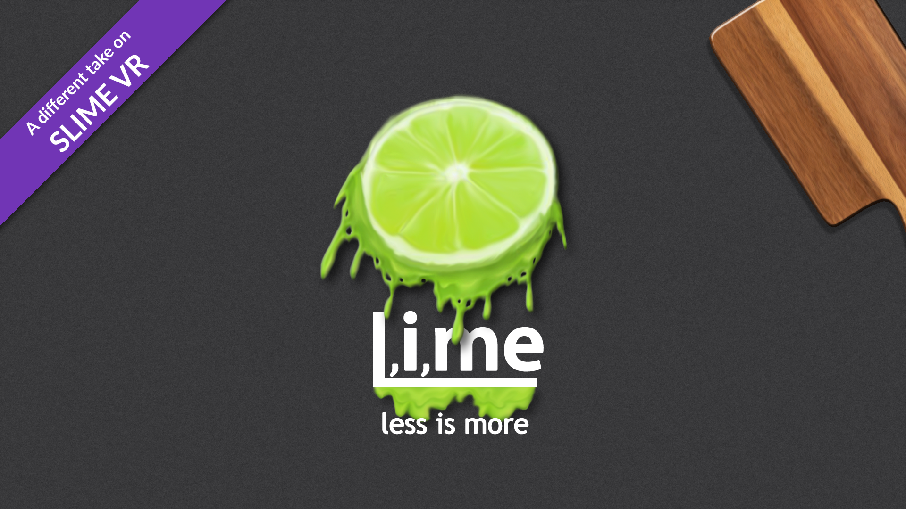

# L,i,me-Slimes

## L,i,me by Rosdayle#0920
L,i,me is a case and hardware variant of the standard slime aimed to natively support a full **9** IMU setup (with work currently be done on an optional addon to allow 4 more IMUs) while being as streamlined as possible with no degredation to performance.

## Who is this for?
- L,i,me is for those who wish to streamline their current standard slime setup by easily converting into a L,i,me.
- For those who want to make a full no compromise 9 IMU setup from the start (with the option to add an extra 4 more IMUs for shoulder and elbow tracking).
- People on a tight budget but want a performant full 9 IMU setup (with the option to add shoulder and elbow tracking in the future).
- Those who intend to use slimevr for mocap and vtubing.

## Why choose L,i,me?
- Unlike the standard set up that is limited to **2 IMUs** per tracker, each **L,i,me** tracker supports **4 IMUs** (without any software modification). Due to this you only need to make 3 L,i,me trackers instead of 6 typical slime trackers for a full 9 IMU setup.
- Less parts required, making L,i,me the cheapest full 9 IMU setup (as well as 11 or 13 IMU setup with an optional addon).
- Aimed at providing the best stable tracking with comfort and full maneuverability due to being less bulky overall (less main trackers).
- Only need to charge and maintain 3 trackers (4 if you include the optional addon).
- Modular and customisable.
- ~~Ongoing support.~~ I can provide any missing models no problem if you message me. However active development has now ended. I will be refreshing and improving upon  this eventually in the future under the minted name. However this build is still perfectly functional. You can check out my latest Non-variant release https://www.thingiverse.com/thing:5815469

## Doing more with less
- Fewer trackers.
- Fewer parts.
- Lower costs.
- Less building.
- Less maintaining.
- Less units to charge.
- More SLIME!

## Github and download link
You can access more information and get the latest L,i,me updates on [the github repo](https://github.com/Rosdayle/L.i.me-Slimes).

## FAQ

### Can I use this with other standard slime trackers?
Yes, there should be no conflicts with any combinations.

### This is my first time soldering or doing DIY with electronics, is this ok for me to build?

If you have confidence that you can or are happy to learn to splice cables cables together, you should be good.
While cable splicing is the toughest part of Slime trackers, you will be required to do more of it when constructing a L,i,me.

### Can I convert my current standard DIY slimes into L,i,mes

Yes, the original build was made through this process. You will likely need to change the battery and switch though

### I don't have enough IMUs can I add them later?

Yes you can in fact start off at minimum 6 IMUs and add the other IMUs later. Please be sure to plan ahead.

### When will the elbow and shoulder tracking addon be available?

~~Shoulder and elbow tracking is available with the double decker addon. Though I personally recommend only using it to track elbows. Unless you have a way to mount shoulder trackers~~. It would be best to create 2 standard DIY trackers for elbow tracking 

### Is Neck or Head tracking available?

While I don't openly include it in the count, Neck "or" Head tracking is possible. However I do not recommend neck tracking due to discomfort, possible reduction of accuracy and risk to user. I can however say you can track your head with an extension from the chest unit.

### I want to track my entire arm for vtubing or mocap

You can try make a L,i,me dedicated for each arm (The combinination and layout is really up to you)

### Can I lie down, roll or whatever on the tracker and its extensions?

Sure go ahead, you will find nothing will prevent you from doing so.

### The IMU I want to use is not listed what do I do?

You can contact me (@Rosdayle#0920) on the slimevr discord and ask me to model the 3D files for you.

### I have an issue

You can ask on the slimevr discord for help contact me (@Rosdayle#0920).

### Where is the L,i,me software?

There is none, L,i,me is a hardware solution that works with any slimevr firmware branch (Such as 0. BMI branch)

*Created by @Smeltie#1999 & @Rosdayle#0920*
