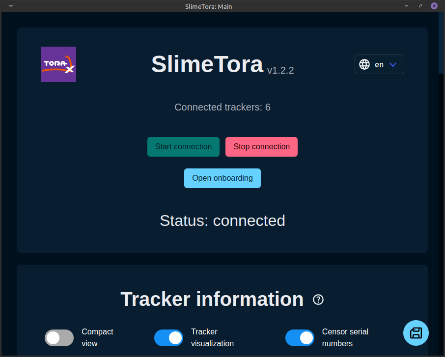

# SlimeTora

SlimeTora is a program that connects the HaritoraX trackers to the SlimeVR server so you can use them as SlimeVR trackers, coming with additional features such as per-tracker settings. It supports the `HaritoraX Wireless` and `HaritoraX Wired` (1.1b/1.1/1.0) models.

## Setup

> More details on setting up the software can be found on SlimeTora's `Getting Started` wiki page: [https://github.com/OCSYT/SlimeTora/wiki/Getting-Started](https://github.com/OCSYT/SlimeTora/wiki/Getting-Started)

### SlimeTora setup

> Your trackers must be paired/connected via the HaritoraConfigurator at least once to work. This is also done to make sure there are no issues with the trackers connecting to the PC in general.

- Download the latest release of SlimeTora in the [releases](https://github.com/OCSYT/SlimeTora/releases) tab.
- Extract the zip archive into its own folder and run the program (`SlimeTora.exe`).
- Under "Program settings", modify them to your setup:
  - Select the model of HaritoraX trackers you have under "Tracker model" (`HaritoraX Wireless`/`HaritoraX 1.1b/1.1/1.0`).
  - Select the supported connection mode you want to use to connect to your trackers (`Bluetooth`/`COM / GX(6/2)`).
    - These two modes can also be used at the same time if using the `HaritoraX Wireless`.
  - (`COM`/`HaritoraX 1.1b/1.1/1.0`) Select the COM port your bluetooth adapter has assigned the trackers to.
    - This can be found in HaritoraConfigurator's "communication settings".
  - (`GX(6/2)` dongles) Select up to 4 COM ports that your trackers are on (3 if only using GX6, 4 if using GX6+GX2).
    - Usually, this is the first four (consecutive) available ports. `COM1`/`COM2` are usually already used by other devices, so the ports are likely `COM3`, `COM4`, `COM5` (and `COM6` for GX2).
    - Check `Device Manager` to see what ports are being used by the trackers as `USB Serial Device`s.
- Change the program's settings to your liking (see [this](https://github.com/OCSYT/SlimeTora/wiki/Settings)).
- Continue to `SlimeVR setup`.

### SlimeVR setup

- Install and run [SlimeVR](../server/initial-setup.md) server, turn on your trackers, and press `Start connection` in SlimeTora.
- If running SlimeVR server for the first time, go through the initial setup:
  - Accept all popups that mention a "new tracker" was detected at any point during the setup (these are your trackers!)
  - Skip the `Input Wi-Fi credentials` screen by pressing `Skip Wi-Fi settings`.
  - Press `I put stickers and straps!`.
  - Assign the trackers to your body (shake to identify the trackers).
  - (**IMPORTANT**) Perform `Automatic Mounting` to calibrate the mounting positions.
  - Choose a proportion calibration method (automatic/manual).
- If this isn't your first time (or skipped initial setup):
  - Accept all popups that mention a "new tracker" was detected (these are your trackers!)
  - Assign the trackers to your body (shake to identify the trackers) in `Tracker Assignment`.
  - Perform a `mounting reset` (you should be in a ski pose) or perform an `Automatic Mounting` calibration.
- If you experience lower-body tracking issues:
  - Open SlimeVR server's settings, disable `Automatic tracker assignment`, and disable both knees under `SteamVR trackers`.
  - This isn't necessary, but this may help fix certain tracking issues especially when sitting/laying.
- Check out the rest of SlimeVR and its settings, and you're done!

## Troubleshooting & FAQ

> For the full troubleshooting and FAQ pages, check out the SlimeTora wiki: [https://github.com/OCSYT/SlimeTora/wiki](https://github.com/OCSYT/SlimeTora/wiki)

### I'm stuck on "searching" forever!

Make sure HaritoraConfigurator is closed. Both SlimeTora and HaritoraConfigurator should not be open at the same time.

### Some of my trackers aren't connecting to SlimeTora!

The most common fix for this is to open the `HaritoraConfigurator` software and make sure they are paired/can connect to the trackers before connecting via SlimeTora again. Unsure why this happens, but this is the most likely fix for you (other than the [general checklist](https://github.com/OCSYT/SlimeTora/wiki/Troubleshooting#general-checklist)).

### My legs (or other parts) are going backwards!

Double check your tracker assignments and make sure you have done `Automatic mounting calibration` in SlimeVR server. Manual mounting calibration does not seem to work well for these trackers.

### My lower-body tracking is off, especially when sitting/laying!

Try disabling the knees in SlimeVR's settings under `SteamVR Trackers` to see if it helps (disable `Automatic tracker assignment` then disabling both knees). The knee trackers will still be used for the skeletal tracking in SlimeVR but not appear as extra trackers in SteamVR, which *may* help with some tracking issues in your lower-body.

### My trackers are not aligned correctly to my body!

Make sure you've done the `Body proportions calibration` correctly, either manually or automatically, and also make sure you have done `Automatic mounting calibration`, **NOT** manual. You can also change settings in the game you are running (e.g. VRChat's IK settings like `Legacy calibration`) or change the positions of the trackers physically.

If running VRChat, there are some recommended settings for it [here](./vrchat-config.md).

*Written by JovannMC, software developed by BracketProto & JovannMC*
