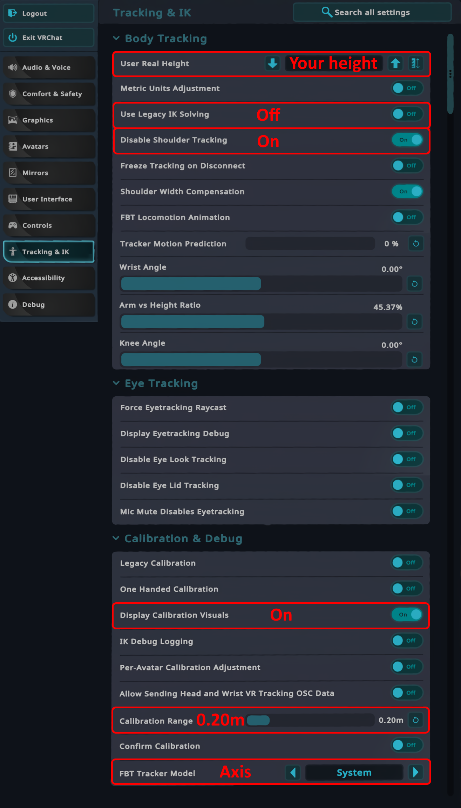

# VRChat Configuration

For optimal usage with VRChat, it is recommend to configure the settings as described by this guide.

## Text guide

- Under "Tracking & IK" on the big settings menu
  - Set "User Real Height" to your height.
  - Toggle "Use Legacy IK Solving" off.
  - Toggle "Disable Shoulder Tracking" on.
  - (Recommended) Toggle "Display Calibration Visuals" on.
  - (For small avatars) Set "Calibration Range" to 0.20m.
  - (Optional) Set "FBT Tracker Model" to "Axis".
- Under "Tracking & IK" on the small settings menu (wrist menu)
  - (Recommended) Set the "Avatar Measurement" scaling mode to "Height:".
  - (Recommended) Set "FBT Spine Mode" to "Lock Hip" or "Lock Head".

## Visual guide

