# Updating Your Tracker's Firmware
On this page you will find several ways to flash SlimeVR trackers and how to manually recover official SlimeVR trackers.

## Index
- [Update Your SlimeVR Trackers](#update-your-slimevr-trackers) - How to update your official SlimeVR trackers.
- [USB Recovery](#usb-recovery) - Recover trackers after failed update.
- [Manual Wireless Updates](#manual-wireless-updates) - Rolling back firmware.

# Update Your SlimeVR Trackers
Under normal circumstances, official SlimeVR trackers should be updated using the icon that appears on the trackers in the main menu


```admonish warning
Beware that the trackers need to be charged to at least 50% for this process.
```

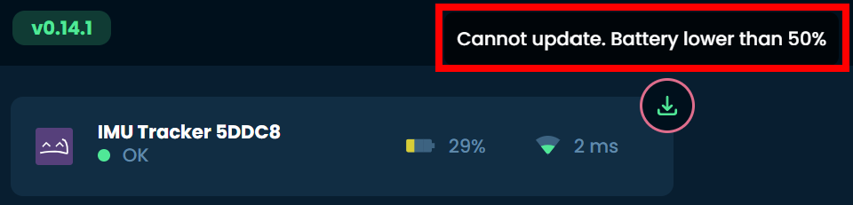


Upon clicking the update icon, you should be met with the following screen, please select the trackers you wish to update and click "Update Selected Trackers".

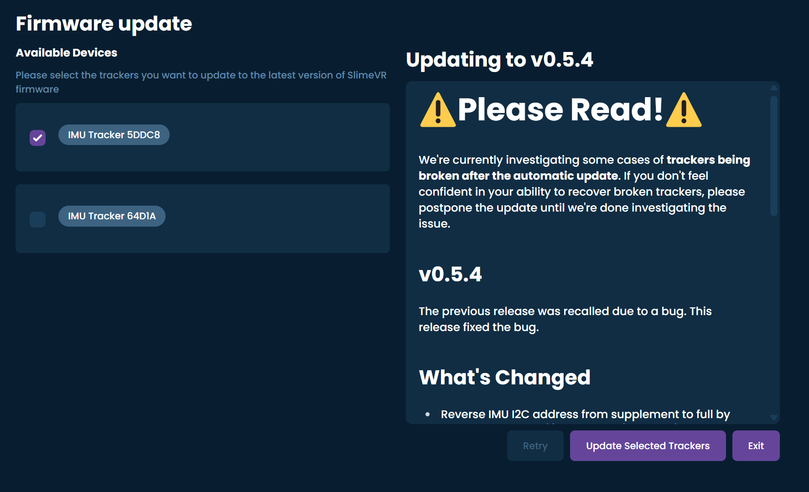

Now, turn the trackers selected for the update off and on again!
```admonish warning
Do not unplug or turn off the tracker during the upload process unless told to do so, it may make the tracker unusable.
```

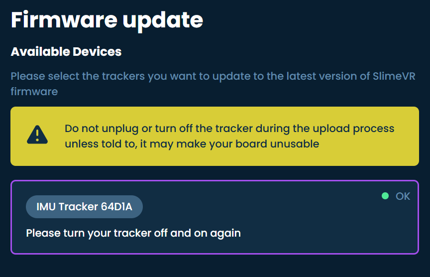

Now, the software will upload the firmware to the selected trackers.

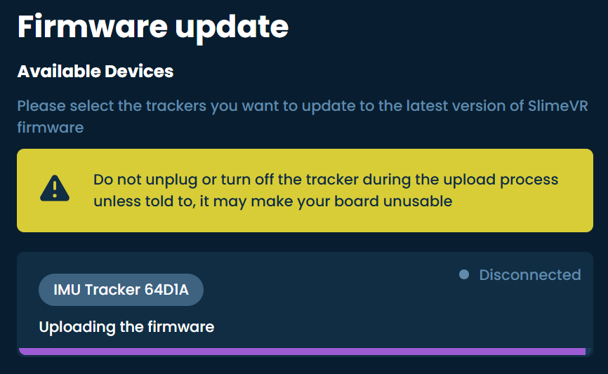

Next, the software will apply the updated firmware to the selected trackers.

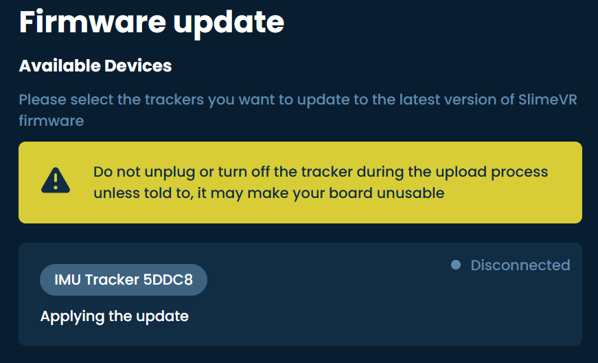

And that's it! Your tracker(s) should now be up to date!

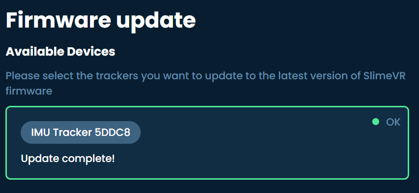

Now, turn the trackers selected for the update off and on again!

```admonish warning
If a tracker has stopped working after the update, do not flash any other trackers and refer to the USB recovery section below to recover the trackers firmware.
```

## Disclaimer
```admonish danger
These steps linked below are tailored towards official SlimeVR trackers, the settings pictured not compatible with most DIY trackers!
This method has the potential to mess up your tracker(s), so please read the following warnings carefully:

1. Do not turn off your trackers during the flashing or applying update processes.

2. After flashing, ensure that your tracker is functional before turning it off.

3. If a tracker has stopped working after flashing it wirelessly, Please try fixing it first by performing a USB recovery before continuing with the other trackers.

4. Uploading unofficial/unsupported firmware might affect your tracker's functionality and may void your warranty.
```

# USB Recovery

This method should only be used when wireless (OTA) is not an option.
You are expected to disasemble the tracker during these steps, **this does not void your warranty.**

```admonish warning
This method requires the following items:
 - A data capable USB-C cable (the included one should suffice).
 - A pozidrive screwdriver (JIS and Phillips screwdriver may strip screw).
 - Conductive tool such as tweezers or a paperclip to bridge specified points (only needed for R11 & R12, R14 has a physical button).
```

*If a screw strips out, you can use a rubber band, which is a common way to extract stripped screws*

## Disassembling The Tracker
Start by turning off your tracker and removing the strap. Use a **pozidrive** screwdriver (JIS and Phillips head may work but can strip out the screws) to undo the screws on the back of the tracker.

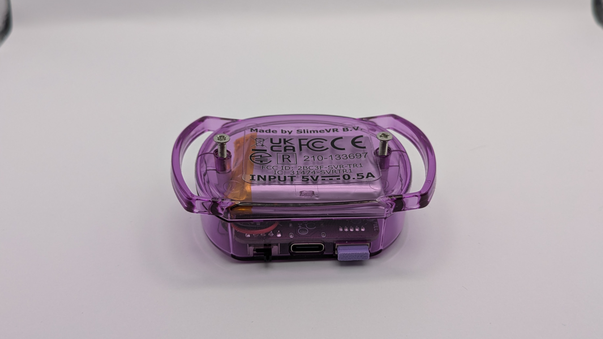

After removing the back cover you can carefully lift out the battery and lay it on the side. Then you can gently lift the PCB out at an angle by lifting the back side of the pcb (opposite side to the power switch and USB port).

```admonish warning
Make sure not to touch the black antenna found on the rear left side. As this can be fragile!
```

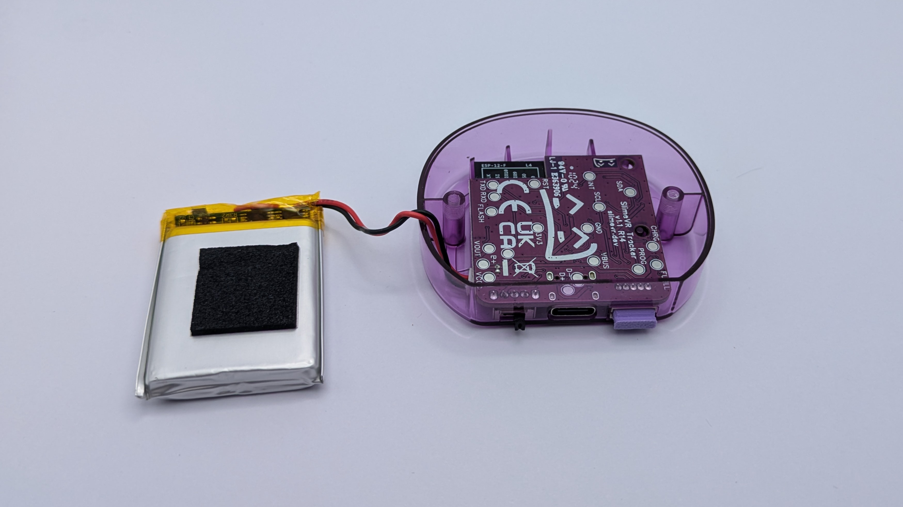

Inspect the back of the PCB to determine which revision you have.

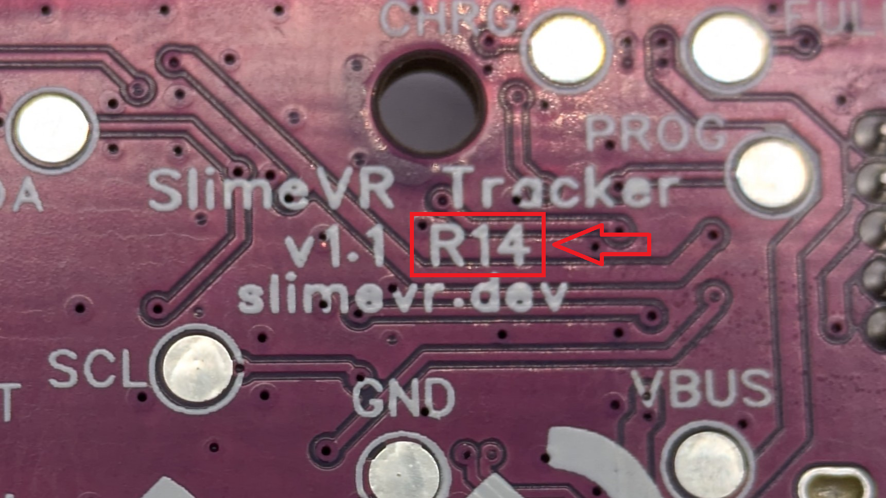

## Flashing Via USB (Serial)
You can find the "DIY Firmware Tool" under your settings menu in the SlimeVR software.

If you are using official SlimeVR trackers, select "SlimeVR" and click "Next Step"

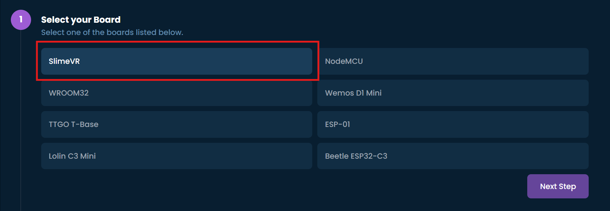

Select the latest available firmware by selecting the highest number in the list and clicking "Next Step".

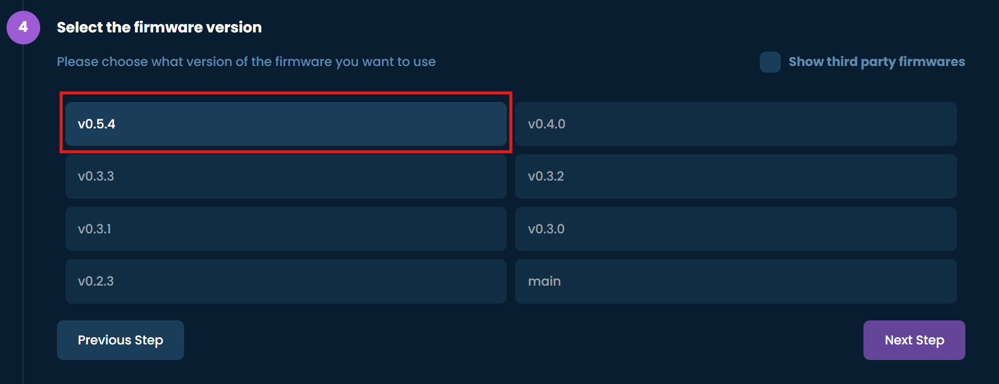

For this step, your tracker needs to be plugged in (Do not turn it on yet).
To Flash the tracker via USB select "serial", enter your Wi-Fi Credentials, and select the detected serial device from the dropdown menu (should be "USB-SERIAL CH340")
```admonish warning
The Wi-Fi name and password are both case-sensitive!
```

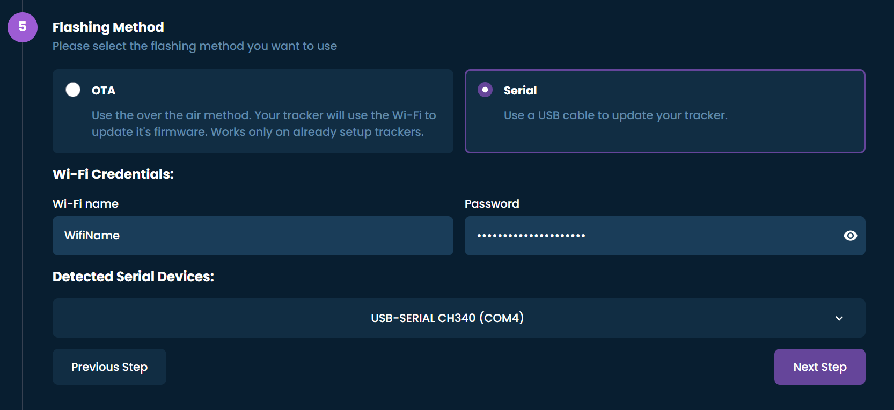


Now, for the next step, you will have to boot the tracker into bootloader mode by doing the following.
You know you will have done it correctly if the blue LED gives a single fast blink when turned on using this method (the tracker needs to stay plugged in at this stage).
```admonish warning
The version of the PCB, indicated as R1x, can be found on the back of the PCB and is important for the next steps!
```

|  Revision |                                                                             Steps                                                                           |
|-----------|-------------------------------------------------------------------------------------------------------------------------------------------------------------|
|    R11    | Turn on the tracker whilst shorting the second rectangular FLASH pad from the edge on the top side of the board to the metal shield of the microcontroller. |
|    R12    |            Turn on the tracker whilst shorting the circular FLASH pad on the top side of the board, and the metal shield of the microcontroller.               |
|    R14    |                                           Turn on the tracker while holding the FLASH button on the top side of the board, you can let go after turning it on.                           |

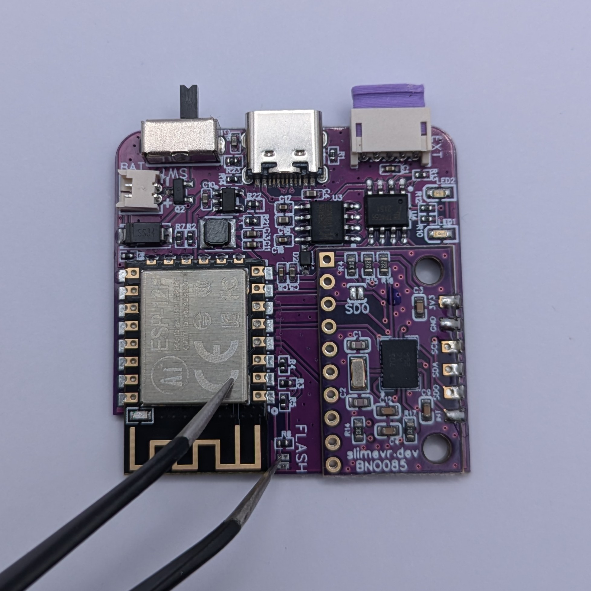

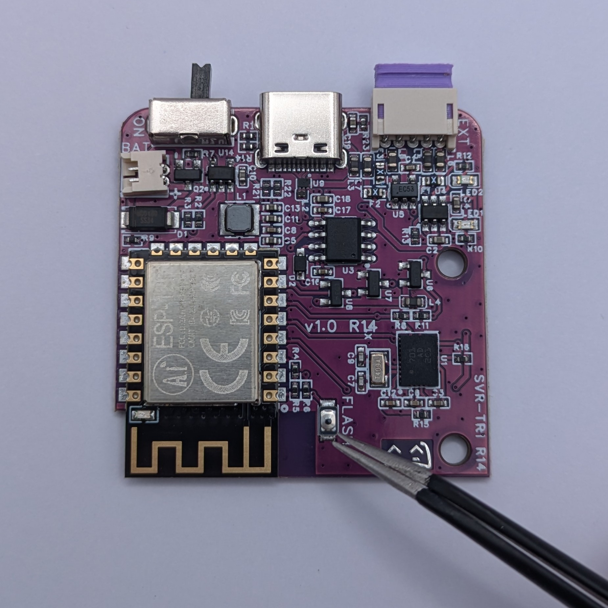


Now click "Next Step", it should move on to the following screen where it will synchronize with the MCU.
If this fails you might have to click retry. If that does not fix it, please retry the above step to ensure it's in bootloader mode (The Blue LED should give a single fast blue blink when powered on into bootloader mode).

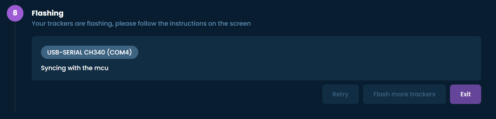

The update should now be getting applied to the tracker.
```admonish danger
Do not turn off the tracker while it is applying the update!
```

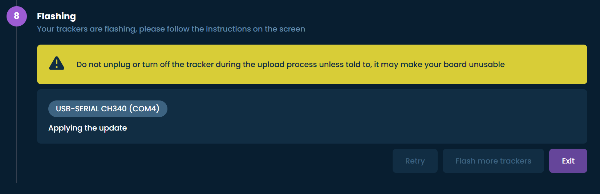

The update should now be complete!
If you get an error, try clicking retry. If that doesn't fix the problem, you may have to start over.

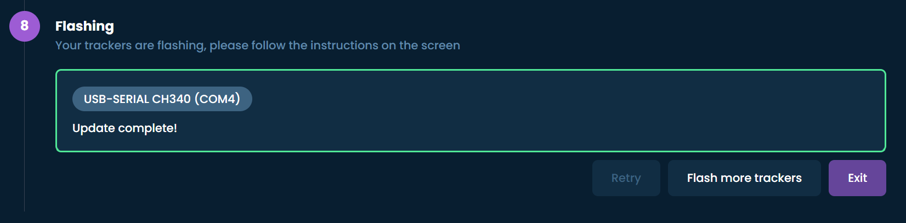


Finally, turn the tracker off and on again to reconnect it to the software. You can repeat the process for any other trackers that may need to be recovered.

# Manual Wireless Updates

This method does not require disassembling the tracker or any cables, but it does require your tracker to already be connected to your Wi-Fi network.
You can find the "DIY Firmware Tool" under the settings menu in the SlimeVR software.

If you are using official SlimeVR trackers, select "SlimeVR" and click "Next Step"


Select the latest available or desired firmware by selecting the version number from the list and click "Next Step"


To Flash the tracker wirelessly select "OTA" and then select all the trackers you wish to flash.
For this step your trackers need to be on and connected to your Wi-Fi. When you have selected all the desired trackers, click "Next Step".

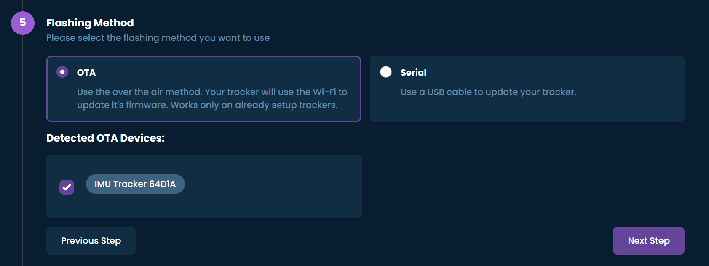

On this step you will have to turn the tracker(s) off and back on again, this way we can verify OTA is enabled and start flashing the tracker(s).
```admonish warning
If the tool says:"Timeout", you need to click "Retry" and follow the instructions"on screen.
```

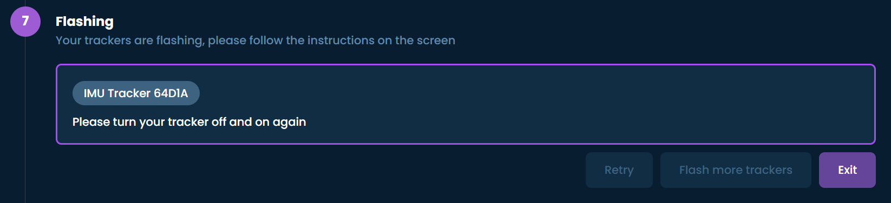


The tracker(s) will now start updating.
```admonish danger
Do not turn off the tracker while it is flashing!
```

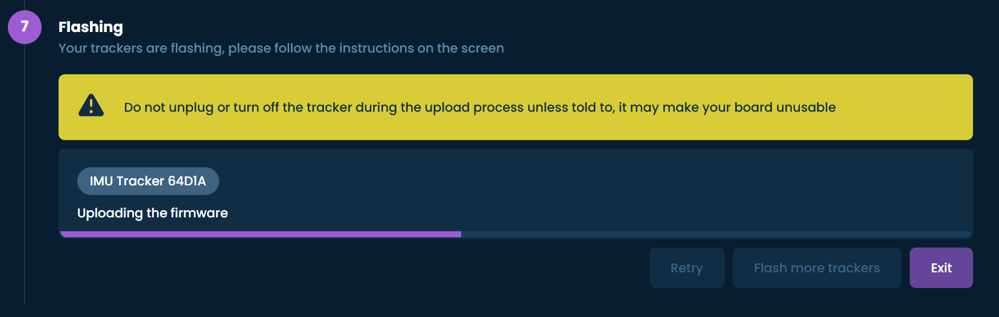


The tracker is now updated and ready to go!

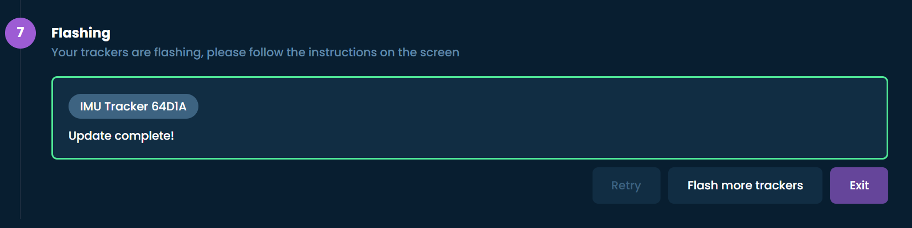

```admonish danger
If a tracker has stopped working after flashing it, do not flash any other trackers and refer to the USB flashing section above to recover it.
```

*Created by [Smeltie](https://github.com/smeltie) & [Meia](https://github.com/Kounocom).*
