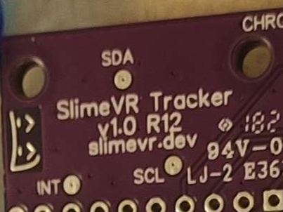

# Updating Your Tracker's Firmware

There are two ways to update the firmware on official SlimeVR trackers: OTA (over-the-air) or via USB.

The currently recommended version of firmware for official trackers is v0.4.0.

## Method 1: Updating Over-the-Air

This method is the simplest, and doesn't require any cables or disassembly, but it does require your tracker to already be paired to your Wi-Fi network.

1. Turn off all your trackers and close the SlimeVR Server if it is open.

1. Download the latest version of the OTA tool [here](https://github.com/ButterscotchV/SlimeVR-OTA-CLI/releases/latest/download/SlimeVR-OTA.exe) and extract it into an empty folder.

1. Open the [SlimeVR Firmware Tool](https://slimevr-firmware.bscotch.ca/) in your browser and select the following options:

|      Option      |     Value     |
|------------------|---------------|
| Firmware Version | SlimeVR/0.4.0 |
|       Board      | BOARD_SLIMEVR |
|   Primary IMU    |   IMU_BNO085  |

Leave all other options as their default values.

4. Press "Download as ZIP"

5. Extract the downloaded ZIP into the same folder where you placed your OTA tool.

6. Turn on a single tracker, wait a few seconds for it to connect to Wi-Fi, then open the OTA tool.

7. Once you see this message, press enter to start the update.

8. Your tracker should now be updated, you can repeat the process for any other trackers you wish to update.

## Method 2: Updating over USB

This method requires a data-capable USB-C cable, an M3 Philips head screwdriver, and a pair of metal tweezers (or some other tool that would allow you to short 2 pins together).

Due to this method requiring you to disassemble your tracker(s), it should only be done if OTA is not an option.

1. Turn off your tracker, remove the strap, then use your Philips head screwdriver to undo the screws on the back of the tracker.

 
2. Remove the back cover and the battery, then gently lift the PCB by the opposite side of where all the ports are to remove it.

3. Inspect the back of the PCB to determine which revision you have.

4. Depending on your board revision, use your tweezers to do the following:

|  Revision |                                                                Steps                                                           |
|-----------|--------------------------------------------------------------------------------------------------------------------------------|
|    R11    | Short the second rectangular FLASH pad from the edge on the top side of the board, and the metal shield of the microcontroller |
|    R12    |            Short the circular FLASH pad on the top side of the board, and the metal shield of the microcontroller              |
|    R14    |                                     Push in the FLASH button on the top side of the board                                      |

5. While still doing step 4, turn on your tracker and plug it in to your computer with a USB-C cable. If you did step 4 correctly, the tracker *should not* connect to Wi-Fi and the SlimeVR Server.

6. Open the [SlimeVR Firmware Tool](https://slimevr-firmware.bscotch.ca/) in a Chromium based browser and select the same options described in the OTA method:

7. Press Flash to Device, and select your tracker in the pop-up, which should appear as `USB Serial`.

8. Your tracker should now be updated, turn it off and on again to get it connect to Wi-Fi again, you can repeat the process for any other trackers you wish to update.

*Created by kounocom. OTA tool and Web Firmware Tool by ButterscotchV. Tracker disassembly images by TheDevMinerTV.*

