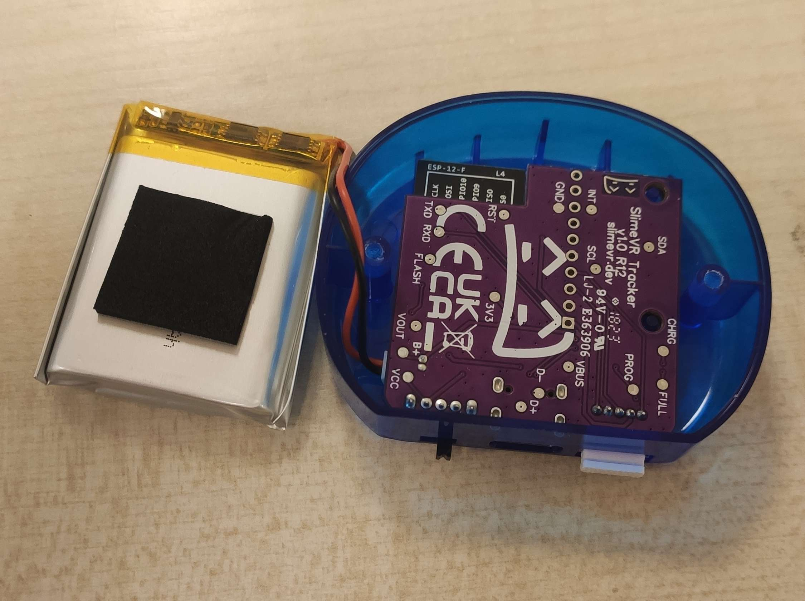

# Updating Your Tracker's Firmware

There are two ways to update the firmware on official SlimeVR trackers: OTA (over-the-air) or via USB.

The currently recommended version of firmware for official trackers is v0.4.0.

## Method 1: Updating Over-the-Air

This method is the simplest, and doesn't require any cables or disassembly, but it does require your tracker to already be paired to your Wi-Fi network.

```admonish danger
This method has the potential to mess up your tracker, so please read the following warnings:

1. Do not turn off your trackers while they are flashing.

1. After flashing, ensure that your tracker is functional before turning it off.

1. If a tracker has stopped working after flashing it, do not flash any other trackers and refer to the USB flashing section below for recovery.
```

1. Turn off all your trackers and close the SlimeVR Server if it is open.

1. Download the latest version of the OTA GUI tool for your platform and extract it somewhere.

| Platform | Link |
|----------|------|
|  Windows | [Link](https://github.com/ButterscotchV/SlimeVR-OTA-CLI/releases/latest/download/SlimeVR-OTA-GUI_win-x64.zip) |
|  Linux   | [Link](https://github.com/ButterscotchV/SlimeVR-OTA-CLI/releases/latest/download/SlimeVR-OTA-GUI_linux-x64.zip) |
|  macOS   | [Link](https://github.com/ButterscotchV/SlimeVR-OTA-CLI/releases/latest/download/SlimeVR-OTA-GUI_osx-x64.zip) |

1. Open the [SlimeVR Firmware Tool](https://slimevr-firmware.bscotch.ca/) in your browser and select the following options:

|      Option      |     Value     |
|------------------|---------------|
| Firmware Version | SlimeVR/0.4.0 |
|       Board      | BOARD_SLIMEVR |
|   Primary IMU    |   IMU_BNO085  |


Leave all other options as their default values.

4. Press "Download as ZIP"


5. Open the OTA tool, press "Select Firmware", locate and select the downloaded ZIP file, then press Open.


6. Turn on a single tracker and wait until it shows up in the OTA tool. 


7. Once it says "Ready to flash...", press "Flash Tracker" to start the update, then wait for it to complete.

```admonish warning
If the progress bar doesn't move, and the tool says "Failed to flash tracker", you may need to restart your tracker and try again.
```

```admonish danger
Do not turn off the tracker while it is flashing!
```


8. Your tracker should now be updated. Close the OTA tool and open the SlimeVR Server to confirm that the tracker works before flashing any more trackers.

```admonish danger
If a tracker has stopped working after flashing it, do not flash any other trackers and refer to the USB flashing section below for recovery.
```

## Method 2: Updating over USB

This method requires a data-capable USB-C cable, an M3 Philips head screwdriver, and a pair of metal tweezers (or some other tool that would allow you to short 2 pins together).

Due to this method requiring you to disassemble your tracker(s), it should only be done if OTA is not an option.

1. Turn off your tracker, remove the strap, then use your Philips head screwdriver to undo the screws on the back of the tracker.


 
2. Remove the back cover and the battery, then gently lift the PCB by the opposite side of where all the ports are to remove it.



3. Inspect the back of the PCB to determine which revision you have.


4. Plug in your tracker to your computer with a USB-C cable while it is off, it should be recognized as a USB device.

5. Open the [SlimeVR Firmware Tool](https://slimevr-firmware.bscotch.ca/) in a Chromium based browser and select the same options described in the OTA method:


6. Press Flash to Device, and select your tracker in the pop-up, which should appear as `USB Serial`. The tool should now say "Start building".


7. While the firmware tool is saying "Start building", use your tweezers to do the following, depending on your board revision:

|  Revision |                                                                             Steps                                                                           |
|-----------|-------------------------------------------------------------------------------------------------------------------------------------------------------------|
|    R11    | Turn on the tracker while shorting the second rectangular FLASH pad from the edge on the top side of the board, and the metal shield of the microcontroller |
|    R12    |            Turn on the tracker while shorting the circular FLASH pad on the top side of the board, and the metal shield of the microcontroller               |
|    R14    |                                           Turn on the tracker while pushing in the FLASH button on the top side of the board                           |


8. If you did step 7 correctly, the firmware should now be flashing to your tracker.


9. Your tracker should now be updated, turn it off and on again to get it connect to Wi-Fi again, you can repeat the process for any other trackers you wish to update.


*Created by kounocom. OTA tool and Web Firmware Tool by ButterscotchV. Tracker disassembly images by TheDevMinerTV.*


